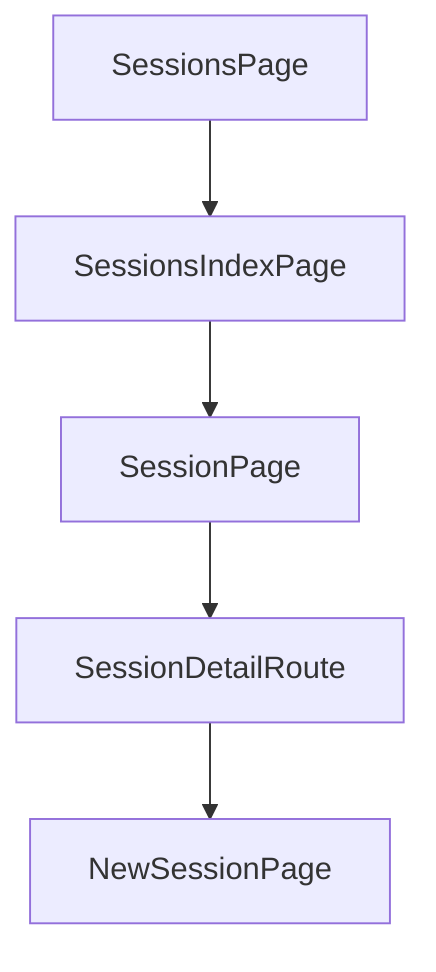

# Chapter 4: Remote Access and Networking

Welcome to **Chapter 4: Remote Access and Networking**. In this part of **HAPI Tutorial: Remote Control for Local AI Coding Sessions**, you will build an intuitive mental model first, then move into concrete implementation details and practical production tradeoffs.


Networking design determines whether HAPI is simple local tooling or production remote infrastructure.

## Access Modes

| Mode | Strength |
|:-----|:---------|
| local-only (`hapi hub`) | tight isolation and low setup overhead |
| relay (`hapi hub --relay`) | quick secure internet access |
| self-hosted tunnel/public host | full routing and policy ownership |

## Network Requirements

- stable SSE-compatible ingress path
- TLS for remote clients
- explicit host/port/public URL configuration
- firewall rules matching hub ingress and tunnel design

## Deployment Pattern

1. validate local-only mode
2. enable relay or named tunnel
3. test phone/browser connectivity and auth
4. verify reconnect behavior under network interruption

## Summary

You now have a practical network rollout sequence for safe remote HAPI access.

Next: [Chapter 5: Permissions and Approval Workflow](05-permissions-and-approval-workflow.md)

## What Problem Does This Solve?

Most teams struggle here because the hard part is not writing more code, but deciding clear boundaries for core abstractions in this chapter so behavior stays predictable as complexity grows.

In practical terms, this chapter helps you avoid three common failures:

- coupling core logic too tightly to one implementation path
- missing the handoff boundaries between setup, execution, and validation
- shipping changes without clear rollback or observability strategy

After working through this chapter, you should be able to reason about `Chapter 4: Remote Access and Networking` as an operating subsystem inside **HAPI Tutorial: Remote Control for Local AI Coding Sessions**, with explicit contracts for inputs, state transitions, and outputs.

Use the implementation notes around execution and reliability details as your checklist when adapting these patterns to your own repository.

## How it Works Under the Hood

Under the hood, `Chapter 4: Remote Access and Networking` usually follows a repeatable control path:

1. **Context bootstrap**: initialize runtime config and prerequisites for `core component`.
2. **Input normalization**: shape incoming data so `execution layer` receives stable contracts.
3. **Core execution**: run the main logic branch and propagate intermediate state through `state model`.
4. **Policy and safety checks**: enforce limits, auth scopes, and failure boundaries.
5. **Output composition**: return canonical result payloads for downstream consumers.
6. **Operational telemetry**: emit logs/metrics needed for debugging and performance tuning.

When debugging, walk this sequence in order and confirm each stage has explicit success/failure conditions.

## Source Walkthrough

Use the following upstream sources to verify implementation details while reading this chapter:

- [HAPI Repository](https://github.com/tiann/hapi)
  Why it matters: authoritative reference on `HAPI Repository` (github.com).
- [HAPI Releases](https://github.com/tiann/hapi/releases)
  Why it matters: authoritative reference on `HAPI Releases` (github.com).
- [HAPI Docs](https://hapi.run)
  Why it matters: authoritative reference on `HAPI Docs` (hapi.run).

## Chapter Connections

- [Tutorial Index](README.md)
- [Previous Chapter: Chapter 3: Session Lifecycle and Handoff](03-session-lifecycle-and-handoff.md)
- [Next Chapter: Chapter 5: Permissions and Approval Workflow](05-permissions-and-approval-workflow.md)
- [Main Catalog](../../README.md#-tutorial-catalog)
- [A-Z Tutorial Directory](../../discoverability/tutorial-directory.md)

## Depth Expansion Playbook

## Source Code Walkthrough

### `web/src/router.tsx`

The `SessionsPage` function in [`web/src/router.tsx`](https://github.com/tiann/hapi/blob/HEAD/web/src/router.tsx) handles a key part of this chapter's functionality:

```tsx
}

function SessionsPage() {
    const { api } = useAppContext()
    const navigate = useNavigate()
    const pathname = useLocation({ select: location => location.pathname })
    const matchRoute = useMatchRoute()
    const { t } = useTranslation()
    const { sessions, isLoading, error, refetch } = useSessions(api)

    const handleRefresh = useCallback(() => {
        void refetch()
    }, [refetch])

    const projectCount = new Set(sessions.map(s => s.metadata?.worktree?.basePath ?? s.metadata?.path ?? 'Other')).size
    const sessionMatch = matchRoute({ to: '/sessions/$sessionId', fuzzy: true })
    const selectedSessionId = sessionMatch && sessionMatch.sessionId !== 'new' ? sessionMatch.sessionId : null
    const isSessionsIndex = pathname === '/sessions' || pathname === '/sessions/'

    return (
        <div className="flex h-full min-h-0">
            <div
                className={`${isSessionsIndex ? 'flex' : 'hidden lg:flex'} w-full lg:w-[420px] xl:w-[480px] shrink-0 flex-col bg-[var(--app-bg)] lg:border-r lg:border-[var(--app-divider)]`}
            >
                <div className="bg-[var(--app-bg)] pt-[env(safe-area-inset-top)]">
                    <div className="mx-auto w-full max-w-content flex items-center justify-between px-3 py-2">
                        <div className="text-xs text-[var(--app-hint)]">
                            {t('sessions.count', { n: sessions.length, m: projectCount })}
                        </div>
                        <div className="flex items-center gap-2">
                            <button
                                type="button"
```

This function is important because it defines how HAPI Tutorial: Remote Control for Local AI Coding Sessions implements the patterns covered in this chapter.

### `web/src/router.tsx`

The `SessionsIndexPage` function in [`web/src/router.tsx`](https://github.com/tiann/hapi/blob/HEAD/web/src/router.tsx) handles a key part of this chapter's functionality:

```tsx
}

function SessionsIndexPage() {
    return null
}

function SessionPage() {
    const { api } = useAppContext()
    const { t } = useTranslation()
    const goBack = useAppGoBack()
    const navigate = useNavigate()
    const queryClient = useQueryClient()
    const { addToast } = useToast()
    const { sessionId } = useParams({ from: '/sessions/$sessionId' })
    const {
        session,
        refetch: refetchSession,
    } = useSession(api, sessionId)
    const {
        messages,
        warning: messagesWarning,
        isLoading: messagesLoading,
        isLoadingMore: messagesLoadingMore,
        hasMore: messagesHasMore,
        loadMore: loadMoreMessages,
        refetch: refetchMessages,
        pendingCount,
        messagesVersion,
        flushPending,
        setAtBottom,
    } = useMessages(api, sessionId)
    const {
```

This function is important because it defines how HAPI Tutorial: Remote Control for Local AI Coding Sessions implements the patterns covered in this chapter.

### `web/src/router.tsx`

The `SessionPage` function in [`web/src/router.tsx`](https://github.com/tiann/hapi/blob/HEAD/web/src/router.tsx) handles a key part of this chapter's functionality:

```tsx
}

function SessionPage() {
    const { api } = useAppContext()
    const { t } = useTranslation()
    const goBack = useAppGoBack()
    const navigate = useNavigate()
    const queryClient = useQueryClient()
    const { addToast } = useToast()
    const { sessionId } = useParams({ from: '/sessions/$sessionId' })
    const {
        session,
        refetch: refetchSession,
    } = useSession(api, sessionId)
    const {
        messages,
        warning: messagesWarning,
        isLoading: messagesLoading,
        isLoadingMore: messagesLoadingMore,
        hasMore: messagesHasMore,
        loadMore: loadMoreMessages,
        refetch: refetchMessages,
        pendingCount,
        messagesVersion,
        flushPending,
        setAtBottom,
    } = useMessages(api, sessionId)
    const {
        sendMessage,
        retryMessage,
        isSending,
    } = useSendMessage(api, sessionId, {
```

This function is important because it defines how HAPI Tutorial: Remote Control for Local AI Coding Sessions implements the patterns covered in this chapter.

### `web/src/router.tsx`

The `SessionDetailRoute` function in [`web/src/router.tsx`](https://github.com/tiann/hapi/blob/HEAD/web/src/router.tsx) handles a key part of this chapter's functionality:

```tsx
}

function SessionDetailRoute() {
    const pathname = useLocation({ select: location => location.pathname })
    const { sessionId } = useParams({ from: '/sessions/$sessionId' })
    const basePath = `/sessions/${sessionId}`
    const isChat = pathname === basePath || pathname === `${basePath}/`

    return isChat ? <SessionPage /> : <Outlet />
}

function NewSessionPage() {
    const { api } = useAppContext()
    const navigate = useNavigate()
    const goBack = useAppGoBack()
    const queryClient = useQueryClient()
    const { machines, isLoading: machinesLoading, error: machinesError } = useMachines(api, true)
    const { t } = useTranslation()

    const handleCancel = useCallback(() => {
        navigate({ to: '/sessions' })
    }, [navigate])

    const handleSuccess = useCallback((sessionId: string) => {
        void queryClient.invalidateQueries({ queryKey: queryKeys.sessions })
        // Replace current page with /sessions to clear spawn flow from history
        navigate({ to: '/sessions', replace: true })
        // Then navigate to new session
        requestAnimationFrame(() => {
            navigate({
                to: '/sessions/$sessionId',
                params: { sessionId },
```

This function is important because it defines how HAPI Tutorial: Remote Control for Local AI Coding Sessions implements the patterns covered in this chapter.


## How These Components Connect


