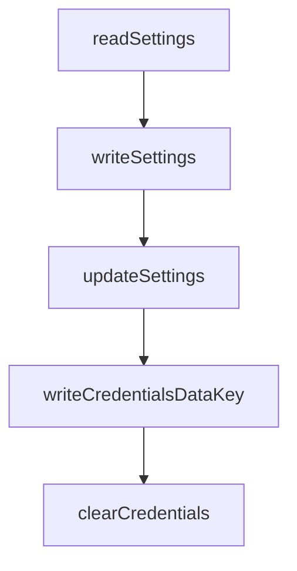

# Chapter 5: Permissions and Approval Workflow

Welcome to **Chapter 5: Permissions and Approval Workflow**. In this part of **HAPI Tutorial: Remote Control for Local AI Coding Sessions**, you will build an intuitive mental model first, then move into concrete implementation details and practical production tradeoffs.


Remote approvals are the core safety boundary when agents request actions.

## Approval Event Flow

1. agent emits permission request
2. CLI forwards request to hub
3. hub stores and broadcasts to PWA/Telegram
4. operator approves/denies
5. decision returns to active session

## Policy Matrix

| Request Type | Recommended Policy |
|:-------------|:-------------------|
| scoped file edits | approve with diff visibility |
| command execution | require explicit command preview |
| destructive/system-wide actions | deny by default |

## Operational Controls

- enforce timeout for unresolved approvals
- require request metadata (target file/command/context)
- retain immutable approval logs for audit and incident review

## Summary

You now have a governance model for remote permission handling in HAPI.

Next: [Chapter 6: PWA, Telegram, and Extensions](06-pwa-telegram-and-extensions.md)

## What Problem Does This Solve?

Most teams struggle here because the hard part is not writing more code, but deciding clear boundaries for core abstractions in this chapter so behavior stays predictable as complexity grows.

In practical terms, this chapter helps you avoid three common failures:

- coupling core logic too tightly to one implementation path
- missing the handoff boundaries between setup, execution, and validation
- shipping changes without clear rollback or observability strategy

After working through this chapter, you should be able to reason about `Chapter 5: Permissions and Approval Workflow` as an operating subsystem inside **HAPI Tutorial: Remote Control for Local AI Coding Sessions**, with explicit contracts for inputs, state transitions, and outputs.

Use the implementation notes around execution and reliability details as your checklist when adapting these patterns to your own repository.

## How it Works Under the Hood

Under the hood, `Chapter 5: Permissions and Approval Workflow` usually follows a repeatable control path:

1. **Context bootstrap**: initialize runtime config and prerequisites for `core component`.
2. **Input normalization**: shape incoming data so `execution layer` receives stable contracts.
3. **Core execution**: run the main logic branch and propagate intermediate state through `state model`.
4. **Policy and safety checks**: enforce limits, auth scopes, and failure boundaries.
5. **Output composition**: return canonical result payloads for downstream consumers.
6. **Operational telemetry**: emit logs/metrics needed for debugging and performance tuning.

When debugging, walk this sequence in order and confirm each stage has explicit success/failure conditions.

## Chapter Connections

- [Tutorial Index](README.md)
- [Previous Chapter: Chapter 4: Remote Access and Networking](04-remote-access-and-networking.md)
- [Next Chapter: Chapter 6: PWA, Telegram, and Extensions](06-pwa-telegram-and-extensions.md)
- [Main Catalog](../../README.md#-tutorial-catalog)
- [A-Z Tutorial Directory](../../discoverability/tutorial-directory.md)

## Source Code Walkthrough

### `cli/src/persistence.ts`

The `readSettings` function in [`cli/src/persistence.ts`](https://github.com/tiann/hapi/blob/HEAD/cli/src/persistence.ts) handles a key part of this chapter's functionality:

```ts
}

export async function readSettings(): Promise<Settings> {
  if (!existsSync(configuration.settingsFile)) {
    return { ...defaultSettings }
  }

  try {
    const content = await readFile(configuration.settingsFile, 'utf8')
    return JSON.parse(content)
  } catch {
    return { ...defaultSettings }
  }
}

export async function writeSettings(settings: Settings): Promise<void> {
  if (!existsSync(configuration.happyHomeDir)) {
    await mkdir(configuration.happyHomeDir, { recursive: true })
  }

  await writeFile(configuration.settingsFile, JSON.stringify(settings, null, 2))
}

/**
 * Atomically update settings with multi-process safety via file locking
 * @param updater Function that takes current settings and returns updated settings
 * @returns The updated settings
 */
export async function updateSettings(
  updater: (current: Settings) => Settings | Promise<Settings>
): Promise<Settings> {
  // Timing constants
```

This function is important because it defines how HAPI Tutorial: Remote Control for Local AI Coding Sessions implements the patterns covered in this chapter.

### `cli/src/persistence.ts`

The `writeSettings` function in [`cli/src/persistence.ts`](https://github.com/tiann/hapi/blob/HEAD/cli/src/persistence.ts) handles a key part of this chapter's functionality:

```ts
}

export async function writeSettings(settings: Settings): Promise<void> {
  if (!existsSync(configuration.happyHomeDir)) {
    await mkdir(configuration.happyHomeDir, { recursive: true })
  }

  await writeFile(configuration.settingsFile, JSON.stringify(settings, null, 2))
}

/**
 * Atomically update settings with multi-process safety via file locking
 * @param updater Function that takes current settings and returns updated settings
 * @returns The updated settings
 */
export async function updateSettings(
  updater: (current: Settings) => Settings | Promise<Settings>
): Promise<Settings> {
  // Timing constants
  const LOCK_RETRY_INTERVAL_MS = 100;  // How long to wait between lock attempts
  const MAX_LOCK_ATTEMPTS = 50;        // Maximum number of attempts (5 seconds total)
  const STALE_LOCK_TIMEOUT_MS = 10000; // Consider lock stale after 10 seconds

  if (!existsSync(configuration.happyHomeDir)) {
    await mkdir(configuration.happyHomeDir, { recursive: true });
  }

  const lockFile = configuration.settingsFile + '.lock';
  const tmpFile = configuration.settingsFile + '.tmp';
  let fileHandle;
  let attempts = 0;

```

This function is important because it defines how HAPI Tutorial: Remote Control for Local AI Coding Sessions implements the patterns covered in this chapter.

### `cli/src/persistence.ts`

The `updateSettings` function in [`cli/src/persistence.ts`](https://github.com/tiann/hapi/blob/HEAD/cli/src/persistence.ts) handles a key part of this chapter's functionality:

```ts
 * @returns The updated settings
 */
export async function updateSettings(
  updater: (current: Settings) => Settings | Promise<Settings>
): Promise<Settings> {
  // Timing constants
  const LOCK_RETRY_INTERVAL_MS = 100;  // How long to wait between lock attempts
  const MAX_LOCK_ATTEMPTS = 50;        // Maximum number of attempts (5 seconds total)
  const STALE_LOCK_TIMEOUT_MS = 10000; // Consider lock stale after 10 seconds

  if (!existsSync(configuration.happyHomeDir)) {
    await mkdir(configuration.happyHomeDir, { recursive: true });
  }

  const lockFile = configuration.settingsFile + '.lock';
  const tmpFile = configuration.settingsFile + '.tmp';
  let fileHandle;
  let attempts = 0;

  // Acquire exclusive lock with retries
  while (attempts < MAX_LOCK_ATTEMPTS) {
    try {
      // 'wx' = create exclusively, fail if exists (cross-platform compatible)
      fileHandle = await open(lockFile, 'wx');
      break;
    } catch (err: any) {
      if (err.code === 'EEXIST') {
        // Lock file exists, wait and retry
        attempts++;
        await new Promise(resolve => setTimeout(resolve, LOCK_RETRY_INTERVAL_MS));

        // Check for stale lock
```

This function is important because it defines how HAPI Tutorial: Remote Control for Local AI Coding Sessions implements the patterns covered in this chapter.

### `cli/src/persistence.ts`

The `writeCredentialsDataKey` function in [`cli/src/persistence.ts`](https://github.com/tiann/hapi/blob/HEAD/cli/src/persistence.ts) handles a key part of this chapter's functionality:

```ts
//

export async function writeCredentialsDataKey(credentials: { publicKey: Uint8Array, machineKey: Uint8Array, token: string }): Promise<void> {
  if (!existsSync(configuration.happyHomeDir)) {
    await mkdir(configuration.happyHomeDir, { recursive: true })
  }
  await writeFile(configuration.privateKeyFile, JSON.stringify({
    encryption: { publicKey: Buffer.from(credentials.publicKey).toString('base64'), machineKey: Buffer.from(credentials.machineKey).toString('base64') },
    token: credentials.token
  }, null, 2));
}

export async function clearCredentials(): Promise<void> {
  if (existsSync(configuration.privateKeyFile)) {
    await unlink(configuration.privateKeyFile);
  }
}

export async function clearMachineId(): Promise<void> {
  await updateSettings(settings => ({
    ...settings,
    machineId: undefined
  }));
}

/**
 * Read runner state from local file
 */
export async function readRunnerState(): Promise<RunnerLocallyPersistedState | null> {
  try {
    if (!existsSync(configuration.runnerStateFile)) {
      return null;
```

This function is important because it defines how HAPI Tutorial: Remote Control for Local AI Coding Sessions implements the patterns covered in this chapter.


## How These Components Connect


