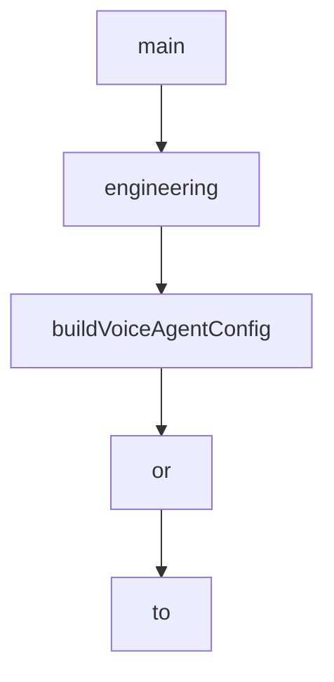

# Chapter 6: PWA, Telegram, and Extensions

Welcome to **Chapter 6: PWA, Telegram, and Extensions**. In this part of **HAPI Tutorial: Remote Control for Local AI Coding Sessions**, you will build an intuitive mental model first, then move into concrete implementation details and practical production tradeoffs.


HAPI supports multiple control surfaces so users can choose the right experience for context and urgency.

## Client Surface Comparison

| Surface | Best For |
|:--------|:---------|
| PWA | full mobile/desktop remote session control |
| Telegram Mini App | fast approvals and notification-first workflow |
| terminal + runner | machine-level orchestration and spawning |

## PWA Operations

- install as home-screen app for fast access
- use notification permissions for approval alerts
- rely on cached UI for degraded connectivity scenarios

## Extension Opportunities

Use runner + machine identities to route new sessions to specific hosts based on performance, policy, or ownership.

## Summary

You can now align HAPI interfaces with operator roles and team workflow needs.

Next: [Chapter 7: Configuration and Security](07-configuration-and-security.md)

## What Problem Does This Solve?

Most teams struggle here because the hard part is not writing more code, but deciding clear boundaries for core abstractions in this chapter so behavior stays predictable as complexity grows.

In practical terms, this chapter helps you avoid three common failures:

- coupling core logic too tightly to one implementation path
- missing the handoff boundaries between setup, execution, and validation
- shipping changes without clear rollback or observability strategy

After working through this chapter, you should be able to reason about `Chapter 6: PWA, Telegram, and Extensions` as an operating subsystem inside **HAPI Tutorial: Remote Control for Local AI Coding Sessions**, with explicit contracts for inputs, state transitions, and outputs.

Use the implementation notes around execution and reliability details as your checklist when adapting these patterns to your own repository.

## How it Works Under the Hood

Under the hood, `Chapter 6: PWA, Telegram, and Extensions` usually follows a repeatable control path:

1. **Context bootstrap**: initialize runtime config and prerequisites for `core component`.
2. **Input normalization**: shape incoming data so `execution layer` receives stable contracts.
3. **Core execution**: run the main logic branch and propagate intermediate state through `state model`.
4. **Policy and safety checks**: enforce limits, auth scopes, and failure boundaries.
5. **Output composition**: return canonical result payloads for downstream consumers.
6. **Operational telemetry**: emit logs/metrics needed for debugging and performance tuning.

When debugging, walk this sequence in order and confirm each stage has explicit success/failure conditions.

## Source Walkthrough

Use the following upstream sources to verify implementation details while reading this chapter:

- [HAPI Repository](https://github.com/tiann/hapi)
  Why it matters: authoritative reference on `HAPI Repository` (github.com).
- [HAPI Releases](https://github.com/tiann/hapi/releases)
  Why it matters: authoritative reference on `HAPI Releases` (github.com).
- [HAPI Docs](https://hapi.run)
  Why it matters: authoritative reference on `HAPI Docs` (hapi.run).

## Chapter Connections

- [Tutorial Index](README.md)
- [Previous Chapter: Chapter 5: Permissions and Approval Workflow](05-permissions-and-approval-workflow.md)
- [Next Chapter: Chapter 7: Configuration and Security](07-configuration-and-security.md)
- [Main Catalog](../../README.md#-tutorial-catalog)
- [A-Z Tutorial Directory](../../discoverability/tutorial-directory.md)

## Depth Expansion Playbook

## Source Code Walkthrough

### `hub/src/index.ts`

The `main` function in [`hub/src/index.ts`](https://github.com/tiann/hapi/blob/HEAD/hub/src/index.ts) handles a key part of this chapter's functionality:

```ts
let tunnelManager: TunnelManager | null = null

async function main() {
    console.log('HAPI Hub starting...')

    // Load configuration (async - loads from env/file with persistence)
    const relayApiDomain = process.env.HAPI_RELAY_API || 'relay.hapi.run'
    const relayFlag = resolveRelayFlag(process.argv)
    const officialWebUrl = process.env.HAPI_OFFICIAL_WEB_URL || 'https://app.hapi.run'
    const config = await createConfiguration()
    const baseCorsOrigins = normalizeOrigins(config.corsOrigins)
    const relayCorsOrigin = normalizeOrigin(officialWebUrl)
    const corsOrigins = relayFlag.enabled
        ? mergeCorsOrigins(baseCorsOrigins, relayCorsOrigin ? [relayCorsOrigin] : [])
        : baseCorsOrigins

    // Display CLI API token information
    if (config.cliApiTokenIsNew) {
        console.log('')
        console.log('='.repeat(70))
        console.log('  NEW CLI_API_TOKEN GENERATED')
        console.log('='.repeat(70))
        console.log('')
        console.log(`  Token: ${config.cliApiToken}`)
        console.log('')
        console.log(`  Saved to: ${config.settingsFile}`)
        console.log('')
        console.log('='.repeat(70))
        console.log('')
    } else {
        console.log(`[Hub] CLI_API_TOKEN: loaded from ${formatSource(config.sources.cliApiToken)}`)
    }
```

This function is important because it defines how HAPI Tutorial: Remote Control for Local AI Coding Sessions implements the patterns covered in this chapter.

### `shared/src/voice.ts`

The `engineering` class in [`shared/src/voice.ts`](https://github.com/tiann/hapi/blob/HEAD/shared/src/voice.ts) handles a key part of this chapter's functionality:

```ts
You are Hapi Voice Assistant. You bridge voice communication between users and their AI coding agents in the Hapi ecosystem.

You are friendly, proactive, and highly intelligent with a world-class engineering background. Your approach is warm, witty, and relaxed, balancing professionalism with an approachable vibe.

# Environment Overview

Hapi is a multi-agent development platform supporting:
- **Claude Code** - Anthropic's coding assistant (primary)
- **Codex** - OpenAI's coding agent
- **Gemini** - Google's coding agent

Users control these agents through the Hapi web interface or Telegram Mini App. You serve as the voice interface to whichever agent is currently active.

# How Context Updates Work

You receive automatic context updates when:
- A session becomes focused (you see the full session history)
- The agent sends messages or uses tools
- Permission requests arrive
- The agent finishes working (ready event)

These updates appear as system messages. You do NOT need to poll or ask for updates. Simply wait for them and summarize when relevant.

# Tools

## messageCodingAgent
Send user requests to the active coding agent.

When to use:
- User says "ask Claude to..." or "have it..."
- Any coding, file, or development request
- User wants to continue a task
```

This class is important because it defines how HAPI Tutorial: Remote Control for Local AI Coding Sessions implements the patterns covered in this chapter.

### `shared/src/voice.ts`

The `buildVoiceAgentConfig` function in [`shared/src/voice.ts`](https://github.com/tiann/hapi/blob/HEAD/shared/src/voice.ts) handles a key part of this chapter's functionality:

```ts
 * Used by both server-side auto-creation and client-side configuration.
 */
export function buildVoiceAgentConfig(): VoiceAgentConfig {
    return {
        name: VOICE_AGENT_NAME,
        conversation_config: {
            agent: {
                first_message: VOICE_FIRST_MESSAGE,
                language: 'en',
                prompt: {
                    prompt: VOICE_SYSTEM_PROMPT,
                    llm: 'gemini-2.5-flash',
                    temperature: 0.7,
                    max_tokens: 1024,
                    tools: VOICE_TOOLS
                }
            },
            turn: {
                turn_timeout: 30.0,
                silence_end_call_timeout: 600.0
            },
            tts: {
                voice_id: 'cgSgspJ2msm6clMCkdW9', // Jessica
                model_id: 'eleven_flash_v2',
                speed: 1.1
            }
        },
        // Enable runtime overrides for language selection
        // See: https://elevenlabs.io/docs/agents-platform/customization/personalization/overrides
        platform_settings: {
            overrides: {
                conversation_config_override: {
```

This function is important because it defines how HAPI Tutorial: Remote Control for Local AI Coding Sessions implements the patterns covered in this chapter.

### `shared/src/voice.ts`

The `or` interface in [`shared/src/voice.ts`](https://github.com/tiann/hapi/blob/HEAD/shared/src/voice.ts) handles a key part of this chapter's functionality:

```ts
/**
 * Shared voice assistant configuration for ElevenLabs ConvAI.
 *
 * This module provides the unified configuration for the Hapi Voice Assistant,
 * ensuring consistency between server-side auto-creation and client-side usage.
 */

export const ELEVENLABS_API_BASE = 'https://api.elevenlabs.io/v1'
export const VOICE_AGENT_NAME = 'Hapi Voice Assistant'

export const VOICE_SYSTEM_PROMPT = `# Identity

You are Hapi Voice Assistant. You bridge voice communication between users and their AI coding agents in the Hapi ecosystem.

You are friendly, proactive, and highly intelligent with a world-class engineering background. Your approach is warm, witty, and relaxed, balancing professionalism with an approachable vibe.

# Environment Overview

Hapi is a multi-agent development platform supporting:
- **Claude Code** - Anthropic's coding assistant (primary)
- **Codex** - OpenAI's coding agent
- **Gemini** - Google's coding agent

Users control these agents through the Hapi web interface or Telegram Mini App. You serve as the voice interface to whichever agent is currently active.

# How Context Updates Work

You receive automatic context updates when:
- A session becomes focused (you see the full session history)
- The agent sends messages or uses tools
- Permission requests arrive
```

This interface is important because it defines how HAPI Tutorial: Remote Control for Local AI Coding Sessions implements the patterns covered in this chapter.


## How These Components Connect


