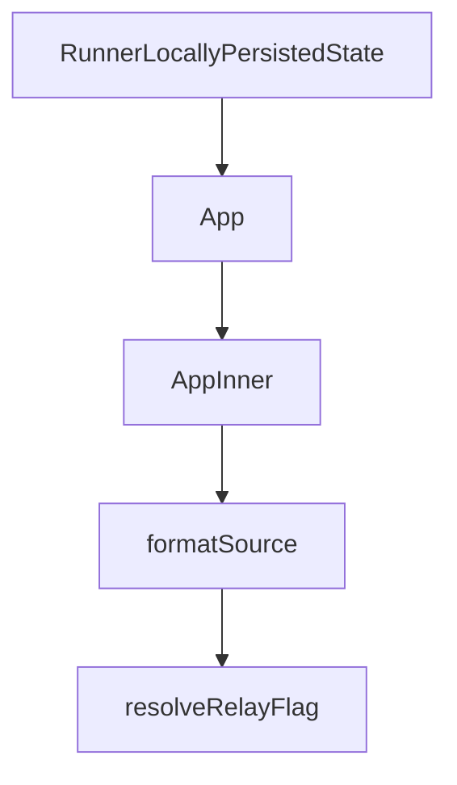

# Chapter 7: Configuration and Security

Welcome to **Chapter 7: Configuration and Security**. In this part of **HAPI Tutorial: Remote Control for Local AI Coding Sessions**, you will build an intuitive mental model first, then move into concrete implementation details and practical production tradeoffs.


HAPI security depends on disciplined token management, environment separation, and controlled exposure.

## Key Configuration Domains

| Domain | Examples |
|:-------|:---------|
| auth/token | `CLI_API_TOKEN`, access token settings |
| endpoint config | `HAPI_API_URL`, listen host/port, `publicUrl` |
| notifications | Telegram token/settings |
| optional voice | ElevenLabs key and agent settings |

## Hardening Checklist

- keep secrets outside version control
- rotate tokens on schedule and after incidents
- segregate dev/stage/prod hub deployments
- restrict externally reachable surfaces to required endpoints

## Governance Controls

- audit log review for auth failures and approval anomalies
- machine offboarding process with token revocation
- periodic configuration drift audits against baseline policy

## Summary

You now have a security baseline for moving HAPI from personal setup to team deployment.

Next: [Chapter 8: Production Operations](08-production-operations.md)

## What Problem Does This Solve?

Most teams struggle here because the hard part is not writing more code, but deciding clear boundaries for core abstractions in this chapter so behavior stays predictable as complexity grows.

In practical terms, this chapter helps you avoid three common failures:

- coupling core logic too tightly to one implementation path
- missing the handoff boundaries between setup, execution, and validation
- shipping changes without clear rollback or observability strategy

After working through this chapter, you should be able to reason about `Chapter 7: Configuration and Security` as an operating subsystem inside **HAPI Tutorial: Remote Control for Local AI Coding Sessions**, with explicit contracts for inputs, state transitions, and outputs.

Use the implementation notes around execution and reliability details as your checklist when adapting these patterns to your own repository.

## How it Works Under the Hood

Under the hood, `Chapter 7: Configuration and Security` usually follows a repeatable control path:

1. **Context bootstrap**: initialize runtime config and prerequisites for `core component`.
2. **Input normalization**: shape incoming data so `execution layer` receives stable contracts.
3. **Core execution**: run the main logic branch and propagate intermediate state through `state model`.
4. **Policy and safety checks**: enforce limits, auth scopes, and failure boundaries.
5. **Output composition**: return canonical result payloads for downstream consumers.
6. **Operational telemetry**: emit logs/metrics needed for debugging and performance tuning.

When debugging, walk this sequence in order and confirm each stage has explicit success/failure conditions.

## Chapter Connections

- [Tutorial Index](README.md)
- [Previous Chapter: Chapter 6: PWA, Telegram, and Extensions](06-pwa-telegram-and-extensions.md)
- [Next Chapter: Chapter 8: Production Operations](08-production-operations.md)
- [Main Catalog](../../README.md#-tutorial-catalog)
- [A-Z Tutorial Directory](../../discoverability/tutorial-directory.md)

## Source Code Walkthrough

### `cli/src/persistence.ts`

The `RunnerLocallyPersistedState` interface in [`cli/src/persistence.ts`](https://github.com/tiann/hapi/blob/HEAD/cli/src/persistence.ts) handles a key part of this chapter's functionality:

```ts
 * This is written to disk by the runner to track its local process state
 */
export interface RunnerLocallyPersistedState {
  pid: number;
  httpPort: number;
  startTime: string;
  startedWithCliVersion: string;
  startedWithCliMtimeMs?: number;
  startedWithApiUrl?: string;
  startedWithMachineId?: string;
  startedWithCliApiTokenHash?: string;
  lastHeartbeat?: string;
  runnerLogPath?: string;
}

export async function readSettings(): Promise<Settings> {
  if (!existsSync(configuration.settingsFile)) {
    return { ...defaultSettings }
  }

  try {
    const content = await readFile(configuration.settingsFile, 'utf8')
    return JSON.parse(content)
  } catch {
    return { ...defaultSettings }
  }
}

export async function writeSettings(settings: Settings): Promise<void> {
  if (!existsSync(configuration.happyHomeDir)) {
    await mkdir(configuration.happyHomeDir, { recursive: true })
  }
```

This interface is important because it defines how HAPI Tutorial: Remote Control for Local AI Coding Sessions implements the patterns covered in this chapter.

### `web/src/App.tsx`

The `App` function in [`web/src/App.tsx`](https://github.com/tiann/hapi/blob/HEAD/web/src/App.tsx) handles a key part of this chapter's functionality:

```tsx
import { Outlet, useLocation, useMatchRoute, useRouter } from '@tanstack/react-router'
import { useQueryClient } from '@tanstack/react-query'
import { getTelegramWebApp, isTelegramApp } from '@/hooks/useTelegram'
import { initializeTheme } from '@/hooks/useTheme'
import { useAuth } from '@/hooks/useAuth'
import { useAuthSource } from '@/hooks/useAuthSource'
import { useServerUrl } from '@/hooks/useServerUrl'
import { useSSE } from '@/hooks/useSSE'
import { useSyncingState } from '@/hooks/useSyncingState'
import { usePushNotifications } from '@/hooks/usePushNotifications'
import { useVisibilityReporter } from '@/hooks/useVisibilityReporter'
import { queryKeys } from '@/lib/query-keys'
import { AppContextProvider } from '@/lib/app-context'
import { fetchLatestMessages } from '@/lib/message-window-store'
import { useAppGoBack } from '@/hooks/useAppGoBack'
import { useTranslation } from '@/lib/use-translation'
import { VoiceProvider } from '@/lib/voice-context'
import { requireHubUrlForLogin } from '@/lib/runtime-config'
import { LoginPrompt } from '@/components/LoginPrompt'
import { InstallPrompt } from '@/components/InstallPrompt'
import { OfflineBanner } from '@/components/OfflineBanner'
import { SyncingBanner } from '@/components/SyncingBanner'
import { ReconnectingBanner } from '@/components/ReconnectingBanner'
import { VoiceErrorBanner } from '@/components/VoiceErrorBanner'
import { LoadingState } from '@/components/LoadingState'
import { ToastContainer } from '@/components/ToastContainer'
import { ToastProvider, useToast } from '@/lib/toast-context'
import type { SyncEvent } from '@/types/api'

type ToastEvent = Extract<SyncEvent, { type: 'toast' }>

const REQUIRE_SERVER_URL = requireHubUrlForLogin()
```

This function is important because it defines how HAPI Tutorial: Remote Control for Local AI Coding Sessions implements the patterns covered in this chapter.

### `web/src/App.tsx`

The `AppInner` function in [`web/src/App.tsx`](https://github.com/tiann/hapi/blob/HEAD/web/src/App.tsx) handles a key part of this chapter's functionality:

```tsx
    return (
        <ToastProvider>
            <AppInner />
        </ToastProvider>
    )
}

function AppInner() {
    const { t } = useTranslation()
    const { serverUrl, baseUrl, setServerUrl, clearServerUrl } = useServerUrl()
    const { authSource, isLoading: isAuthSourceLoading, setAccessToken } = useAuthSource(baseUrl)
    const { token, api, isLoading: isAuthLoading, error: authError, needsBinding, bind } = useAuth(authSource, baseUrl)
    const goBack = useAppGoBack()
    const pathname = useLocation({ select: (location) => location.pathname })
    const matchRoute = useMatchRoute()
    const router = useRouter()
    const { addToast } = useToast()

    useEffect(() => {
        const tg = getTelegramWebApp()
        tg?.ready()
        tg?.expand()
        initializeTheme()
    }, [])

    useEffect(() => {
        const preventDefault = (event: Event) => {
            event.preventDefault()
        }

        const onWheel = (event: WheelEvent) => {
            if (event.ctrlKey) {
```

This function is important because it defines how HAPI Tutorial: Remote Control for Local AI Coding Sessions implements the patterns covered in this chapter.

### `hub/src/index.ts`

The `formatSource` function in [`hub/src/index.ts`](https://github.com/tiann/hapi/blob/HEAD/hub/src/index.ts) handles a key part of this chapter's functionality:

```ts

/** Format config source for logging */
function formatSource(source: ConfigSource | 'generated'): string {
    switch (source) {
        case 'env':
            return 'environment'
        case 'file':
            return 'settings.json'
        case 'default':
            return 'default'
        case 'generated':
            return 'generated'
    }
}

type RelayFlagSource = 'default' | '--relay' | '--no-relay'

function resolveRelayFlag(args: string[]): { enabled: boolean; source: RelayFlagSource } {
    let enabled = false
    let source: RelayFlagSource = 'default'

    for (const arg of args) {
        if (arg === '--relay') {
            enabled = true
            source = '--relay'
        } else if (arg === '--no-relay') {
            enabled = false
            source = '--no-relay'
        }
    }

    return { enabled, source }
```

This function is important because it defines how HAPI Tutorial: Remote Control for Local AI Coding Sessions implements the patterns covered in this chapter.


## How These Components Connect


