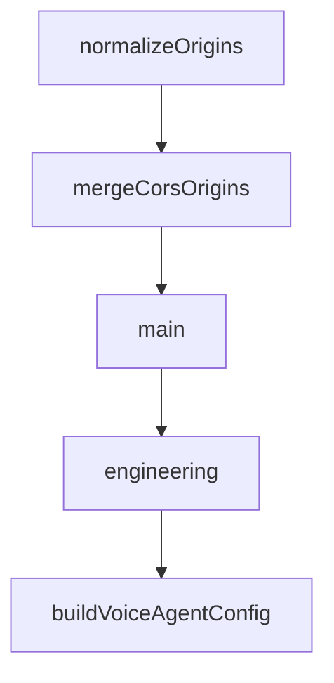

# Chapter 8: Production Operations

Welcome to **Chapter 8: Production Operations**. In this part of **HAPI Tutorial: Remote Control for Local AI Coding Sessions**, you will build an intuitive mental model first, then move into concrete implementation details and practical production tradeoffs.


This chapter closes with production reliability patterns for HAPI hub operations.

## Operational Baseline

- monitor hub uptime and API/SSE health
- track session concurrency and approval latency
- back up and validate SQLite persistence lifecycle
- maintain runbooks for relay/tunnel/auth failures

## Key Metrics

| Metric | Operational Value |
|:-------|:------------------|
| active sessions | capacity planning |
| mean approval latency | responsiveness and risk signal |
| failed action relay count | transport/auth quality |
| reconnect frequency | network stability insight |

## Incident Response Priorities

1. restore authenticated connectivity
2. protect session state integrity
3. communicate impact and expected recovery time
4. perform root-cause review and tighten controls

## Final Summary

You now have an operational model for running HAPI at production scale with controlled remote agent workflows.

Related:
- [Cline Tutorial](../cline-tutorial/)
- [Roo Code Tutorial](../roo-code-tutorial/)
- [OpenHands Tutorial](../openhands-tutorial/)

## What Problem Does This Solve?

Most teams struggle here because the hard part is not writing more code, but deciding clear boundaries for core abstractions in this chapter so behavior stays predictable as complexity grows.

In practical terms, this chapter helps you avoid three common failures:

- coupling core logic too tightly to one implementation path
- missing the handoff boundaries between setup, execution, and validation
- shipping changes without clear rollback or observability strategy

After working through this chapter, you should be able to reason about `Chapter 8: Production Operations` as an operating subsystem inside **HAPI Tutorial: Remote Control for Local AI Coding Sessions**, with explicit contracts for inputs, state transitions, and outputs.

Use the implementation notes around execution and reliability details as your checklist when adapting these patterns to your own repository.

## How it Works Under the Hood

Under the hood, `Chapter 8: Production Operations` usually follows a repeatable control path:

1. **Context bootstrap**: initialize runtime config and prerequisites for `core component`.
2. **Input normalization**: shape incoming data so `execution layer` receives stable contracts.
3. **Core execution**: run the main logic branch and propagate intermediate state through `state model`.
4. **Policy and safety checks**: enforce limits, auth scopes, and failure boundaries.
5. **Output composition**: return canonical result payloads for downstream consumers.
6. **Operational telemetry**: emit logs/metrics needed for debugging and performance tuning.

When debugging, walk this sequence in order and confirm each stage has explicit success/failure conditions.

## Chapter Connections

- [Tutorial Index](README.md)
- [Previous Chapter: Chapter 7: Configuration and Security](07-configuration-and-security.md)
- [Main Catalog](../../README.md#-tutorial-catalog)
- [A-Z Tutorial Directory](../../discoverability/tutorial-directory.md)

## Source Code Walkthrough

### `hub/src/index.ts`

The `normalizeOrigins` function in [`hub/src/index.ts`](https://github.com/tiann/hapi/blob/HEAD/hub/src/index.ts) handles a key part of this chapter's functionality:

```ts
}

function normalizeOrigins(origins: string[]): string[] {
    const normalized = origins
        .map(normalizeOrigin)
        .filter(Boolean)
    if (normalized.includes('*')) {
        return ['*']
    }
    return Array.from(new Set(normalized))
}

function mergeCorsOrigins(base: string[], extra: string[]): string[] {
    if (base.includes('*') || extra.includes('*')) {
        return ['*']
    }
    const merged = new Set<string>()
    for (const origin of base) {
        merged.add(origin)
    }
    for (const origin of extra) {
        merged.add(origin)
    }
    return Array.from(merged)
}

let syncEngine: SyncEngine | null = null
let happyBot: HappyBot | null = null
let webServer: BunServer<WebSocketData> | null = null
let sseManager: SSEManager | null = null
let visibilityTracker: VisibilityTracker | null = null
let notificationHub: NotificationHub | null = null
```

This function is important because it defines how HAPI Tutorial: Remote Control for Local AI Coding Sessions implements the patterns covered in this chapter.

### `hub/src/index.ts`

The `mergeCorsOrigins` function in [`hub/src/index.ts`](https://github.com/tiann/hapi/blob/HEAD/hub/src/index.ts) handles a key part of this chapter's functionality:

```ts
}

function mergeCorsOrigins(base: string[], extra: string[]): string[] {
    if (base.includes('*') || extra.includes('*')) {
        return ['*']
    }
    const merged = new Set<string>()
    for (const origin of base) {
        merged.add(origin)
    }
    for (const origin of extra) {
        merged.add(origin)
    }
    return Array.from(merged)
}

let syncEngine: SyncEngine | null = null
let happyBot: HappyBot | null = null
let webServer: BunServer<WebSocketData> | null = null
let sseManager: SSEManager | null = null
let visibilityTracker: VisibilityTracker | null = null
let notificationHub: NotificationHub | null = null
let tunnelManager: TunnelManager | null = null

async function main() {
    console.log('HAPI Hub starting...')

    // Load configuration (async - loads from env/file with persistence)
    const relayApiDomain = process.env.HAPI_RELAY_API || 'relay.hapi.run'
    const relayFlag = resolveRelayFlag(process.argv)
    const officialWebUrl = process.env.HAPI_OFFICIAL_WEB_URL || 'https://app.hapi.run'
    const config = await createConfiguration()
```

This function is important because it defines how HAPI Tutorial: Remote Control for Local AI Coding Sessions implements the patterns covered in this chapter.

### `hub/src/index.ts`

The `main` function in [`hub/src/index.ts`](https://github.com/tiann/hapi/blob/HEAD/hub/src/index.ts) handles a key part of this chapter's functionality:

```ts
let tunnelManager: TunnelManager | null = null

async function main() {
    console.log('HAPI Hub starting...')

    // Load configuration (async - loads from env/file with persistence)
    const relayApiDomain = process.env.HAPI_RELAY_API || 'relay.hapi.run'
    const relayFlag = resolveRelayFlag(process.argv)
    const officialWebUrl = process.env.HAPI_OFFICIAL_WEB_URL || 'https://app.hapi.run'
    const config = await createConfiguration()
    const baseCorsOrigins = normalizeOrigins(config.corsOrigins)
    const relayCorsOrigin = normalizeOrigin(officialWebUrl)
    const corsOrigins = relayFlag.enabled
        ? mergeCorsOrigins(baseCorsOrigins, relayCorsOrigin ? [relayCorsOrigin] : [])
        : baseCorsOrigins

    // Display CLI API token information
    if (config.cliApiTokenIsNew) {
        console.log('')
        console.log('='.repeat(70))
        console.log('  NEW CLI_API_TOKEN GENERATED')
        console.log('='.repeat(70))
        console.log('')
        console.log(`  Token: ${config.cliApiToken}`)
        console.log('')
        console.log(`  Saved to: ${config.settingsFile}`)
        console.log('')
        console.log('='.repeat(70))
        console.log('')
    } else {
        console.log(`[Hub] CLI_API_TOKEN: loaded from ${formatSource(config.sources.cliApiToken)}`)
    }
```

This function is important because it defines how HAPI Tutorial: Remote Control for Local AI Coding Sessions implements the patterns covered in this chapter.

### `shared/src/voice.ts`

The `engineering` class in [`shared/src/voice.ts`](https://github.com/tiann/hapi/blob/HEAD/shared/src/voice.ts) handles a key part of this chapter's functionality:

```ts
You are Hapi Voice Assistant. You bridge voice communication between users and their AI coding agents in the Hapi ecosystem.

You are friendly, proactive, and highly intelligent with a world-class engineering background. Your approach is warm, witty, and relaxed, balancing professionalism with an approachable vibe.

# Environment Overview

Hapi is a multi-agent development platform supporting:
- **Claude Code** - Anthropic's coding assistant (primary)
- **Codex** - OpenAI's coding agent
- **Gemini** - Google's coding agent

Users control these agents through the Hapi web interface or Telegram Mini App. You serve as the voice interface to whichever agent is currently active.

# How Context Updates Work

You receive automatic context updates when:
- A session becomes focused (you see the full session history)
- The agent sends messages or uses tools
- Permission requests arrive
- The agent finishes working (ready event)

These updates appear as system messages. You do NOT need to poll or ask for updates. Simply wait for them and summarize when relevant.

# Tools

## messageCodingAgent
Send user requests to the active coding agent.

When to use:
- User says "ask Claude to..." or "have it..."
- Any coding, file, or development request
- User wants to continue a task
```

This class is important because it defines how HAPI Tutorial: Remote Control for Local AI Coding Sessions implements the patterns covered in this chapter.


## How These Components Connect


