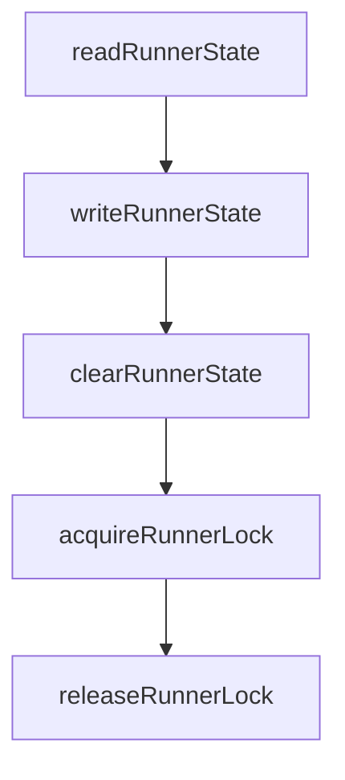

# Chapter 8: Production Operations

Welcome to **Chapter 8: Production Operations**. In this part of **HAPI Tutorial: Remote Control for Local AI Coding Sessions**, you will build an intuitive mental model first, then move into concrete implementation details and practical production tradeoffs.


This chapter closes with production reliability patterns for HAPI hub operations.

## Operational Baseline

- monitor hub uptime and API/SSE health
- track session concurrency and approval latency
- back up and validate SQLite persistence lifecycle
- maintain runbooks for relay/tunnel/auth failures

## Key Metrics

| Metric | Operational Value |
|:-------|:------------------|
| active sessions | capacity planning |
| mean approval latency | responsiveness and risk signal |
| failed action relay count | transport/auth quality |
| reconnect frequency | network stability insight |

## Incident Response Priorities

1. restore authenticated connectivity
2. protect session state integrity
3. communicate impact and expected recovery time
4. perform root-cause review and tighten controls

## Final Summary

You now have an operational model for running HAPI at production scale with controlled remote agent workflows.

Related:
- [Cline Tutorial](../cline-tutorial/)
- [Roo Code Tutorial](../roo-code-tutorial/)
- [OpenHands Tutorial](../openhands-tutorial/)

## What Problem Does This Solve?

Most teams struggle here because the hard part is not writing more code, but deciding clear boundaries for core abstractions in this chapter so behavior stays predictable as complexity grows.

In practical terms, this chapter helps you avoid three common failures:

- coupling core logic too tightly to one implementation path
- missing the handoff boundaries between setup, execution, and validation
- shipping changes without clear rollback or observability strategy

After working through this chapter, you should be able to reason about `Chapter 8: Production Operations` as an operating subsystem inside **HAPI Tutorial: Remote Control for Local AI Coding Sessions**, with explicit contracts for inputs, state transitions, and outputs.

Use the implementation notes around execution and reliability details as your checklist when adapting these patterns to your own repository.

## How it Works Under the Hood

Under the hood, `Chapter 8: Production Operations` usually follows a repeatable control path:

1. **Context bootstrap**: initialize runtime config and prerequisites for `core component`.
2. **Input normalization**: shape incoming data so `execution layer` receives stable contracts.
3. **Core execution**: run the main logic branch and propagate intermediate state through `state model`.
4. **Policy and safety checks**: enforce limits, auth scopes, and failure boundaries.
5. **Output composition**: return canonical result payloads for downstream consumers.
6. **Operational telemetry**: emit logs/metrics needed for debugging and performance tuning.

When debugging, walk this sequence in order and confirm each stage has explicit success/failure conditions.

## Source Walkthrough

Use the following upstream sources to verify implementation details while reading this chapter:

- [HAPI Repository](https://github.com/tiann/hapi)
  Why it matters: authoritative reference on `HAPI Repository` (github.com).
- [HAPI Releases](https://github.com/tiann/hapi/releases)
  Why it matters: authoritative reference on `HAPI Releases` (github.com).
- [HAPI Docs](https://hapi.run)
  Why it matters: authoritative reference on `HAPI Docs` (hapi.run).

## Chapter Connections

- [Tutorial Index](README.md)
- [Previous Chapter: Chapter 7: Configuration and Security](07-configuration-and-security.md)
- [Main Catalog](../../README.md#-tutorial-catalog)
- [A-Z Tutorial Directory](../../discoverability/tutorial-directory.md)

## Depth Expansion Playbook

## Source Code Walkthrough

### `cli/src/persistence.ts`

The `readRunnerState` function in [`cli/src/persistence.ts`](https://github.com/tiann/hapi/blob/HEAD/cli/src/persistence.ts) handles a key part of this chapter's functionality:

```ts
 * Read runner state from local file
 */
export async function readRunnerState(): Promise<RunnerLocallyPersistedState | null> {
  try {
    if (!existsSync(configuration.runnerStateFile)) {
      return null;
    }
    const content = await readFile(configuration.runnerStateFile, 'utf-8');
    return JSON.parse(content) as RunnerLocallyPersistedState;
  } catch (error) {
    // State corrupted somehow :(
    console.error(`[PERSISTENCE] Runner state file corrupted: ${configuration.runnerStateFile}`, error);
    return null;
  }
}

/**
 * Write runner state to local file (synchronously for atomic operation)
 */
export function writeRunnerState(state: RunnerLocallyPersistedState): void {
  writeFileSync(configuration.runnerStateFile, JSON.stringify(state, null, 2), 'utf-8');
}

/**
 * Clean up runner state file and lock file
 */
export async function clearRunnerState(): Promise<void> {
  if (existsSync(configuration.runnerStateFile)) {
    await unlink(configuration.runnerStateFile);
  }
  // Also clean up lock file if it exists (for stale cleanup)
  if (existsSync(configuration.runnerLockFile)) {
```

This function is important because it defines how HAPI Tutorial: Remote Control for Local AI Coding Sessions implements the patterns covered in this chapter.

### `cli/src/persistence.ts`

The `writeRunnerState` function in [`cli/src/persistence.ts`](https://github.com/tiann/hapi/blob/HEAD/cli/src/persistence.ts) handles a key part of this chapter's functionality:

```ts
 * Write runner state to local file (synchronously for atomic operation)
 */
export function writeRunnerState(state: RunnerLocallyPersistedState): void {
  writeFileSync(configuration.runnerStateFile, JSON.stringify(state, null, 2), 'utf-8');
}

/**
 * Clean up runner state file and lock file
 */
export async function clearRunnerState(): Promise<void> {
  if (existsSync(configuration.runnerStateFile)) {
    await unlink(configuration.runnerStateFile);
  }
  // Also clean up lock file if it exists (for stale cleanup)
  if (existsSync(configuration.runnerLockFile)) {
    try {
      await unlink(configuration.runnerLockFile);
    } catch {
      // Lock file might be held by running runner, ignore error
    }
  }
}

/**
 * Acquire an exclusive lock file for the runner.
 * The lock file proves the runner is running and prevents multiple instances.
 * Returns the file handle to hold for the runner's lifetime, or null if locked.
 */
export async function acquireRunnerLock(
  maxAttempts: number = 5,
  delayIncrementMs: number = 200
): Promise<FileHandle | null> {
```

This function is important because it defines how HAPI Tutorial: Remote Control for Local AI Coding Sessions implements the patterns covered in this chapter.

### `cli/src/persistence.ts`

The `clearRunnerState` function in [`cli/src/persistence.ts`](https://github.com/tiann/hapi/blob/HEAD/cli/src/persistence.ts) handles a key part of this chapter's functionality:

```ts
 * Clean up runner state file and lock file
 */
export async function clearRunnerState(): Promise<void> {
  if (existsSync(configuration.runnerStateFile)) {
    await unlink(configuration.runnerStateFile);
  }
  // Also clean up lock file if it exists (for stale cleanup)
  if (existsSync(configuration.runnerLockFile)) {
    try {
      await unlink(configuration.runnerLockFile);
    } catch {
      // Lock file might be held by running runner, ignore error
    }
  }
}

/**
 * Acquire an exclusive lock file for the runner.
 * The lock file proves the runner is running and prevents multiple instances.
 * Returns the file handle to hold for the runner's lifetime, or null if locked.
 */
export async function acquireRunnerLock(
  maxAttempts: number = 5,
  delayIncrementMs: number = 200
): Promise<FileHandle | null> {
  for (let attempt = 1; attempt <= maxAttempts; attempt++) {
    try {
      // 'wx' ensures we only create if it doesn't exist (atomic lock acquisition)
      const fileHandle = await open(configuration.runnerLockFile, 'wx');
      // Write PID to lock file for debugging
      await fileHandle.writeFile(String(process.pid));
      return fileHandle;
```

This function is important because it defines how HAPI Tutorial: Remote Control for Local AI Coding Sessions implements the patterns covered in this chapter.

### `cli/src/persistence.ts`

The `acquireRunnerLock` function in [`cli/src/persistence.ts`](https://github.com/tiann/hapi/blob/HEAD/cli/src/persistence.ts) handles a key part of this chapter's functionality:

```ts
 * Returns the file handle to hold for the runner's lifetime, or null if locked.
 */
export async function acquireRunnerLock(
  maxAttempts: number = 5,
  delayIncrementMs: number = 200
): Promise<FileHandle | null> {
  for (let attempt = 1; attempt <= maxAttempts; attempt++) {
    try {
      // 'wx' ensures we only create if it doesn't exist (atomic lock acquisition)
      const fileHandle = await open(configuration.runnerLockFile, 'wx');
      // Write PID to lock file for debugging
      await fileHandle.writeFile(String(process.pid));
      return fileHandle;
    } catch (error: any) {
      if (error.code === 'EEXIST') {
        // Lock file exists, check if process is still running
        try {
          const lockPid = readFileSync(configuration.runnerLockFile, 'utf-8').trim();
          if (lockPid && !isNaN(Number(lockPid))) {
            if (!isProcessAlive(Number(lockPid))) {
              // Process doesn't exist, remove stale lock
              unlinkSync(configuration.runnerLockFile);
              continue; // Retry acquisition
            }
          }
        } catch {
          // Can't read lock file, might be corrupted
        }
      }

      if (attempt === maxAttempts) {
        return null;
```

This function is important because it defines how HAPI Tutorial: Remote Control for Local AI Coding Sessions implements the patterns covered in this chapter.


## How These Components Connect


