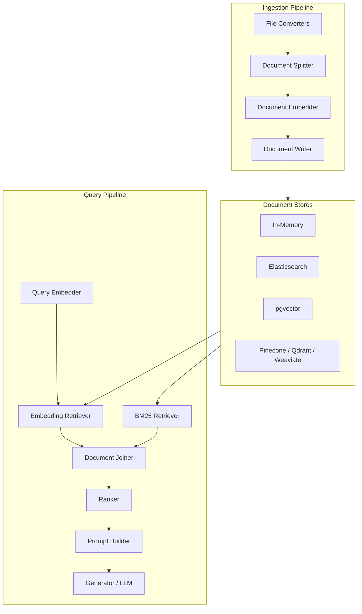

# Haystack: Deep Dive Tutorial

> **Project**: [Haystack](https://github.com/deepset-ai/haystack) — An open-source framework for building production-ready LLM applications, RAG pipelines, and intelligent search systems.

## What Is Haystack?

Haystack is an open-source LLM framework by deepset for building composable AI pipelines. It provides a modular, component-based architecture that combines retrieval, generation, and evaluation into production-ready workflows. Haystack supports dozens of LLM providers, vector databases, and retrieval strategies out of the box.

| Feature | Description |
|---------|-------------|
| **Pipeline System** | Directed graph of components with typed inputs/outputs and automatic validation |
| **RAG** | First-class retrieval-augmented generation with hybrid search (BM25 + embedding) |
| **Multi-Provider** | OpenAI, Anthropic, Cohere, Google, Hugging Face, Ollama, and more |
| **Document Stores** | In-memory, Elasticsearch, OpenSearch, Pinecone, Qdrant, Weaviate, Chroma, pgvector |
| **Evaluation** | Built-in metrics (MRR, MAP, NDCG) and LLM-based evaluation components |
| **Custom Components** | `@component` decorator for building reusable pipeline nodes with typed I/O |

## Architecture Overview

## Tutorial Structure

| Chapter | Topic | What You'll Learn |
|---------|-------|-------------------|
| [1. Getting Started](01-getting-started.md) | Setup | Installation, first RAG pipeline, architecture overview |
| [2. Document Stores](02-document-stores.md) | Storage | Store backends, indexing, preprocessing, multi-store patterns |
| [3. Retrievers & Search](03-retrievers-search.md) | Retrieval | BM25, embedding, hybrid search, filtering, re-ranking |
| [4. Generators & LLMs](04-generators-llms.md) | Generation | Multi-provider LLMs, prompt engineering, streaming, chat |
| [5. Pipelines & Workflows](05-pipelines-workflows.md) | Composition | Pipeline graph, branching, loops, serialization, async |
| [6. Evaluation & Optimization](06-evaluation-optimization.md) | Quality | Retrieval metrics, LLM evaluation, A/B testing, optimization |
| [7. Custom Components](07-custom-components.md) | Extensibility | @component decorator, typed I/O, testing, packaging |
| [8. Production Deployment](08-production-deployment.md) | Operations | REST API, Docker, Kubernetes, monitoring, scaling |

## Tech Stack

| Component | Technology |
|-----------|-----------|
| **Language** | Python 3.9+ |
| **Pipeline Engine** | Custom directed graph with topological execution |
| **Serialization** | YAML / JSON pipeline definitions |
| **Embeddings** | Sentence Transformers, OpenAI, Cohere, Fastembed |
| **Vector Search** | FAISS, Pinecone, Qdrant, Weaviate, Chroma, pgvector |
| **Text Search** | Elasticsearch, OpenSearch, BM25 (in-memory) |
| **LLM Providers** | OpenAI, Anthropic, Google, Cohere, Hugging Face, Ollama |
| **API Layer** | Hayhooks (FastAPI-based pipeline serving) |

---

Ready to begin? Start with [Chapter 1: Getting Started](01-getting-started.md).

---

*Built with insights from the [Haystack repository](https://github.com/deepset-ai/haystack) and community documentation.*

## Navigation & Backlinks

- [Start Here: Chapter 1: Getting Started with Haystack](01-getting-started.md)
- [Back to Main Catalog](../../README.md#-tutorial-catalog)
- [Browse A-Z Tutorial Directory](../../discoverability/tutorial-directory.md)
- [Search by Intent](../../discoverability/query-hub.md)
- [Explore Category Hubs](../../README.md#category-hubs)

## Full Chapter Map

1. [Chapter 1: Getting Started with Haystack](01-getting-started.md)
2. [Chapter 2: Document Stores](02-document-stores.md)
3. [Chapter 3: Retrievers & Search](03-retrievers-search.md)
4. [Chapter 4: Generators & LLMs](04-generators-llms.md)
5. [Chapter 5: Pipelines & Workflows](05-pipelines-workflows.md)
6. [Chapter 6: Evaluation & Optimization](06-evaluation-optimization.md)
7. [Chapter 7: Custom Components](07-custom-components.md)
8. [Chapter 8: Production Deployment](08-production-deployment.md)

## Source References

- [Haystack](https://github.com/deepset-ai/haystack)

*Generated by [AI Codebase Knowledge Builder](https://github.com/The-Pocket/Tutorial-Codebase-Knowledge)*
