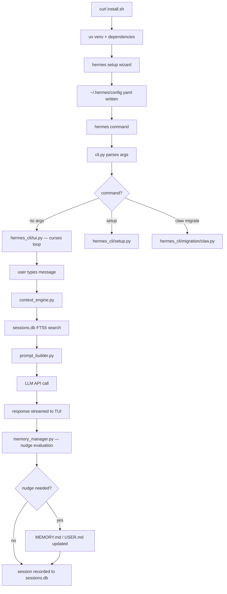
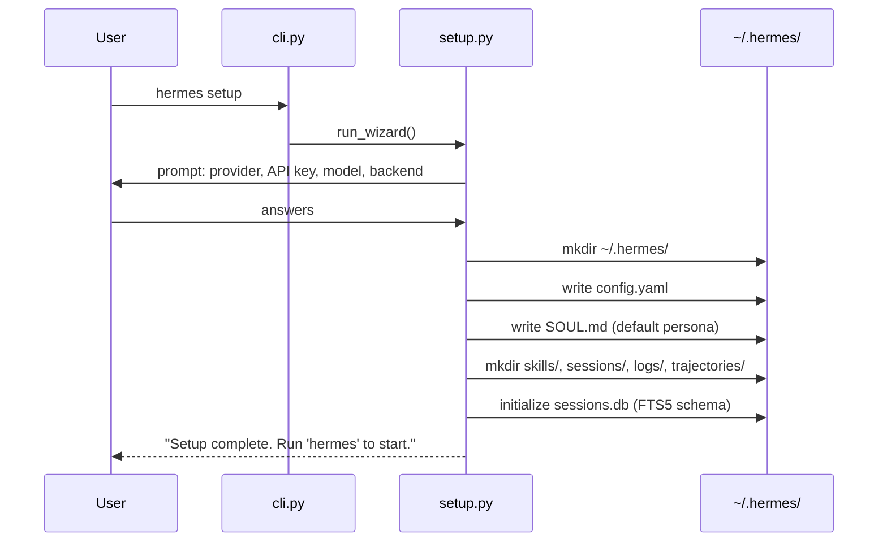

# Chapter 1: Getting Started

## What Problem Does This Solve?

Most AI agent frameworks are session-scoped: you start them, they run, you stop them, and nothing persists. The next conversation starts from a blank slate. This is fine for demos and experiments, but it is useless as a genuine personal assistant — one that remembers your projects, knows your preferences, and gets better at helping you over time.

Hermes Agent solves the blank-slate problem by making persistence the default, not the exception. The `~/.hermes/` directory is the agent's brain. It accumulates episodic memories from every session, semantic facts in `MEMORY.md` and `USER.md`, and procedural knowledge in `SKILL.md` files that the agent writes and improves autonomously. When you open the TUI tomorrow, it knows what you were working on today.

This chapter walks you through installation, the setup wizard, the directory layout, and your first conversation — building the foundation for everything that follows.

---

## System Requirements

| Requirement | Minimum | Recommended |
|---|---|---|
| Python | 3.11 | 3.12 |
| Package manager | pip | uv (10-100x faster) |
| OS | Linux / macOS | Linux (full backend support) |
| RAM | 4 GB | 16 GB (for local model backends) |
| Docker | Optional | Required for Docker terminal backend |
| SQLite | 3.35+ (FTS5) | Bundled with Python 3.11+ |

Hermes uses `uv` for dependency management. The curl installer handles this automatically; from-source installs should install `uv` first.

---

## Installation

### Option A: One-Line Installer (Recommended)

```bash
curl -fsSL https://raw.githubusercontent.com/nousresearch/hermes-agent/main/install.sh | bash
```

The installer:
1. Detects your OS and architecture
2. Installs `uv` if not present
3. Clones the repository to `~/.hermes-agent/`
4. Creates a virtual environment with `uv venv`
5. Installs all dependencies with `uv pip install -e .`
6. Adds the `hermes` command to your PATH via a shell wrapper

Verify the installation:

```bash
hermes --version
# hermes-agent 0.x.x (NousResearch)
```

### Option B: From Source

```bash
# Prerequisites
pip install uv   # or: brew install uv

# Clone and install
git clone https://github.com/nousresearch/hermes-agent.git
cd hermes-agent
uv venv
source .venv/bin/activate
uv pip install -e .

# Verify
hermes --version
```

### Option C: Nix

```bash
nix develop   # enters the devshell defined in flake.nix
```

The Nix flake pins all dependencies, making this the most reproducible option for development.

---

## The Setup Wizard

Running `hermes setup` launches an interactive wizard that writes `~/.hermes/config.yaml`. You only need to run it once; you can re-run it any time to change settings.

```bash
hermes setup
```

```
╔═══════════════════════════════════════════╗
║         Hermes Agent Setup Wizard         ║
╚═══════════════════════════════════════════╝

[1/6] Primary LLM provider
  > openai / anthropic / together / openrouter / local
  Choice: openai

[2/6] API key for openai
  Key: sk-...

[3/6] Default model
  > gpt-4o / gpt-4-turbo / gpt-3.5-turbo / custom
  Choice: gpt-4o

[4/6] Terminal backend
  > local / docker / ssh / daytona / singularity / modal
  Choice: local

[5/6] Enable messaging gateway? (y/n): y
  Platforms to enable (comma-separated):
  telegram, discord, slack, ...

[6/6] Agent persona name (default: Hermes): Hermes

Setup complete. Config written to ~/.hermes/config.yaml
Run 'hermes' to start.
```

### What the Wizard Configures

| Wizard Step | Config Key | Effect |
|---|---|---|
| Primary provider | `llm.provider` | Default API endpoint for all completions |
| API key | `llm.api_key` | Stored in config (or env var `HERMES_API_KEY`) |
| Default model | `llm.model` | Base model; smart routing can override per-request |
| Terminal backend | `execution.backend` | Where shell commands run (local, Docker, SSH, etc.) |
| Gateway platforms | `gateway.enabled` | Which messaging platforms to activate |
| Persona name | `agent.persona` | Name used in SOUL.md and TUI header |

---

## The `~/.hermes/` Directory Layout

After setup and a first conversation, the directory looks like this:

```
~/.hermes/
├── config.yaml              # Master configuration (written by hermes setup)
├── SOUL.md                  # Agent persona definition (editable)
├── MEMORY.md                # Semantic long-term memory (agent-written)
├── USER.md                  # User model (agent-written via Honcho dialectic)
├── AGENTS.md                # (Optional) multi-agent context instructions
├── hermes.md                # (Optional) project/context file injected into prompts
│
├── skills/                  # Procedural memory — SKILL.md files
│   ├── git_workflow.md
│   ├── python_debug.md
│   └── ...
│
├── sessions/                # Episodic memory — SQLite FTS5 database
│   └── sessions.db
│
├── logs/                    # Structured logs per session
│   └── session_<timestamp>.jsonl
│
├── trajectories/            # RL training data (Atropos format)
│   └── traj_<timestamp>.jsonl
│
└── .credentials/            # Encrypted gateway credentials
    ├── telegram.enc
    └── discord.enc
```

### Key Files Explained

**`SOUL.md`** — The agent's persona. Hermes reads this at the start of every prompt. Edit it to change the agent's name, writing style, areas of expertise, or constraints. This is the primary customization lever for individual users.

**`MEMORY.md`** — Declarative long-term memory. The agent writes facts here autonomously when `memory_manager.py` decides a memory nudge is warranted. Examples: your preferred programming language, ongoing projects, important dates.

**`USER.md`** — A model of you, the user. Written by the Honcho dialectic system which infers your goals, communication style, and knowledge level from conversation patterns.

**`skills/`** — Directory of `SKILL.md` files. Each file is a proceduralized workflow the agent discovered was worth crystallizing. The agent both creates and improves these files autonomously.

**`sessions/sessions.db`** — FTS5 SQLite database storing compressed summaries of past sessions. When you ask about something from weeks ago, `context_engine.py` performs a full-text search here and injects the relevant summary into your prompt.

---

## First Conversation

```bash
hermes
```

The curses TUI opens. Type your first message:

```
You: Hello! I'm starting a new Python project for data pipeline automation.

Hermes: Great to meet you! A data pipeline automation project — tell me more
        about the data sources you're working with and what kind of
        transformations you need...

        [Hermes is forming a memory about your new project...]
```

In the background, several things happen on the first substantive exchange:

```
Session Start
    │
    ▼
context_engine.py ──► searches sessions.db (empty on first run)
    │
    ▼
prompt_builder.py ──► assembles: SOUL.md + empty memories + no skills
    │
    ▼
LLM call ──► response streamed to TUI
    │
    ▼
memory_manager.py ──► evaluates: should a MEMORY.md write be triggered?
    │                  (yes: new project mentioned)
    ▼
MEMORY.md updated: "User started a Python data pipeline project on 2026-04-12"
    │
    ▼
session recorded ──► sessions.db gets summary entry
```

---

## OpenClaw Migration

If you used OpenClaw (Hermes's predecessor), you can import your entire history:

```bash
hermes claw migrate
```

```
OpenClaw Migration Tool
=======================
Detected ~/.openclaw/ directory.

Found:
  - 847 session records
  - 23 skill files
  - MEMORY.md (12 KB)
  - USER.md (4 KB)
  - config.yaml

Migrating...
  ✓ Sessions imported to ~/.hermes/sessions/sessions.db
  ✓ Skills copied to ~/.hermes/skills/
  ✓ MEMORY.md merged
  ✓ USER.md merged
  ✓ Config values translated

Migration complete. Your OpenClaw history is now available in Hermes.
```

The migration tool handles:
- Schema translation from OpenClaw's session format to Hermes's FTS5 schema
- Skill file compatibility (format is identical — SKILL.md is shared between projects)
- MEMORY.md merging (deduplication by semantic similarity)
- Config key mapping (OpenClaw config keys → Hermes config keys)

---

## CLI Command Reference

```bash
hermes                    # Launch TUI (default)
hermes setup              # Re-run setup wizard
hermes claw migrate       # Import OpenClaw data
hermes cron list          # Show scheduled jobs
hermes cron add <spec>    # Add a cron job
hermes gateway status     # Show gateway connection states
hermes skills list        # List all SKILL.md files
hermes skills show <name> # Display a skill
hermes version            # Print version info
hermes --help             # Full help text
```

---

## Architecture Flow: From Install to First Token



---

## Directory Initialization Flow



---

## Environment Variables

For CI/CD, Docker, or scripting use cases, every config value can be overridden with environment variables:

```bash
export HERMES_API_KEY="sk-..."
export HERMES_MODEL="gpt-4o"
export HERMES_PROVIDER="openai"
export HERMES_BACKEND="docker"
export HERMES_HOME="/custom/path/.hermes"   # Override ~/.hermes location
```

Environment variables always take precedence over `config.yaml`.

---

## Troubleshooting

| Symptom | Likely Cause | Fix |
|---|---|---|
| `hermes: command not found` | Shell wrapper not in PATH | Re-run installer or add `~/.hermes-agent/.venv/bin` to PATH |
| `FTS5 not available` | Old SQLite bundled with Python | Upgrade to Python 3.11+ |
| `API key invalid` | Wrong key in config | Run `hermes setup` again |
| `curses import error` | Windows without WSL | Use WSL2 or Docker on Windows |
| `Port already in use` | Gateway server conflict | Change `gateway.port` in config.yaml |
| Setup wizard hangs | Slow API key validation | Press Ctrl+C and check network |

---

## Chapter Summary

| Concept | Key Takeaway |
|---|---|
| Installation | One-line curl installer; uv manages dependencies |
| Setup wizard | Writes ~/.hermes/config.yaml; six prompts cover all essential config |
| ~/.hermes/ layout | Persistent state directory: SOUL.md, MEMORY.md, USER.md, skills/, sessions/ |
| First conversation | memory_manager.py autonomously decides when to write MEMORY.md |
| OpenClaw migration | `hermes claw migrate` imports sessions, skills, memories, and config |
| CLI commands | `hermes`, `hermes setup`, `hermes claw migrate`, `hermes cron`, `hermes gateway` |
| Env vars | All config overridable via HERMES_* environment variables |
