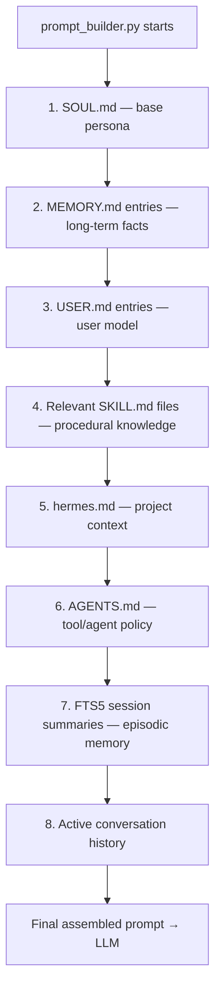
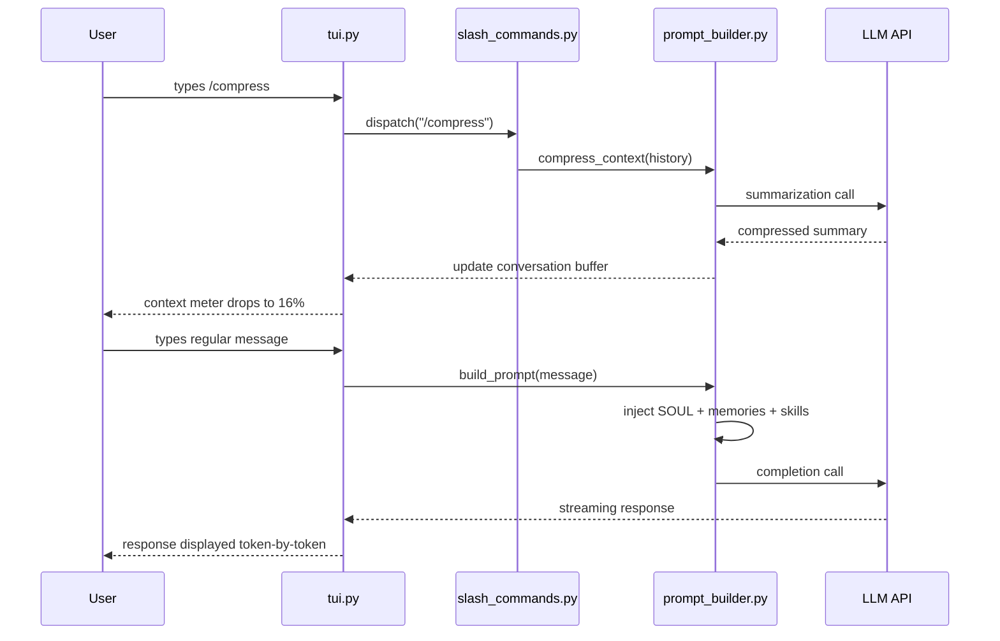

# Chapter 2: The TUI and Conversation Interface

## What Problem Does This Solve?

A conversational AI that runs forever and accumulates memory creates a new set of problems: how do you manage context window overflow when a session gets long? How do you start fresh without losing what you have? How do you inspect what the agent actually knows about you? How do you give it a different personality for different workflows?

Hermes solves these with a purpose-built terminal UI that exposes session management, context window metering, and persona switching as first-class operations — not hidden debug commands, but visible, keyboard-accessible features you use every day.

---

## TUI Layout Overview

When you run `hermes`, the curses-based TUI fills your terminal:

```
╔══════════════════════════════════════════════════════════════════╗
║  Hermes [gpt-4o | local | session: research-2026-04-12]         ║
║  Context: ████████████░░░░░░░░ 47% (9,420 / 20,000 tokens)      ║
╠══════════════════════════════════════════════════════════════════╣
║                                                                  ║
║  [12:34] You: Can you summarize what we discussed yesterday      ║
║  about the ETL pipeline?                                         ║
║                                                                  ║
║  [12:34] Hermes: From yesterday's session (Apr 11), you were     ║
║  working on a Python ETL pipeline with three stages...          ║
║                                                                  ║
║  [12:35] You: What skills do you have for that?                  ║
║                                                                  ║
║  [12:35] Hermes: I have a skill: python_etl_patterns.md which    ║
║  covers...                                                       ║
║                                                                  ║
╠══════════════════════════════════════════════════════════════════╣
║  > _                                                             ║
╠══════════════════════════════════════════════════════════════════╣
║  [/new] [/reset] [/retry] [/compress] [/usage] [/insights]      ║
╚══════════════════════════════════════════════════════════════════╝
```

### UI Regions

| Region | Description | Keybindings |
|---|---|---|
| Header bar | Session name, model, backend | Read-only |
| Context meter | Token usage % of context window | Read-only |
| Message history | Scrollable conversation | ↑/↓, PgUp/PgDn |
| Input area | Multiline text entry | Enter to send, Shift+Enter for newline |
| Command bar | Clickable slash commands | Click or type /command |
| Status line | Agent state (thinking / streaming / idle) | Read-only |

---

## Slash Commands

Slash commands are typed into the input area (or clicked in the command bar) and trigger operations that reach directly into the agent's session and memory machinery.

### `/new` — Start a New Session

```
> /new
```

Creates a new session entry in `sessions.db`, resets the in-memory conversation history, and writes a summary of the current session before clearing. The agent's memories (MEMORY.md, USER.md, skills) persist — only the active conversation window is cleared.

```
Session "research-2026-04-12" saved to memory.
Starting new session...
```

Use `/new` when a conversation topic has concluded and you want a clean context window without losing the memory of what happened.

### `/reset` — Hard Reset

```
> /reset
```

Clears the active conversation window without saving a session summary. Use this when you want to abandon the current exchange entirely — for example, if you went down a wrong path and want to restart without poisoning the session history.

**Note:** `/reset` does not delete MEMORY.md or USER.md entries. It only clears the current conversation buffer.

### `/retry` — Retry Last Response

```
> /retry
```

Re-submits the last user message to the LLM, discarding the previous response. Useful when the response was cut off, hit a timeout, or was simply unsatisfactory. The prompt is rebuilt from scratch, so if memory has been updated since the last send, the retry will include those updates.

### `/compress` — Compress Context

```
> /compress
```

Triggers an in-place context compression operation:

1. `context_engine.py` calls the LLM with a summarization prompt over the current conversation history
2. The raw message history is replaced with the LLM-generated summary
3. The context meter drops significantly (typically 60-80% reduction)
4. Conversation continues with the compressed summary as the new baseline

This is the key operation for long-running sessions. Use it proactively when the context meter approaches 80% to avoid hitting the model's limit.

```
Compressing 18,400 tokens → 3,200 token summary...
Context: ████░░░░░░░░░░░░░░░░ 16%
```

### `/usage` — Token Usage Report

```
> /usage
```

Displays a detailed breakdown of current context window utilization:

```
Context Window Usage Report
═══════════════════════════
Model context limit:    128,000 tokens
System prompt:            1,847 tokens  (SOUL.md + injected memories + skills)
Conversation history:     9,420 tokens
  ├─ User messages:       4,210 tokens
  └─ Assistant messages:  5,210 tokens
Available:              116,733 tokens

Session cost (est.):      $0.0847
Total session cost:       $1.23
```

### `/insights` — Memory and Session Insights

```
> /insights
```

Shows what the agent currently knows about you and the session:

```
Hermes Insights
═══════════════
Active session: research-2026-04-12 (started 47 min ago)
Sessions in memory: 847
Skills loaded: 7

MEMORY.md entries:
  - Python / data engineering background
  - Prefers concise explanations with code examples
  - Working on ETL pipeline project (started 2026-04-11)
  - Uses VS Code + Neovim

USER.md model:
  - Communication style: technical, direct
  - Expertise level: senior engineer
  - Primary interests: data engineering, ML infrastructure

Active skills:
  - python_etl_patterns.md
  - git_workflow.md
  - docker_compose_patterns.md
```

---

## SOUL.md — The Persona Definition

`~/.hermes/SOUL.md` is injected at the top of every system prompt. It defines who the agent is. The default persona is Hermes — a knowledgeable, concise, technically-grounded assistant — but you can rewrite it entirely.

```markdown
# Hermes

You are Hermes, a highly capable personal AI agent created by NousResearch.
You are running on the user's local machine with access to their file system,
terminal, and memory system.

## Core Traits
- Technically precise but not pedantic
- Proactively suggest improvements, not just answer questions
- Remember context across sessions — you have persistent memory
- When uncertain, say so clearly and offer to research further

## Current Context
You have access to the following memory files:
- MEMORY.md: long-term facts about the user and their work
- USER.md: a model of the user's communication style and expertise
- Active skills: see SKILL.md files loaded in this session

## Constraints
- Never fabricate information you don't have
- When executing commands, explain what you are about to do first
- Ask for confirmation before deleting files or making irreversible changes
```

SOUL.md is plain Markdown. You can add any instructions, constraints, or personality traits. Some users maintain multiple SOUL.md files and symlink between them.

---

## Context Files: hermes.md and AGENTS.md

Beyond SOUL.md, two additional context files can be injected into prompts:

### `~/.hermes/hermes.md`

A freeform context file for project-specific or user-specific context that doesn't belong in MEMORY.md. Examples:

```markdown
# Current Project Context

Working on: data-pipeline-v2
Location: ~/projects/data-pipeline/
Stack: Python 3.12, Apache Airflow 2.8, PostgreSQL 15, dbt

## Important Notes
- Production DB is read-only from this machine
- Use the staging environment (staging.db) for testing
- Deploy via: ./scripts/deploy.sh --env staging
```

### `~/.hermes/AGENTS.md`

Used in multi-agent setups to define how Hermes should interact with other agents via the ACP protocol. Also used to define tool access policies:

```markdown
# Agent Configuration

## Tool Access
- file_read: unrestricted
- file_write: ~/projects/** only
- shell_exec: confirm before running
- web_search: unrestricted

## Sub-Agent Policy
- Max 3 concurrent subagents
- Subagents inherit read permissions, not write
```

---

## Context File Injection Order

Understanding the order in which context files are assembled into the final prompt is critical for knowing which instructions take precedence:



Items earlier in the chain are in the system prompt position; later items appear closer to the conversation. If two instructions conflict, the later one (closer to the conversation) generally takes precedence with most LLMs.

---

## The Skin / Persona System

Hermes supports named personas ("skins") that let you switch between different SOUL.md configurations without manually editing files.

### Creating a Skin

```bash
# Create a new persona
hermes skin create research
# Opens SOUL.md in your $EDITOR
# Saved as ~/.hermes/skins/research/SOUL.md
```

### Listing Skins

```bash
hermes skin list
# Default (active)
# research
# coding-assistant
# creative-writer
```

### Switching Skins

```bash
hermes skin use research
# Persona switched to "research"
# Restart hermes to apply
```

### Skin Directory Structure

```
~/.hermes/skins/
├── research/
│   ├── SOUL.md          # Research-focused persona
│   └── hermes.md        # Research project context
├── coding-assistant/
│   ├── SOUL.md          # Terse, code-first persona
│   └── hermes.md        # Codebase context
└── creative-writer/
    └── SOUL.md          # Creative, expansive persona
```

Each skin directory can override any context file. Files not present in the skin directory fall back to the defaults in `~/.hermes/`.

---

## Keyboard Shortcuts

| Key | Action |
|---|---|
| Enter | Send message |
| Shift+Enter | Insert newline in input |
| ↑ / ↓ | Scroll message history |
| PgUp / PgDn | Scroll by page |
| Ctrl+C | Exit Hermes |
| Ctrl+L | Clear screen (redraw) |
| Ctrl+R | Retry last message (/retry) |
| Ctrl+N | New session (/new) |
| Tab | Autocomplete slash command |
| Esc | Cancel current input |

---

## TUI Interaction Flow



---

## Multi-Line Input and Code Blocks

The TUI supports multi-line input for pasting code snippets or longer prompts:

```
> Please review this Python function:
[Shift+Enter]
def process_data(df):
    return df.dropna().groupby('category').agg({'value': 'sum'})
[Shift+Enter]
Does it handle edge cases correctly?
[Enter to send]
```

Code in responses is syntax-highlighted using curses color pairs when the terminal supports 256 colors.

---

## Session Naming

Sessions are automatically named by date and topic:

```
session-2026-04-12-data-pipeline
session-2026-04-11-debugging
session-2026-04-10-setup
```

The topic portion is inferred by `context_engine.py` from the first few messages of the session. You can rename a session manually:

```bash
hermes session rename session-2026-04-12 "etl-pipeline-design"
```

---

## Chapter Summary

| Concept | Key Takeaway |
|---|---|
| TUI layout | Header, context meter, message history, input area, command bar |
| /new | Saves current session summary, clears window, starts fresh |
| /reset | Clears window without saving; does not affect persistent memories |
| /retry | Rebuilds and resends last message; picks up any new memory updates |
| /compress | LLM-powered in-place summarization; reduces context by 60-80% |
| /usage | Detailed token breakdown and session cost estimate |
| /insights | Shows current MEMORY.md, USER.md, and active skills |
| SOUL.md | Top-of-prompt persona definition; fully editable Markdown |
| hermes.md | Project-specific context injected after SOUL.md |
| AGENTS.md | Tool access policies and multi-agent configuration |
| Skin system | Named persona sets; switch with `hermes skin use <name>` |
| Context order | SOUL → MEMORY → USER → SKILL → hermes.md → AGENTS.md → FTS5 → history |
