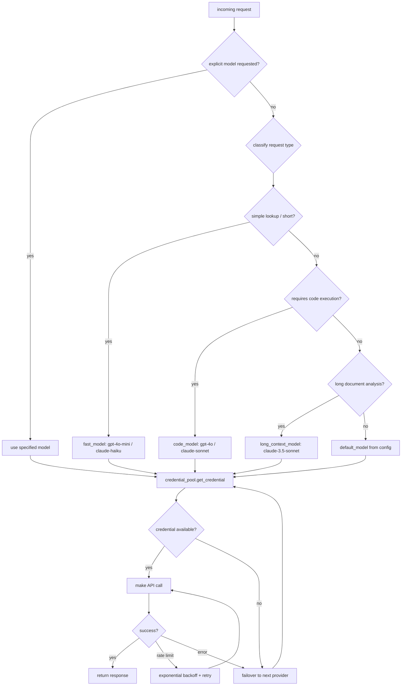
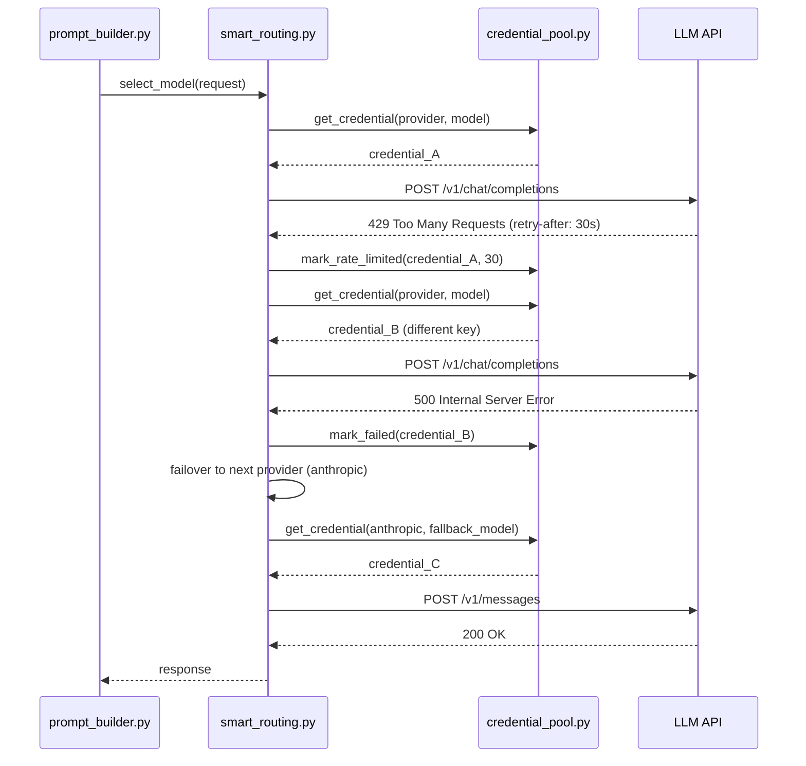

# Chapter 3: Agent Core — Prompt Building, Context Engine, and Model Routing

## What Problem Does This Solve?

LLM API calls look simple from the outside — send a string, get a string back. But a production agent needs to solve three harder problems:

1. **What context goes in the prompt?** A naive agent includes the full conversation history until it overflows. Hermes instead selects the most relevant episodic memories, injects only the applicable skills, and compresses aggressively — so the context window is always used for signal, not noise.

2. **Which model and provider should handle this request?** Different requests have different cost/quality tradeoffs. A quick lookup should route to a fast, cheap model. A complex coding task should go to the most capable one. If the primary provider is down or rate-limited, the agent should fail over automatically, not crash.

3. **How do you avoid paying for the same tokens over and over?** The SOUL.md + MEMORY.md system prompt is nearly identical across all calls in a session. Prompt caching (supported by Anthropic's API and others) can eliminate most of that cost — but only if the cache prefix is stable.

The agent core — `prompt_builder.py`, `context_engine.py`, `smart_routing.py`, and `credential_pool.py` — solves all three.

---

## Module Responsibilities

| Module | Responsibility |
|---|---|
| `prompt_builder.py` | Assembles the final prompt from all context sources |
| `context_engine.py` | Retrieves and ranks relevant episodic memories via FTS5 |
| `smart_routing.py` | Selects the optimal model/provider per request |
| `credential_pool.py` | Manages multiple API keys with rotation and failover |

---

## prompt_builder.py — The Assembly Pipeline

`prompt_builder.py` is called once per user message. It produces a fully assembled prompt ready for the LLM API.

### Context Sources (in assembly order)

```python
# hermes_cli/agent/prompt_builder.py (structure)

class PromptBuilder:
    def build(self, user_message: str, session_history: list) -> Prompt:
        """
        Assemble a complete prompt from all context sources.
        Returns a Prompt with system_prompt, messages list, and metadata.
        """
        system_parts = []

        # 1. Base persona
        system_parts.append(self._load_soul())           # SOUL.md

        # 2. Long-term semantic memory
        system_parts.append(self._load_memory())         # MEMORY.md
        system_parts.append(self._load_user_model())     # USER.md

        # 3. Procedural memory — only relevant skills
        relevant_skills = self.skill_utils.select_relevant(
            user_message, session_history
        )
        system_parts.append(self._format_skills(relevant_skills))

        # 4. Project context
        if (hermes_md := self._load_hermes_md()):
            system_parts.append(hermes_md)

        # 5. Episodic memory — FTS5 search results
        episodic = self.context_engine.retrieve(user_message)
        if episodic:
            system_parts.append(self._format_episodic(episodic))

        system_prompt = "\n\n---\n\n".join(filter(None, system_parts))

        return Prompt(
            system=system_prompt,
            messages=session_history + [{"role": "user", "content": user_message}],
            model=self.router.select(user_message),
            cache_prefix_length=len(system_prompt),  # hint for caching
        )
```

### Skill Relevance Selection

Not all SKILL.md files are injected into every prompt. `skill_utils.select_relevant()` uses a lightweight TF-IDF-style scoring against the current message and recent conversation turns to select only the top-k skills most likely to be useful:

```python
# hermes_cli/agent/skill_utils.py (structure)

def select_relevant(
    message: str,
    history: list,
    top_k: int = 3,
    threshold: float = 0.15
) -> list[Skill]:
    """
    Returns top_k skills whose content overlaps with the current context.
    Skills below the threshold score are excluded even if they're in top_k.
    """
    query_tokens = tokenize(message + " ".join(m["content"] for m in history[-5:]))
    scored = [
        (skill, tfidf_overlap(query_tokens, skill.tokens))
        for skill in self.all_skills
    ]
    return [
        skill for skill, score in sorted(scored, key=lambda x: -x[1])
        if score >= threshold
    ][:top_k]
```

This keeps the prompt tight — if you have 50 SKILL.md files, a question about Python debugging won't inject the skills about Docker networking or Terraform.

---

## context_engine.py — Episodic Memory Retrieval

`context_engine.py` is responsible for the episodic memory layer: searching past session summaries and injecting the most relevant fragments into the current prompt.

### FTS5 Search Pipeline

```python
# hermes_cli/agent/context_engine.py (structure)

class ContextEngine:
    def retrieve(self, query: str, max_results: int = 5) -> list[MemoryFragment]:
        """
        Search sessions.db using FTS5 for sessions relevant to the query.
        Returns up to max_results summarized session fragments.
        """
        # 1. FTS5 full-text search
        raw_results = self.db.execute(
            """
            SELECT session_id, summary, relevance_score, created_at
            FROM sessions_fts
            WHERE sessions_fts MATCH ?
            ORDER BY rank
            LIMIT ?
            """,
            (fts5_escape(query), max_results * 3)  # over-fetch for re-ranking
        ).fetchall()

        # 2. Re-rank by recency * relevance
        reranked = [
            MemoryFragment(
                session_id=r["session_id"],
                summary=r["summary"],
                score=r["relevance_score"] * recency_weight(r["created_at"]),
                age_days=days_ago(r["created_at"])
            )
            for r in raw_results
        ]
        reranked.sort(key=lambda x: -x.score)

        return reranked[:max_results]
```

### Session Summary Schema (sessions.db)

```sql
-- sessions table
CREATE VIRTUAL TABLE sessions_fts USING fts5(
    session_id UNINDEXED,
    summary,           -- LLM-generated summary, indexed
    tags,              -- comma-separated topic tags, indexed
    created_at UNINDEXED,
    relevance_score UNINDEXED
);

-- The summary column is what FTS5 searches.
-- Summaries are written by memory_manager.py at session end,
-- using an LLM call to condense the session to 200-500 words.
```

### Recency Weighting

Recent sessions get a boost over older ones at equal relevance:

```
score = fts5_rank * recency_weight

recency_weight:
  - Last 7 days:   2.0
  - 7–30 days:     1.5
  - 30–90 days:    1.0
  - 90+ days:      0.7
```

This prevents the agent from always surfacing very old sessions when recent ones are equally relevant.

---

## smart_routing.py — Model Selection

`smart_routing.py` selects the model for each request based on a combination of request characteristics, configured routing rules, and provider availability.

### Routing Decision Tree



### Routing Configuration

```yaml
# ~/.hermes/config.yaml

llm:
  routing:
    default_model: "gpt-4o"
    fast_model: "gpt-4o-mini"
    code_model: "gpt-4o"
    long_context_model: "claude-3-5-sonnet-20241022"

    rules:
      - condition: "token_estimate < 500 and not requires_tools"
        model: fast_model
      - condition: "has_code_block or requires_shell_execution"
        model: code_model
      - condition: "token_estimate > 50000"
        model: long_context_model

    providers:
      - name: openai
        priority: 1
        models: [gpt-4o, gpt-4o-mini, gpt-4-turbo]
      - name: anthropic
        priority: 2
        models: [claude-3-5-sonnet-20241022, claude-3-haiku-20240307]
      - name: together
        priority: 3
        models: [meta-llama/Llama-3.3-70b-Instruct-Turbo]
      - name: local
        priority: 4
        models: [hermes-3-llama-3.1-8b]
        endpoint: "http://localhost:11434/v1"
```

---

## credential_pool.py — Multi-Key Management

`credential_pool.py` manages a pool of API credentials, enabling key rotation (to stay under per-key rate limits) and provider failover (to survive provider outages).

### Pool Configuration

```yaml
# ~/.hermes/config.yaml

credentials:
  openai:
    keys:
      - key: "sk-proj-abc..."
        weight: 1.0
        max_rpm: 500
      - key: "sk-proj-def..."
        weight: 1.0
        max_rpm: 500
    rotation_strategy: "round_robin"  # or "least_loaded"

  anthropic:
    keys:
      - key: "sk-ant-..."
        weight: 1.0
    rotation_strategy: "least_loaded"
```

### How Key Selection Works

```python
# hermes_cli/agent/credential_pool.py (structure)

class CredentialPool:
    def get_credential(self, provider: str, model: str) -> Credential:
        """
        Returns the best available credential for this provider.
        Raises NoCredentialAvailable if all keys are exhausted/failed.
        """
        available = [
            c for c in self.pool[provider]
            if not c.is_rate_limited() and not c.is_failed()
        ]
        if not available:
            raise NoCredentialAvailable(provider)

        if self.config.rotation_strategy == "round_robin":
            return available[self._next_index % len(available)]
        elif self.config.rotation_strategy == "least_loaded":
            return min(available, key=lambda c: c.current_rpm)

    def mark_rate_limited(self, credential: Credential, retry_after: int):
        """Called when a 429 response is received."""
        credential.rate_limited_until = time.time() + retry_after

    def mark_failed(self, credential: Credential, error: Exception):
        """Called on non-recoverable error. Removes key from rotation."""
        credential.failed = True
        self._alert(f"Credential {credential.key[:8]}... failed: {error}")
```

---

## Prompt Caching

The system prompt assembled by `prompt_builder.py` — which includes SOUL.md, MEMORY.md, USER.md, and skills — is typically 1,500–4,000 tokens. For providers that support prompt caching (Anthropic, some OpenAI configs), Hermes sends a cache-control header on the system prompt to eliminate recomputation costs for repeated calls in the same session.

### How Cache Stability Is Maintained

The cache prefix is only effective if it doesn't change between calls. `prompt_builder.py` ensures this by:

1. Ordering all context sources deterministically (SOUL → MEMORY → USER → SKILLS in alphabetical order)
2. Never including timestamps or session IDs in the system prompt (these go in the first user message)
3. Using a dirty-flag mechanism: the system prompt is only rebuilt when MEMORY.md or USER.md has changed

```python
# hermes_cli/agent/prompt_builder.py (cache logic)

def build(self, message: str, history: list) -> Prompt:
    if self._system_dirty or not self._cached_system:
        self._cached_system = self._assemble_system()
        self._system_dirty = False

    # Cache prefix is the full system prompt.
    # Only the messages list changes between calls.
    return Prompt(
        system=self._cached_system,
        messages=history + [{"role": "user", "content": message}],
        cache_control={"type": "ephemeral"}  # Anthropic API header
    )
```

On Anthropic's API with prompt caching enabled, a typical Hermes session saves approximately 40-60% of input token costs.

---

## Error Handling and Resilience



---

## Performance Tuning

| Config Key | Default | Effect |
|---|---|---|
| `llm.routing.fast_model` | gpt-4o-mini | Used for simple/short requests |
| `llm.stream` | true | Token-by-token streaming in TUI |
| `llm.cache_system_prompt` | true | Prompt caching (Anthropic/compatible) |
| `context_engine.max_results` | 5 | Max episodic memories per prompt |
| `context_engine.recency_bias` | 1.5 | Multiplier for recent session scores |
| `skill_utils.top_k` | 3 | Max skills injected per prompt |
| `skill_utils.threshold` | 0.15 | Minimum TF-IDF overlap to inject |
| `credential_pool.rotation` | round_robin | Key rotation strategy |
| `credential_pool.retry_budget` | 3 | Max retries before failover |

---

## Chapter Summary

| Module | Key Takeaway |
|---|---|
| prompt_builder.py | Five-source assembly pipeline: SOUL → MEMORY → USER → SKILL → EPISODIC |
| context_engine.py | FTS5 full-text search over session summaries + recency re-ranking |
| skill_utils.py | TF-IDF skill selection — only injects skills relevant to current message |
| smart_routing.py | Rule-based model selection by request type + provider priority failover |
| credential_pool.py | Multi-key rotation with rate-limit tracking and failed-key removal |
| Prompt caching | System prompt cached across calls; dirty flag prevents unnecessary rebuilds |
| Error resilience | 429 → key rotation → provider failover; full audit trail in logs |
