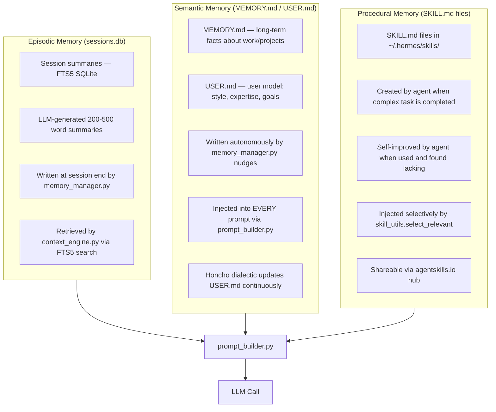
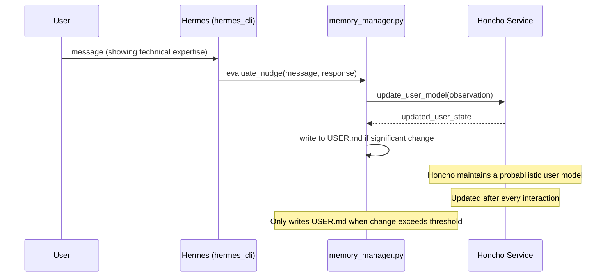
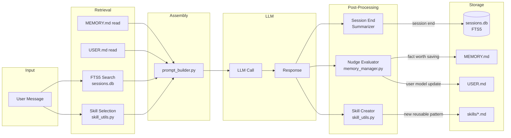

# Chapter 4: Memory, Skills, and the Learning Loop

## What Problem Does This Solve?

A personal AI agent faces a fundamental tension: it needs to remember enormous amounts of context to be genuinely useful, but LLM context windows are finite and expensive. Naively keeping everything in the prompt doesn't scale. Throwing everything away between sessions makes the agent forget-prone and frustrating.

Hermes resolves this tension with a three-layer memory architecture that stores different types of knowledge in the form best suited to their retrieval patterns:

- **Episodic memory** is searchable by content — you retrieve it when you need to recall what happened
- **Semantic memory** is always-available facts — injected into every prompt because they're always relevant
- **Procedural memory** is skills — injected selectively when the agent recognizes a task it has proceduralized

The result is an agent that uses its context window efficiently: only the most relevant episodic fragments, only the applicable skills, but always the core user model and preferences.

---

## The Three Memory Layers



---

## Episodic Memory: FTS5 Session Search

### How Sessions Are Stored

At the end of every conversation (triggered by `/new`, graceful exit, or a configurable inactivity timeout), `memory_manager.py` calls the LLM to produce a compact summary of the session:

```python
# hermes_cli/agent/memory_manager.py (session summary flow)

async def summarize_and_store(self, session: Session):
    """
    Called when a session ends. Generates an LLM summary and
    stores it in sessions.db for future FTS5 retrieval.
    """
    summary_prompt = f"""
    Summarize this conversation in 200-400 words.
    Focus on: decisions made, facts established, tasks completed,
    and any important context that would help recall this session.
    
    Conversation:
    {session.format_for_summary()}
    """
    summary = await self.llm.complete(summary_prompt, model=self.fast_model)

    # Extract topic tags for additional FTS5 signal
    tags = await self.extract_tags(summary)

    self.db.execute(
        """
        INSERT INTO sessions_fts(session_id, summary, tags, created_at, relevance_score)
        VALUES (?, ?, ?, ?, 1.0)
        """,
        (session.id, summary, ",".join(tags), session.created_at)
    )
```

### Querying Sessions Directly

You can query the sessions database directly:

```bash
# List recent sessions
hermes session list --limit 10

# Search sessions by content
hermes session search "ETL pipeline"

# Show a specific session summary
hermes session show session-2026-04-11-debugging

# Export all session summaries
hermes session export --format json > sessions_backup.json
```

Or query the SQLite database directly:

```bash
sqlite3 ~/.hermes/sessions/sessions.db \
  "SELECT session_id, substr(summary, 1, 100) FROM sessions_fts
   WHERE sessions_fts MATCH 'ETL pipeline'
   ORDER BY rank LIMIT 5;"
```

### FTS5 Schema

```sql
CREATE VIRTUAL TABLE sessions_fts USING fts5(
    session_id    UNINDEXED,      -- not searched, just stored
    summary,                       -- main search field
    tags,                          -- topic tags for boosting
    created_at    UNINDEXED,
    relevance_score UNINDEXED,

    -- FTS5 options
    tokenize = "unicode61",        -- handles unicode, punctuation
    content = sessions_raw,        -- content table for snippet generation
    content_rowid = id
);

-- The raw sessions table (content store)
CREATE TABLE sessions_raw (
    id            INTEGER PRIMARY KEY,
    session_id    TEXT UNIQUE,
    summary       TEXT,
    tags          TEXT,
    created_at    REAL,
    relevance_score REAL DEFAULT 1.0,
    message_count INTEGER,
    token_count   INTEGER
);
```

---

## Semantic Memory: MEMORY.md and USER.md

### memory_manager.py — The Nudge System

The most distinctive aspect of Hermes's memory system is that the agent decides autonomously when to update its own semantic memory. It doesn't ask you to save facts — it infers when a fact is worth saving and writes it without interrupting the conversation.

This is implemented via "nudge evaluation" — a lightweight classifier that runs after each assistant response:

```python
# hermes_cli/agent/memory_manager.py (nudge evaluation)

NUDGE_TRIGGERS = [
    # Pattern: agent should write to MEMORY.md
    "user mentioned a new project",
    "user stated a preference",
    "important date or deadline mentioned",
    "technology choice made",
    "architecture decision recorded",
    "new person mentioned with context",
]

USER_NUDGE_TRIGGERS = [
    # Pattern: agent should update USER.md
    "user corrected the agent's assumption about expertise",
    "user communication style shift detected",
    "user expressed frustration with response style",
    "user demonstrated knowledge in new domain",
]

async def evaluate_nudge(
    self, 
    user_message: str,
    assistant_response: str,
    recent_history: list
) -> NudgeDecision:
    """
    Lightweight LLM call to determine if a memory write is warranted.
    Uses a fast model (e.g., gpt-4o-mini) to keep latency low.
    """
    prompt = f"""
    Based on this exchange, should the agent update its long-term memory?
    
    User: {user_message}
    Assistant: {assistant_response[:500]}
    
    Respond with JSON:
    {{
      "memory_write": boolean,
      "user_write": boolean,
      "memory_entry": "string or null",
      "user_entry": "string or null",
      "reasoning": "brief explanation"
    }}
    """
    result = await self.llm.complete_json(prompt, model=self.fast_model)
    return NudgeDecision(**result)
```

### What Gets Written to MEMORY.md

MEMORY.md is a human-readable Markdown file that the agent appends to and reorganizes:

```markdown
# Long-Term Memory

## Projects
- **data-pipeline-v2**: Python ETL project, started 2026-04-11. Using Apache Airflow 2.8, PostgreSQL 15, dbt. Location: ~/projects/data-pipeline/
- **hermes-agent-fork**: Contributing to NousResearch/hermes-agent. Focus: improving FTS5 search ranking.

## Preferences
- Prefers concise explanations with working code examples over theoretical exposition
- Uses VS Code as primary editor, Neovim for quick edits
- Prefer Python type hints in all new code
- Dark mode terminals only

## Technology Context
- Primary language: Python 3.12
- Database of choice: PostgreSQL for production, SQLite for local tooling
- Infrastructure: Docker + Kubernetes, deployed to AWS EKS

## Important Dates
- Project deadline: data-pipeline-v2 demo on 2026-05-01
```

### What Gets Written to USER.md

USER.md is maintained by the Honcho dialectic system and tracks the user model:

```markdown
# User Model

## Communication Style
- Technical, direct, no filler phrases
- Prefers bullet points over prose for lists
- Appreciates when agent admits uncertainty
- Dislikes over-explanation of things they clearly know

## Expertise Level
- Senior software engineer (8+ years)
- Expert: Python, data engineering, SQL
- Proficient: DevOps, Kubernetes, Terraform
- Learning: ML infrastructure, RL training pipelines

## Interaction Patterns
- Usually works in evening sessions (18:00–23:00 UTC)
- Asks focused questions; rarely needs prompting for context
- Prefers to see reasoning process for complex decisions
- Occasionally frustration with overly cautious responses

## Goals
- Build a production-grade data platform
- Contribute to open-source AI tooling
- Learn RL training pipeline design
```

---

## Honcho Dialectic User Modeling

Honcho is an external service integrated with Hermes for dialectic user modeling — a technique where the user model is refined through an ongoing implicit dialogue between what the agent infers and what the user's behavior confirms or contradicts.



Honcho can be configured in `config.yaml`:

```yaml
honcho:
  enabled: true
  endpoint: "https://api.honcho.dev/v1"
  api_key: "hk-..."
  sync_interval: 10  # sync USER.md every N interactions
  local_fallback: true  # use local heuristics if Honcho is unavailable
```

---

## Procedural Memory: SKILL.md Files

### SKILL.md Format

Each skill file is a structured Markdown document with a defined schema:

```markdown
---
skill_id: python_etl_patterns
created: 2026-04-11
last_improved: 2026-04-12
improvement_count: 3
trigger_phrases: ["etl", "data pipeline", "extract transform load", "airflow"]
confidence: 0.87
---

# Skill: Python ETL Patterns

## When to Use This Skill
Use this skill when the user is working on data extraction, transformation,
or loading tasks in Python.

## Pattern: Idempotent Airflow DAG

```python
from airflow import DAG
from airflow.operators.python import PythonOperator
from datetime import datetime, timedelta

def idempotent_etl(**context):
    execution_date = context['execution_date']
    # Use execution_date to ensure idempotency
    process_for_date(execution_date)

dag = DAG(
    'etl_pipeline',
    start_date=datetime(2026, 1, 1),
    schedule_interval='@daily',
    catchup=False,    # Important: prevent historical backfill
    max_active_runs=1 # Prevent concurrent runs
)
```

## Common Pitfalls
1. Not handling idempotency — always parameterize by execution date
2. Missing error handling on external API calls — use try/except + retries
3. Missing logging — use Airflow's built-in task logging
4. Not testing DAGs locally — use `airflow dags test` before deployment

## Improvement Notes
- v1: Basic DAG template
- v2: Added idempotency pattern after user hit duplicate data bug
- v3: Added local testing guidance after user asked about testing
```

### Autonomous Skill Creation

The agent creates a new skill file when it detects it has provided a complex, reusable workflow. This is triggered by `skill_utils.py`'s post-response analysis:

```python
# hermes_cli/agent/skill_utils.py (skill creation flow)

async def evaluate_skill_creation(
    self,
    user_message: str,
    assistant_response: str,
    response_length: int,
    tool_calls_made: list
) -> SkillCreationDecision:
    """
    Decide if this interaction warrants creating a new SKILL.md.
    
    Heuristics:
    - Response contained a reusable code pattern
    - Multiple tool calls were orchestrated in a non-obvious way
    - User asked about a general pattern (not a one-off)
    - Response is long (>500 tokens) and structured
    """
    if response_length < 200:
        return SkillCreationDecision(create=False)
    
    # Check against existing skills to avoid duplication
    similar = self.find_similar_skill(user_message, threshold=0.8)
    if similar:
        # Improve existing skill instead of creating new one
        return SkillCreationDecision(
            create=False,
            improve=similar,
            improvement_type="extend"
        )
    
    # Ask LLM to evaluate and optionally generate the skill
    decision = await self.llm.complete_json(
        self._skill_creation_prompt(user_message, assistant_response),
        model=self.fast_model
    )
    
    if decision["create"]:
        await self._write_skill(decision["skill_content"])
    
    return SkillCreationDecision(**decision)
```

### Autonomous Skill Improvement

When an existing skill is used and the agent finds it lacking or outdated, it can improve the skill in-place:

```python
# hermes_cli/agent/skill_utils.py (skill improvement)

async def improve_skill(
    self,
    skill: Skill,
    improvement_context: str
) -> bool:
    """
    Called when agent used a skill but found it needed updating.
    Rewrites the skill with improvements and bumps improvement_count.
    """
    improved_content = await self.llm.complete(
        f"""
        Improve this skill based on the following context:
        
        Context: {improvement_context}
        
        Current skill:
        {skill.content}
        
        Produce an improved version that:
        1. Fixes any issues discovered in context
        2. Adds the new pattern/insight from context
        3. Updates the improvement notes section
        4. Increments improvement_count in frontmatter
        """,
        model=self.capable_model
    )
    
    # Write atomically
    tmp_path = skill.path.with_suffix('.tmp')
    tmp_path.write_text(improved_content)
    tmp_path.rename(skill.path)
    
    skill.improvement_count += 1
    return True
```

---

## agentskills.io — The Community Skills Hub

Hermes integrates with [agentskills.io](https://agentskills.io), a community platform for sharing SKILL.md files between users.

### Publishing a Skill

```bash
# Publish a skill to agentskills.io
hermes skills publish python_etl_patterns

# Output:
# Skill published: https://agentskills.io/skills/python_etl_patterns
# Stars: 0  Downloads: 0
```

### Installing Community Skills

```bash
# Search for skills
hermes skills search "kubernetes deployment"

# Install a skill
hermes skills install kubernetes-deployment-patterns

# List installed skills
hermes skills list
```

### Skill Metadata for Discovery

```yaml
# SKILL.md frontmatter for agentskills.io submission
---
skill_id: python_etl_patterns
author: johnxie
version: "1.3.0"
tags: [python, etl, airflow, data-engineering]
description: "Battle-tested patterns for Python ETL pipelines with Airflow"
requires_tools: [file_read, shell_exec]
tested_with: [gpt-4o, claude-3-5-sonnet, hermes-3-llama-3.1-70b]
license: MIT
---
```

---

## Memory Architecture Flow



---

## Memory Configuration

```yaml
# ~/.hermes/config.yaml

memory:
  episodic:
    max_results: 5             # Max session fragments per prompt
    recency_weight:
      7_days: 2.0
      30_days: 1.5
      90_days: 1.0
      older: 0.7
    summary_model: "gpt-4o-mini"  # Fast model for session summarization

  semantic:
    max_memory_entries: 100    # Trim MEMORY.md when it exceeds this
    max_user_entries: 50       # Trim USER.md when it exceeds this
    honcho_enabled: true

  procedural:
    skills_dir: "~/.hermes/skills"
    max_skills_injected: 3
    relevance_threshold: 0.15
    auto_create: true          # Allow autonomous skill creation
    auto_improve: true         # Allow autonomous skill improvement
    agentskills_sync: false    # Auto-sync with agentskills.io
```

---

## Chapter Summary

| Concept | Key Takeaway |
|---|---|
| Episodic memory | FTS5 SQLite session summaries; searched by content + recency on every prompt |
| Semantic memory | MEMORY.md (facts) + USER.md (user model); always injected, agent-written |
| Procedural memory | SKILL.md files; selectively injected by TF-IDF; autonomously created and improved |
| memory_manager.py | Evaluates after every response whether a memory nudge is warranted |
| Nudge system | Lightweight LLM classifier using fast model; runs asynchronously |
| Session summarization | LLM generates 200-500 word summary at session end; stored in FTS5 |
| Honcho dialectic | External service for probabilistic user modeling; falls back to local heuristics |
| Skill creation | Triggered when agent provides a complex reusable pattern |
| Skill improvement | Agent rewrites skill file when it finds the current version lacking |
| agentskills.io | Community skill hub; install/publish via `hermes skills` commands |
