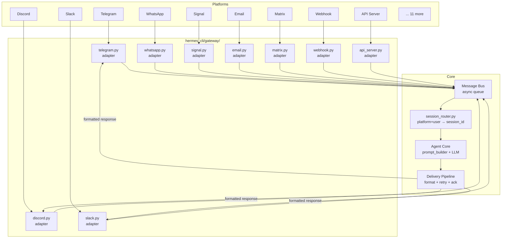
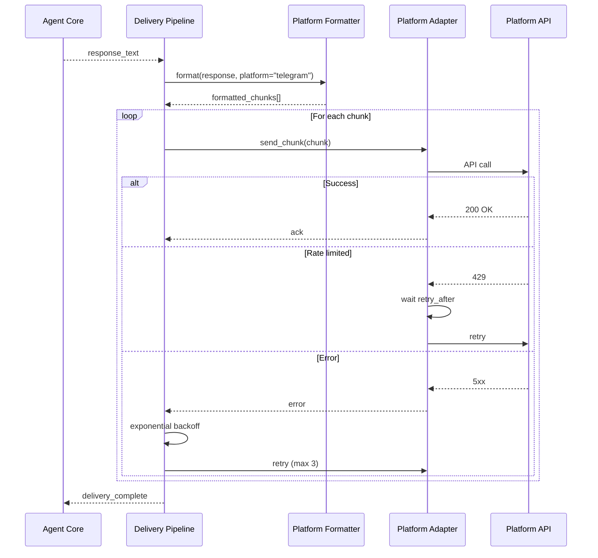

# Chapter 5: The Messaging Gateway

## What Problem Does This Solve?

A personal AI agent that only works when you're sitting at a terminal is a limited tool. Most productive moments happen in motion — on a phone, in a chat app, in an email thread. Hermes's messaging gateway solves this by bringing the full agent experience — persistent memory, skill execution, tool use — to any platform you already use.

The challenge is not just supporting many platforms; it's doing so without fragmenting the agent's memory. A message sent from Telegram and a message sent from Discord should feel like parts of the same continuous conversation, not isolated sessions with different agents. The gateway's session routing system ensures this.

---

## Supported Platforms

| Category | Platforms |
|---|---|
| Consumer messaging | Telegram, WhatsApp, Signal, SMS |
| Team communication | Slack, Discord, Mattermost |
| Email | SMTP/IMAP (any email provider) |
| Federated / open | Matrix (Element) |
| Enterprise Asian platforms | Feishu (Lark), DingTalk, WeCom (Enterprise WeChat), Weixin |
| Smart home | Home Assistant |
| Programmatic | Webhook (generic HTTP), OpenAI-compatible API server |

Total: 20+ platform adapters.

---

## Gateway Architecture



---

## The Normalized Message Event

All platform adapters convert their native message format into a unified `GatewayMessage` object before queuing:

```python
# hermes_cli/gateway/types.py

@dataclass
class GatewayMessage:
    # Identity
    platform: str           # "telegram", "discord", "slack", etc.
    platform_user_id: str   # platform-native user identifier
    platform_chat_id: str   # channel/room/thread identifier
    
    # Content
    content: str            # normalized text content
    attachments: list[Attachment]  # files, images, voice notes
    
    # Metadata
    timestamp: float        # unix timestamp
    message_id: str         # platform-native message ID (for threading)
    reply_to: str | None    # if this is a reply to another message
    
    # Routing
    session_id: str | None  # set by session_router.py
    user_profile: UserProfile | None  # set by session_router.py
```

---

## Session Routing

`session_router.py` maps each incoming message to the correct Hermes session. This is the mechanism that ensures cross-platform memory continuity.

```python
# hermes_cli/gateway/session_router.py (structure)

class SessionRouter:
    def route(self, message: GatewayMessage) -> RoutedMessage:
        """
        Determine the session_id for this message.
        
        Routing logic:
        1. Check if (platform, platform_user_id) is paired with a Hermes user
        2. If paired, use the user's primary session_id
        3. If not paired, create an anonymous session for this platform+user combo
        4. If pairing_required=true and not paired, drop the message
        """
        pairing = self.pairing_db.lookup(
            platform=message.platform,
            platform_user_id=message.platform_user_id
        )
        
        if pairing:
            session_id = pairing.hermes_user_id
            user_profile = pairing.user_profile
        elif self.config.require_pairing:
            return RoutedMessage(drop=True, reason="unpaired_user")
        else:
            session_id = f"anon_{message.platform}_{message.platform_user_id}"
            user_profile = None
        
        return RoutedMessage(
            message=message,
            session_id=session_id,
            user_profile=user_profile,
            drop=False
        )
```

### Cross-Platform Memory Continuity

When a user is paired (linked to a Hermes identity), their session_id is their Hermes user ID — the same ID used by the TUI. This means:

- A conversation started in the TUI can be continued on Telegram
- Skills created via the TUI are available when messaging from Discord
- MEMORY.md and USER.md are shared across all platforms
- `/insights` from Telegram shows the same memory as `/insights` in the TUI

---

## Platform Configuration

Each platform is enabled and configured in `~/.hermes/config.yaml`:

```yaml
gateway:
  enabled: true
  port: 8080              # Port for webhook receivers and API server
  require_pairing: true   # Reject messages from unpaired users
  
  platforms:
    telegram:
      enabled: true
      token: "7123456789:AAF..."
      webhook_url: "https://yourserver.com/hermes/telegram"
      allowed_user_ids: [123456789]  # Optional allowlist
    
    discord:
      enabled: true
      bot_token: "MTIz..."
      guild_ids: [1234567890123456789]  # Optional server allowlist
    
    slack:
      enabled: true
      bot_token: "xoxb-..."
      app_token: "xapp-..."  # For Socket Mode (no public URL needed)
    
    whatsapp:
      enabled: false         # Requires Meta Business API approval
      phone_number_id: "..."
      access_token: "..."
    
    signal:
      enabled: true
      signal_cli_path: "/usr/local/bin/signal-cli"
      phone_number: "+15555551234"
    
    email:
      enabled: true
      smtp_host: "smtp.gmail.com"
      smtp_port: 587
      imap_host: "imap.gmail.com"
      username: "you@gmail.com"
      password: "app-specific-password"
      check_interval: 60  # seconds between IMAP polls
    
    matrix:
      enabled: false
      homeserver: "https://matrix.org"
      access_token: "syt_..."
      room_ids: ["!roomid:matrix.org"]
    
    webhook:
      enabled: true
      path: "/hermes/webhook"
      secret: "your-webhook-secret"
```

---

## Platform Driver Deep Dives

### Telegram Adapter

```python
# hermes_cli/gateway/telegram.py (structure)

class TelegramAdapter:
    async def start_webhook(self):
        """Register webhook with Telegram and start aiohttp server."""
        await self.bot.set_webhook(
            url=f"{self.config.webhook_url}/telegram",
            secret_token=self.config.secret
        )

    async def handle_update(self, update: dict) -> GatewayMessage | None:
        """Convert Telegram update to GatewayMessage."""
        msg = update.get("message") or update.get("callback_query", {}).get("message")
        if not msg:
            return None
        
        return GatewayMessage(
            platform="telegram",
            platform_user_id=str(msg["from"]["id"]),
            platform_chat_id=str(msg["chat"]["id"]),
            content=msg.get("text", ""),
            attachments=self._extract_attachments(msg),
            timestamp=msg["date"],
            message_id=str(msg["message_id"]),
        )
    
    async def send_response(self, chat_id: str, text: str):
        """Send response, splitting at 4096 char Telegram limit."""
        for chunk in split_message(text, 4096):
            await self.bot.send_message(
                chat_id=chat_id,
                text=chunk,
                parse_mode="Markdown"
            )
```

### Signal Adapter

Signal integration uses `signal-cli` — a command-line Java application that interfaces with Signal's native protocol:

```python
# hermes_cli/gateway/signal.py (structure)

class SignalAdapter:
    async def start_daemon(self):
        """Start signal-cli in daemon mode for JSON-RPC communication."""
        self.process = await asyncio.create_subprocess_exec(
            self.config.signal_cli_path,
            "--output=json",
            "daemon",
            "--socket", "/tmp/signal-cli.sock",
            stdout=asyncio.subprocess.PIPE,
        )
    
    async def listen(self):
        """Read JSON messages from signal-cli stdout."""
        async for line in self.process.stdout:
            event = json.loads(line)
            if event.get("type") == "receive":
                yield self._parse_message(event)
```

### Email Adapter

```python
# hermes_cli/gateway/email.py (structure)

class EmailAdapter:
    async def poll_inbox(self):
        """Poll IMAP inbox for new messages."""
        with imaplib.IMAP4_SSL(self.config.imap_host) as imap:
            imap.login(self.config.username, self.config.password)
            imap.select("INBOX")
            _, message_nums = imap.search(None, "UNSEEN")
            
            for num in message_nums[0].split():
                _, data = imap.fetch(num, "(RFC822)")
                msg = email.message_from_bytes(data[0][1])
                yield self._parse_email(msg)
                imap.store(num, "+FLAGS", "\\Seen")
```

---

## The Delivery Pipeline

After the agent generates a response, the delivery pipeline handles formatting, chunking, and reliable delivery:



### Platform-Specific Formatting

Each platform has different constraints (message length, Markdown support, file size limits):

| Platform | Max Message Length | Markdown Support | File Upload |
|---|---|---|---|
| Telegram | 4,096 chars | MarkdownV2 | 50 MB |
| Discord | 2,000 chars | Discord Markdown | 25 MB |
| Slack | 40,000 chars | mrkdwn | 1 GB |
| WhatsApp | 65,536 chars | None (plain text) | 16 MB |
| Signal | None | None (plain text) | 100 MB |
| Email | Unlimited | HTML | Unlimited |
| Matrix | Unlimited | HTML + Markdown | 100 MB |

The `PlatformFormatter` class converts the agent's Markdown output to each platform's native format, handles splitting at sentence/paragraph boundaries for platforms with limits, and falls back to plain text when rich formatting isn't supported.

---

## Pairing and Security

Pairing links a platform identity (e.g., a Telegram user ID) to a Hermes user identity. This ensures:

1. Only authorized users can access the agent
2. All platforms share the same memory and session state
3. Anonymous users can be blocked (`require_pairing: true`)

### Pairing Flow

```bash
# In the TUI, generate a pairing code
> /pair telegram
Pairing code: HERMES-7X4K-QR2P
Valid for: 15 minutes

# Send the code to the Hermes bot on Telegram:
# /pair HERMES-7X4K-QR2P

# TUI confirms:
Telegram user @username (ID: 123456789) paired successfully.
All future messages from this user will share your session.
```

The pairing code is a time-limited token stored in `~/.hermes/.credentials/pairing.db`. After pairing, the platform user ID is permanently associated with the Hermes user's session namespace.

---

## OpenAI-Compatible API Server Mode

`api_server.py` exposes an OpenAI-compatible REST API, enabling programmatic access to Hermes from any tool or library that supports the OpenAI SDK:

```bash
# Start the API server
hermes gateway api-server --port 8080

# Use with the OpenAI Python SDK
```

```python
from openai import OpenAI

client = OpenAI(
    base_url="http://localhost:8080/v1",
    api_key="hermes-local"   # any non-empty string
)

response = client.chat.completions.create(
    model="hermes",           # model name is ignored; uses configured model
    messages=[
        {"role": "user", "content": "What were we discussing yesterday?"}
    ]
)
# Response includes episodic memory just like the TUI
```

The API server:
- Implements `/v1/chat/completions` (streaming and non-streaming)
- Implements `/v1/models` (returns available configured models)
- Shares the same session namespace as the TUI and gateway (pass `session_id` in the request metadata to control which session to use)
- Logs all API calls to `~/.hermes/logs/api_access.jsonl`

---

## Monitoring Gateway Health

```bash
# Check all platform connection states
hermes gateway status

# Output:
Gateway Status
══════════════
telegram:  ✓ Connected  (last message: 2 min ago)
discord:   ✓ Connected  (last message: 1 hour ago)
slack:     ✗ Error      (connection refused — check bot token)
signal:    ✓ Connected  (last message: 5 min ago)
email:     ✓ Connected  (polling every 60s)
api_server: ✓ Running   (port 8080, 3 active connections)

# View gateway logs
hermes gateway logs --platform telegram --last 50

# Reconnect a failed platform
hermes gateway reconnect slack
```

---

## Chapter Summary

| Concept | Key Takeaway |
|---|---|
| Message bus | All platforms normalize to GatewayMessage; async queue decouples ingestion from processing |
| Session routing | Platform+user → Hermes session_id; enables cross-platform memory continuity |
| Pairing | Time-limited code links platform identity to Hermes identity; controls memory sharing |
| Platform adapters | 20+ adapters in hermes_cli/gateway/; each handles platform-specific auth and formatting |
| Delivery pipeline | Format → chunk → send → retry; platform-aware length limits and Markdown conversion |
| API server mode | OpenAI-compatible /v1/chat/completions; programmatic access with session awareness |
| require_pairing | Config flag to block unpaired users; important for public-facing deployments |
| Cross-platform memory | All paired platforms share MEMORY.md, USER.md, sessions.db, and skills |
