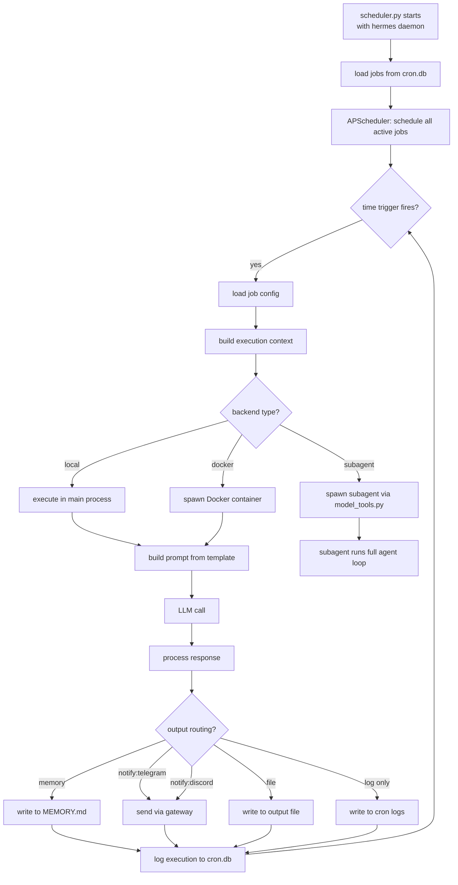
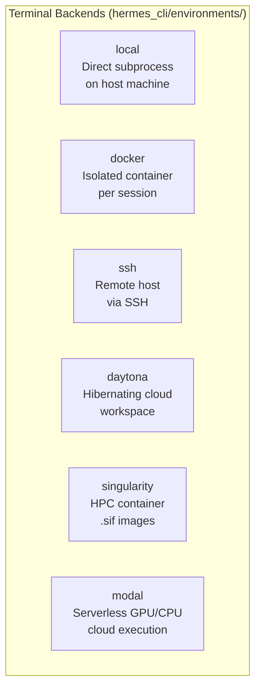
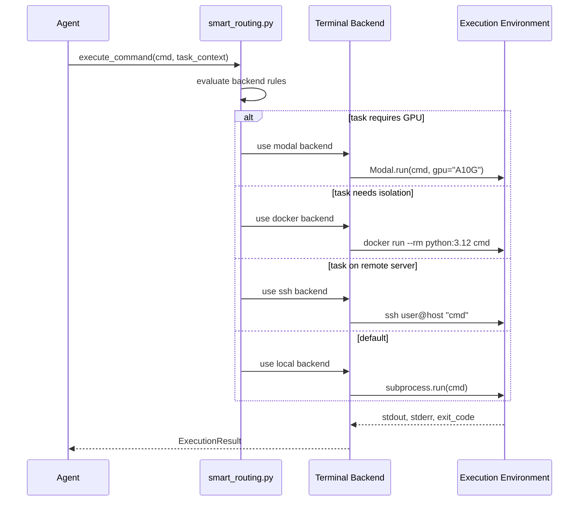

# Chapter 6: Cron Scheduling, Subagents, and Automation

## What Problem Does This Solve?

Most agent frameworks require a human to be present to get work done. Hermes is designed to work asynchronously — running scheduled tasks while you sleep, parallelizing multi-step workflows with subagents, and executing code in isolated containers without manual setup.

This chapter covers three related automation systems:

1. **Cron scheduling** — run agent prompts on a time-based schedule
2. **Subagent spawning** — parallelize tasks by spawning isolated agent instances via Python RPC
3. **Terminal backends** — six execution environments for isolated, reproducible code execution

---

## Cron Scheduling

### Core Concepts

A Hermes cron job is a combination of:
- A cron expression (schedule)
- A prompt template (what the agent should do)
- An optional context file or memory namespace
- Output routing (where results go: memory, file, gateway notification)

```bash
# Add a daily standup summarizer
hermes cron add \
  --schedule "0 9 * * 1-5" \
  --prompt "Review my MEMORY.md and generate a standup summary of active projects" \
  --output "notify:telegram" \
  --name "daily-standup"

# Add a weekly memory cleanup
hermes cron add \
  --schedule "0 0 * * 0" \
  --prompt "Review MEMORY.md and remove stale or completed items. Update relevance." \
  --output "memory" \
  --name "weekly-memory-cleanup"

# Add an hourly monitoring job
hermes cron add \
  --schedule "0 * * * *" \
  --prompt "Check if any of my GitHub notifications require response" \
  --output "notify:telegram,discord" \
  --name "github-monitor"
```

### Cron CLI Commands

```bash
hermes cron list              # Show all scheduled jobs
hermes cron show <name>       # Show job details
hermes cron run <name>        # Run a job immediately (manual trigger)
hermes cron pause <name>      # Pause a job
hermes cron resume <name>     # Resume a paused job
hermes cron remove <name>     # Delete a job
hermes cron logs <name>       # Show recent job execution logs
hermes cron history           # Show all job executions
```

```bash
# Example: hermes cron list output
Job Name                Schedule          Status    Last Run              Next Run
────────────────────────────────────────────────────────────────────────────────
daily-standup           0 9 * * 1-5       active    2026-04-11 09:00      2026-04-14 09:00
weekly-memory-cleanup   0 0 * * 0         active    2026-04-07 00:00      2026-04-14 00:00
github-monitor          0 * * * *         active    2026-04-12 08:00      2026-04-12 09:00
project-report          0 18 * * 5        paused    2026-04-05 18:00      —
```

---

## How the Scheduler Works



### scheduler.py Internals

```python
# hermes_cli/cron/scheduler.py (structure)

class HermesCronScheduler:
    def __init__(self, config: Config):
        self.scheduler = AsyncIOScheduler(timezone="UTC")
        self.job_store = JobStore("~/.hermes/cron.db")

    async def start(self):
        """Load all active jobs and start APScheduler."""
        for job in self.job_store.list_active():
            self.scheduler.add_job(
                self._execute_job,
                CronTrigger.from_crontab(job.schedule),
                args=[job],
                id=job.name,
                misfire_grace_time=300  # 5-minute grace period for missed fires
            )
        self.scheduler.start()

    async def _execute_job(self, job: CronJob):
        """Execute a single scheduled job."""
        start_time = time.time()
        try:
            context = await self._build_context(job)
            result = await self._run_agent(job.prompt_template, context)
            await self._route_output(job, result)
            
            self.job_store.record_execution(
                job_id=job.id,
                status="success",
                duration=time.time() - start_time,
                output_preview=result[:200]
            )
        except Exception as e:
            self.job_store.record_execution(
                job_id=job.id,
                status="error",
                error=str(e),
                duration=time.time() - start_time
            )
            if job.notify_on_failure:
                await self.gateway.send(job.failure_notify_platform, str(e))
```

---

## Subagents

Subagents are isolated Hermes instances spawned by the primary agent to parallelize complex tasks. They communicate with the parent via Python RPC.

### When to Use Subagents

| Use Case | Description |
|---|---|
| Parallel research | Spawn 3 subagents to research different aspects of a topic simultaneously |
| Large-scale code review | Spawn one subagent per file in a directory |
| Multi-environment testing | Run the same test across different Docker environments in parallel |
| Batch data processing | Distribute a dataset across subagents for parallel processing |

### Spawning Subagents via model_tools.py

```python
# hermes_cli/agent/model_tools.py (subagent tool)

@tool(name="spawn_subagent")
async def spawn_subagent(
    prompt: str,
    context_files: list[str] = None,
    backend: str = "local",
    max_iterations: int = 10,
    timeout: int = 300,
) -> SubagentResult:
    """
    Spawn an isolated Hermes subagent to complete a specific task.
    
    Args:
        prompt: The task for the subagent to complete
        context_files: List of file paths to include in the subagent's context
        backend: Execution backend (local/docker/ssh/daytona/modal/singularity)
        max_iterations: Maximum agent loop iterations
        timeout: Maximum execution time in seconds
    
    Returns:
        SubagentResult with output, tool_calls, and exit_status
    """
    subagent = HermesSubagent(
        prompt=prompt,
        context_files=context_files or [],
        backend=backend,
        session_id=f"subagent_{uuid4().hex[:8]}",
        parent_session_id=get_current_session_id()
    )
    
    return await subagent.run(
        max_iterations=max_iterations,
        timeout=timeout
    )
```

### Subagent Spawning Example

From an interactive session:

```
You: I need to review the architecture of this Python project for security issues.
     The project is in ~/projects/data-pipeline/. It has about 40 Python files.

Hermes: I'll spawn a subagent for each module directory to parallelize this review.

[Hermes spawns 4 subagents, one per module directory]

Subagent 1 (ingestion/): Reviewing 8 files...
Subagent 2 (transformation/): Reviewing 12 files...
Subagent 3 (storage/): Reviewing 11 files...
Subagent 4 (api/): Reviewing 9 files...

[All 4 complete in ~45 seconds instead of ~180 seconds sequentially]

Security Review Summary:
========================
Critical (1): SQL injection risk in storage/db.py:147 — unsanitized user input
High (3): Hardcoded credentials in ingestion/config.py (3 instances)
Medium (5): Missing input validation on API endpoints
...
```

---

## batch_runner.py — Batch Automation

`batch_runner.py` enables high-throughput automation over large datasets or file collections:

```python
# hermes_cli/environments/batch_runner.py (structure)

class BatchRunner:
    async def run(
        self,
        items: list[Any],
        prompt_template: str,
        concurrency: int = 5,
        backend: str = "local",
        output_file: str | None = None
    ) -> BatchResult:
        """
        Run the agent on each item in parallel with concurrency limit.
        
        Template variables available: {item}, {index}, {total}
        """
        semaphore = asyncio.Semaphore(concurrency)
        results = []
        
        async def process_item(index: int, item: Any):
            async with semaphore:
                prompt = prompt_template.format(
                    item=item, 
                    index=index, 
                    total=len(items)
                )
                result = await self.agent.run_once(prompt, backend=backend)
                return BatchItemResult(index=index, item=item, output=result)
        
        tasks = [process_item(i, item) for i, item in enumerate(items)]
        results = await asyncio.gather(*tasks, return_exceptions=True)
        
        if output_file:
            self._write_results(output_file, results)
        
        return BatchResult(results=results, total=len(items))
```

### CLI Usage

```bash
# Process a list of URLs
hermes batch run \
  --input urls.txt \
  --prompt "Summarize the content at this URL: {item}" \
  --concurrency 5 \
  --output summaries.jsonl

# Process files in a directory
hermes batch run \
  --input "~/projects/data-pipeline/**/*.py" \
  --prompt "Review this Python file for code quality issues:\n{item}" \
  --backend docker \
  --output code_review.jsonl
```

---

## Terminal Backends

Hermes supports six terminal backends for code execution. The backend determines where shell commands run when the agent uses the `shell_exec` tool.



### Backend Configuration and Use Cases

| Backend | Config Key | Best For |
|---|---|---|
| `local` | `execution.backend: local` | Development; direct access to host filesystem |
| `docker` | `execution.backend: docker` | Isolation; reproducibility; dependency management |
| `ssh` | `execution.backend: ssh` | Remote servers; production environments |
| `daytona` | `execution.backend: daytona` | Cost efficiency; hibernating cloud workspaces |
| `singularity` | `execution.backend: singularity` | HPC clusters; rootless containers |
| `modal` | `execution.backend: modal` | GPU workloads; serverless scaling; ML training |

### Docker Backend

```yaml
# config.yaml
execution:
  backend: docker
  docker:
    image: "python:3.12-slim"
    volumes:
      - "~/projects:/workspace:rw"
    environment:
      - "PYTHONPATH=/workspace"
    auto_remove: true           # Container removed after each session
    memory_limit: "2g"
    cpu_limit: 2.0
```

The Docker backend creates a fresh container for each agent session, mounts specified volumes, and destroys the container on session end. This provides strong isolation without persistent state between sessions.

### SSH Backend

```yaml
execution:
  backend: ssh
  ssh:
    host: "myserver.example.com"
    port: 22
    username: "deploy"
    key_path: "~/.ssh/id_ed25519"
    working_dir: "/home/deploy/hermes-workspace"
    multiplexing: true  # Reuse SSH connection (faster)
```

### Daytona Backend

Daytona workspaces hibernate when not in use and wake up automatically when needed. This makes them cost-effective for agents that run sporadically:

```yaml
execution:
  backend: daytona
  daytona:
    server_url: "https://app.daytona.io"
    api_key: "dyt-..."
    workspace_id: "hermes-workspace-01"
    auto_start: true    # Wake workspace automatically on use
```

### Modal Backend

Modal is the only backend with native GPU support, making it the right choice for ML workloads:

```yaml
execution:
  backend: modal
  modal:
    token_id: "ak-..."
    token_secret: "as-..."
    gpu: "A10G"         # null for CPU-only
    timeout: 3600       # seconds
    image: "python:3.12"
    packages: ["torch", "transformers"]
```

---

## Backend Selection Flow



---

## Automation Patterns

### Pattern 1: Daily Briefing

```bash
hermes cron add \
  --schedule "0 8 * * *" \
  --prompt "Generate my daily briefing: summarize yesterday's session highlights from MEMORY.md, list today's known deadlines, and suggest 3 priority tasks" \
  --output "notify:telegram" \
  --name "daily-briefing"
```

### Pattern 2: Repository Monitor

```bash
hermes cron add \
  --schedule "*/30 * * * *" \
  --prompt "Check GitHub notifications for @mentioned issues in NousResearch/hermes-agent. Summarize any requiring response." \
  --output "notify:slack:#dev-alerts,log" \
  --name "github-monitor"
```

### Pattern 3: Automated Code Review

```bash
# Watch a directory for new pull requests and auto-review
hermes cron add \
  --schedule "*/5 * * * *" \
  --prompt "Check for new unreviewed PRs in ~/projects/data-pipeline. For any new ones, spawn a subagent to perform security and quality review." \
  --backend docker \
  --output "file:~/reviews/pr_reviews.md" \
  --name "pr-auto-review"
```

---

## Chapter Summary

| Concept | Key Takeaway |
|---|---|
| Cron scheduler | APScheduler-based; jobs are prompts with schedule, context, and output routing |
| Job output routing | Results go to memory, file, gateway notification, or log depending on config |
| Subagent spawning | spawn_subagent tool in model_tools.py; isolated Hermes instances for parallel work |
| batch_runner.py | Async batch processing with concurrency limit; processes lists or file globs |
| local backend | Direct subprocess; fastest, no isolation |
| docker backend | Isolated container per session; auto-removed; volume-mounted |
| ssh backend | Remote execution; multiplexed connections for efficiency |
| daytona backend | Hibernating cloud workspaces; cost-effective for sporadic use |
| singularity backend | HPC clusters; rootless containers; .sif image support |
| modal backend | Serverless GPU/CPU; best for ML workloads |
