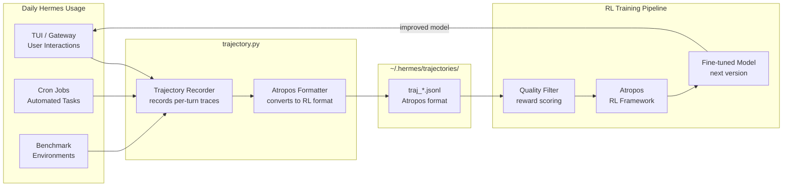
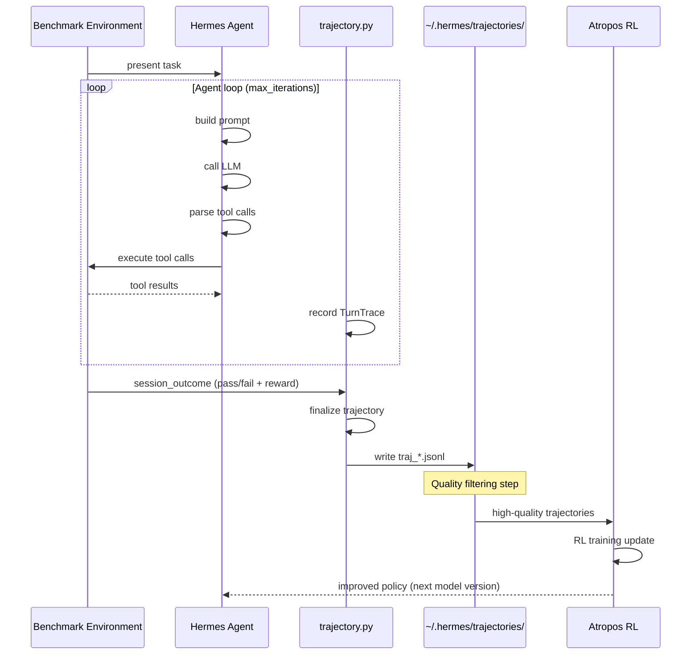

# Chapter 7: RL Training and Trajectory Generation

## What Problem Does This Solve?

Modern LLM fine-tuning — especially via reinforcement learning from human or environment feedback — requires high-quality behavioral trajectories: recordings of what an agent did, step by step, including reasoning, tool calls, and outcomes. These trajectories are expensive to generate synthetically and hard to collect at scale.

Hermes solves this by turning every production interaction into a potential training example. `trajectory.py` records a complete trace of each agent loop iteration — the prompt, the reasoning, every tool call, and the final response — in the Atropos RL format that NousResearch uses for fine-tuning. If you use Hermes daily, you're continuously generating training data for the very models that power it.

---

## The Closed Learning Loop



---

## trajectory.py — The Recorder

`trajectory.py` is attached to the agent's core loop as an observer. It records a structured trace of every turn without affecting the agent's behavior.

### What Gets Recorded

```python
# hermes_cli/agent/trajectory.py (data structures)

@dataclass
class TurnTrace:
    """A single turn in an agent trajectory."""
    
    # Context
    session_id: str
    turn_index: int
    timestamp: float
    model: str
    provider: str
    
    # Input
    prompt_tokens: int
    system_prompt_hash: str    # For deduplication; not the full prompt
    user_message: str
    conversation_history_length: int
    
    # Agent reasoning (if chain-of-thought is enabled)
    reasoning: str | None
    
    # Tool calls (may be multiple per turn)
    tool_calls: list[ToolCall]
    
    # Output
    assistant_response: str
    completion_tokens: int
    
    # Outcome signals (filled in post-turn)
    user_feedback: str | None   # explicit feedback if user gave it
    task_completed: bool | None # set by environment for benchmark tasks
    reward: float | None        # set by reward model or environment


@dataclass
class ToolCall:
    tool_name: str
    arguments: dict
    result: str | None
    error: str | None
    duration_ms: float
    success: bool
```

### Recording a Trajectory

```python
# hermes_cli/agent/trajectory.py (recording flow)

class TrajectoryRecorder:
    def __init__(self, config: Config):
        self.enabled = config.trajectory.enabled
        self.output_dir = Path(config.trajectory.output_dir)
        self.current_trajectory: list[TurnTrace] = []

    def record_turn(
        self,
        user_message: str,
        reasoning: str | None,
        tool_calls: list[ToolCall],
        assistant_response: str,
        model_info: ModelInfo,
        token_counts: TokenCounts
    ) -> TurnTrace:
        """Record a single turn. Called after each agent response."""
        if not self.enabled:
            return None
        
        trace = TurnTrace(
            session_id=self.session_id,
            turn_index=len(self.current_trajectory),
            timestamp=time.time(),
            model=model_info.model,
            provider=model_info.provider,
            prompt_tokens=token_counts.prompt,
            system_prompt_hash=hash_system_prompt(self.current_system_prompt),
            user_message=user_message,
            conversation_history_length=len(self.history),
            reasoning=reasoning,
            tool_calls=tool_calls,
            assistant_response=assistant_response,
            completion_tokens=token_counts.completion,
        )
        
        self.current_trajectory.append(trace)
        return trace
    
    def finalize(self, session_outcome: SessionOutcome):
        """Write the complete trajectory to disk at session end."""
        trajectory = Trajectory(
            session_id=self.session_id,
            turns=self.current_trajectory,
            outcome=session_outcome,
            format_version="atropos-v1"
        )
        
        output_path = self.output_dir / f"traj_{self.session_id}.jsonl"
        with open(output_path, "w") as f:
            for turn in trajectory.turns:
                f.write(json.dumps(asdict(turn)) + "\n")
```

---

## Atropos Format

Atropos is NousResearch's RL training framework. The trajectory format it consumes is a JSONL file where each line is a turn trace:

```jsonl
{"session_id": "sess_abc123", "turn_index": 0, "model": "gpt-4o", "user_message": "Can you help me debug this Python function?", "reasoning": "The user has a Python debugging question. I should ask to see the code.", "tool_calls": [], "assistant_response": "I'd be happy to help debug your Python function. Could you share the code?", "prompt_tokens": 1847, "completion_tokens": 23, "reward": null}
{"session_id": "sess_abc123", "turn_index": 1, "model": "gpt-4o", "user_message": "def process(df):\n    return df.groupby('a').sum()", "reasoning": "Simple groupby operation. The issue might be NaN handling or column types.", "tool_calls": [{"tool_name": "shell_exec", "arguments": {"command": "python3 -c \"import pandas as pd; df = pd.DataFrame({'a': [1,1,2], 'b': [None, 2, 3]}); print(df.groupby('a').sum())\"}"}, "result": "     b\na     \n1  2.0\n2  3.0", "success": true, "duration_ms": 234}], "assistant_response": "The function looks correct for basic aggregation. However, note that NaN values are silently dropped by groupby().sum()...", "prompt_tokens": 2103, "completion_tokens": 187, "reward": 1.0}
```

### Trajectory Configuration

```yaml
# ~/.hermes/config.yaml

trajectory:
  enabled: true
  output_dir: "~/.hermes/trajectories"
  
  # What to record
  record_reasoning: true      # Include chain-of-thought if available
  record_tool_calls: true     # Include all tool call arguments and results
  record_system_prompt: false # Exclude for privacy (hash only)
  
  # Quality filtering
  min_turn_count: 2           # Skip single-turn sessions
  require_tool_calls: false   # Include even non-tool-using sessions
  
  # Reward signals
  reward_model: null          # Path to local reward model, or null for human feedback only
  
  # Upload
  auto_upload: false          # Upload to NousResearch if true
  upload_endpoint: "https://training.nousresearch.com/trajectories"
  upload_api_key: "nk-..."
```

---

## Benchmark Environments

Hermes ships with four benchmark environments designed to generate high-quality training trajectories for specific skill domains.

### Overview

| Environment | Location | Tests | Domain |
|---|---|---|---|
| hermes_swe_env | environments/hermes_swe_env/ | Software engineering tasks | Code editing, bug fixing, PR review |
| tblite | environments/tblite/ | Terminal-based tasks | Shell scripting, file manipulation, system admin |
| terminalbench_2 | environments/terminalbench_2/ | Terminal reasoning | Complex multi-step terminal workflows |
| yc_bench | environments/yc_bench/ | Business/startup tasks | Research, analysis, document generation |

### hermes_swe_env — Software Engineering Benchmark

Based on SWE-bench methodology, `hermes_swe_env` presents the agent with real-world software engineering tasks:

```python
# hermes_cli/environments/hermes_swe_env/__init__.py (structure)

class HermesSWEEnv:
    """
    Software engineering benchmark environment.
    
    Each task is a GitHub issue + repository snapshot.
    The agent must produce a patch that resolves the issue.
    Success is measured by automated test suite pass rate.
    """
    
    async def run_task(self, task: SWETask) -> TaskResult:
        """
        Set up a Docker container with the task's repository,
        present the issue to the agent, and evaluate the result.
        """
        container = await self._setup_container(task.repo_snapshot)
        
        prompt = f"""
        You are working on the following GitHub issue:
        
        Repository: {task.repo}
        Issue #{task.issue_number}: {task.issue_title}
        
        {task.issue_body}
        
        Please resolve this issue by editing the relevant files.
        """
        
        result = await self.agent.run(
            prompt=prompt,
            backend="docker",
            container=container,
            max_iterations=20
        )
        
        test_pass_rate = await self._run_tests(container)
        
        return TaskResult(
            task_id=task.id,
            success=test_pass_rate > 0.9,
            test_pass_rate=test_pass_rate,
            patch=await self._extract_patch(container),
            trajectory=result.trajectory
        )
```

### tblite — Terminal Benchmark Lite

A collection of terminal-focused tasks ranging from simple file operations to complex shell scripting challenges:

```python
# hermes_cli/environments/tblite/__init__.py (structure)

TASK_CATEGORIES = {
    "file_ops": [
        "Find all Python files modified in the last 24 hours",
        "Create a directory structure for a new Python package",
        "Extract specific lines from multiple log files",
    ],
    "shell_scripting": [
        "Write a bash script to monitor disk usage and alert when > 90%",
        "Parse a CSV file and output statistics",
        "Create a backup script with rotation",
    ],
    "system_admin": [
        "Set up a cron job to run a Python script daily",
        "Configure environment variables for a Python project",
        "Debug a failing systemd service",
    ]
}
```

### terminalbench_2 — Advanced Terminal Reasoning

`terminalbench_2` focuses on multi-step terminal workflows that require planning and state management:

```python
# hermes_cli/environments/terminalbench_2/__init__.py (structure)

class TerminalBench2:
    """
    Advanced terminal benchmark with longer-horizon tasks.
    Evaluates ability to maintain state across many steps,
    recover from errors, and use terminal tools efficiently.
    """
    pass
```

### yc_bench — Business Task Benchmark

Evaluates the agent's ability to perform business and startup-related tasks:

```python
# hermes_cli/environments/yc_bench/__init__.py (structure)

TASK_TYPES = [
    "market_research",       # Research a market and produce a report
    "competitor_analysis",   # Analyze competitors and create comparison matrix
    "technical_spec",        # Write a technical specification document
    "financial_model",       # Build a simple financial model in a spreadsheet
    "user_interview_analysis", # Analyze interview transcripts for themes
]
```

---

## Tool-Call Parsers for Multi-Model RL

One of Hermes's most technically sophisticated features is its ability to generate RL training data from multiple model families. Different models use different tool-call formats, and `trajectory.py` includes parsers for each:

```python
# hermes_cli/agent/trajectory.py (tool call parsers)

class ToolCallParser:
    """
    Parse tool calls from different model families into
    a unified ToolCall format for trajectory recording.
    """
    
    @staticmethod
    def parse(response: str, model_family: str) -> list[ToolCall]:
        parser = {
            "hermes":   ToolCallParser._parse_hermes,    # Hermes function calling
            "deepseek": ToolCallParser._parse_deepseek,  # DeepSeek tool use
            "qwen":     ToolCallParser._parse_qwen,      # Qwen tool calls
            "glm":      ToolCallParser._parse_glm,       # GLM function calls
            "llama":    ToolCallParser._parse_llama,     # Llama tool use
            "kimi":     ToolCallParser._parse_kimi,      # Kimi (Moonshot) tools
            "mistral":  ToolCallParser._parse_mistral,   # Mistral tool calls
        }.get(model_family, ToolCallParser._parse_openai)
        
        return parser(response)
    
    @staticmethod
    def _parse_hermes(response: str) -> list[ToolCall]:
        """Parse Hermes function calling format."""
        # Hermes uses XML-like tags: <tool_call>...</tool_call>
        calls = []
        for match in re.finditer(r'<tool_call>(.*?)</tool_call>', response, re.DOTALL):
            try:
                call_data = json.loads(match.group(1))
                calls.append(ToolCall(
                    tool_name=call_data["name"],
                    arguments=call_data.get("arguments", {})
                ))
            except json.JSONDecodeError:
                pass
        return calls
    
    @staticmethod
    def _parse_deepseek(response: str) -> list[ToolCall]:
        """Parse DeepSeek tool use format."""
        # DeepSeek uses a different JSON structure
        ...
```

### Model Family Support Matrix

| Model Family | Tool Format | Reasoning Format | Notes |
|---|---|---|---|
| Hermes (NousResearch) | XML tags: `<tool_call>` | `<reasoning>` | Native format |
| DeepSeek | JSON in `<tool_call>` | `<think>` | R1-style reasoning |
| Qwen | OpenAI-compatible JSON | Optional `<think>` | Qwen2.5 family |
| GLM | Function call JSON | Not exposed | GLM-4 family |
| Llama | OpenAI-compatible | Optional chain | Llama 3.x family |
| Kimi (Moonshot) | OpenAI-compatible | `<think>` | k1.5 family |
| Mistral | OpenAI-compatible | Not exposed | Mistral/Mixtral |
| OpenAI (fallback) | Standard function calling | Not exposed | GPT-4o family |

---

## Running the Data Generation Pipeline

### Generate Trajectories from Benchmarks

```bash
# Run hermes_swe_env benchmark and generate trajectories
hermes bench run hermes_swe_env \
  --model "gpt-4o" \
  --tasks 50 \
  --output ~/.hermes/trajectories/swe_bench_run_1/

# Run tblite benchmark
hermes bench run tblite \
  --model "meta-llama/Llama-3.3-70b-Instruct-Turbo" \
  --tasks 100 \
  --backend docker \
  --concurrency 5 \
  --output ~/.hermes/trajectories/tblite_run_1/
```

### Filter and Score Trajectories

```bash
# Score trajectories with a reward model
hermes traj score \
  --input ~/.hermes/trajectories/swe_bench_run_1/ \
  --reward-model ~/models/reward_model.ckpt \
  --output ~/.hermes/trajectories/scored/

# Filter to high-quality trajectories
hermes traj filter \
  --input ~/.hermes/trajectories/scored/ \
  --min-reward 0.7 \
  --min-turns 3 \
  --output ~/.hermes/trajectories/filtered/

# Convert to Atropos training format
hermes traj export \
  --input ~/.hermes/trajectories/filtered/ \
  --format atropos-v1 \
  --output ~/training_data/hermes_trajectories.jsonl
```

### Upload to NousResearch

```bash
# Upload high-quality trajectories to contribute to model training
hermes traj upload \
  --input ~/.hermes/trajectories/filtered/ \
  --endpoint https://training.nousresearch.com/trajectories \
  --api-key $NOUSRESEARCH_API_KEY
```

---

## Data Generation Pipeline Architecture



---

## Reward Signals

Trajectories become useful for RL training only when they have reward signals. Hermes supports three reward sources:

| Reward Source | When Available | Quality |
|---|---|---|
| Environment feedback | Benchmark runs (automated test pass/fail) | High — ground truth |
| User explicit feedback | User rates response with 👍/👎 in TUI | High — human judgment |
| Reward model | Configured local or API reward model | Medium — depends on model quality |
| Implicit signal | Session length, skill creation events, memory writes | Low — correlational |

For production use, the most valuable trajectories come from benchmark runs where success is objectively measurable. Interactive session trajectories are valuable when users provide explicit feedback.

---

## Chapter Summary

| Concept | Key Takeaway |
|---|---|
| trajectory.py | Silent observer on agent loop; records every turn in Atropos format |
| Atropos format | JSONL; one line per turn; includes reasoning, tool calls, outcomes, rewards |
| Closed loop | Daily usage → trajectories → Atropos training → improved models → daily usage |
| hermes_swe_env | SWE-bench-style software engineering tasks; Docker-isolated; evaluated by tests |
| tblite | Terminal task benchmark; shell scripting, file ops, system admin |
| terminalbench_2 | Long-horizon terminal reasoning tasks |
| yc_bench | Business task benchmark; research, analysis, document generation |
| Tool-call parsers | Unified parser for 7+ model families; enables multi-model RL training |
| Reward signals | Environment feedback (best), user feedback, reward model, implicit signals |
| Upload workflow | Filter → score → export → upload to NousResearch training endpoint |
