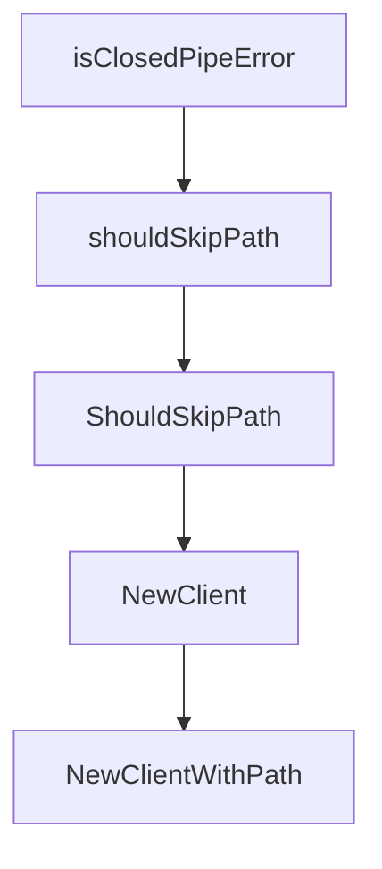

# Chapter 1: Getting Started

Welcome to **Chapter 1: Getting Started**. In this part of **HumanLayer Tutorial: Context Engineering and Human-Governed Coding Agents**, you will build an intuitive mental model first, then move into concrete implementation details and practical production tradeoffs.


This chapter clarifies the current HumanLayer landscape and how to start with practical workflows.

## Learning Goals

- understand current CodeLayer/HumanLayer positioning
- identify key docs and repository entry points
- run first workflow exploration in local environment

## Orientation Notes

- `README.md` focuses on current CodeLayer workflow direction
- `humanlayer.md` documents legacy SDK concepts and principles
- docs folder and monorepo packages show active implementation surfaces

## Source References

- [HumanLayer README](https://github.com/humanlayer/humanlayer/blob/main/README.md)
- [humanlayer.md](https://github.com/humanlayer/humanlayer/blob/main/humanlayer.md)

## Summary

You now have a clear starting point for learning the active and legacy parts of HumanLayer.

Next: [Chapter 2: Architecture and Monorepo Layout](02-architecture-and-monorepo-layout.md)

## Source Code Walkthrough

### `claudecode-go/client.go`

The `isClosedPipeError` function in [`claudecode-go/client.go`](https://github.com/humanlayer/humanlayer/blob/HEAD/claudecode-go/client.go) handles a key part of this chapter's functionality:

```go
)

// isClosedPipeError checks if an error is due to a closed pipe (expected when process exits)
func isClosedPipeError(err error) bool {
	if err == nil {
		return false
	}

	// Check for common closed pipe error patterns
	errStr := err.Error()
	if strings.Contains(errStr, "file already closed") ||
		strings.Contains(errStr, "broken pipe") ||
		strings.Contains(errStr, "use of closed network connection") {
		return true
	}

	// Check for syscall errors indicating closed pipe
	var syscallErr *os.SyscallError
	if errors.As(err, &syscallErr) {
		return syscallErr.Err == syscall.EPIPE || syscallErr.Err == syscall.EBADF
	}

	// Check for EOF (which can happen when pipe closes)
	return errors.Is(err, io.EOF)
}

// Client provides methods to interact with the Claude Code SDK
type Client struct {
	claudePath string
}

// shouldSkipPath checks if a path should be skipped during search
```

This function is important because it defines how HumanLayer Tutorial: Context Engineering and Human-Governed Coding Agents implements the patterns covered in this chapter.

### `claudecode-go/client.go`

The `shouldSkipPath` function in [`claudecode-go/client.go`](https://github.com/humanlayer/humanlayer/blob/HEAD/claudecode-go/client.go) handles a key part of this chapter's functionality:

```go
}

// shouldSkipPath checks if a path should be skipped during search
func shouldSkipPath(path string) bool {
	// Skip node_modules directories
	if strings.Contains(path, "/node_modules/") {
		return true
	}
	// Skip backup files
	if strings.HasSuffix(path, ".bak") {
		return true
	}
	return false
}

// ShouldSkipPath checks if a path should be skipped during search (exported version)
func ShouldSkipPath(path string) bool {
	return shouldSkipPath(path)
}

// NewClient creates a new Claude Code client
func NewClient() (*Client, error) {
	// First try standard PATH
	path, err := exec.LookPath("claude")
	if err == nil && !shouldSkipPath(path) {
		return &Client{claudePath: path}, nil
	}

	// Try common installation paths
	commonPaths := []string{
		filepath.Join(os.Getenv("HOME"), ".claude/local/claude"), // Add Claude's own directory
		filepath.Join(os.Getenv("HOME"), ".npm/bin/claude"),
```

This function is important because it defines how HumanLayer Tutorial: Context Engineering and Human-Governed Coding Agents implements the patterns covered in this chapter.

### `claudecode-go/client.go`

The `ShouldSkipPath` function in [`claudecode-go/client.go`](https://github.com/humanlayer/humanlayer/blob/HEAD/claudecode-go/client.go) handles a key part of this chapter's functionality:

```go
}

// ShouldSkipPath checks if a path should be skipped during search (exported version)
func ShouldSkipPath(path string) bool {
	return shouldSkipPath(path)
}

// NewClient creates a new Claude Code client
func NewClient() (*Client, error) {
	// First try standard PATH
	path, err := exec.LookPath("claude")
	if err == nil && !shouldSkipPath(path) {
		return &Client{claudePath: path}, nil
	}

	// Try common installation paths
	commonPaths := []string{
		filepath.Join(os.Getenv("HOME"), ".claude/local/claude"), // Add Claude's own directory
		filepath.Join(os.Getenv("HOME"), ".npm/bin/claude"),
		filepath.Join(os.Getenv("HOME"), ".bun/bin/claude"),
		filepath.Join(os.Getenv("HOME"), ".local/bin/claude"),
		"/usr/local/bin/claude",
		"/opt/homebrew/bin/claude",
	}

	for _, candidatePath := range commonPaths {
		if shouldSkipPath(candidatePath) {
			continue
		}
		if _, err := os.Stat(candidatePath); err == nil {
			// Verify it's executable
			if err := isExecutable(candidatePath); err == nil {
```

This function is important because it defines how HumanLayer Tutorial: Context Engineering and Human-Governed Coding Agents implements the patterns covered in this chapter.

### `claudecode-go/client.go`

The `NewClient` function in [`claudecode-go/client.go`](https://github.com/humanlayer/humanlayer/blob/HEAD/claudecode-go/client.go) handles a key part of this chapter's functionality:

```go
}

// NewClient creates a new Claude Code client
func NewClient() (*Client, error) {
	// First try standard PATH
	path, err := exec.LookPath("claude")
	if err == nil && !shouldSkipPath(path) {
		return &Client{claudePath: path}, nil
	}

	// Try common installation paths
	commonPaths := []string{
		filepath.Join(os.Getenv("HOME"), ".claude/local/claude"), // Add Claude's own directory
		filepath.Join(os.Getenv("HOME"), ".npm/bin/claude"),
		filepath.Join(os.Getenv("HOME"), ".bun/bin/claude"),
		filepath.Join(os.Getenv("HOME"), ".local/bin/claude"),
		"/usr/local/bin/claude",
		"/opt/homebrew/bin/claude",
	}

	for _, candidatePath := range commonPaths {
		if shouldSkipPath(candidatePath) {
			continue
		}
		if _, err := os.Stat(candidatePath); err == nil {
			// Verify it's executable
			if err := isExecutable(candidatePath); err == nil {
				return &Client{claudePath: candidatePath}, nil
			}
		}
	}

```

This function is important because it defines how HumanLayer Tutorial: Context Engineering and Human-Governed Coding Agents implements the patterns covered in this chapter.


## How These Components Connect


