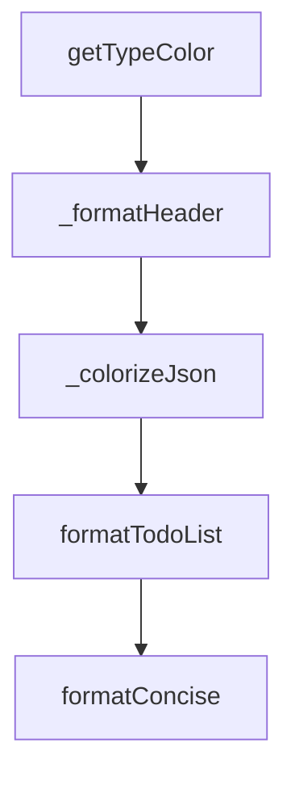

# Chapter 1: Getting Started

Welcome to **Chapter 1: Getting Started**. In this part of **HumanLayer Tutorial: Context Engineering and Human-Governed Coding Agents**, you will build an intuitive mental model first, then move into concrete implementation details and practical production tradeoffs.


This chapter clarifies the current HumanLayer landscape and how to start with practical workflows.

## Learning Goals

- understand current CodeLayer/HumanLayer positioning
- identify key docs and repository entry points
- run first workflow exploration in local environment

## Orientation Notes

- `README.md` focuses on current CodeLayer workflow direction
- `humanlayer.md` documents legacy SDK concepts and principles
- docs folder and monorepo packages show active implementation surfaces

## Source References

- [HumanLayer README](https://github.com/humanlayer/humanlayer/blob/main/README.md)
- [humanlayer.md](https://github.com/humanlayer/humanlayer/blob/main/humanlayer.md)

## Summary

You now have a clear starting point for learning the active and legacy parts of HumanLayer.

Next: [Chapter 2: Architecture and Monorepo Layout](02-architecture-and-monorepo-layout.md)

## Depth Expansion Playbook

## Source Code Walkthrough

### `hack/visualize.ts`

The `getTypeColor` function in [`hack/visualize.ts`](https://github.com/humanlayer/humanlayer/blob/HEAD/hack/visualize.ts) handles a key part of this chapter's functionality:

```ts
};

function getTypeColor(type: string): string {
  switch (type) {
    case 'system':
      return colors.magenta;
    case 'user':
      return colors.blue;
    case 'assistant':
      return colors.green;
    case 'tool_use':
      return colors.cyan;
    case 'tool_result':
      return colors.yellow;
    case 'message':
      return colors.dim;
    case 'text':
      return colors.reset;
    default:
      return colors.reset;
  }
}

function _formatHeader(json: any, lineNumber: number): string {
  const type = json.type || 'unknown';
  const typeColor = getTypeColor(type);

  let header = `${colors.dim}--- Line ${lineNumber} ${typeColor}[${type.toUpperCase()}]${colors.reset}`;

  // Add context based on type
  if (json.message?.role) {
    header += ` ${colors.dim}(${json.message.role})${colors.reset}`;
```

This function is important because it defines how HumanLayer Tutorial: Context Engineering and Human-Governed Coding Agents implements the patterns covered in this chapter.

### `hack/visualize.ts`

The `_formatHeader` function in [`hack/visualize.ts`](https://github.com/humanlayer/humanlayer/blob/HEAD/hack/visualize.ts) handles a key part of this chapter's functionality:

```ts
}

function _formatHeader(json: any, lineNumber: number): string {
  const type = json.type || 'unknown';
  const typeColor = getTypeColor(type);

  let header = `${colors.dim}--- Line ${lineNumber} ${typeColor}[${type.toUpperCase()}]${colors.reset}`;

  // Add context based on type
  if (json.message?.role) {
    header += ` ${colors.dim}(${json.message.role})${colors.reset}`;
  }

  if (json.message?.content?.[0]?.name) {
    header += ` ${colors.cyan}${json.message.content[0].name}${colors.reset}`;
  }

  if (json.name) {
    header += ` ${colors.cyan}${json.name}${colors.reset}`;
  }

  if (json.subtype) {
    header += ` ${colors.dim}${json.subtype}${colors.reset}`;
  }

  return `${header} ${colors.dim}---${colors.reset}`;
}

function _colorizeJson(obj: any, indent = 0, path: string[] = []): string {
  const spaces = '  '.repeat(indent);

  if (obj === null) return `${colors.dim}null${colors.reset}`;
```

This function is important because it defines how HumanLayer Tutorial: Context Engineering and Human-Governed Coding Agents implements the patterns covered in this chapter.

### `hack/visualize.ts`

The `_colorizeJson` function in [`hack/visualize.ts`](https://github.com/humanlayer/humanlayer/blob/HEAD/hack/visualize.ts) handles a key part of this chapter's functionality:

```ts
}

function _colorizeJson(obj: any, indent = 0, path: string[] = []): string {
  const spaces = '  '.repeat(indent);

  if (obj === null) return `${colors.dim}null${colors.reset}`;
  if (typeof obj === 'boolean') return `${colors.yellow}${obj}${colors.reset}`;
  if (typeof obj === 'number') return `${colors.cyan}${obj}${colors.reset}`;
  if (typeof obj === 'string') {
    // Truncate very long strings
    if (obj.length > 200) {
      return `${colors.green}"${obj.substring(0, 197)}..."${colors.reset}`;
    }
    return `${colors.green}"${obj}"${colors.reset}`;
  }

  if (Array.isArray(obj)) {
    if (obj.length === 0) return '[]';

    // For content arrays, show summary
    if (path.includes('content') && obj.length > 3) {
      const summary = obj.slice(0, 2).map((item) => _colorizeJson(item, indent + 1, [...path]));
      return `[\n${summary.join(',\n')},\n${spaces}  ${colors.dim}... ${obj.length - 2} more items${colors.reset}\n${spaces}]`;
    }

    const items = obj.map((item) => `${spaces}  ${_colorizeJson(item, indent + 1, [...path])}`);
    return `[\n${items.join(',\n')}\n${spaces}]`;
  }

  if (typeof obj === 'object') {
    const keys = Object.keys(obj);
    if (keys.length === 0) return '{}';
```

This function is important because it defines how HumanLayer Tutorial: Context Engineering and Human-Governed Coding Agents implements the patterns covered in this chapter.

### `hack/visualize.ts`

The `formatTodoList` function in [`hack/visualize.ts`](https://github.com/humanlayer/humanlayer/blob/HEAD/hack/visualize.ts) handles a key part of this chapter's functionality:

```ts
}

function formatTodoList(todos: any[]): string {
  let output = `📋 ${colors.bright}${colors.cyan}Todo List Update${colors.reset}\n`;

  const statusColors = {
    completed: colors.dim + colors.green,
    in_progress: colors.bright + colors.yellow,
    pending: colors.reset,
  };

  const statusIcons = {
    completed: '✅',
    in_progress: '🔄',
    pending: '⏸️',
  };

  const priorityColors = {
    high: colors.red,
    medium: colors.yellow,
    low: colors.dim,
  };

  todos.forEach((todo, index) => {
    const statusColor = statusColors[todo.status] || colors.reset;
    const statusIcon = statusIcons[todo.status] || '❓';
    const priorityColor = priorityColors[todo.priority] || colors.reset;
    const checkbox = todo.status === 'completed' ? '☑️' : '☐';

    output += `  ${checkbox} ${statusIcon} ${statusColor}${todo.content}${colors.reset}`;
    output += ` ${priorityColor}[${todo.priority}]${colors.reset}`;

```

This function is important because it defines how HumanLayer Tutorial: Context Engineering and Human-Governed Coding Agents implements the patterns covered in this chapter.


## How These Components Connect


