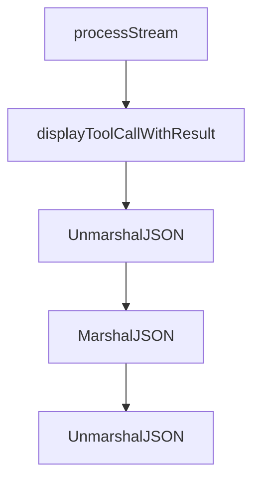

# Chapter 2: Architecture and Monorepo Layout

Welcome to **Chapter 2: Architecture and Monorepo Layout**. In this part of **HumanLayer Tutorial: Context Engineering and Human-Governed Coding Agents**, you will build an intuitive mental model first, then move into concrete implementation details and practical production tradeoffs.


HumanLayer uses a monorepo layout that supports multiple workflow surfaces and tooling paths.

## Key Areas

| Area | Focus |
|:-----|:------|
| `apps/` | end-user application surfaces |
| `packages/` | reusable shared libraries |
| docs and scripts | workflow guidance and automation |
| CLI-related dirs (`hld`, `hlyr`) | command workflows and tooling |

## Summary

You now know where to inspect and extend key parts of the HumanLayer codebase.

Next: [Chapter 3: Context Engineering Workflows](03-context-engineering-workflows.md)

## Depth Expansion Playbook

## Source Code Walkthrough

### `hack/visualize.ts`

The `processStream` function in [`hack/visualize.ts`](https://github.com/humanlayer/humanlayer/blob/HEAD/hack/visualize.ts) handles a key part of this chapter's functionality:

```ts
}

async function processStream() {
  const rl = createInterface({
    input: process.stdin,
    crlfDelay: Infinity,
  });

  const debugMode = process.argv.includes('--debug');
  const toolCalls = new Map(); // Store tool calls by their ID
  const pendingResults = new Map(); // Store results waiting for their tool calls
  let lastLine = null; // Track the last line to detect final message
  let isLastAssistantMessage = false;

  rl.on('line', (line) => {
    if (line.trim()) {
      const timestamp = debugMode
        ? `${colors.dim}[${new Date().toISOString()}]${colors.reset} `
        : '';

      try {
        const json = JSON.parse(line);

        // Check if this is a tool call
        if (json.type === 'assistant' && json.message?.content?.[0]?.id) {
          const toolCall = json.message.content[0];
          const toolId = toolCall.id;

          // Store the tool call
          toolCalls.set(toolId, {
            toolCall: json,
            timestamp: timestamp,
```

This function is important because it defines how HumanLayer Tutorial: Context Engineering and Human-Governed Coding Agents implements the patterns covered in this chapter.

### `hack/visualize.ts`

The `displayToolCallWithResult` function in [`hack/visualize.ts`](https://github.com/humanlayer/humanlayer/blob/HEAD/hack/visualize.ts) handles a key part of this chapter's functionality:

```ts
          if (pendingResults.has(toolId)) {
            const result = pendingResults.get(toolId);
            displayToolCallWithResult(
              toolCall,
              json,
              result.toolResult,
              result.timestamp,
              timestamp
            );
            pendingResults.delete(toolId);
          } else {
            // Display the tool call and mark it as pending
            process.stdout.write(`${timestamp + formatConcise(json)}\n`);
            process.stdout.write(`${colors.dim}  ⎿  Waiting for result...${colors.reset}\n\n`);
          }
        }
        // Check if this is a tool result
        else if (json.type === 'user' && json.message?.content?.[0]?.type === 'tool_result') {
          const toolResult = json.message.content[0];
          const toolId = toolResult.tool_use_id;

          if (toolCalls.has(toolId)) {
            // We have the matching tool call, display them together
            const stored = toolCalls.get(toolId);
            displayToolCallWithResult(
              stored.toolCall.message.content[0],
              stored.toolCall,
              json,
              stored.timestamp,
              timestamp
            );
            toolCalls.delete(toolId);
```

This function is important because it defines how HumanLayer Tutorial: Context Engineering and Human-Governed Coding Agents implements the patterns covered in this chapter.

### `claudecode-go/types.go`

The `UnmarshalJSON` function in [`claudecode-go/types.go`](https://github.com/humanlayer/humanlayer/blob/HEAD/claudecode-go/types.go) handles a key part of this chapter's functionality:

```go
}

// UnmarshalJSON implements custom unmarshaling to handle both string and array formats
func (c *ContentField) UnmarshalJSON(data []byte) error {
	// First try to unmarshal as string
	var str string
	if err := json.Unmarshal(data, &str); err == nil {
		c.Value = str
		return nil
	}

	// If that fails, try array format
	var arr []struct {
		Type string `json:"type"`
		Text string `json:"text"`
	}
	if err := json.Unmarshal(data, &arr); err == nil {
		// Concatenate all text elements
		var texts []string
		for _, item := range arr {
			if item.Type == "text" && item.Text != "" {
				texts = append(texts, item.Text)
			}
		}
		c.Value = strings.Join(texts, "\n")
		return nil
	}

	return fmt.Errorf("content field is neither string nor array format")
}

// MarshalJSON implements custom marshaling to always output as string
```

This function is important because it defines how HumanLayer Tutorial: Context Engineering and Human-Governed Coding Agents implements the patterns covered in this chapter.

### `claudecode-go/types.go`

The `MarshalJSON` function in [`claudecode-go/types.go`](https://github.com/humanlayer/humanlayer/blob/HEAD/claudecode-go/types.go) handles a key part of this chapter's functionality:

```go
}

// MarshalJSON implements custom marshaling to always output as string
func (c ContentField) MarshalJSON() ([]byte, error) {
	return json.Marshal(c.Value)
}

// Content can be text or tool use
type Content struct {
	Type      string                 `json:"type"`
	Text      string                 `json:"text,omitempty"`
	Thinking  string                 `json:"thinking,omitempty"`
	ID        string                 `json:"id,omitempty"`
	Name      string                 `json:"name,omitempty"`
	Input     map[string]interface{} `json:"input,omitempty"`
	ToolUseID string                 `json:"tool_use_id,omitempty"`
	Content   ContentField           `json:"content,omitempty"`
}

// ServerToolUse tracks server-side tool usage
type ServerToolUse struct {
	WebSearchRequests int `json:"web_search_requests,omitempty"`
}

// CacheCreation tracks cache creation metrics
type CacheCreation struct {
	Ephemeral1HInputTokens int `json:"ephemeral_1h_input_tokens,omitempty"`
	Ephemeral5MInputTokens int `json:"ephemeral_5m_input_tokens,omitempty"`
}

// Usage tracks token usage
type Usage struct {
```

This function is important because it defines how HumanLayer Tutorial: Context Engineering and Human-Governed Coding Agents implements the patterns covered in this chapter.


## How These Components Connect


