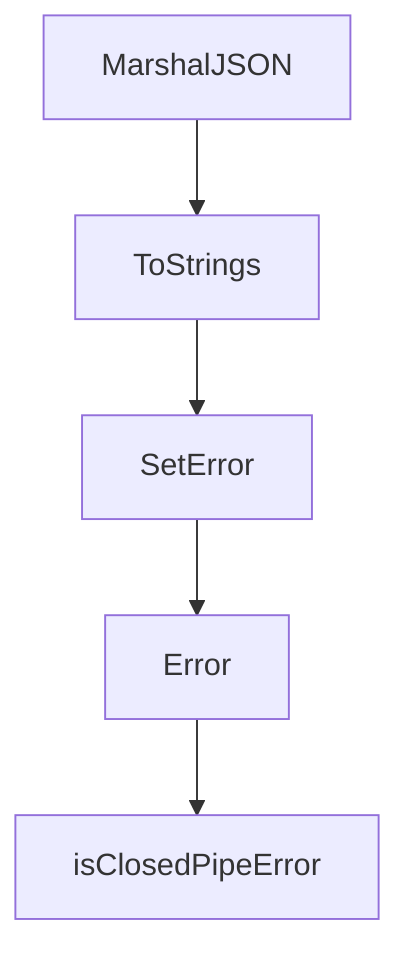

# Chapter 3: Context Engineering Workflows

Welcome to **Chapter 3: Context Engineering Workflows**. In this part of **HumanLayer Tutorial: Context Engineering and Human-Governed Coding Agents**, you will build an intuitive mental model first, then move into concrete implementation details and practical production tradeoffs.


Context engineering is central to making coding agents reliable in complex repositories.

## Core Pattern

1. narrow problem statement and scope
2. curate minimal, high-signal context
3. enforce explicit task boundaries
4. iterate with measured review loops

## Why It Works

- reduces agent drift
- lowers token waste
- improves repeatability across teammates

## Source References

- [HumanLayer README](https://github.com/humanlayer/humanlayer/blob/main/README.md)
- [humanlayer.md](https://github.com/humanlayer/humanlayer/blob/main/humanlayer.md)

## Summary

You now have a repeatable context workflow pattern for hard coding tasks.

Next: [Chapter 4: Parallel Agent Orchestration](04-parallel-agent-orchestration.md)

## Depth Expansion Playbook

## Source Code Walkthrough

### `claudecode-go/types.go`

The `MarshalJSON` function in [`claudecode-go/types.go`](https://github.com/humanlayer/humanlayer/blob/HEAD/claudecode-go/types.go) handles a key part of this chapter's functionality:

```go
}

// MarshalJSON implements custom marshaling to always output as string
func (c ContentField) MarshalJSON() ([]byte, error) {
	return json.Marshal(c.Value)
}

// Content can be text or tool use
type Content struct {
	Type      string                 `json:"type"`
	Text      string                 `json:"text,omitempty"`
	Thinking  string                 `json:"thinking,omitempty"`
	ID        string                 `json:"id,omitempty"`
	Name      string                 `json:"name,omitempty"`
	Input     map[string]interface{} `json:"input,omitempty"`
	ToolUseID string                 `json:"tool_use_id,omitempty"`
	Content   ContentField           `json:"content,omitempty"`
}

// ServerToolUse tracks server-side tool usage
type ServerToolUse struct {
	WebSearchRequests int `json:"web_search_requests,omitempty"`
}

// CacheCreation tracks cache creation metrics
type CacheCreation struct {
	Ephemeral1HInputTokens int `json:"ephemeral_1h_input_tokens,omitempty"`
	Ephemeral5MInputTokens int `json:"ephemeral_5m_input_tokens,omitempty"`
}

// Usage tracks token usage
type Usage struct {
```

This function is important because it defines how HumanLayer Tutorial: Context Engineering and Human-Governed Coding Agents implements the patterns covered in this chapter.

### `claudecode-go/types.go`

The `ToStrings` function in [`claudecode-go/types.go`](https://github.com/humanlayer/humanlayer/blob/HEAD/claudecode-go/types.go) handles a key part of this chapter's functionality:

```go
}

// ToStrings converts denials to string array for backward compatibility
func (p PermissionDenials) ToStrings() []string {
	if p.Denials == nil {
		return nil
	}
	result := make([]string, len(p.Denials))
	for i, d := range p.Denials {
		result[i] = d.ToolName
	}
	return result
}

// ModelUsageDetail represents usage details for a specific model
type ModelUsageDetail struct {
	InputTokens              int     `json:"inputTokens"`
	OutputTokens             int     `json:"outputTokens"`
	CacheReadInputTokens     int     `json:"cacheReadInputTokens"`
	CacheCreationInputTokens int     `json:"cacheCreationInputTokens"`
	WebSearchRequests        int     `json:"webSearchRequests"`
	CostUSD                  float64 `json:"costUSD"`
	ContextWindow            int     `json:"contextWindow,omitempty"`
}

// Result represents the final result of a Claude session
type Result struct {
	Type              string                      `json:"type"`
	Subtype           string                      `json:"subtype"`
	CostUSD           float64                     `json:"total_cost_usd"`
	IsError           bool                        `json:"is_error"`
	DurationMS        int                         `json:"duration_ms"`
```

This function is important because it defines how HumanLayer Tutorial: Context Engineering and Human-Governed Coding Agents implements the patterns covered in this chapter.

### `claudecode-go/types.go`

The `SetError` function in [`claudecode-go/types.go`](https://github.com/humanlayer/humanlayer/blob/HEAD/claudecode-go/types.go) handles a key part of this chapter's functionality:

```go
}

// SetError safely sets the error
func (s *Session) SetError(err error) {
	s.mu.Lock()
	defer s.mu.Unlock()
	if s.err == nil {
		s.err = err
	}
}

// Error safely gets the error
func (s *Session) Error() error {
	s.mu.RLock()
	defer s.mu.RUnlock()
	return s.err
}

```

This function is important because it defines how HumanLayer Tutorial: Context Engineering and Human-Governed Coding Agents implements the patterns covered in this chapter.

### `claudecode-go/types.go`

The `Error` function in [`claudecode-go/types.go`](https://github.com/humanlayer/humanlayer/blob/HEAD/claudecode-go/types.go) handles a key part of this chapter's functionality:

```go
	// Result event fields (when type="result")
	CostUSD           float64                     `json:"total_cost_usd,omitempty"`
	IsError           bool                        `json:"is_error,omitempty"`
	DurationMS        int                         `json:"duration_ms,omitempty"`
	DurationAPI       int                         `json:"duration_api_ms,omitempty"`
	NumTurns          int                         `json:"num_turns,omitempty"`
	Result            string                      `json:"result,omitempty"`
	Usage             *Usage                      `json:"usage,omitempty"`
	ModelUsage        map[string]ModelUsageDetail `json:"modelUsage,omitempty"`
	Error             string                      `json:"error,omitempty"`
	PermissionDenials *PermissionDenials          `json:"permission_denials,omitempty"`
	UUID              string                      `json:"uuid,omitempty"`
}

// MCPStatus represents the status of an MCP server
type MCPStatus struct {
	Name   string `json:"name"`
	Status string `json:"status"`
}

// Message represents an assistant or user message
type Message struct {
	ID      string    `json:"id"`
	Type    string    `json:"type"`
	Role    string    `json:"role"`
	Model   string    `json:"model,omitempty"`
	Content []Content `json:"content"`
	Usage   *Usage    `json:"usage,omitempty"`
}

// ContentField handles both string and array content formats
type ContentField struct {
```

This function is important because it defines how HumanLayer Tutorial: Context Engineering and Human-Governed Coding Agents implements the patterns covered in this chapter.


## How These Components Connect


