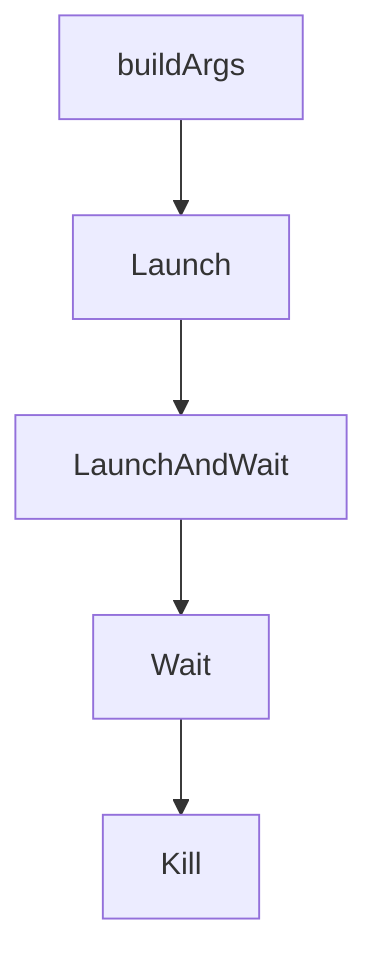

# Chapter 3: Context Engineering Workflows

Welcome to **Chapter 3: Context Engineering Workflows**. In this part of **HumanLayer Tutorial: Context Engineering and Human-Governed Coding Agents**, you will build an intuitive mental model first, then move into concrete implementation details and practical production tradeoffs.


Context engineering is central to making coding agents reliable in complex repositories.

## Core Pattern

1. narrow problem statement and scope
2. curate minimal, high-signal context
3. enforce explicit task boundaries
4. iterate with measured review loops

## Why It Works

- reduces agent drift
- lowers token waste
- improves repeatability across teammates

## Source References

- [HumanLayer README](https://github.com/humanlayer/humanlayer/blob/main/README.md)
- [humanlayer.md](https://github.com/humanlayer/humanlayer/blob/main/humanlayer.md)

## Summary

You now have a repeatable context workflow pattern for hard coding tasks.

Next: [Chapter 4: Parallel Agent Orchestration](04-parallel-agent-orchestration.md)

## Source Code Walkthrough

### `claudecode-go/client.go`

The `buildArgs` function in [`claudecode-go/client.go`](https://github.com/humanlayer/humanlayer/blob/HEAD/claudecode-go/client.go) handles a key part of this chapter's functionality:

```go
}

// buildArgs converts SessionConfig into command line arguments
func (c *Client) buildArgs(config SessionConfig) ([]string, error) {
	args := []string{}

	// Session management
	if config.SessionID != "" {
		args = append(args, "--resume", config.SessionID)

		// Add fork flag if specified
		if config.ForkSession {
			args = append(args, "--fork-session")
		}
	}

	// Model
	if config.Model != "" {
		args = append(args, "--model", string(config.Model))
	}

	// Output format
	if config.OutputFormat != "" {
		args = append(args, "--output-format", string(config.OutputFormat))
		// stream-json requires --verbose
		if config.OutputFormat == OutputStreamJSON && !config.Verbose {
			args = append(args, "--verbose")
		}
	}

	// MCP configuration
	if config.MCPConfig != nil {
```

This function is important because it defines how HumanLayer Tutorial: Context Engineering and Human-Governed Coding Agents implements the patterns covered in this chapter.

### `claudecode-go/client.go`

The `Launch` function in [`claudecode-go/client.go`](https://github.com/humanlayer/humanlayer/blob/HEAD/claudecode-go/client.go) handles a key part of this chapter's functionality:

```go
}

// Launch starts a new Claude session and returns immediately
func (c *Client) Launch(config SessionConfig) (*Session, error) {
	args, err := c.buildArgs(config)
	if err != nil {
		return nil, err
	}

	log.Printf("Executing Claude command: %s %v", c.claudePath, args)
	cmd := exec.Command(c.claudePath, args...)

	// Set environment variables if specified
	if len(config.Env) > 0 {
		cmd.Env = os.Environ() // Start with current environment
		for key, value := range config.Env {
			cmd.Env = append(cmd.Env, fmt.Sprintf("%s=%s", key, value))
		}
	}

	// Set working directory if specified
	if config.WorkingDir != "" {
		workingDir := config.WorkingDir

		// Expand tilde to user home directory
		if strings.HasPrefix(workingDir, "~/") {
			if home, err := os.UserHomeDir(); err == nil {
				workingDir = filepath.Join(home, workingDir[2:])
			}
		} else if workingDir == "~" {
			if home, err := os.UserHomeDir(); err == nil {
				workingDir = home
```

This function is important because it defines how HumanLayer Tutorial: Context Engineering and Human-Governed Coding Agents implements the patterns covered in this chapter.

### `claudecode-go/client.go`

The `LaunchAndWait` function in [`claudecode-go/client.go`](https://github.com/humanlayer/humanlayer/blob/HEAD/claudecode-go/client.go) handles a key part of this chapter's functionality:

```go
}

// LaunchAndWait starts a Claude session and waits for it to complete
func (c *Client) LaunchAndWait(config SessionConfig) (*Result, error) {
	session, err := c.Launch(config)
	if err != nil {
		return nil, err
	}

	return session.Wait()
}

// Wait blocks until the session completes and returns the result
// TODO: Add context support to allow cancellation/timeout. This would help prevent
// indefinite blocking when waiting for interrupted sessions or hanging processes.
// Consider adding WaitContext(ctx context.Context) method or updating Wait() signature.
func (s *Session) Wait() (*Result, error) {
	<-s.done

	if err := s.Error(); err != nil && s.result == nil {
		return nil, fmt.Errorf("claude process failed: %w", err)
	}

	return s.result, nil
}

// Kill terminates the session
func (s *Session) Kill() error {
	if s.cmd.Process != nil {
		return s.cmd.Process.Kill()
	}
	return nil
```

This function is important because it defines how HumanLayer Tutorial: Context Engineering and Human-Governed Coding Agents implements the patterns covered in this chapter.

### `claudecode-go/client.go`

The `Wait` function in [`claudecode-go/client.go`](https://github.com/humanlayer/humanlayer/blob/HEAD/claudecode-go/client.go) handles a key part of this chapter's functionality:

```go
	}

	// Wait for process to complete in background
	go func() {
		// Wait for the command to exit
		session.SetError(cmd.Wait())

		// IMPORTANT: Wait for parsing to complete before signaling done.
		// This ensures that all output has been read and processed before
		// the session is considered complete. Without this synchronization,
		// Wait() might return before the result is available.
		<-parseDone

		close(session.done)
	}()

	return session, nil
}

// LaunchAndWait starts a Claude session and waits for it to complete
func (c *Client) LaunchAndWait(config SessionConfig) (*Result, error) {
	session, err := c.Launch(config)
	if err != nil {
		return nil, err
	}

	return session.Wait()
}

// Wait blocks until the session completes and returns the result
// TODO: Add context support to allow cancellation/timeout. This would help prevent
// indefinite blocking when waiting for interrupted sessions or hanging processes.
```

This function is important because it defines how HumanLayer Tutorial: Context Engineering and Human-Governed Coding Agents implements the patterns covered in this chapter.


## How These Components Connect


