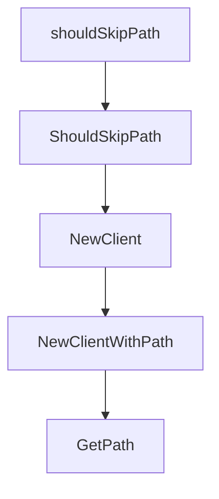

# Chapter 4: Parallel Agent Orchestration

Welcome to **Chapter 4: Parallel Agent Orchestration**. In this part of **HumanLayer Tutorial: Context Engineering and Human-Governed Coding Agents**, you will build an intuitive mental model first, then move into concrete implementation details and practical production tradeoffs.


Parallel agent sessions can improve throughput, but only when orchestration is explicit and controlled.

## Orchestration Rules

| Rule | Purpose |
|:-----|:--------|
| isolate task scopes | avoid cross-session collisions |
| keep shared context curated | reduce contradictory outputs |
| use structured handoff notes | preserve continuity |
| enforce review before merge | maintain quality |

## Summary

You now understand how to scale from single-agent workflows to coordinated parallel execution.

Next: [Chapter 5: Human Approval and High-Stakes Actions](05-human-approval-and-high-stakes-actions.md)

## Depth Expansion Playbook

## Source Code Walkthrough

### `claudecode-go/client.go`

The `shouldSkipPath` function in [`claudecode-go/client.go`](https://github.com/humanlayer/humanlayer/blob/HEAD/claudecode-go/client.go) handles a key part of this chapter's functionality:

```go
}

// shouldSkipPath checks if a path should be skipped during search
func shouldSkipPath(path string) bool {
	// Skip node_modules directories
	if strings.Contains(path, "/node_modules/") {
		return true
	}
	// Skip backup files
	if strings.HasSuffix(path, ".bak") {
		return true
	}
	return false
}

// ShouldSkipPath checks if a path should be skipped during search (exported version)
func ShouldSkipPath(path string) bool {
	return shouldSkipPath(path)
}

// NewClient creates a new Claude Code client
func NewClient() (*Client, error) {
	// First try standard PATH
	path, err := exec.LookPath("claude")
	if err == nil && !shouldSkipPath(path) {
		return &Client{claudePath: path}, nil
	}

	// Try common installation paths
	commonPaths := []string{
		filepath.Join(os.Getenv("HOME"), ".claude/local/claude"), // Add Claude's own directory
		filepath.Join(os.Getenv("HOME"), ".npm/bin/claude"),
```

This function is important because it defines how HumanLayer Tutorial: Context Engineering and Human-Governed Coding Agents implements the patterns covered in this chapter.

### `claudecode-go/client.go`

The `ShouldSkipPath` function in [`claudecode-go/client.go`](https://github.com/humanlayer/humanlayer/blob/HEAD/claudecode-go/client.go) handles a key part of this chapter's functionality:

```go
}

// ShouldSkipPath checks if a path should be skipped during search (exported version)
func ShouldSkipPath(path string) bool {
	return shouldSkipPath(path)
}

// NewClient creates a new Claude Code client
func NewClient() (*Client, error) {
	// First try standard PATH
	path, err := exec.LookPath("claude")
	if err == nil && !shouldSkipPath(path) {
		return &Client{claudePath: path}, nil
	}

	// Try common installation paths
	commonPaths := []string{
		filepath.Join(os.Getenv("HOME"), ".claude/local/claude"), // Add Claude's own directory
		filepath.Join(os.Getenv("HOME"), ".npm/bin/claude"),
		filepath.Join(os.Getenv("HOME"), ".bun/bin/claude"),
		filepath.Join(os.Getenv("HOME"), ".local/bin/claude"),
		"/usr/local/bin/claude",
		"/opt/homebrew/bin/claude",
	}

	for _, candidatePath := range commonPaths {
		if shouldSkipPath(candidatePath) {
			continue
		}
		if _, err := os.Stat(candidatePath); err == nil {
			// Verify it's executable
			if err := isExecutable(candidatePath); err == nil {
```

This function is important because it defines how HumanLayer Tutorial: Context Engineering and Human-Governed Coding Agents implements the patterns covered in this chapter.

### `claudecode-go/client.go`

The `NewClient` function in [`claudecode-go/client.go`](https://github.com/humanlayer/humanlayer/blob/HEAD/claudecode-go/client.go) handles a key part of this chapter's functionality:

```go
}

// NewClient creates a new Claude Code client
func NewClient() (*Client, error) {
	// First try standard PATH
	path, err := exec.LookPath("claude")
	if err == nil && !shouldSkipPath(path) {
		return &Client{claudePath: path}, nil
	}

	// Try common installation paths
	commonPaths := []string{
		filepath.Join(os.Getenv("HOME"), ".claude/local/claude"), // Add Claude's own directory
		filepath.Join(os.Getenv("HOME"), ".npm/bin/claude"),
		filepath.Join(os.Getenv("HOME"), ".bun/bin/claude"),
		filepath.Join(os.Getenv("HOME"), ".local/bin/claude"),
		"/usr/local/bin/claude",
		"/opt/homebrew/bin/claude",
	}

	for _, candidatePath := range commonPaths {
		if shouldSkipPath(candidatePath) {
			continue
		}
		if _, err := os.Stat(candidatePath); err == nil {
			// Verify it's executable
			if err := isExecutable(candidatePath); err == nil {
				return &Client{claudePath: candidatePath}, nil
			}
		}
	}

```

This function is important because it defines how HumanLayer Tutorial: Context Engineering and Human-Governed Coding Agents implements the patterns covered in this chapter.

### `claudecode-go/client.go`

The `NewClientWithPath` function in [`claudecode-go/client.go`](https://github.com/humanlayer/humanlayer/blob/HEAD/claudecode-go/client.go) handles a key part of this chapter's functionality:

```go
}

// NewClientWithPath creates a new client with a specific claude binary path
func NewClientWithPath(claudePath string) *Client {
	return &Client{
		claudePath: claudePath,
	}
}

// GetPath returns the path to the Claude binary
func (c *Client) GetPath() string {
	return c.claudePath
}

// GetVersion executes claude --version and returns the version string
func (c *Client) GetVersion() (string, error) {
	if c.claudePath == "" {
		return "", fmt.Errorf("claude path not set")
	}

	// Create command with timeout to prevent hanging
	ctx, cancel := context.WithTimeout(context.Background(), 5*time.Second)
	defer cancel()

	cmd := exec.CommandContext(ctx, c.claudePath, "--version")
	output, err := cmd.Output()
	if err != nil {
		// Check if it was a timeout
		if ctx.Err() == context.DeadlineExceeded {
			return "", fmt.Errorf("claude --version timed out after 5 seconds")
		}
		// Check for exit error to get more details
```

This function is important because it defines how HumanLayer Tutorial: Context Engineering and Human-Governed Coding Agents implements the patterns covered in this chapter.


## How These Components Connect


