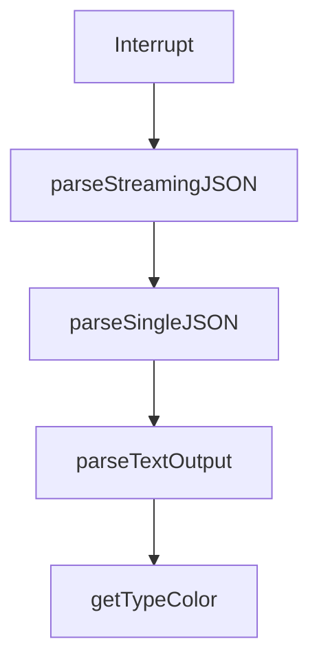

# Chapter 4: Parallel Agent Orchestration

Welcome to **Chapter 4: Parallel Agent Orchestration**. In this part of **HumanLayer Tutorial: Context Engineering and Human-Governed Coding Agents**, you will build an intuitive mental model first, then move into concrete implementation details and practical production tradeoffs.


Parallel agent sessions can improve throughput, but only when orchestration is explicit and controlled.

## Orchestration Rules

| Rule | Purpose |
|:-----|:--------|
| isolate task scopes | avoid cross-session collisions |
| keep shared context curated | reduce contradictory outputs |
| use structured handoff notes | preserve continuity |
| enforce review before merge | maintain quality |

## Summary

You now understand how to scale from single-agent workflows to coordinated parallel execution.

Next: [Chapter 5: Human Approval and High-Stakes Actions](05-human-approval-and-high-stakes-actions.md)

## Source Code Walkthrough

### `claudecode-go/client.go`

The `Interrupt` function in [`claudecode-go/client.go`](https://github.com/humanlayer/humanlayer/blob/HEAD/claudecode-go/client.go) handles a key part of this chapter's functionality:

```go
}

// Interrupt sends a SIGINT signal to the session process
func (s *Session) Interrupt() error {
	if s.cmd.Process != nil {
		return s.cmd.Process.Signal(syscall.SIGINT)
	}
	return nil
}

// parseStreamingJSON reads and parses streaming JSON output
func (s *Session) parseStreamingJSON(stdout, stderr io.Reader) {
	scanner := bufio.NewScanner(stdout)
	// Configure scanner to handle large JSON lines (up to 10MB)
	// This prevents buffer overflow when Claude returns large file contents
	scanner.Buffer(make([]byte, 0), 10*1024*1024) // 10MB max line size
	var stderrBuf strings.Builder
	stderrDone := make(chan struct{})

	// Capture stderr in background
	go func() {
		defer close(stderrDone)
		buf := make([]byte, 1024)
		for {
			n, err := stderr.Read(buf)
			if err != nil {
				break
			}
			stderrBuf.Write(buf[:n])
		}
	}()

```

This function is important because it defines how HumanLayer Tutorial: Context Engineering and Human-Governed Coding Agents implements the patterns covered in this chapter.

### `claudecode-go/client.go`

The `parseStreamingJSON` function in [`claudecode-go/client.go`](https://github.com/humanlayer/humanlayer/blob/HEAD/claudecode-go/client.go) handles a key part of this chapter's functionality:

```go
		// Start goroutine to parse streaming JSON
		go func() {
			session.parseStreamingJSON(stdout, stderr)
			close(parseDone)
		}()
	case OutputJSON:
		// Start goroutine to parse single JSON result
		go func() {
			session.parseSingleJSON(stdout, stderr)
			close(parseDone)
		}()
	default:
		// Text output - just capture the result
		go func() {
			session.parseTextOutput(stdout, stderr)
			close(parseDone)
		}()
	}

	// Wait for process to complete in background
	go func() {
		// Wait for the command to exit
		session.SetError(cmd.Wait())

		// IMPORTANT: Wait for parsing to complete before signaling done.
		// This ensures that all output has been read and processed before
		// the session is considered complete. Without this synchronization,
		// Wait() might return before the result is available.
		<-parseDone

		close(session.done)
	}()
```

This function is important because it defines how HumanLayer Tutorial: Context Engineering and Human-Governed Coding Agents implements the patterns covered in this chapter.

### `claudecode-go/client.go`

The `parseSingleJSON` function in [`claudecode-go/client.go`](https://github.com/humanlayer/humanlayer/blob/HEAD/claudecode-go/client.go) handles a key part of this chapter's functionality:

```go
		// Start goroutine to parse single JSON result
		go func() {
			session.parseSingleJSON(stdout, stderr)
			close(parseDone)
		}()
	default:
		// Text output - just capture the result
		go func() {
			session.parseTextOutput(stdout, stderr)
			close(parseDone)
		}()
	}

	// Wait for process to complete in background
	go func() {
		// Wait for the command to exit
		session.SetError(cmd.Wait())

		// IMPORTANT: Wait for parsing to complete before signaling done.
		// This ensures that all output has been read and processed before
		// the session is considered complete. Without this synchronization,
		// Wait() might return before the result is available.
		<-parseDone

		close(session.done)
	}()

	return session, nil
}

// LaunchAndWait starts a Claude session and waits for it to complete
func (c *Client) LaunchAndWait(config SessionConfig) (*Result, error) {
```

This function is important because it defines how HumanLayer Tutorial: Context Engineering and Human-Governed Coding Agents implements the patterns covered in this chapter.

### `claudecode-go/client.go`

The `parseTextOutput` function in [`claudecode-go/client.go`](https://github.com/humanlayer/humanlayer/blob/HEAD/claudecode-go/client.go) handles a key part of this chapter's functionality:

```go
		// Text output - just capture the result
		go func() {
			session.parseTextOutput(stdout, stderr)
			close(parseDone)
		}()
	}

	// Wait for process to complete in background
	go func() {
		// Wait for the command to exit
		session.SetError(cmd.Wait())

		// IMPORTANT: Wait for parsing to complete before signaling done.
		// This ensures that all output has been read and processed before
		// the session is considered complete. Without this synchronization,
		// Wait() might return before the result is available.
		<-parseDone

		close(session.done)
	}()

	return session, nil
}

// LaunchAndWait starts a Claude session and waits for it to complete
func (c *Client) LaunchAndWait(config SessionConfig) (*Result, error) {
	session, err := c.Launch(config)
	if err != nil {
		return nil, err
	}

	return session.Wait()
```

This function is important because it defines how HumanLayer Tutorial: Context Engineering and Human-Governed Coding Agents implements the patterns covered in this chapter.


## How These Components Connect


