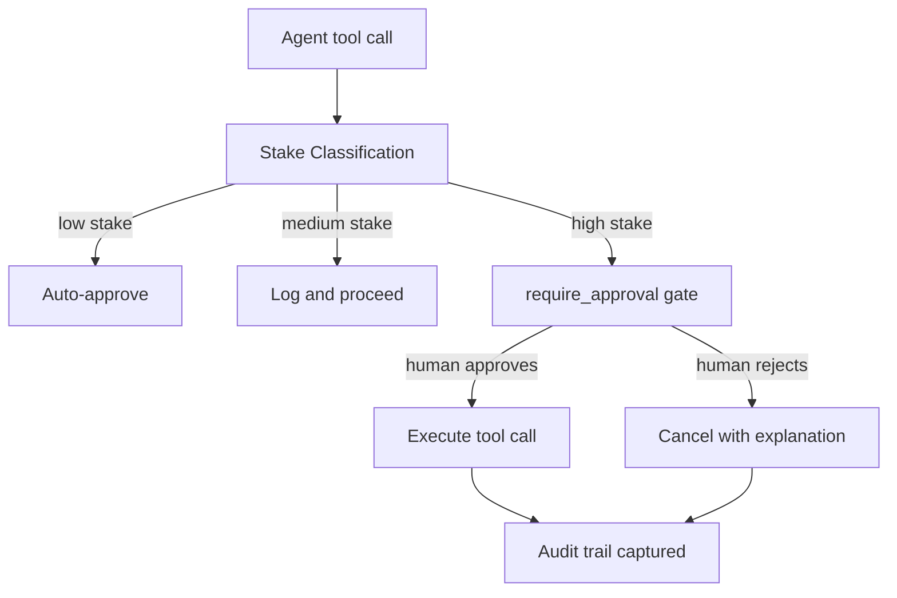

# Chapter 5: Human Approval and High-Stakes Actions

Welcome to **Chapter 5: Human Approval and High-Stakes Actions**. In this part of **HumanLayer Tutorial: Context Engineering and Human-Governed Coding Agents**, you will build an intuitive mental model first, then move into concrete implementation details and practical production tradeoffs.

High-stakes operations require deterministic human oversight, not best-effort prompts.

## Stake Model

| Stake Level | Example |
|:------------|:--------|
| low | public data reads |
| medium | private read access |
| high | write actions and external communication |

## Governance Pattern

- classify tool calls by stake level
- require approval for all high-stakes actions
- capture decision audit trails for compliance

## Source References

- [humanlayer.md](https://github.com/humanlayer/humanlayer/blob/main/humanlayer.md)

## Summary

You now have a practical approval framework for risky coding-agent operations.

Next: [Chapter 6: IDE and CLI Integration Patterns](06-ide-and-cli-integration-patterns.md)

## Source Code Walkthrough

### `humanlayer.md`

The [`humanlayer.md`](https://github.com/humanlayer/humanlayer/blob/main/humanlayer.md) document defines the human approval API surface — `require_approval`, `HumanLayer`, and the tool-call classification patterns used to gate high-stakes actions. This is the primary source for the stake-level model and governance pattern described in this chapter.

### `claudecode-go/client.go`

The [`claudecode-go/client.go`](https://github.com/humanlayer/humanlayer/blob/HEAD/claudecode-go/client.go) file shows how the Go client integrates with the Claude Code subprocess and how tool-call events are intercepted before execution. The approval gate logic wraps tool calls based on their stake classification — the low/medium/high model this chapter documents.

## How These Components Connect

