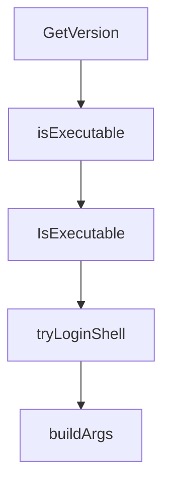

# Chapter 5: Human Approval and High-Stakes Actions

Welcome to **Chapter 5: Human Approval and High-Stakes Actions**. In this part of **HumanLayer Tutorial: Context Engineering and Human-Governed Coding Agents**, you will build an intuitive mental model first, then move into concrete implementation details and practical production tradeoffs.


High-stakes operations require deterministic human oversight, not best-effort prompts.

## Stake Model

| Stake Level | Example |
|:------------|:--------|
| low | public data reads |
| medium | private read access |
| high | write actions and external communication |

## Governance Pattern

- classify tool calls by stake level
- require approval for all high-stakes actions
- capture decision audit trails for compliance

## Source References

- [humanlayer.md](https://github.com/humanlayer/humanlayer/blob/main/humanlayer.md)

## Summary

You now have a practical approval framework for risky coding-agent operations.

Next: [Chapter 6: IDE and CLI Integration Patterns](06-ide-and-cli-integration-patterns.md)

## Depth Expansion Playbook

## Source Code Walkthrough

### `claudecode-go/client.go`

The `GetVersion` function in [`claudecode-go/client.go`](https://github.com/humanlayer/humanlayer/blob/HEAD/claudecode-go/client.go) handles a key part of this chapter's functionality:

```go
}

// GetVersion executes claude --version and returns the version string
func (c *Client) GetVersion() (string, error) {
	if c.claudePath == "" {
		return "", fmt.Errorf("claude path not set")
	}

	// Create command with timeout to prevent hanging
	ctx, cancel := context.WithTimeout(context.Background(), 5*time.Second)
	defer cancel()

	cmd := exec.CommandContext(ctx, c.claudePath, "--version")
	output, err := cmd.Output()
	if err != nil {
		// Check if it was a timeout
		if ctx.Err() == context.DeadlineExceeded {
			return "", fmt.Errorf("claude --version timed out after 5 seconds")
		}
		// Check for exit error to get more details
		if exitErr, ok := err.(*exec.ExitError); ok {
			return "", fmt.Errorf("claude --version failed with exit code %d: %s", exitErr.ExitCode(), string(exitErr.Stderr))
		}
		return "", fmt.Errorf("failed to execute claude --version: %w", err)
	}

	// Trim whitespace and return
	version := strings.TrimSpace(string(output))
	if version == "" {
		return "", fmt.Errorf("claude --version returned empty output")
	}

```

This function is important because it defines how HumanLayer Tutorial: Context Engineering and Human-Governed Coding Agents implements the patterns covered in this chapter.

### `claudecode-go/client.go`

The `isExecutable` function in [`claudecode-go/client.go`](https://github.com/humanlayer/humanlayer/blob/HEAD/claudecode-go/client.go) handles a key part of this chapter's functionality:

```go
		if _, err := os.Stat(candidatePath); err == nil {
			// Verify it's executable
			if err := isExecutable(candidatePath); err == nil {
				return &Client{claudePath: candidatePath}, nil
			}
		}
	}

	// Try login shell as last resort
	if shellPath := tryLoginShell(); shellPath != "" {
		return &Client{claudePath: shellPath}, nil
	}

	return nil, fmt.Errorf("claude binary not found in PATH or common locations")
}

// NewClientWithPath creates a new client with a specific claude binary path
func NewClientWithPath(claudePath string) *Client {
	return &Client{
		claudePath: claudePath,
	}
}

// GetPath returns the path to the Claude binary
func (c *Client) GetPath() string {
	return c.claudePath
}

// GetVersion executes claude --version and returns the version string
func (c *Client) GetVersion() (string, error) {
	if c.claudePath == "" {
		return "", fmt.Errorf("claude path not set")
```

This function is important because it defines how HumanLayer Tutorial: Context Engineering and Human-Governed Coding Agents implements the patterns covered in this chapter.

### `claudecode-go/client.go`

The `IsExecutable` function in [`claudecode-go/client.go`](https://github.com/humanlayer/humanlayer/blob/HEAD/claudecode-go/client.go) handles a key part of this chapter's functionality:

```go
}

// IsExecutable checks if file is executable (exported version)
func IsExecutable(path string) error {
	return isExecutable(path)
}

// tryLoginShell attempts to find claude using a login shell
func tryLoginShell() string {
	shells := []string{"zsh", "bash"}
	for _, shell := range shells {
		cmd := exec.Command(shell, "-lc", "which claude")
		out, err := cmd.Output()
		if err == nil {
			path := strings.TrimSpace(string(out))
			if path != "" && path != "claude not found" && !shouldSkipPath(path) {
				return path
			}
		}
	}
	return ""
}

// buildArgs converts SessionConfig into command line arguments
func (c *Client) buildArgs(config SessionConfig) ([]string, error) {
	args := []string{}

	// Session management
	if config.SessionID != "" {
		args = append(args, "--resume", config.SessionID)

		// Add fork flag if specified
```

This function is important because it defines how HumanLayer Tutorial: Context Engineering and Human-Governed Coding Agents implements the patterns covered in this chapter.

### `claudecode-go/client.go`

The `tryLoginShell` function in [`claudecode-go/client.go`](https://github.com/humanlayer/humanlayer/blob/HEAD/claudecode-go/client.go) handles a key part of this chapter's functionality:

```go

	// Try login shell as last resort
	if shellPath := tryLoginShell(); shellPath != "" {
		return &Client{claudePath: shellPath}, nil
	}

	return nil, fmt.Errorf("claude binary not found in PATH or common locations")
}

// NewClientWithPath creates a new client with a specific claude binary path
func NewClientWithPath(claudePath string) *Client {
	return &Client{
		claudePath: claudePath,
	}
}

// GetPath returns the path to the Claude binary
func (c *Client) GetPath() string {
	return c.claudePath
}

// GetVersion executes claude --version and returns the version string
func (c *Client) GetVersion() (string, error) {
	if c.claudePath == "" {
		return "", fmt.Errorf("claude path not set")
	}

	// Create command with timeout to prevent hanging
	ctx, cancel := context.WithTimeout(context.Background(), 5*time.Second)
	defer cancel()

	cmd := exec.CommandContext(ctx, c.claudePath, "--version")
```

This function is important because it defines how HumanLayer Tutorial: Context Engineering and Human-Governed Coding Agents implements the patterns covered in this chapter.


## How These Components Connect


