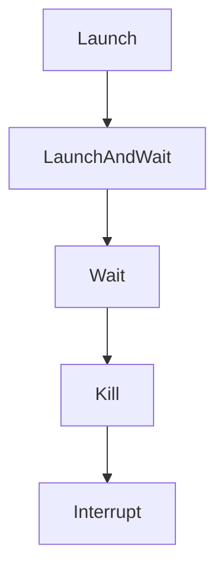

# Chapter 6: IDE and CLI Integration Patterns

Welcome to **Chapter 6: IDE and CLI Integration Patterns**. In this part of **HumanLayer Tutorial: Context Engineering and Human-Governed Coding Agents**, you will build an intuitive mental model first, then move into concrete implementation details and practical production tradeoffs.


HumanLayer-style workflows are most effective when integrated directly into developer loops.

## Integration Checklist

- standardize local workflow commands
- define context templates for common task classes
- ensure PR review handoff artifacts are consistent

## Summary

You now have baseline patterns to embed HumanLayer workflows into daily IDE and terminal practice.

Next: [Chapter 7: Telemetry, Cost, and Team Governance](07-telemetry-cost-and-team-governance.md)

## Depth Expansion Playbook

## Source Code Walkthrough

### `claudecode-go/client.go`

The `Launch` function in [`claudecode-go/client.go`](https://github.com/humanlayer/humanlayer/blob/HEAD/claudecode-go/client.go) handles a key part of this chapter's functionality:

```go
}

// Launch starts a new Claude session and returns immediately
func (c *Client) Launch(config SessionConfig) (*Session, error) {
	args, err := c.buildArgs(config)
	if err != nil {
		return nil, err
	}

	log.Printf("Executing Claude command: %s %v", c.claudePath, args)
	cmd := exec.Command(c.claudePath, args...)

	// Set environment variables if specified
	if len(config.Env) > 0 {
		cmd.Env = os.Environ() // Start with current environment
		for key, value := range config.Env {
			cmd.Env = append(cmd.Env, fmt.Sprintf("%s=%s", key, value))
		}
	}

	// Set working directory if specified
	if config.WorkingDir != "" {
		workingDir := config.WorkingDir

		// Expand tilde to user home directory
		if strings.HasPrefix(workingDir, "~/") {
			if home, err := os.UserHomeDir(); err == nil {
				workingDir = filepath.Join(home, workingDir[2:])
			}
		} else if workingDir == "~" {
			if home, err := os.UserHomeDir(); err == nil {
				workingDir = home
```

This function is important because it defines how HumanLayer Tutorial: Context Engineering and Human-Governed Coding Agents implements the patterns covered in this chapter.

### `claudecode-go/client.go`

The `LaunchAndWait` function in [`claudecode-go/client.go`](https://github.com/humanlayer/humanlayer/blob/HEAD/claudecode-go/client.go) handles a key part of this chapter's functionality:

```go
}

// LaunchAndWait starts a Claude session and waits for it to complete
func (c *Client) LaunchAndWait(config SessionConfig) (*Result, error) {
	session, err := c.Launch(config)
	if err != nil {
		return nil, err
	}

	return session.Wait()
}

// Wait blocks until the session completes and returns the result
// TODO: Add context support to allow cancellation/timeout. This would help prevent
// indefinite blocking when waiting for interrupted sessions or hanging processes.
// Consider adding WaitContext(ctx context.Context) method or updating Wait() signature.
func (s *Session) Wait() (*Result, error) {
	<-s.done

	if err := s.Error(); err != nil && s.result == nil {
		return nil, fmt.Errorf("claude process failed: %w", err)
	}

	return s.result, nil
}

// Kill terminates the session
func (s *Session) Kill() error {
	if s.cmd.Process != nil {
		return s.cmd.Process.Kill()
	}
	return nil
```

This function is important because it defines how HumanLayer Tutorial: Context Engineering and Human-Governed Coding Agents implements the patterns covered in this chapter.

### `claudecode-go/client.go`

The `Wait` function in [`claudecode-go/client.go`](https://github.com/humanlayer/humanlayer/blob/HEAD/claudecode-go/client.go) handles a key part of this chapter's functionality:

```go
	}

	// Wait for process to complete in background
	go func() {
		// Wait for the command to exit
		session.SetError(cmd.Wait())

		// IMPORTANT: Wait for parsing to complete before signaling done.
		// This ensures that all output has been read and processed before
		// the session is considered complete. Without this synchronization,
		// Wait() might return before the result is available.
		<-parseDone

		close(session.done)
	}()

	return session, nil
}

// LaunchAndWait starts a Claude session and waits for it to complete
func (c *Client) LaunchAndWait(config SessionConfig) (*Result, error) {
	session, err := c.Launch(config)
	if err != nil {
		return nil, err
	}

	return session.Wait()
}

// Wait blocks until the session completes and returns the result
// TODO: Add context support to allow cancellation/timeout. This would help prevent
// indefinite blocking when waiting for interrupted sessions or hanging processes.
```

This function is important because it defines how HumanLayer Tutorial: Context Engineering and Human-Governed Coding Agents implements the patterns covered in this chapter.

### `claudecode-go/client.go`

The `Kill` function in [`claudecode-go/client.go`](https://github.com/humanlayer/humanlayer/blob/HEAD/claudecode-go/client.go) handles a key part of this chapter's functionality:

```go
}

// Kill terminates the session
func (s *Session) Kill() error {
	if s.cmd.Process != nil {
		return s.cmd.Process.Kill()
	}
	return nil
}

// Interrupt sends a SIGINT signal to the session process
func (s *Session) Interrupt() error {
	if s.cmd.Process != nil {
		return s.cmd.Process.Signal(syscall.SIGINT)
	}
	return nil
}

// parseStreamingJSON reads and parses streaming JSON output
func (s *Session) parseStreamingJSON(stdout, stderr io.Reader) {
	scanner := bufio.NewScanner(stdout)
	// Configure scanner to handle large JSON lines (up to 10MB)
	// This prevents buffer overflow when Claude returns large file contents
	scanner.Buffer(make([]byte, 0), 10*1024*1024) // 10MB max line size
	var stderrBuf strings.Builder
	stderrDone := make(chan struct{})

	// Capture stderr in background
	go func() {
		defer close(stderrDone)
		buf := make([]byte, 1024)
		for {
```

This function is important because it defines how HumanLayer Tutorial: Context Engineering and Human-Governed Coding Agents implements the patterns covered in this chapter.


## How These Components Connect


