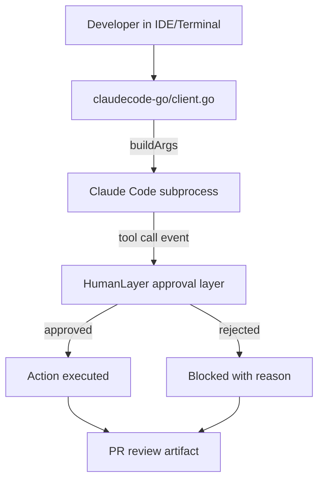

# Chapter 6: IDE and CLI Integration Patterns

Welcome to **Chapter 6: IDE and CLI Integration Patterns**. In this part of **HumanLayer Tutorial: Context Engineering and Human-Governed Coding Agents**, you will build an intuitive mental model first, then move into concrete implementation details and practical production tradeoffs.

HumanLayer-style workflows are most effective when integrated directly into developer loops.

## Integration Checklist

- standardize local workflow commands
- define context templates for common task classes
- ensure PR review handoff artifacts are consistent

## Summary

You now have baseline patterns to embed HumanLayer workflows into daily IDE and terminal practice.

Next: [Chapter 7: Telemetry, Cost, and Team Governance](07-telemetry-cost-and-team-governance.md)

## Source Code Walkthrough

### `claudecode-go/client.go`

The [`claudecode-go/client.go`](https://github.com/humanlayer/humanlayer/blob/HEAD/claudecode-go/client.go) file implements the core Claude Code subprocess client. The `buildArgs` and `GetPath` functions define how the CLI arguments and project path are configured when launching coding agents from a terminal or IDE integration — directly relevant to the IDE and CLI workflow patterns this chapter covers.

### `humanlayer.md`

The [`humanlayer.md`](https://github.com/humanlayer/humanlayer/blob/main/humanlayer.md) document describes the SDK integration patterns that teams embed in their IDE and CLI workflows. It covers how to configure HumanLayer as a wrapper around coding-agent tool calls, enabling the standardized workflow commands and context templates described in this chapter.

## How These Components Connect

