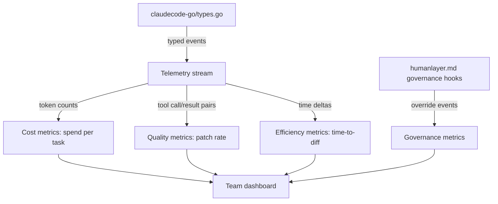

# Chapter 7: Telemetry, Cost, and Team Governance

Welcome to **Chapter 7: Telemetry, Cost, and Team Governance**. In this part of **HumanLayer Tutorial: Context Engineering and Human-Governed Coding Agents**, you will build an intuitive mental model first, then move into concrete implementation details and practical production tradeoffs.

Team-scale coding-agent programs need quality, cost, and governance telemetry to remain effective.

## Key Metrics

| Area | Metrics |
|:-----|:--------|
| quality | accepted patch rate, regression rate |
| efficiency | time-to-first-useful-diff |
| cost | token spend per completed task |
| governance | policy violations, manual overrides |

## Summary

You now have a metric framework for sustainable team operations.

Next: [Chapter 8: Production Rollout and Adoption](08-production-rollout-and-adoption.md)

## Source Code Walkthrough

### `claudecode-go/types.go`

The [`claudecode-go/types.go`](https://github.com/humanlayer/humanlayer/blob/HEAD/claudecode-go/types.go) file defines the structured event types emitted by the Claude Code subprocess — tool calls, results, usage metrics, and agent outputs. These typed events are the raw telemetry stream from which the quality and cost metrics described in this chapter (accepted patch rate, token spend per task) are derived.

### `humanlayer.md`

The [`humanlayer.md`](https://github.com/humanlayer/humanlayer/blob/main/humanlayer.md) SDK reference documents the governance hooks — policy violation callbacks, manual override logging, and audit trail capture — that feed the governance metrics (policy violations, manual overrides) in the metrics table of this chapter.

## How These Components Connect

