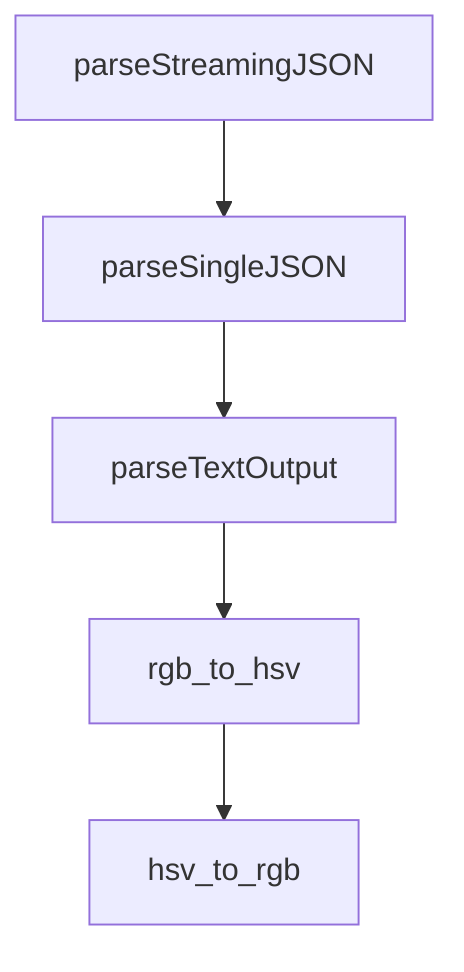

# Chapter 7: Telemetry, Cost, and Team Governance

Welcome to **Chapter 7: Telemetry, Cost, and Team Governance**. In this part of **HumanLayer Tutorial: Context Engineering and Human-Governed Coding Agents**, you will build an intuitive mental model first, then move into concrete implementation details and practical production tradeoffs.


Team-scale coding-agent programs need quality, cost, and governance telemetry to remain effective.

## Key Metrics

| Area | Metrics |
|:-----|:--------|
| quality | accepted patch rate, regression rate |
| efficiency | time-to-first-useful-diff |
| cost | token spend per completed task |
| governance | policy violations, manual overrides |

## Summary

You now have a metric framework for sustainable team operations.

Next: [Chapter 8: Production Rollout and Adoption](08-production-rollout-and-adoption.md)

## Depth Expansion Playbook

## Source Code Walkthrough

### `claudecode-go/client.go`

The `parseStreamingJSON` function in [`claudecode-go/client.go`](https://github.com/humanlayer/humanlayer/blob/HEAD/claudecode-go/client.go) handles a key part of this chapter's functionality:

```go
		// Start goroutine to parse streaming JSON
		go func() {
			session.parseStreamingJSON(stdout, stderr)
			close(parseDone)
		}()
	case OutputJSON:
		// Start goroutine to parse single JSON result
		go func() {
			session.parseSingleJSON(stdout, stderr)
			close(parseDone)
		}()
	default:
		// Text output - just capture the result
		go func() {
			session.parseTextOutput(stdout, stderr)
			close(parseDone)
		}()
	}

	// Wait for process to complete in background
	go func() {
		// Wait for the command to exit
		session.SetError(cmd.Wait())

		// IMPORTANT: Wait for parsing to complete before signaling done.
		// This ensures that all output has been read and processed before
		// the session is considered complete. Without this synchronization,
		// Wait() might return before the result is available.
		<-parseDone

		close(session.done)
	}()
```

This function is important because it defines how HumanLayer Tutorial: Context Engineering and Human-Governed Coding Agents implements the patterns covered in this chapter.

### `claudecode-go/client.go`

The `parseSingleJSON` function in [`claudecode-go/client.go`](https://github.com/humanlayer/humanlayer/blob/HEAD/claudecode-go/client.go) handles a key part of this chapter's functionality:

```go
		// Start goroutine to parse single JSON result
		go func() {
			session.parseSingleJSON(stdout, stderr)
			close(parseDone)
		}()
	default:
		// Text output - just capture the result
		go func() {
			session.parseTextOutput(stdout, stderr)
			close(parseDone)
		}()
	}

	// Wait for process to complete in background
	go func() {
		// Wait for the command to exit
		session.SetError(cmd.Wait())

		// IMPORTANT: Wait for parsing to complete before signaling done.
		// This ensures that all output has been read and processed before
		// the session is considered complete. Without this synchronization,
		// Wait() might return before the result is available.
		<-parseDone

		close(session.done)
	}()

	return session, nil
}

// LaunchAndWait starts a Claude session and waits for it to complete
func (c *Client) LaunchAndWait(config SessionConfig) (*Result, error) {
```

This function is important because it defines how HumanLayer Tutorial: Context Engineering and Human-Governed Coding Agents implements the patterns covered in this chapter.

### `claudecode-go/client.go`

The `parseTextOutput` function in [`claudecode-go/client.go`](https://github.com/humanlayer/humanlayer/blob/HEAD/claudecode-go/client.go) handles a key part of this chapter's functionality:

```go
		// Text output - just capture the result
		go func() {
			session.parseTextOutput(stdout, stderr)
			close(parseDone)
		}()
	}

	// Wait for process to complete in background
	go func() {
		// Wait for the command to exit
		session.SetError(cmd.Wait())

		// IMPORTANT: Wait for parsing to complete before signaling done.
		// This ensures that all output has been read and processed before
		// the session is considered complete. Without this synchronization,
		// Wait() might return before the result is available.
		<-parseDone

		close(session.done)
	}()

	return session, nil
}

// LaunchAndWait starts a Claude session and waits for it to complete
func (c *Client) LaunchAndWait(config SessionConfig) (*Result, error) {
	session, err := c.Launch(config)
	if err != nil {
		return nil, err
	}

	return session.Wait()
```

This function is important because it defines how HumanLayer Tutorial: Context Engineering and Human-Governed Coding Agents implements the patterns covered in this chapter.

### `hack/rotate_icon_colors.py`

The `rgb_to_hsv` function in [`hack/rotate_icon_colors.py`](https://github.com/humanlayer/humanlayer/blob/HEAD/hack/rotate_icon_colors.py) handles a key part of this chapter's functionality:

```py
import numpy as np

def rgb_to_hsv(rgb):
    """Convert RGB to HSV using numpy for speed"""
    rgb = rgb.astype('float32') / 255.0
    maxc = np.max(rgb, axis=2)
    minc = np.min(rgb, axis=2)
    v = maxc
    
    deltac = maxc - minc
    s = np.where(maxc != 0, deltac / maxc, 0)
    
    # Hue calculation
    rc = np.where(deltac != 0, (maxc - rgb[:,:,0]) / deltac, 0)
    gc = np.where(deltac != 0, (maxc - rgb[:,:,1]) / deltac, 0)
    bc = np.where(deltac != 0, (maxc - rgb[:,:,2]) / deltac, 0)
    
    h = np.zeros_like(maxc)
    h = np.where((rgb[:,:,0] == maxc) & (deltac != 0), bc - gc, h)
    h = np.where((rgb[:,:,1] == maxc) & (deltac != 0), 2.0 + rc - bc, h)
    h = np.where((rgb[:,:,2] == maxc) & (deltac != 0), 4.0 + gc - rc, h)
    h = (h / 6.0) % 1.0
    
    return np.stack([h, s, v], axis=2)

def hsv_to_rgb(hsv):
    """Convert HSV back to RGB"""
    h, s, v = hsv[:,:,0], hsv[:,:,1], hsv[:,:,2]
    
    i = np.floor(h * 6.0).astype(int)
    f = h * 6.0 - i
    p = v * (1.0 - s)
```

This function is important because it defines how HumanLayer Tutorial: Context Engineering and Human-Governed Coding Agents implements the patterns covered in this chapter.


## How These Components Connect


