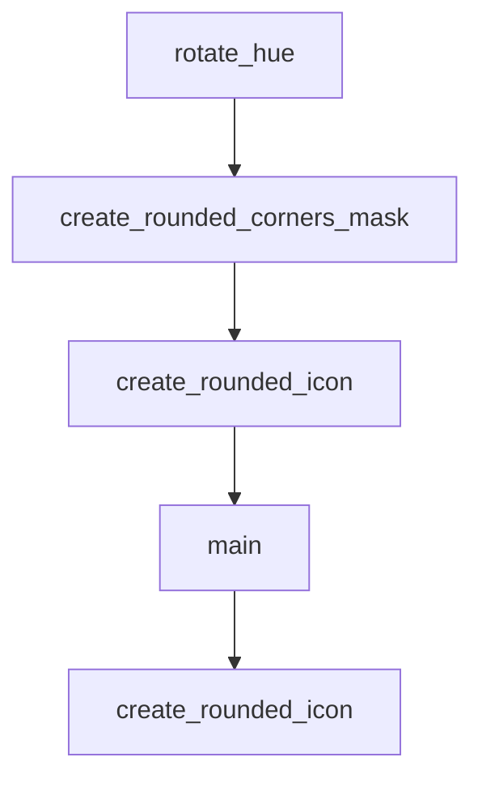

# Chapter 8: Production Rollout and Adoption

Welcome to **Chapter 8: Production Rollout and Adoption**. In this part of **HumanLayer Tutorial: Context Engineering and Human-Governed Coding Agents**, you will build an intuitive mental model first, then move into concrete implementation details and practical production tradeoffs.


This chapter outlines a rollout model for adopting HumanLayer workflows across teams.

## Rollout Phases

1. pilot with strict guardrails
2. expand to high-leverage teams
3. standardize policies and templates
4. operationalize review and incident playbooks

## Adoption Risks

- over-automation without policy gates
- context quality drift across teams
- cost escalation without telemetry controls

## Summary

You now have a phased adoption strategy for scaling coding-agent workflows with human governance.

## Depth Expansion Playbook

## Source Code Walkthrough

### `hack/rotate_icon_colors.py`

The `rotate_hue` function in [`hack/rotate_icon_colors.py`](https://github.com/humanlayer/humanlayer/blob/HEAD/hack/rotate_icon_colors.py) handles a key part of this chapter's functionality:

```py
    return (rgb * 255).astype('uint8')

def rotate_hue(image_path, output_path, hue_shift=0.3):
    """Rotate hue of an image by specified amount (0.3 = 108 degrees)"""
    img = Image.open(image_path).convert('RGBA')
    rgb = np.array(img)
    
    # Separate alpha channel
    alpha = rgb[:,:,3]
    rgb_only = rgb[:,:,:3]
    
    # Convert to HSV, rotate hue, convert back
    hsv = rgb_to_hsv(rgb_only)
    hsv[:,:,0] = (hsv[:,:,0] + hue_shift) % 1.0
    rgb_rotated = hsv_to_rgb(hsv)
    
    # Recombine with alpha
    result = np.dstack([rgb_rotated, alpha])
    
    Image.fromarray(result, 'RGBA').save(output_path)

if __name__ == "__main__":
    if len(sys.argv) != 3:
        print("Usage: python rotate_icon_colors.py input.png output.png")
        sys.exit(1)
    
    rotate_hue(sys.argv[1], sys.argv[2], hue_shift=0.3)
```

This function is important because it defines how HumanLayer Tutorial: Context Engineering and Human-Governed Coding Agents implements the patterns covered in this chapter.

### `hack/generate_rounded_icons.py`

The `create_rounded_corners_mask` function in [`hack/generate_rounded_icons.py`](https://github.com/humanlayer/humanlayer/blob/HEAD/hack/generate_rounded_icons.py) handles a key part of this chapter's functionality:

```py


def create_rounded_corners_mask(size, radius):
    """Create a mask for rounded corners"""
    mask = Image.new("L", (size, size), 0)
    draw = ImageDraw.Draw(mask)

    # Draw a rounded rectangle
    draw.rounded_rectangle([(0, 0), (size - 1, size - 1)], radius=radius, fill=255)

    return mask


def create_rounded_icon(source_path, output_path, size):
    """Create a rounded corner icon at the specified size"""
    # Open and resize the source image
    img = Image.open(source_path)
    img = img.convert("RGBA")
    img = img.resize((size, size), Image.Resampling.LANCZOS)

    # Create a rounded corners mask
    radius = size // 5  # 20% corner radius
    mask = create_rounded_corners_mask(size, radius)

    # Create output image with transparent background
    output = Image.new("RGBA", (size, size), (0, 0, 0, 0))
    output.paste(img, (0, 0))

    # Apply the mask to the alpha channel
    output.putalpha(mask)

    # Save the result
```

This function is important because it defines how HumanLayer Tutorial: Context Engineering and Human-Governed Coding Agents implements the patterns covered in this chapter.

### `hack/generate_rounded_icons.py`

The `create_rounded_icon` function in [`hack/generate_rounded_icons.py`](https://github.com/humanlayer/humanlayer/blob/HEAD/hack/generate_rounded_icons.py) handles a key part of this chapter's functionality:

```py


def create_rounded_icon(source_path, output_path, size):
    """Create a rounded corner icon at the specified size"""
    # Open and resize the source image
    img = Image.open(source_path)
    img = img.convert("RGBA")
    img = img.resize((size, size), Image.Resampling.LANCZOS)

    # Create a rounded corners mask
    radius = size // 5  # 20% corner radius
    mask = create_rounded_corners_mask(size, radius)

    # Create output image with transparent background
    output = Image.new("RGBA", (size, size), (0, 0, 0, 0))
    output.paste(img, (0, 0))

    # Apply the mask to the alpha channel
    output.putalpha(mask)

    # Save the result
    output.save(output_path, "PNG")
    print(f"Created: {output_path} ({size}x{size})")


def main():
    print("Generating rounded corner icons...")

    # Ensure icon directory exists
    os.makedirs(ICON_DIR, exist_ok=True)

    # Generate main icons
```

This function is important because it defines how HumanLayer Tutorial: Context Engineering and Human-Governed Coding Agents implements the patterns covered in this chapter.

### `hack/generate_rounded_icons.py`

The `main` function in [`hack/generate_rounded_icons.py`](https://github.com/humanlayer/humanlayer/blob/HEAD/hack/generate_rounded_icons.py) handles a key part of this chapter's functionality:

```py


def main():
    print("Generating rounded corner icons...")

    # Ensure icon directory exists
    os.makedirs(ICON_DIR, exist_ok=True)

    # Generate main icons
    create_rounded_icon(SOURCE_ICON, f"{ICON_DIR}/icon.png", 512)
    create_rounded_icon(SOURCE_ICON, f"{ICON_DIR}/32x32.png", 32)
    create_rounded_icon(SOURCE_ICON, f"{ICON_DIR}/128x128.png", 128)
    create_rounded_icon(SOURCE_ICON, f"{ICON_DIR}/128x128@2x.png", 256)

    # Generate Windows Store icons
    for size in [30, 44, 71, 89, 107, 142, 150, 284, 310]:
        create_rounded_icon(SOURCE_ICON, f"{ICON_DIR}/Square{size}x{size}Logo.png", size)

    create_rounded_icon(SOURCE_ICON, f"{ICON_DIR}/StoreLogo.png", 50)

    # Generate iconset for macOS
    print("\nCreating macOS iconset...")
    iconset_dir = "/tmp/icon.iconset"
    os.makedirs(iconset_dir, exist_ok=True)

    # Standard macOS icon sizes
    icon_sizes = [
        (16, "icon_16x16.png"),
        (32, "icon_16x16@2x.png"),
        (32, "icon_32x32.png"),
        (64, "icon_32x32@2x.png"),
        (128, "icon_128x128.png"),
```

This function is important because it defines how HumanLayer Tutorial: Context Engineering and Human-Governed Coding Agents implements the patterns covered in this chapter.


## How These Components Connect


