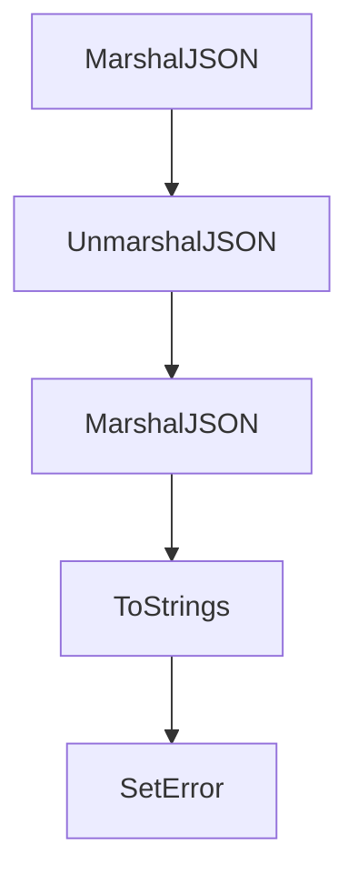

# Chapter 8: Production Rollout and Adoption

Welcome to **Chapter 8: Production Rollout and Adoption**. In this part of **HumanLayer Tutorial: Context Engineering and Human-Governed Coding Agents**, you will build an intuitive mental model first, then move into concrete implementation details and practical production tradeoffs.


This chapter outlines a rollout model for adopting HumanLayer workflows across teams.

## Rollout Phases

1. pilot with strict guardrails
2. expand to high-leverage teams
3. standardize policies and templates
4. operationalize review and incident playbooks

## Adoption Risks

- over-automation without policy gates
- context quality drift across teams
- cost escalation without telemetry controls

## Summary

You now have a phased adoption strategy for scaling coding-agent workflows with human governance.

## Source Code Walkthrough

### `claudecode-go/types.go`

The `MarshalJSON` function in [`claudecode-go/types.go`](https://github.com/humanlayer/humanlayer/blob/HEAD/claudecode-go/types.go) handles a key part of this chapter's functionality:

```go
}

// MarshalJSON implements custom marshaling to always output as string
func (c ContentField) MarshalJSON() ([]byte, error) {
	return json.Marshal(c.Value)
}

// Content can be text or tool use
type Content struct {
	Type      string                 `json:"type"`
	Text      string                 `json:"text,omitempty"`
	Thinking  string                 `json:"thinking,omitempty"`
	ID        string                 `json:"id,omitempty"`
	Name      string                 `json:"name,omitempty"`
	Input     map[string]interface{} `json:"input,omitempty"`
	ToolUseID string                 `json:"tool_use_id,omitempty"`
	Content   ContentField           `json:"content,omitempty"`
}

// ServerToolUse tracks server-side tool usage
type ServerToolUse struct {
	WebSearchRequests int `json:"web_search_requests,omitempty"`
}

// CacheCreation tracks cache creation metrics
type CacheCreation struct {
	Ephemeral1HInputTokens int `json:"ephemeral_1h_input_tokens,omitempty"`
	Ephemeral5MInputTokens int `json:"ephemeral_5m_input_tokens,omitempty"`
}

// Usage tracks token usage
type Usage struct {
```

This function is important because it defines how HumanLayer Tutorial: Context Engineering and Human-Governed Coding Agents implements the patterns covered in this chapter.

### `claudecode-go/types.go`

The `UnmarshalJSON` function in [`claudecode-go/types.go`](https://github.com/humanlayer/humanlayer/blob/HEAD/claudecode-go/types.go) handles a key part of this chapter's functionality:

```go
}

// UnmarshalJSON implements custom unmarshaling to handle both string and array formats
func (c *ContentField) UnmarshalJSON(data []byte) error {
	// First try to unmarshal as string
	var str string
	if err := json.Unmarshal(data, &str); err == nil {
		c.Value = str
		return nil
	}

	// If that fails, try array format
	var arr []struct {
		Type string `json:"type"`
		Text string `json:"text"`
	}
	if err := json.Unmarshal(data, &arr); err == nil {
		// Concatenate all text elements
		var texts []string
		for _, item := range arr {
			if item.Type == "text" && item.Text != "" {
				texts = append(texts, item.Text)
			}
		}
		c.Value = strings.Join(texts, "\n")
		return nil
	}

	return fmt.Errorf("content field is neither string nor array format")
}

// MarshalJSON implements custom marshaling to always output as string
```

This function is important because it defines how HumanLayer Tutorial: Context Engineering and Human-Governed Coding Agents implements the patterns covered in this chapter.

### `claudecode-go/types.go`

The `MarshalJSON` function in [`claudecode-go/types.go`](https://github.com/humanlayer/humanlayer/blob/HEAD/claudecode-go/types.go) handles a key part of this chapter's functionality:

```go
}

// MarshalJSON implements custom marshaling to always output as string
func (c ContentField) MarshalJSON() ([]byte, error) {
	return json.Marshal(c.Value)
}

// Content can be text or tool use
type Content struct {
	Type      string                 `json:"type"`
	Text      string                 `json:"text,omitempty"`
	Thinking  string                 `json:"thinking,omitempty"`
	ID        string                 `json:"id,omitempty"`
	Name      string                 `json:"name,omitempty"`
	Input     map[string]interface{} `json:"input,omitempty"`
	ToolUseID string                 `json:"tool_use_id,omitempty"`
	Content   ContentField           `json:"content,omitempty"`
}

// ServerToolUse tracks server-side tool usage
type ServerToolUse struct {
	WebSearchRequests int `json:"web_search_requests,omitempty"`
}

// CacheCreation tracks cache creation metrics
type CacheCreation struct {
	Ephemeral1HInputTokens int `json:"ephemeral_1h_input_tokens,omitempty"`
	Ephemeral5MInputTokens int `json:"ephemeral_5m_input_tokens,omitempty"`
}

// Usage tracks token usage
type Usage struct {
```

This function is important because it defines how HumanLayer Tutorial: Context Engineering and Human-Governed Coding Agents implements the patterns covered in this chapter.

### `claudecode-go/types.go`

The `ToStrings` function in [`claudecode-go/types.go`](https://github.com/humanlayer/humanlayer/blob/HEAD/claudecode-go/types.go) handles a key part of this chapter's functionality:

```go
}

// ToStrings converts denials to string array for backward compatibility
func (p PermissionDenials) ToStrings() []string {
	if p.Denials == nil {
		return nil
	}
	result := make([]string, len(p.Denials))
	for i, d := range p.Denials {
		result[i] = d.ToolName
	}
	return result
}

// ModelUsageDetail represents usage details for a specific model
type ModelUsageDetail struct {
	InputTokens              int     `json:"inputTokens"`
	OutputTokens             int     `json:"outputTokens"`
	CacheReadInputTokens     int     `json:"cacheReadInputTokens"`
	CacheCreationInputTokens int     `json:"cacheCreationInputTokens"`
	WebSearchRequests        int     `json:"webSearchRequests"`
	CostUSD                  float64 `json:"costUSD"`
	ContextWindow            int     `json:"contextWindow,omitempty"`
}

// Result represents the final result of a Claude session
type Result struct {
	Type              string                      `json:"type"`
	Subtype           string                      `json:"subtype"`
	CostUSD           float64                     `json:"total_cost_usd"`
	IsError           bool                        `json:"is_error"`
	DurationMS        int                         `json:"duration_ms"`
```

This function is important because it defines how HumanLayer Tutorial: Context Engineering and Human-Governed Coding Agents implements the patterns covered in this chapter.


## How These Components Connect


