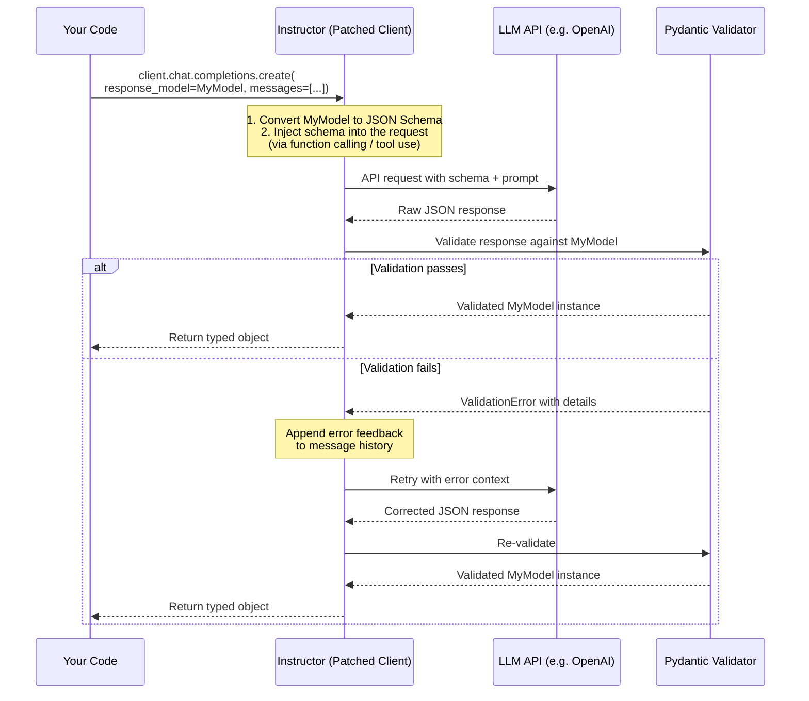

# Chapter 1: Getting Started with Instructor

Welcome to **Chapter 1: Getting Started with Instructor**. In this part of **Instructor Tutorial: Structured LLM Outputs**, you will build an intuitive mental model first, then move into concrete implementation details and practical production tradeoffs.


> Install Instructor, patch your LLM client, and return your first typed object with Pydantic validation.

## Overview

If you have ever called an LLM and then spent hours writing parsing logic to pull structured data out of free-form text, Instructor is here to save you. It wraps your LLM client (OpenAI, Anthropic, Google, Ollama, and others) so that every call returns a **validated Python object** instead of a raw string. You define the shape of the data with a Pydantic model, Instructor tells the LLM exactly what schema to follow, and if the response does not match, it automatically retries with feedback until it does.

In short: you describe what you want, and Instructor makes sure you get it -- typed, validated, and ready to use.

### What You Will Build

By the end of this chapter you will be able to:

- Install Instructor and its dependencies in a clean environment.
- Patch the OpenAI client so it returns structured objects.
- Define several Pydantic models for different use cases.
- Make your first extraction call and inspect the result.
- Understand the request flow from prompt to validated object.
- Handle basic errors gracefully.

### Why Structured Output Matters

When you ask an LLM a question, the response is just a string. That string might look like JSON, but there is no guarantee that:

- The keys are spelled correctly.
- The types are what you expect (a number instead of a string, for example).
- Required fields are present.
- Values fall within acceptable ranges.

Instructor solves all of these problems by treating the LLM response as data that must conform to a contract -- your Pydantic model. If the data does not pass validation, Instructor sends the validation errors back to the model and asks it to try again. This turns an unreliable text-generation step into a dependable data-extraction step.

## Prerequisites

Before you begin, make sure you have:

- **Python 3.9 or later** -- Instructor relies on modern typing features. Python 3.10+ is recommended.
- **An OpenAI API key** -- We use OpenAI in this chapter, but Chapter 6 covers other providers.
- **pip (or pipx)** -- For installing packages.
- **Basic Python knowledge** -- You should be comfortable with classes, type hints, and importing modules.

> **Tip:** If you do not have an API key yet, head to [platform.openai.com](https://platform.openai.com) to create one. Store it in an environment variable called `OPENAI_API_KEY` so you do not hard-code secrets.

## Install Instructor

The simplest way to install is with pip:

```bash
pip install instructor openai "pydantic>=2.6"
```

This pulls in three packages:

| Package | Purpose |
|:--------|:--------|
| `instructor` | The core library that patches your client and handles retries |
| `openai` | The official OpenAI Python SDK |
| `pydantic` (v2.6+) | Data validation and schema generation |

### Recommended: Use a Virtual Environment

It is good practice to isolate project dependencies so they do not conflict with other projects on your machine. Here is how to set one up:

```bash
# Create a virtual environment in the current directory
python -m venv .venv

# Activate it (macOS / Linux)
source .venv/bin/activate

# Activate it (Windows PowerShell)
.venv\Scripts\Activate.ps1

# Now install inside the virtual environment
pip install instructor openai "pydantic>=2.6"
```

### Verify the Installation

Run a quick check to make sure everything is in place:

```bash
python -c "import instructor; print(instructor.__version__)"
```

You should see a version number like `1.7.0` or higher. If you get an `ImportError`, double-check that your virtual environment is activated and that the install step completed without errors.

## Patch the OpenAI Client

The central idea in Instructor is **patching**. You take an ordinary OpenAI client and wrap it with Instructor. The patched client works exactly like the original, except it gains the ability to accept a `response_model` parameter and return validated objects.

```python
import instructor
from openai import OpenAI

# Create the standard OpenAI client
bare_client = OpenAI()  # reads OPENAI_API_KEY from the environment

# Patch it with Instructor
client = instructor.from_openai(bare_client)
```

That is it. The `client` object now supports structured extraction. You still call the same methods (`chat.completions.create` or `responses.create`), but you can pass an extra keyword argument -- `response_model` -- to tell Instructor what shape the data should take.

> **Note:** The original `bare_client` is not modified. `instructor.from_openai` returns a new wrapper, so you can keep both around if you need raw completions for some calls and structured output for others.

## How It Works Under the Hood

Understanding the patching mechanism will help you debug issues and make the most of the library. Here is the full request flow:



Let's break this down step by step:

1. **Schema generation** -- When you pass `response_model=MyModel`, Instructor calls Pydantic's `.model_json_schema()` method to produce a JSON Schema representation of your model. This schema lists every field, its type, constraints, and description.

2. **Schema injection** -- Instructor adds that schema to the LLM request. For OpenAI, it uses the **function calling** (tool use) mechanism, effectively telling the model: "You must respond by calling this function with these exact parameters." This is far more reliable than asking the model to output JSON in the prompt text.

3. **API call** -- The request is sent to the LLM provider as usual. From the provider's perspective, this is a normal API call with tool definitions.

4. **Parsing** -- When the response comes back, Instructor extracts the structured data from the tool-call arguments.

5. **Validation** -- The extracted data is passed to Pydantic, which checks types, runs validators, and enforces constraints.

6. **Retry loop** -- If Pydantic raises a `ValidationError`, Instructor appends the error messages to the conversation and makes another API call. The model sees what went wrong and can correct its output. This loop continues until validation passes or the maximum number of retries is reached.

This retry-with-feedback mechanism is what makes Instructor so powerful. The LLM is not just guessing blindly -- it learns from its mistakes on each attempt.

## Your First Extraction

Let's write a complete example. We will define a simple `Todo` model and extract a task from natural language.

```python
# first_extraction.py
import instructor
from pydantic import BaseModel, Field
from openai import OpenAI

# Step 1: Patch the client
client = instructor.from_openai(OpenAI())

# Step 2: Define your data model
class Todo(BaseModel):
    """A single to-do item extracted from user input."""
    title: str = Field(..., description="A short, imperative task title")
    priority: str = Field(..., description="One of: low, medium, high")
    done: bool = Field(default=False, description="Whether the task is already completed")

# Step 3: Call the LLM with response_model
todo = client.chat.completions.create(
    model="gpt-4o-mini",
    response_model=Todo,
    messages=[
        {
            "role": "user",
            "content": "Add a todo for shipping the docs, high priority"
        }
    ],
)

# Step 4: Use the result -- it's a fully typed Python object
print(todo)
# > Todo(title='Ship the docs', priority='high', done=False)

print(f"Task: {todo.title}")
# > Task: Ship the docs

print(f"Priority: {todo.priority}")
# > Priority: high

print(f"Done: {todo.done}")
# > Done: False

# You can also convert it to a dictionary or JSON
print(todo.model_dump())
# > {'title': 'Ship the docs', 'priority': 'high', 'done': False}

print(todo.model_dump_json(indent=2))
# > {
# >   "title": "Ship the docs",
# >   "priority": "high",
# >   "done": false
# > }
```

Save this as `first_extraction.py` and run it:

```bash
python first_extraction.py
```

If you see a `Todo(...)` object printed, congratulations -- your setup is working and you have made your first structured extraction.

## More Model Examples

The `Todo` example is deliberately simple. Let's look at a few more models to get a feel for what Instructor can handle.

### Example: Extracting a Person

```python
from pydantic import BaseModel, Field
from typing import Optional

class Person(BaseModel):
    """Information about a person mentioned in text."""
    name: str = Field(..., description="The person's full name")
    age: Optional[int] = Field(None, description="Age in years, if mentioned")
    occupation: Optional[str] = Field(None, description="Job title or role, if mentioned")
    location: Optional[str] = Field(None, description="City or country, if mentioned")

person = client.chat.completions.create(
    model="gpt-4o-mini",
    response_model=Person,
    messages=[
        {
            "role": "user",
            "content": "Marie Curie was a physicist and chemist born in Warsaw. "
                       "She was 66 when she passed away."
        }
    ],
)

print(person)
# > Person(name='Marie Curie', age=66, occupation='physicist and chemist', location='Warsaw')
```

Notice how `Optional` fields gracefully handle missing information. If the text did not mention an age, the field would simply be `None` instead of causing an error.

### Example: Extracting a Product Review

```python
from pydantic import BaseModel, Field
from typing import Literal

class ProductReview(BaseModel):
    """Structured representation of a product review."""
    product_name: str = Field(..., description="Name of the product being reviewed")
    rating: int = Field(..., description="Rating from 1 to 5", ge=1, le=5)
    sentiment: Literal["positive", "negative", "mixed"] = Field(
        ..., description="Overall sentiment of the review"
    )
    summary: str = Field(..., description="One-sentence summary of the review")
    pros: list[str] = Field(default_factory=list, description="List of positive points")
    cons: list[str] = Field(default_factory=list, description="List of negative points")

review = client.chat.completions.create(
    model="gpt-4o-mini",
    response_model=ProductReview,
    messages=[
        {
            "role": "user",
            "content": "I bought the UltraBlend 3000 blender last week. It's amazingly powerful "
                       "and crushes ice like nothing. The design is sleek. However, it's really "
                       "loud and the lid doesn't seal perfectly. Overall I'd give it 4 out of 5."
        }
    ],
)

print(f"Product: {review.product_name}")
print(f"Rating: {review.rating}/5 ({review.sentiment})")
print(f"Summary: {review.summary}")
print(f"Pros: {review.pros}")
print(f"Cons: {review.cons}")
# > Product: UltraBlend 3000
# > Rating: 4/5 (positive)
# > Summary: A powerful and sleek blender that is let down by noise and a loose lid.
# > Pros: ['Amazingly powerful', 'Crushes ice easily', 'Sleek design']
# > Cons: ['Very loud', "Lid doesn't seal perfectly"]
```

A few things to notice here:

- **`ge=1, le=5`** on the `rating` field tells Pydantic to reject any rating outside the 1-5 range. If the LLM returns a 6, validation fails and Instructor retries.
- **`Literal["positive", "negative", "mixed"]`** constrains the sentiment to exactly those three strings. The LLM cannot invent a new category.
- **`list[str]`** fields let the model return a variable number of items.

## Error Handling Basics

Things can go wrong -- the API might be down, the model might not follow instructions, or you might hit your rate limit. Here is how to handle the most common situations:

```python
import instructor
from pydantic import BaseModel, Field
from openai import OpenAI, APIError, RateLimitError

client = instructor.from_openai(OpenAI())

class City(BaseModel):
    name: str = Field(..., description="City name")
    country: str = Field(..., description="Country the city is in")
    population: int = Field(..., description="Approximate population")

# Wrap your extraction call in a try/except block
try:
    city = client.chat.completions.create(
        model="gpt-4o-mini",
        response_model=City,
        max_retries=2,           # Instructor will retry up to 2 times on validation errors
        messages=[
            {"role": "user", "content": "Tell me about Tokyo"}
        ],
    )
    print(city)

except instructor.exceptions.InstructorRetryException as e:
    # All retries exhausted and validation still fails
    print(f"Extraction failed after retries: {e}")

except RateLimitError:
    # You've hit the API rate limit
    print("Rate limited -- wait a moment and try again.")

except APIError as e:
    # Some other API-level error (500, timeout, etc.)
    print(f"API error: {e}")
```

The key takeaway is that `max_retries` controls how many times Instructor will ask the model to fix its output when validation fails. If all retries are exhausted, an `InstructorRetryException` is raised so you can handle it in your application logic.

> **Tip:** Start with `max_retries=2` or `3`. More retries increase reliability but also increase latency and cost. For most models and well-designed schemas, one retry is usually enough.

## A Complete Working Example

Let's put everything together in a self-contained script you can copy, paste, and run:

```python
# complete_example.py
"""
A complete Instructor example that extracts meeting details from a paragraph.
Run: python complete_example.py
"""

import instructor
from pydantic import BaseModel, Field
from openai import OpenAI
from typing import Optional

# --- 1. Patch the client ---
client = instructor.from_openai(OpenAI())  # uses OPENAI_API_KEY env var

# --- 2. Define your models ---
class Attendee(BaseModel):
    """A person attending the meeting."""
    name: str = Field(..., description="Full name of the attendee")
    role: Optional[str] = Field(None, description="Job title or role, if mentioned")

class MeetingDetails(BaseModel):
    """Structured details extracted from a meeting description."""
    title: str = Field(..., description="The name or topic of the meeting")
    date: Optional[str] = Field(None, description="Date in ISO 8601 format (YYYY-MM-DD)")
    time: Optional[str] = Field(None, description="Time in HH:MM format, 24-hour clock")
    location: Optional[str] = Field(None, description="Physical or virtual meeting location")
    attendees: list[Attendee] = Field(
        default_factory=list,
        description="People mentioned as attending"
    )
    agenda: list[str] = Field(
        default_factory=list,
        description="Agenda items or topics to discuss"
    )
    action_required: bool = Field(
        ..., description="Whether follow-up actions were mentioned"
    )

# --- 3. Extract structured data ---
text = """
Hey team, just a reminder about our Q4 planning session this Thursday (2025-01-16)
at 2pm in Conference Room B. Sarah Chen (VP Engineering), Marcus Johnson (Product Lead),
and Aisha Patel (Design Director) will all be there.

We need to cover three things: the roadmap for Q1, the hiring plan for the backend
team, and the design system migration. Marcus, please bring the updated customer
feedback report. Let's keep it to 90 minutes max.
"""

meeting = client.chat.completions.create(
    model="gpt-4o-mini",
    response_model=MeetingDetails,
    messages=[
        {
            "role": "system",
            "content": "Extract meeting details from the text. Be precise with dates and names."
        },
        {
            "role": "user",
            "content": text
        }
    ],
)

# --- 4. Use the structured result ---
print(f"Meeting: {meeting.title}")
print(f"Date: {meeting.date}")
print(f"Time: {meeting.time}")
print(f"Location: {meeting.location}")
print(f"Action required: {meeting.action_required}")
print(f"\nAttendees ({len(meeting.attendees)}):")
for a in meeting.attendees:
    role_str = f" ({a.role})" if a.role else ""
    print(f"  - {a.name}{role_str}")
print(f"\nAgenda ({len(meeting.agenda)} items):")
for i, item in enumerate(meeting.agenda, 1):
    print(f"  {i}. {item}")
```

**Expected output:**

```
Meeting: Q4 Planning Session
Date: 2025-01-16
Time: 14:00
Location: Conference Room B
Action required: True

Attendees (3):
  - Sarah Chen (VP Engineering)
  - Marcus Johnson (Product Lead)
  - Aisha Patel (Design Director)

Agenda (3 items):
  1. Roadmap for Q1
  2. Hiring plan for the backend team
  3. Design system migration
```

Notice how the model correctly parsed the date into ISO format, converted "2pm" to 24-hour time, extracted all three attendees with their roles, identified the three agenda items, and recognized that follow-up actions were mentioned (Marcus was asked to bring a report).

## Common Patterns

Now that you understand the basics, here are four extraction patterns you will use again and again. These are previews -- later chapters explore each in depth.

### Pattern 1: Text Classification

Classify text into one or more categories. This is one of the most common uses of Instructor.

```python
from typing import Literal
from pydantic import BaseModel, Field

class Classification(BaseModel):
    """Classify a customer support message."""
    category: Literal["billing", "technical", "account", "general"] = Field(
        ..., description="Primary category of the support request"
    )
    urgency: Literal["low", "medium", "high", "critical"] = Field(
        ..., description="How urgently this needs to be addressed"
    )
    confidence: float = Field(
        ..., description="Confidence score between 0.0 and 1.0",
        ge=0.0, le=1.0
    )

result = client.chat.completions.create(
    model="gpt-4o-mini",
    response_model=Classification,
    messages=[
        {
            "role": "user",
            "content": "I've been charged twice for my subscription this month "
                       "and I need a refund immediately!"
        }
    ],
)

print(f"Category: {result.category}")     # > billing
print(f"Urgency: {result.urgency}")       # > high
print(f"Confidence: {result.confidence}")  # > 0.95
```

### Pattern 2: Named Entity Extraction

Pull structured entities out of unstructured text. Perfect for processing documents, articles, or transcripts.

```python
from pydantic import BaseModel, Field

class Entity(BaseModel):
    """A named entity found in the text."""
    text: str = Field(..., description="The entity as it appears in the source")
    label: str = Field(..., description="Entity type: PERSON, ORG, LOCATION, DATE, MONEY, etc.")

class EntityList(BaseModel):
    """All named entities extracted from a passage."""
    entities: list[Entity] = Field(..., description="List of extracted entities")

entities = client.chat.completions.create(
    model="gpt-4o-mini",
    response_model=EntityList,
    messages=[
        {
            "role": "user",
            "content": "Apple Inc. CEO Tim Cook announced a $50 billion investment "
                       "in US manufacturing at the company's headquarters in Cupertino "
                       "on March 15, 2025."
        }
    ],
)

for e in entities.entities:
    print(f"  {e.label:10s} -> {e.text}")
# > ORG        -> Apple Inc.
# > PERSON     -> Tim Cook
# > MONEY      -> $50 billion
# > LOCATION   -> US
# > LOCATION   -> Cupertino
# > DATE       -> March 15, 2025
```

### Pattern 3: Summarization with Structure

Instead of asking for a plain-text summary, define a model that forces the LLM to produce a structured summary with specific sections.

```python
from pydantic import BaseModel, Field

class StructuredSummary(BaseModel):
    """A structured summary of an article or document."""
    title: str = Field(..., description="A concise title for the content")
    one_line_summary: str = Field(..., description="The main point in one sentence")
    key_points: list[str] = Field(
        ..., description="3-5 key takeaways, each one sentence"
    )
    target_audience: str = Field(
        ..., description="Who would benefit most from reading this"
    )

summary = client.chat.completions.create(
    model="gpt-4o-mini",
    response_model=StructuredSummary,
    messages=[
        {
            "role": "system",
            "content": "Summarize the following article in a structured format."
        },
        {
            "role": "user",
            "content": "... (your article text here) ..."
        }
    ],
)
```

This pattern is especially useful for building content pipelines where downstream systems expect data in a specific shape.

### Pattern 4: Multi-Item Extraction

Extract a list of items from a single block of text. Useful for invoices, resumes, event listings, and more.

```python
from pydantic import BaseModel, Field
from typing import Optional

class ContactInfo(BaseModel):
    """A single contact extracted from a business card or email signature."""
    name: str = Field(..., description="Full name")
    email: Optional[str] = Field(None, description="Email address")
    phone: Optional[str] = Field(None, description="Phone number in original format")
    company: Optional[str] = Field(None, description="Company or organization name")

class ContactList(BaseModel):
    """All contacts extracted from the input text."""
    contacts: list[ContactInfo] = Field(..., description="List of extracted contacts")

contacts = client.chat.completions.create(
    model="gpt-4o-mini",
    response_model=ContactList,
    messages=[
        {
            "role": "user",
            "content": """
            Please extract the contacts:
            - Jane Smith, jane@acme.com, (555) 123-4567, Acme Corp
            - Bob Lee, bob.lee@widgets.io, Widget Industries
            - Carlos M., +1-555-987-6543
            """
        }
    ],
)

for c in contacts.contacts:
    print(f"{c.name} | {c.email or 'N/A'} | {c.phone or 'N/A'} | {c.company or 'N/A'}")
# > Jane Smith | jane@acme.com | (555) 123-4567 | Acme Corp
# > Bob Lee | bob.lee@widgets.io | N/A | Widget Industries
# > Carlos M. | N/A | +1-555-987-6543 | N/A
```

The trick here is wrapping the individual item model inside a container model with a `list` field. This lets the LLM return one, five, or fifty items -- all validated.

## Key Concepts Summary

Here is a quick-reference table of everything we covered in this chapter:

| Concept | What It Does | Example |
|:--------|:-------------|:--------|
| **Patching** | Wraps your LLM client to support `response_model` | `client = instructor.from_openai(OpenAI())` |
| **response_model** | Tells Instructor which Pydantic model to validate against | `response_model=Todo` |
| **Field descriptions** | Guide the LLM on what each field should contain | `Field(..., description="short task title")` |
| **Type constraints** | Restrict values to valid options | `Literal["low", "medium", "high"]` |
| **Numeric constraints** | Enforce min/max on numbers | `Field(..., ge=1, le=5)` |
| **Optional fields** | Let the LLM return `None` when info is missing | `Optional[str] = None` |
| **List fields** | Extract multiple items into a typed list | `list[str]`, `list[MyModel]` |
| **max_retries** | Number of times to retry on validation failure | `max_retries=2` |
| **model_dump()** | Convert the validated object to a Python dict | `todo.model_dump()` |
| **model_dump_json()** | Convert the validated object to a JSON string | `todo.model_dump_json()` |

## Quick CLI Smoke Test

If you have not already, create a minimal test file:

```python
# smoke_test.py
import instructor
from pydantic import BaseModel
from openai import OpenAI

client = instructor.from_openai(OpenAI())

class Greeting(BaseModel):
    message: str
    language: str

result = client.chat.completions.create(
    model="gpt-4o-mini",
    response_model=Greeting,
    messages=[{"role": "user", "content": "Say hello in French"}],
)

print(result)
```

```bash
python smoke_test.py
# > Greeting(message='Bonjour', language='French')
```

If you see a `Greeting(...)` object, you are all set.

## Troubleshooting

| Problem | Likely Cause | Solution |
|:--------|:-------------|:---------|
| **401 Unauthorized** | Missing or expired API key | Set `OPENAI_API_KEY` in your environment and verify it at platform.openai.com |
| **ModuleNotFoundError: instructor** | Package not installed or wrong environment | Run `pip install instructor` and make sure your virtual environment is activated |
| **Validation errors / retries exhausted** | Schema is too strict or descriptions are unclear | Add clear `description` strings to every `Field`, relax constraints, or increase `max_retries` |
| **Unexpected field values** | Model is guessing instead of extracting | Use `Literal` types to constrain options; add a `system` message with extraction instructions |
| **Slow responses** | Too many retries or large model | Use `gpt-4o-mini` for simpler tasks; ensure your schema is well-described to minimize retries |
| **Rate limit errors** | Too many requests in a short period | Add retry logic with exponential backoff, or reduce request frequency |

## What's Next

You now know how to install Instructor, patch your client, define models, and extract structured data from LLM responses. In the next chapter, we will dive deeper into designing Pydantic models that guide the LLM toward accurate, well-typed responses with minimal retries.

---

**Next: [Chapter 2: Pydantic Models](02-pydantic-models.md)**

## What Problem Does This Solve?

Most teams struggle here because the hard part is not writing more code, but deciding clear boundaries for `Field`, `description`, `print` so behavior stays predictable as complexity grows.

In practical terms, this chapter helps you avoid three common failures:

- coupling core logic too tightly to one implementation path
- missing the handoff boundaries between setup, execution, and validation
- shipping changes without clear rollback or observability strategy

After working through this chapter, you should be able to reason about `Chapter 1: Getting Started with Instructor` as an operating subsystem inside **Instructor Tutorial: Structured LLM Outputs**, with explicit contracts for inputs, state transitions, and outputs.

Use the implementation notes around `BaseModel`, `client`, `role` as your checklist when adapting these patterns to your own repository.

## How it Works Under the Hood

Under the hood, `Chapter 1: Getting Started with Instructor` usually follows a repeatable control path:

1. **Context bootstrap**: initialize runtime config and prerequisites for `Field`.
2. **Input normalization**: shape incoming data so `description` receives stable contracts.
3. **Core execution**: run the main logic branch and propagate intermediate state through `print`.
4. **Policy and safety checks**: enforce limits, auth scopes, and failure boundaries.
5. **Output composition**: return canonical result payloads for downstream consumers.
6. **Operational telemetry**: emit logs/metrics needed for debugging and performance tuning.

When debugging, walk this sequence in order and confirm each stage has explicit success/failure conditions.

## Source Walkthrough

Use the following upstream sources to verify implementation details while reading this chapter:

- [View Repo](https://github.com/instructor-ai/instructor)
  Why it matters: authoritative reference on `View Repo` (github.com).
- [Awesome Code Docs](https://github.com/johnxie/awesome-code-docs)
  Why it matters: authoritative reference on `Awesome Code Docs` (github.com).

Suggested trace strategy:
- search upstream code for `Field` and `description` to map concrete implementation paths
- compare docs claims against actual runtime/config code before reusing patterns in production

## Chapter Connections

- [Tutorial Index](index.md)
- [Next Chapter: Chapter 2: Crafting Effective Pydantic Models](02-pydantic-models.md)
- [Main Catalog](../../README.md#-tutorial-catalog)
- [A-Z Tutorial Directory](../../discoverability/tutorial-directory.md)
