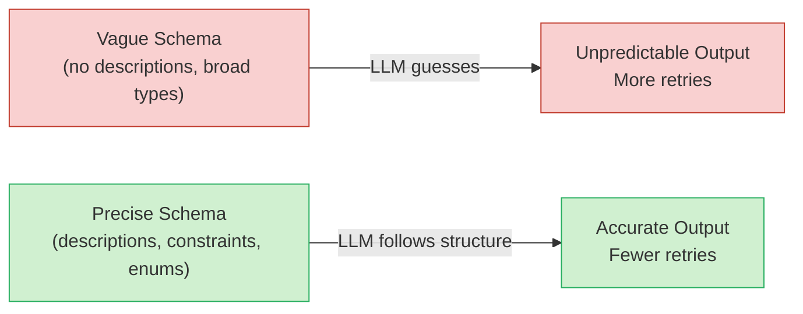

# Chapter 2: Crafting Effective Pydantic Models

> Design schemas that guide the model toward accurate, typed responses with minimal retries.

## Overview

When you use Instructor, the Pydantic model you define is not just a data container -- it is *the prompt itself* for the structural part of the LLM's output. A well-designed schema dramatically reduces hallucinations, cuts retry loops, and produces stable results across different providers. A poorly designed schema does the opposite: vague fields lead to vague answers.

This chapter walks you through everything you need to know about building schemas that actually work. We will start with the fundamentals of field design, move into advanced types and constraints, and finish with a gallery of real-world schemas you can adapt for your own projects.

### What You Will Learn

- How Pydantic field descriptions steer the LLM's output.
- Which built-in types (datetime, UUID, URL, email, etc.) to reach for and when.
- How to compose, nest, and reuse models for complex structures.
- Schema design principles that minimize retries.
- Common anti-patterns and how to fix them.



The relationship is direct: more information in the schema means less guesswork for the model.

---

## Schema Design Principles

Before diving into code, here are five principles that will save you debugging time later.

### 1. Be Specific in Descriptions

Every `Field(description=...)` is an instruction to the LLM. Think of it as a mini-prompt embedded in the schema. "A string" tells the model nothing. "A short, imperative bug title like 'Fix login redirect loop'" tells it exactly what you want.

### 2. Constrain the Output Space

The fewer valid outputs the model can produce, the more likely it is to produce the right one. Use `Literal`, `Enum`, `conint`, `max_length`, and `max_items` aggressively. If there are only four valid categories, do not use `str` -- use `Literal["billing", "technical", "account", "other"]`.

### 3. Prefer Small, Composed Models

A flat model with 20 fields is hard for both humans and LLMs to reason about. Break it into logical groups -- a `Contact` model, an `Address` model, a `LineItem` model -- and compose them. The hierarchy gives the LLM a mental map of the data.

### 4. Make Optional Fields Explicit

If a field might not be present in the source text, mark it `Optional` with a default of `None`. But still provide a description so the LLM knows *when* to fill it in. "Phone number in E.164 format, if mentioned" is much better than a bare `Optional[str]`.

### 5. Use Examples When Descriptions Are Not Enough

Pydantic's `Field` supports a `json_schema_extra` parameter (or `examples` in Pydantic v2) that lets you embed example values directly in the JSON schema. Some LLMs pick up on these hints.

```python
from pydantic import BaseModel, Field

class MovieReview(BaseModel):
    title: str = Field(
        ...,
        description="The exact title of the movie being reviewed",
        examples=["The Shawshank Redemption", "Parasite"],
    )
    rating: float = Field(
        ...,
        ge=0.0,
        le=10.0,
        description="Numeric rating on a 0-10 scale, one decimal place",
    )
    summary: str = Field(
        ...,
        max_length=280,
        description="One-paragraph summary of the review, Twitter-length",
    )
```

---

## Field Design Basics

Let's revisit the fundamentals. Every field in your model has three jobs: it tells Pydantic how to *validate* the data, it tells Python how to *type-check* your code, and it tells the LLM how to *generate* the value.

```python
from pydantic import BaseModel, Field
from typing import Literal

class Issue(BaseModel):
    """A software bug report extracted from user text."""

    title: str = Field(
        ...,
        description="Short, imperative title (e.g., 'Fix checkout crash on Safari')"
    )
    severity: Literal["low", "medium", "high"] = Field(
        ...,
        description="Based on user impact and urgency"
    )
    component: str = Field(
        ...,
        description="The affected module or service name"
    )
    steps: list[str] = Field(
        default_factory=list,
        description="Ordered reproduction steps, one sentence each"
    )
```

A few things to notice:

- **`Literal` forces discrete options.** The LLM cannot invent a fifth severity level. This is one of the single most effective techniques for improving output quality.
- **Descriptions are short and directive.** They read like instructions, not documentation. "Short, imperative title" is a command the model follows.
- **`default_factory=list`** avoids the mutable default argument trap and tells the LLM that an empty list is acceptable when no steps are mentioned.
- **The class docstring matters.** Instructor includes it in the schema sent to the LLM, so it acts as a top-level instruction for the entire object.

---

## Expanded Field Types

Pydantic ships with a rich set of types beyond `str` and `int`. Each one adds automatic validation and, importantly, signals intent to the LLM.

### Dates and Times

```python
from datetime import datetime, date, time
from pydantic import BaseModel, Field

class Event(BaseModel):
    name: str = Field(..., description="Name of the event")
    event_date: date = Field(
        ...,
        description="Date in YYYY-MM-DD format"
    )
    start_time: time = Field(
        ...,
        description="Start time in HH:MM 24-hour format"
    )
    created_at: datetime = Field(
        ...,
        description="Full ISO 8601 datetime with timezone, e.g. 2025-03-15T14:30:00Z"
    )
```

Using `date` instead of `str` means Pydantic will reject "next Tuesday" and force the LLM to produce "2025-03-18". That is exactly what you want -- structured, parseable output.

### UUIDs

```python
from uuid import UUID
from pydantic import BaseModel, Field

class TrackedEntity(BaseModel):
    id: UUID = Field(
        ...,
        description="A unique UUID v4 identifier for this entity"
    )
    name: str = Field(..., description="Human-readable name")
```

UUIDs are useful when you need the LLM to generate unique identifiers for entities it extracts. The model will produce properly formatted UUIDs like `"550e8400-e29b-41d4-a716-446655440000"`.

### URLs

```python
from pydantic import BaseModel, Field, HttpUrl

class Reference(BaseModel):
    title: str = Field(..., description="Title of the referenced resource")
    url: HttpUrl = Field(
        ...,
        description="Full HTTPS URL to the resource"
    )
```

`HttpUrl` validates that the string is a well-formed URL with an http or https scheme. This prevents the LLM from returning partial paths or malformed links.

### Email Addresses

```python
from pydantic import BaseModel, Field, EmailStr

class ContactInfo(BaseModel):
    name: str = Field(..., description="Full name of the person")
    email: EmailStr = Field(
        ...,
        description="Valid email address"
    )
```

Note that `EmailStr` requires the `email-validator` package (`pip install pydantic[email]`). It validates format, so "bob at company" will fail and trigger a retry with a proper address.

### Putting Types Together

Here is a model that uses several of these types at once:

```python
from datetime import datetime
from uuid import UUID
from pydantic import BaseModel, Field, HttpUrl, EmailStr

class CustomerInteraction(BaseModel):
    interaction_id: UUID = Field(
        ..., description="Unique identifier for this interaction"
    )
    customer_email: EmailStr = Field(
        ..., description="Customer's email address"
    )
    timestamp: datetime = Field(
        ..., description="When the interaction occurred, ISO 8601"
    )
    reference_url: HttpUrl | None = Field(
        None, description="Link to relevant documentation, if any"
    )
    summary: str = Field(
        ..., max_length=500, description="Brief summary of the interaction"
    )
```

---

## Constrained Types

Constraints are guardrails. They limit what the LLM can produce and what Pydantic will accept.

```python
from pydantic import BaseModel, Field, HttpUrl, conint, confloat

class Link(BaseModel):
    label: str = Field(..., description="Anchor text for the link")
    url: HttpUrl = Field(..., description="Full URL")

class Article(BaseModel):
    title: str = Field(
        ...,
        min_length=4,
        max_length=120,
        description="Article headline, 4-120 characters"
    )
    tags: list[str] = Field(
        default_factory=list,
        max_length=8,
        description="Up to 8 topic tags, lowercase"
    )
    reading_time_min: conint(ge=1, le=60) = Field(
        default=5,
        description="Estimated reading time in minutes"
    )
    confidence: confloat(ge=0.0, le=1.0) = Field(
        ...,
        description="Model's confidence in the extraction, 0.0 to 1.0"
    )
    sources: list[Link] = Field(
        default_factory=list,
        description="Source links referenced in the article"
    )
```

Here is what each constraint does:

- **`min_length` / `max_length` on strings** -- prevents one-word titles or essay-length ones.
- **`max_length` on lists** -- hints the model to keep arrays tight. Without this, you might get 30 tags when you only wanted 5.
- **`conint(ge=1, le=60)`** -- ensures the integer falls within a range. The model will not produce 0 or 999.
- **`confloat(ge=0.0, le=1.0)`** -- same idea for floats. Great for confidence scores, percentages, and ratings.

---

## Nested Models and Composition

Flat schemas with many fields are harder for LLMs to fill accurately. Nesting breaks the problem into smaller, logical pieces.

```python
from pydantic import BaseModel, Field

class Contact(BaseModel):
    """A person's contact information."""
    name: str = Field(..., description="Full name")
    email: str = Field(..., description="Email address")

class Address(BaseModel):
    """A physical mailing address."""
    street: str = Field(..., description="Street address including number")
    city: str = Field(..., description="City name")
    state: str = Field(..., description="State or province abbreviation")
    postal_code: str = Field(..., description="ZIP or postal code")
    country: str = Field(default="US", description="ISO 3166-1 alpha-2 country code")

class Company(BaseModel):
    """A company profile extracted from text."""
    name: str = Field(..., description="Legal company name")
    domain: str = Field(..., description="Primary web domain, e.g. acme.com")
    headquarters: Address = Field(..., description="HQ address")
    contacts: list[Contact] = Field(
        default_factory=list,
        description="Known contacts at this company"
    )
```

Composition has two big advantages:

1. **Reusability.** The `Contact` and `Address` models can be used across dozens of schemas.
2. **Clarity for the LLM.** The nested structure tells the model "first fill in the headquarters as an Address, then fill in each contact as a Contact." This hierarchy reduces confusion.

---

## Optional vs Required

The distinction between optional and required fields is critical for extraction tasks. If the source text might not contain a phone number, make it optional. If you always need a name, make it required.

```python
from typing import Optional
from pydantic import BaseModel, Field

class Lead(BaseModel):
    """A sales lead extracted from an email or message."""
    name: str = Field(..., description="Full name of the lead")
    company: Optional[str] = Field(
        None,
        description="Company name, if mentioned"
    )
    phone: Optional[str] = Field(
        None,
        description="Phone number in E.164 format (e.g., +14155551234), if mentioned"
    )
    interest: str = Field(
        ...,
        description="What product or service they are interested in"
    )
```

The key rule: **always provide descriptions for optional fields.** Without a description, the LLM does not know whether to try hard to find a value or leave it blank. "Phone number in E.164 format, if mentioned" tells the model both the format *and* when to fill it in.

---

## Enums vs Literals

Both `Enum` and `Literal` restrict a field to a set of allowed values. When should you use which?

```python
from enum import Enum
from typing import Literal

# Use Literal for simple, one-off choices
class QuickClassification(BaseModel):
    sentiment: Literal["positive", "negative", "neutral"]

# Use Enum when you reuse the same choices across multiple models
class Channel(str, Enum):
    email = "email"
    sms = "sms"
    push = "push"
    in_app = "in_app"

class Notification(BaseModel):
    channel: Channel = Field(..., description="Delivery channel for the notification")
    message: str = Field(..., description="Notification body text")

class UserPreference(BaseModel):
    preferred_channel: Channel = Field(..., description="User's preferred contact channel")
    opt_out_channels: list[Channel] = Field(
        default_factory=list,
        description="Channels the user has opted out of"
    )
```

**Rule of thumb:** Use `Literal` for inline, throwaway choices. Use `Enum` when the same set of values appears in more than one model. Enums also give you better autocomplete in your IDE.

---

## How Field Descriptions Guide the LLM

You might wonder: how does a Pydantic field description actually influence the LLM? Here is what happens under the hood.

When you call `client.chat.completions.create(response_model=MyModel, ...)`, Instructor converts your Pydantic model into a JSON schema and passes it to the LLM via the function-calling or tool-use API. That JSON schema looks something like this:

```json
{
  "type": "object",
  "properties": {
    "title": {
      "type": "string",
      "description": "Short, imperative bug title",
      "minLength": 4,
      "maxLength": 120
    },
    "severity": {
      "type": "string",
      "enum": ["low", "medium", "high"],
      "description": "Based on user impact and urgency"
    }
  },
  "required": ["title", "severity"]
}
```

The LLM reads those `"description"` fields as part of the function schema. They are effectively **per-field prompts**. The model uses them to decide:

- **What content to generate** for each field.
- **What format to use** (ISO date, E.164 phone, etc.).
- **When to leave optional fields as null** ("if mentioned" is a strong signal).

This is why vague descriptions like "a string value" are nearly useless, while specific ones like "ISO 8601 date in UTC timezone" produce consistently correct output.

### Tips for Writing Great Descriptions

| Approach | Bad | Good |
|----------|-----|------|
| Be specific about format | `"a date"` | `"Date in YYYY-MM-DD format"` |
| Give examples | `"a name"` | `"Full name, e.g. 'Jane Smith'"` |
| Explain when to fill | `"optional phone"` | `"Phone in E.164 format, if mentioned in the text"` |
| Set expectations for length | `"a summary"` | `"2-3 sentence summary of the key points"` |
| Use imperative tone | `"this is the title"` | `"Short, imperative title for the bug report"` |

---

## Real-World Schema Gallery

Theory is great, but seeing real schemas is better. Here are five production-style models you can adapt.

### 1. E-Commerce Product

```python
from pydantic import BaseModel, Field, HttpUrl, confloat
from typing import Literal, Optional

class ProductDimensions(BaseModel):
    """Physical dimensions of the product."""
    length_cm: float = Field(..., description="Length in centimeters")
    width_cm: float = Field(..., description="Width in centimeters")
    height_cm: float = Field(..., description="Height in centimeters")
    weight_kg: float = Field(..., ge=0, description="Weight in kilograms")

class Product(BaseModel):
    """A product listing extracted from a product page or description."""
    name: str = Field(..., max_length=200, description="Product name as shown on the listing")
    brand: str = Field(..., description="Manufacturer or brand name")
    category: Literal[
        "electronics", "clothing", "home", "sports", "books", "toys", "other"
    ] = Field(..., description="Primary product category")
    price_usd: confloat(ge=0) = Field(..., description="Price in USD, e.g. 29.99")
    currency: str = Field(default="USD", description="ISO 4217 currency code")
    in_stock: bool = Field(..., description="Whether the product is currently available")
    description: str = Field(
        ...,
        max_length=1000,
        description="Product description, 1-3 paragraphs"
    )
    tags: list[str] = Field(
        default_factory=list,
        max_length=10,
        description="Searchable tags, lowercase, e.g. ['wireless', 'bluetooth']"
    )
    image_url: Optional[HttpUrl] = Field(None, description="Primary product image URL")
    dimensions: Optional[ProductDimensions] = Field(
        None, description="Physical dimensions, if available"
    )
```

Notice how this schema uses a nested `ProductDimensions` model instead of putting four dimension fields at the top level. This keeps the main model clean and makes the dimension group reusable.

### 2. Support Ticket

```python
from datetime import datetime
from pydantic import BaseModel, Field, EmailStr
from typing import Literal, Optional

class SupportTicket(BaseModel):
    """A customer support ticket extracted from an email or chat transcript."""
    ticket_title: str = Field(
        ...,
        max_length=120,
        description="Concise title summarizing the issue"
    )
    customer_name: str = Field(..., description="Name of the customer")
    customer_email: EmailStr = Field(..., description="Customer's email address")
    category: Literal[
        "billing", "technical", "account", "shipping", "feature_request", "other"
    ] = Field(..., description="Issue category based on the content")
    priority: Literal["p1_critical", "p2_high", "p3_medium", "p4_low"] = Field(
        ...,
        description="Priority level: p1 for outages, p2 for broken features, p3 for inconveniences, p4 for questions"
    )
    description: str = Field(
        ...,
        max_length=2000,
        description="Detailed description of the issue in the customer's own words"
    )
    steps_to_reproduce: list[str] = Field(
        default_factory=list,
        description="Ordered steps to reproduce the issue, if applicable"
    )
    affected_product: Optional[str] = Field(
        None,
        description="Specific product or feature affected, if mentioned"
    )
    sentiment: Literal["frustrated", "neutral", "positive"] = Field(
        ...,
        description="Customer's overall emotional tone"
    )
    created_at: datetime = Field(
        ...,
        description="When the ticket was created, ISO 8601 format"
    )
```

The `priority` field includes a description that explains the criteria for each level. This is one of the best techniques for getting the LLM to choose the right option consistently.

### 3. Meeting Notes

```python
from datetime import date
from pydantic import BaseModel, Field
from typing import Optional

class ActionItem(BaseModel):
    """A task assigned during the meeting."""
    assignee: str = Field(..., description="Name of the person responsible")
    task: str = Field(..., description="What needs to be done, imperative form")
    due_date: Optional[date] = Field(
        None, description="Due date in YYYY-MM-DD format, if mentioned"
    )

class Decision(BaseModel):
    """A decision made during the meeting."""
    topic: str = Field(..., description="What was decided about")
    outcome: str = Field(..., description="The decision that was reached")
    rationale: Optional[str] = Field(
        None, description="Why this decision was made, if discussed"
    )

class MeetingNotes(BaseModel):
    """Structured meeting notes extracted from a transcript or raw notes."""
    title: str = Field(..., description="Meeting title or topic")
    date: date = Field(..., description="Meeting date in YYYY-MM-DD format")
    attendees: list[str] = Field(
        ...,
        description="Names of all people who attended"
    )
    summary: str = Field(
        ...,
        max_length=500,
        description="2-3 sentence executive summary of the meeting"
    )
    key_points: list[str] = Field(
        ...,
        max_length=10,
        description="Main discussion points, one sentence each"
    )
    decisions: list[Decision] = Field(
        default_factory=list,
        description="Decisions reached during the meeting"
    )
    action_items: list[ActionItem] = Field(
        default_factory=list,
        description="Tasks assigned with owners"
    )
    next_meeting: Optional[date] = Field(
        None, description="Date of the next meeting, if scheduled"
    )
```

This schema shows the power of nested models. `ActionItem` and `Decision` are small, focused models that could be reused in project-management or task-tracking schemas elsewhere.

### 4. Code Review Feedback

```python
from pydantic import BaseModel, Field
from typing import Literal, Optional

class CodeComment(BaseModel):
    """A single comment on a specific part of the code."""
    file_path: str = Field(
        ..., description="Relative path to the file, e.g. 'src/utils/auth.py'"
    )
    line_range: Optional[str] = Field(
        None, description="Line range like '42-48', if specific lines are referenced"
    )
    category: Literal["bug", "style", "performance", "security", "suggestion"] = Field(
        ..., description="Type of feedback"
    )
    severity: Literal["critical", "major", "minor", "nitpick"] = Field(
        ..., description="How important this comment is"
    )
    comment: str = Field(
        ...,
        max_length=500,
        description="The review feedback, be specific and actionable"
    )
    suggested_fix: Optional[str] = Field(
        None, description="Suggested code or approach to fix the issue"
    )

class CodeReview(BaseModel):
    """A structured code review extracted from a diff or pull request."""
    pr_title: str = Field(..., description="Title of the pull request")
    overall_assessment: Literal["approve", "request_changes", "comment"] = Field(
        ..., description="Overall review verdict"
    )
    summary: str = Field(
        ...,
        max_length=300,
        description="Brief overall assessment of the changes"
    )
    comments: list[CodeComment] = Field(
        default_factory=list,
        description="Individual review comments on specific code sections"
    )
    positives: list[str] = Field(
        default_factory=list,
        max_length=5,
        description="Things done well in this PR"
    )
```

### 5. Invoice Line Items

```python
from datetime import date
from pydantic import BaseModel, Field, confloat, EmailStr
from typing import Optional

class LineItem(BaseModel):
    """A single item on an invoice."""
    description: str = Field(..., description="What was purchased or billed")
    quantity: int = Field(..., ge=1, description="Number of units")
    unit_price: confloat(ge=0) = Field(..., description="Price per unit in the invoice currency")
    total: confloat(ge=0) = Field(..., description="quantity * unit_price")

class Invoice(BaseModel):
    """An invoice extracted from a PDF or email."""
    invoice_number: str = Field(..., description="Invoice ID or number as shown on the document")
    vendor_name: str = Field(..., description="Name of the company that issued the invoice")
    vendor_email: Optional[EmailStr] = Field(
        None, description="Vendor's contact email, if present"
    )
    issue_date: date = Field(..., description="Date the invoice was issued, YYYY-MM-DD")
    due_date: Optional[date] = Field(
        None, description="Payment due date, YYYY-MM-DD, if present"
    )
    line_items: list[LineItem] = Field(
        ..., description="Individual line items on the invoice"
    )
    subtotal: confloat(ge=0) = Field(..., description="Sum of all line item totals before tax")
    tax_amount: confloat(ge=0) = Field(default=0, description="Total tax amount")
    total_amount: confloat(ge=0) = Field(
        ..., description="Final total including tax"
    )
    currency: str = Field(default="USD", description="ISO 4217 currency code")
```

---

## Putting It Together with Instructor

Now let's see how these schemas work in practice with Instructor:

```python
import instructor
from openai import OpenAI
from pydantic import BaseModel, Field
from typing import Literal

client = instructor.from_openai(OpenAI())

# Reuse the models we defined earlier
class Contact(BaseModel):
    name: str = Field(..., description="Full name")
    email: str = Field(..., description="Email address")

class Issue(BaseModel):
    title: str = Field(..., description="Short, imperative bug title")
    severity: Literal["low", "medium", "high"] = Field(
        ..., description="Based on user impact and urgency"
    )
    component: str = Field(..., description="Affected module or service")
    steps: list[str] = Field(default_factory=list, description="Ordered reproduction steps")

class SupportTicket(BaseModel):
    """A support ticket combining issue details and contact info."""
    issue: Issue
    priority: Literal["p1", "p2", "p3"] = Field(
        ..., description="p1=outage, p2=broken feature, p3=question"
    )
    contact: Contact

ticket = client.chat.completions.create(
    model="gpt-4o-mini",
    messages=[
        {
            "role": "user",
            "content": "The login page crashes on Safari when I click 'Forgot Password'. "
                       "My name is Alice Chen, alice@example.com. This is blocking our team."
        }
    ],
    response_model=SupportTicket,
)

print(ticket.model_dump_json(indent=2))
# {
#   "issue": {
#     "title": "Fix forgot password crash on Safari",
#     "severity": "high",
#     "component": "authentication",
#     "steps": [
#       "Navigate to the login page",
#       "Click the 'Forgot Password' link",
#       "Observe the page crash on Safari"
#     ]
#   },
#   "priority": "p1",
#   "contact": {
#     "name": "Alice Chen",
#     "email": "alice@example.com"
#   }
# }
```

Clear schemas drastically cut retries and make outputs stable across providers. The model knows exactly what to produce because the schema tells it.

---

## Common Mistakes

Here are anti-patterns that cause unnecessary retries, vague output, or outright failures.

### Mistake 1: Using `str` When a Constrained Type Exists

```python
# Bad -- the LLM might return "sometime next week" or "March"
class Event(BaseModel):
    date: str

# Good -- forces a real date object
from datetime import date as date_type

class Event(BaseModel):
    date: date_type = Field(..., description="Event date in YYYY-MM-DD format")
```

### Mistake 2: No Descriptions on Fields

```python
# Bad -- the LLM has no guidance on what "category" means
class Item(BaseModel):
    name: str
    category: str
    score: float

# Good -- every field has a clear instruction
class Item(BaseModel):
    name: str = Field(..., description="Product name as displayed to customers")
    category: str = Field(..., description="One of: electronics, clothing, home, food")
    score: float = Field(..., ge=0, le=5, description="Rating from 0 to 5 stars")
```

Even better, replace `category: str` with `Literal["electronics", "clothing", "home", "food"]` so the constraint is enforced, not just suggested.

### Mistake 3: Giant Flat Models

```python
# Bad -- 15+ fields at one level, hard for the LLM to track
class Order(BaseModel):
    customer_name: str
    customer_email: str
    customer_phone: str
    shipping_street: str
    shipping_city: str
    shipping_state: str
    shipping_zip: str
    item_1_name: str
    item_1_qty: int
    item_1_price: float
    # ... and so on

# Good -- nested composition
class Customer(BaseModel):
    name: str = Field(..., description="Customer full name")
    email: str = Field(..., description="Customer email address")
    phone: str | None = Field(None, description="Phone number if available")

class Address(BaseModel):
    street: str = Field(..., description="Street address")
    city: str = Field(..., description="City")
    state: str = Field(..., description="State abbreviation")
    zip_code: str = Field(..., description="ZIP code")

class LineItem(BaseModel):
    name: str = Field(..., description="Item name")
    quantity: int = Field(..., ge=1, description="Number of units")
    price: float = Field(..., ge=0, description="Price per unit")

class Order(BaseModel):
    customer: Customer
    shipping_address: Address
    items: list[LineItem] = Field(..., description="Items in the order")
```

### Mistake 4: Forgetting `default_factory` for Mutable Defaults

```python
# Bad -- mutable default shared across instances
class Report(BaseModel):
    findings: list[str] = []  # This works in Pydantic but is a code smell

# Good -- proper factory
class Report(BaseModel):
    findings: list[str] = Field(default_factory=list, description="List of findings")
```

### Mistake 5: Overly Broad Optional Fields Without Guidance

```python
# Bad -- the LLM doesn't know when to fill vs skip these
class Profile(BaseModel):
    name: str
    bio: str | None = None
    website: str | None = None
    location: str | None = None

# Good -- each optional field explains when to populate it
class Profile(BaseModel):
    name: str = Field(..., description="Person's display name")
    bio: str | None = Field(
        None, description="Short bio if the person describes themselves"
    )
    website: HttpUrl | None = Field(
        None, description="Personal or company website, if a URL is mentioned"
    )
    location: str | None = Field(
        None, description="City and country, if location is mentioned"
    )
```

---

## Pydantic Types Reference

Here is a quick-reference table of the most useful Pydantic types for Instructor schemas, and when to reach for each one.

| Type | Import | Use When | Example |
|------|--------|----------|---------|
| `str` | built-in | Free-form text | Names, descriptions, summaries |
| `int` | built-in | Whole numbers | Counts, quantities, ages |
| `float` | built-in | Decimal numbers | Prices, scores, percentages |
| `bool` | built-in | True/false flags | `is_active`, `in_stock` |
| `date` | `datetime` | Calendar dates | Event dates, due dates |
| `time` | `datetime` | Time of day | Meeting times, schedules |
| `datetime` | `datetime` | Full timestamps | Created-at, logged-at |
| `UUID` | `uuid` | Unique identifiers | Entity IDs, correlation IDs |
| `Literal[...]` | `typing` | Fixed set of values (inline) | Sentiment, priority, status |
| `Enum` | `enum` | Fixed set of values (reusable) | Channels, roles, categories |
| `HttpUrl` | `pydantic` | Web URLs | Links, image URLs, API endpoints |
| `EmailStr` | `pydantic` | Email addresses | Contact emails (needs `email-validator`) |
| `conint(ge, le)` | `pydantic` | Bounded integers | Ratings 1-5, age 0-120 |
| `confloat(ge, le)` | `pydantic` | Bounded floats | Confidence 0.0-1.0, price >= 0 |
| `Optional[T]` | `typing` | May be absent | Fields not always in source text |
| `list[T]` | built-in | Ordered collections | Tags, steps, line items |

**General guidance:** Always use the most specific type that fits. `date` is better than `str` for dates. `Literal` is better than `str` for categories. `conint(ge=1, le=5)` is better than `int` for a star rating. The more specific the type, the less the LLM has to guess.

---

## Tips and Best Practices

- **Keep descriptions short and directive.** Write them like instructions: "use ISO date", "array of 3 bullets", "one sentence max".
- **Cap list lengths** with `max_length` to avoid verbose responses. If you want 5 tags, say so.
- **Use `Literal` or `Enum` for finite choices.** Combine them with a short description that explains the criteria for each option.
- **Reuse nested models.** Avoid giant, flat objects that are hard for LLMs to follow.
- **Add class docstrings.** Instructor includes them in the schema sent to the LLM.
- **Test with real text.** The best way to refine a schema is to run it against actual input and see where the model gets confused, then add constraints or descriptions to fix it.
- **Start strict, loosen later.** It is easier to relax a constraint than to debug why the model keeps producing garbage with a loose schema.

---

## Summary

Your Pydantic model is not just a data structure -- it is the most important part of your prompt. Every field type, description, constraint, and nested model tells the LLM exactly what you expect. Invest time in schema design, and you will spend far less time debugging retries.

In the next chapter, we will add validation rules and retry logic on top of these schemas to guarantee that the output meets your quality bar even when the LLM's first attempt is not perfect.

---

Previous: [Chapter 1: Getting Started](01-getting-started.md) | Next: [Chapter 3: Validation & Retries](03-validation.md)
