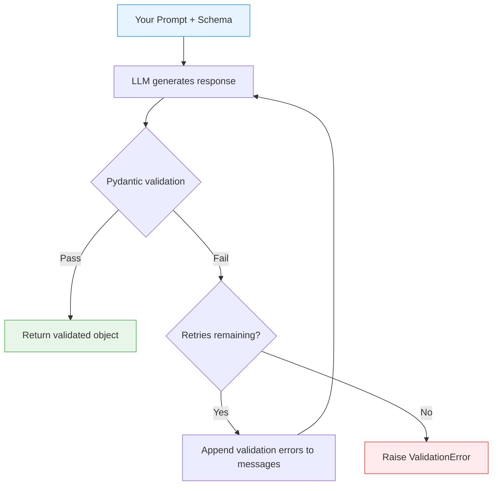

# Chapter 3: Validation, Errors, and Retries

> Enforce data quality with Pydantic validation, custom errors, and automatic retries.

## Overview

In the previous chapter you learned how to design Pydantic models that guide the LLM toward well-structured output. But what happens when the model still gets it wrong? Maybe it returns an age of 250, an email address that is clearly malformed, or a date range where the end comes before the start.

That is where validation and retries come in. Instructor validates every LLM response against your schema. When something fails, it does not simply give up. Instead, it feeds the validation errors back to the LLM and asks it to try again. This self-correcting loop is one of Instructor's most powerful features, and understanding how to control it is the key to building reliable structured-output pipelines.

In this chapter you will learn:

- How Instructor's retry loop works under the hood
- How to write field-level validators for common patterns (emails, dates, URLs, and more)
- How to write model-level validators for cross-field rules
- How to customize retry strategies
- How to handle validation errors gracefully in production
- How to put it all together in a real-world invoice validation example

## The Validation-Retry Loop

Before diving into code, let's visualize the core mechanism that makes Instructor so effective. When you call `client.responses.create()` with a `response_model`, here is what happens behind the scenes:



The important thing to notice is the feedback loop: validation errors become part of the next prompt. The LLM sees exactly what went wrong ("age must be less than or equal to 120") and can correct its output on the next attempt. This is not a blind retry -- it is an informed retry.

## Built-in Validation and Retries

Pydantic gives you a rich set of built-in constraints that Instructor enforces automatically. You already saw a taste of this in Chapter 2, but let's look at it with the retry mechanism in focus.

```python
from pydantic import BaseModel, Field, ValidationError
import instructor
from openai import OpenAI

# Patch the OpenAI client with Instructor
client = instructor.from_openai(OpenAI())

class Person(BaseModel):
    name: str = Field(
        ...,
        min_length=3,
        description="Full name of the person"
    )
    age: int = Field(
        ...,
        ge=0,
        le=120,
        description="Age in years, must be realistic"
    )
    email: str | None = Field(
        None,
        description="Valid email address if provided"
    )

try:
    person = client.responses.create(
        model="gpt-4o-mini",
        messages=[
            {
                "role": "user",
                "content": "Extract the person: John Doe, 35, john@example.com"
            }
        ],
        response_model=Person,
        max_retries=3,  # Instructor will try up to 3 more times on failure
    )
    print(person)
    # name='John Doe' age=35 email='john@example.com'
except ValidationError as e:
    print("Validation failed after all retries:", e)
```

A few things to note:

- **`max_retries`** controls how many additional attempts Instructor will make after the first failure. Setting it to 3 means the LLM gets up to 4 total chances (1 original + 3 retries).
- **`ValidationError`** is raised only if all retries are exhausted and the output still does not pass validation.
- **Built-in constraints** like `min_length`, `ge` (greater than or equal), and `le` (less than or equal) are enforced on every attempt.

## How Retries Work Under the Hood

Understanding the retry mechanism helps you write better schemas and prompts. Here is what Instructor does on each retry:

1. **The LLM generates a response** based on your prompt and the schema definition.
2. **Pydantic validates the response.** If it passes, Instructor returns the validated object immediately.
3. **If validation fails**, Instructor captures the `ValidationError` details -- which fields failed, what the constraints were, and what values were attempted.
4. **Instructor appends a new message** to the conversation. This message contains the raw validation error, formatted so the LLM can understand what went wrong.
5. **The LLM tries again**, now with the original prompt plus the error feedback in context.

Here is a simplified view of what the retry message looks like internally:

```
Recall the function correctly, fix the errors and try again.

Validation Errors:
1 validation error for Person
age
  Input should be less than or equal to 120 [type=less_than_equal, input_value=250, input_type=int]
```

This is incredibly effective because modern LLMs are good at following correction instructions. They see the specific constraint ("less than or equal to 120"), the value they produced (250), and can adjust accordingly.

The practical takeaway: **write clear, specific constraints and descriptions**. The more precise your validation error messages are, the better the LLM can self-correct on retry.

## Custom Validation with `field_validator`

Built-in constraints cover many cases, but real-world applications need domain-specific rules. Pydantic's `field_validator` decorator lets you write custom logic for individual fields. When these validators raise `ValueError`, Instructor treats them the same as built-in constraint failures -- the error message is fed back to the LLM on retry.

### Basic Example: Concise Comments

```python
from pydantic import BaseModel, Field, field_validator

class Survey(BaseModel):
    satisfaction: int = Field(..., ge=1, le=5)
    comment: str

    @field_validator("comment")
    @classmethod
    def must_be_concise(cls, v):
        """Reject comments that are too long."""
        if len(v.split()) > 50:
            raise ValueError(
                "Comment too long; keep it under 50 words. "
                "Summarize the key point instead."
            )
        return v
```

Notice that the error message is written for the LLM to read. It tells the model not just what went wrong, but what to do about it. This is a best practice for all custom validators.

### Email Validation

```python
import re
from pydantic import BaseModel, field_validator

class ContactInfo(BaseModel):
    name: str
    email: str

    @field_validator("email")
    @classmethod
    def validate_email_format(cls, v):
        """Check that the email looks like a real email address."""
        # A practical regex -- not RFC-complete, but catches common issues
        pattern = r"^[a-zA-Z0-9._%+-]+@[a-zA-Z0-9.-]+\.[a-zA-Z]{2,}$"
        if not re.match(pattern, v):
            raise ValueError(
                f"'{v}' is not a valid email address. "
                "Use the format user@domain.com"
            )
        return v.lower()  # Normalize to lowercase
```

The validator does double duty here: it rejects bad values and normalizes good ones by converting to lowercase. The LLM will not produce a lowercase email on its own, but the validator ensures consistency.

### Date Range Validation

```python
from datetime import date
from pydantic import BaseModel, Field, field_validator

class EventBooking(BaseModel):
    event_name: str
    start_date: date = Field(..., description="ISO format: YYYY-MM-DD")
    end_date: date = Field(..., description="ISO format: YYYY-MM-DD")

    @field_validator("end_date")
    @classmethod
    def end_after_start(cls, v, info):
        """Ensure the event does not end before it starts."""
        # info.data contains previously validated fields
        start = info.data.get("start_date")
        if start and v < start:
            raise ValueError(
                f"end_date ({v}) cannot be before start_date ({start}). "
                "Swap the dates or correct the range."
            )
        return v

    @field_validator("start_date")
    @classmethod
    def not_in_the_past(cls, v):
        """Prevent booking events in the past."""
        if v < date.today():
            raise ValueError(
                f"start_date ({v}) is in the past. "
                "Use today's date or a future date."
            )
        return v
```

A note on field order: Pydantic validates fields in the order they are defined. In the example above, `start_date` is validated before `end_date`, so when the `end_after_start` validator runs, `info.data["start_date"]` is already available. Keep this in mind when writing validators that depend on other fields.

### URL Validation

```python
from urllib.parse import urlparse
from pydantic import BaseModel, field_validator

class Bookmark(BaseModel):
    title: str
    url: str
    category: str

    @field_validator("url")
    @classmethod
    def validate_url(cls, v):
        """Ensure the URL is well-formed with a valid scheme."""
        parsed = urlparse(v)
        if parsed.scheme not in ("http", "https"):
            raise ValueError(
                f"URL must start with http:// or https://, got '{v}'. "
                "Provide a complete URL with scheme."
            )
        if not parsed.netloc or "." not in parsed.netloc:
            raise ValueError(
                f"URL has an invalid domain: '{parsed.netloc}'. "
                "Use a real domain like example.com."
            )
        return v
```

For even stricter URL validation, you can use Pydantic's built-in `HttpUrl` type from Chapter 2. The custom validator approach is useful when you need to allow specific schemes or apply custom normalization.

## Cross-Field Validation with `model_validator`

Sometimes a field is only valid in relation to other fields. For these situations, Pydantic provides `model_validator`, which runs after all individual fields have been validated and gives you access to the entire model.

### Price Range Consistency

```python
from pydantic import BaseModel, Field, model_validator

class PriceRange(BaseModel):
    product_name: str
    min_price: float = Field(..., ge=0, description="Minimum price in USD")
    max_price: float = Field(..., ge=0, description="Maximum price in USD")
    currency: str = Field(default="USD", description="ISO 4217 currency code")

    @model_validator(mode="after")
    def min_less_than_max(self):
        """Ensure the price range makes sense."""
        if self.min_price > self.max_price:
            raise ValueError(
                f"min_price ({self.min_price}) cannot exceed "
                f"max_price ({self.max_price}). "
                "Swap them or correct the values."
            )
        return self
```

### Shipping Address Completeness

```python
from pydantic import BaseModel, Field, model_validator

class ShippingAddress(BaseModel):
    street: str
    city: str
    state: str | None = None
    zip_code: str | None = None
    country: str = Field(..., description="ISO 3166-1 alpha-2 code, e.g. US, GB, DE")

    @model_validator(mode="after")
    def us_address_requires_state_and_zip(self):
        """US addresses must have both state and zip code."""
        if self.country == "US":
            missing = []
            if not self.state:
                missing.append("state")
            if not self.zip_code:
                missing.append("zip_code")
            if missing:
                raise ValueError(
                    f"US addresses require {', '.join(missing)}. "
                    "Provide the full address."
                )
        return self
```

### User Registration Sanity Check

```python
from pydantic import BaseModel, Field, model_validator

class UserRegistration(BaseModel):
    username: str = Field(..., min_length=3, max_length=30)
    email: str
    role: str = Field(..., description="One of: admin, editor, viewer")
    can_delete: bool = Field(
        default=False,
        description="Whether the user can delete resources"
    )

    @model_validator(mode="after")
    def only_admins_can_delete(self):
        """Non-admin users should not have delete permissions."""
        if self.can_delete and self.role != "admin":
            raise ValueError(
                f"Only admins can have delete permissions, "
                f"but role is '{self.role}'. "
                "Either change the role to 'admin' or set can_delete to false."
            )
        return self
```

The pattern is the same in every case: check the relationship between fields, raise a `ValueError` with a clear corrective message, and return `self` if everything is fine. Instructor feeds the error message to the LLM on retry, so make it actionable.

## Custom Retry Strategies

The default retry behavior -- retrying up to `max_retries` times with error feedback -- works well for most use cases. But sometimes you want more control.

### Using Tenacity for Advanced Retries

Instructor integrates with the `tenacity` library, which gives you fine-grained control over retry behavior including exponential backoff, custom wait strategies, and conditional retries.

```python
import instructor
from openai import OpenAI
from pydantic import BaseModel, Field
from tenacity import Retrying, stop_after_attempt, wait_exponential

client = instructor.from_openai(OpenAI())

class ExtractedEntity(BaseModel):
    name: str = Field(..., min_length=2)
    entity_type: str = Field(..., description="person, org, or location")
    confidence: float = Field(..., ge=0.0, le=1.0)

# Define a custom retry strategy with exponential backoff
entity = client.responses.create(
    model="gpt-4o-mini",
    messages=[
        {"role": "user", "content": "Extract: Apple Inc. is based in Cupertino."}
    ],
    response_model=ExtractedEntity,
    max_retries=Retrying(
        stop=stop_after_attempt(3),       # Stop after 3 attempts
        wait=wait_exponential(
            multiplier=1,                  # Start with 1 second
            min=1,                         # Minimum wait: 1 second
            max=10,                        # Maximum wait: 10 seconds
        ),
    ),
)
```

Exponential backoff is especially useful when you are hitting rate limits or when the LLM provider has intermittent issues. The wait time increases with each retry (1s, 2s, 4s, ...), reducing the chance of overwhelming the API.

### Adjusting Retries Based on Error Type

You can also use tenacity's `retry_if_exception_type` to only retry on specific errors:

```python
from pydantic import ValidationError
from tenacity import Retrying, retry_if_exception_type, stop_after_attempt

# Only retry on validation errors, not on API errors
entity = client.responses.create(
    model="gpt-4o-mini",
    messages=[
        {"role": "user", "content": "Extract the main entity from this text."}
    ],
    response_model=ExtractedEntity,
    max_retries=Retrying(
        stop=stop_after_attempt(3),
        retry=retry_if_exception_type(ValidationError),
    ),
)
```

This is useful in production where you want to distinguish between "the LLM gave a bad answer" (worth retrying) and "the API is down" (not worth retrying).

## Validation Error Handling

In production code, you need robust error handling. Here are patterns for catching, logging, and recovering from validation failures.

### Basic Try/Except Pattern

```python
from pydantic import ValidationError
import instructor
from openai import OpenAI

client = instructor.from_openai(OpenAI())

def extract_person(text: str) -> Person | None:
    """Extract a person from text, returning None on failure."""
    try:
        return client.responses.create(
            model="gpt-4o-mini",
            messages=[{"role": "user", "content": text}],
            response_model=Person,
            max_retries=2,
        )
    except ValidationError as e:
        # All retries exhausted; the LLM could not produce valid output
        print(f"Validation failed: {e.error_count()} error(s)")
        for error in e.errors():
            print(f"  - {error['loc']}: {error['msg']}")
        return None
    except Exception as e:
        # API errors, network issues, etc.
        print(f"Unexpected error: {e}")
        return None
```

### Structured Logging for Production

In a real application, you want structured logs that can be queried and alerted on.

```python
import logging
import json
from pydantic import ValidationError

# Set up a structured logger
logger = logging.getLogger("instructor.validation")
logger.setLevel(logging.INFO)

def extract_with_logging(text: str, model_class, retries: int = 2):
    """Extract structured data with comprehensive logging."""
    try:
        result = client.responses.create(
            model="gpt-4o-mini",
            messages=[{"role": "user", "content": text}],
            response_model=model_class,
            max_retries=retries,
        )
        logger.info(
            "Extraction succeeded",
            extra={
                "model_class": model_class.__name__,
                "input_length": len(text),
            },
        )
        return result

    except ValidationError as e:
        # Log the full error details for debugging
        logger.warning(
            "Validation failed after retries",
            extra={
                "model_class": model_class.__name__,
                "error_count": e.error_count(),
                "errors": json.dumps(e.errors(), default=str),
                "input_length": len(text),
            },
        )
        return None

    except Exception as e:
        logger.error(
            "Extraction error",
            extra={
                "model_class": model_class.__name__,
                "error_type": type(e).__name__,
                "error_message": str(e),
            },
        )
        raise
```

### Fallback Values

Sometimes you need a result even when validation fails. You can define a fallback that returns a safe default:

```python
from pydantic import BaseModel, Field

class SentimentResult(BaseModel):
    text: str
    sentiment: str = Field(..., description="positive, negative, or neutral")
    confidence: float = Field(..., ge=0.0, le=1.0)

def analyze_sentiment(text: str) -> SentimentResult:
    """Analyze sentiment with a safe fallback."""
    try:
        return client.responses.create(
            model="gpt-4o-mini",
            messages=[{"role": "user", "content": f"Analyze sentiment: {text}"}],
            response_model=SentimentResult,
            max_retries=2,
        )
    except Exception:
        # Return a conservative default rather than crashing
        return SentimentResult(
            text=text,
            sentiment="neutral",
            confidence=0.0,
        )
```

## Handling Partial Failures

When your schema contains a list of items, a single bad item can fail the entire response. There are a few strategies for dealing with this.

### Let Instructor Retry the Whole Response

This is the default behavior. If one product in a list of ten fails validation, Instructor sends all the errors back and the LLM regenerates the entire list.

```python
class Product(BaseModel):
    name: str
    price: float = Field(..., ge=0)

class Catalog(BaseModel):
    products: list[Product]
```

This works well for small lists, but for larger lists it can be wasteful. The LLM has to regenerate everything, including the items that were already valid.

### Split Large Lists Into Individual Calls

For large lists, consider extracting items one at a time or in small batches:

```python
def extract_products(descriptions: list[str]) -> list[Product]:
    """Extract products one at a time for better error isolation."""
    products = []
    for desc in descriptions:
        try:
            product = client.responses.create(
                model="gpt-4o-mini",
                messages=[
                    {"role": "user", "content": f"Extract product: {desc}"}
                ],
                response_model=Product,
                max_retries=2,
            )
            products.append(product)
        except ValidationError:
            # Skip this item and continue with the rest
            logger.warning(f"Could not extract product from: {desc}")
    return products
```

This isolates failures so one bad item does not bring down the whole batch.

## Real-World Example: Invoice Validation

Let's put everything together with a realistic example. Imagine you are building a system that extracts invoice data from unstructured text (emails, PDFs, etc.) and needs to validate every field before sending it to your accounting system.

```python
import re
from datetime import date, timedelta
from pydantic import BaseModel, Field, field_validator, model_validator
import instructor
from openai import OpenAI

client = instructor.from_openai(OpenAI())


class LineItem(BaseModel):
    """A single line item on an invoice."""
    description: str = Field(
        ...,
        min_length=3,
        description="Brief description of the product or service"
    )
    quantity: int = Field(..., ge=1, le=10000)
    unit_price: float = Field(
        ...,
        ge=0.01,
        description="Price per unit in the invoice currency"
    )
    total: float = Field(
        ...,
        ge=0.01,
        description="quantity * unit_price"
    )

    @model_validator(mode="after")
    def total_matches_calculation(self):
        """Ensure the line total is consistent with quantity and unit_price."""
        expected = round(self.quantity * self.unit_price, 2)
        if abs(self.total - expected) > 0.01:
            raise ValueError(
                f"Line total ({self.total}) does not match "
                f"quantity ({self.quantity}) * unit_price ({self.unit_price}) "
                f"= {expected}. Use the correct calculated total."
            )
        return self


class Invoice(BaseModel):
    """A validated invoice extracted from unstructured text."""
    invoice_number: str = Field(
        ...,
        description="Unique invoice identifier, e.g. INV-2024-001"
    )
    vendor_name: str = Field(..., min_length=2)
    vendor_email: str = Field(..., description="Vendor contact email")
    issue_date: date = Field(..., description="Date the invoice was issued, YYYY-MM-DD")
    due_date: date = Field(..., description="Payment due date, YYYY-MM-DD")
    currency: str = Field(
        default="USD",
        description="ISO 4217 currency code"
    )
    line_items: list[LineItem] = Field(
        ...,
        min_length=1,
        description="At least one line item required"
    )
    subtotal: float = Field(..., ge=0)
    tax_rate: float = Field(
        ...,
        ge=0,
        le=1,
        description="Tax rate as a decimal, e.g. 0.08 for 8%"
    )
    tax_amount: float = Field(..., ge=0)
    total_due: float = Field(..., ge=0)
    notes: str | None = Field(None, description="Optional notes or payment instructions")

    # -- Field validators --

    @field_validator("invoice_number")
    @classmethod
    def validate_invoice_number(cls, v):
        """Invoice numbers should follow a recognizable pattern."""
        if not re.match(r"^[A-Z]{2,5}-\d{4}-\d{3,6}$", v):
            raise ValueError(
                f"Invoice number '{v}' does not match expected format. "
                "Use the pattern: PREFIX-YYYY-NNNNN (e.g. INV-2024-00123)."
            )
        return v

    @field_validator("vendor_email")
    @classmethod
    def validate_vendor_email(cls, v):
        """Check for a valid email format."""
        pattern = r"^[a-zA-Z0-9._%+-]+@[a-zA-Z0-9.-]+\.[a-zA-Z]{2,}$"
        if not re.match(pattern, v):
            raise ValueError(
                f"'{v}' is not a valid email. Use format: user@domain.com"
            )
        return v.lower()

    @field_validator("currency")
    @classmethod
    def validate_currency_code(cls, v):
        """Only accept common ISO 4217 codes."""
        allowed = {"USD", "EUR", "GBP", "CAD", "AUD", "JPY", "CHF"}
        if v.upper() not in allowed:
            raise ValueError(
                f"Currency '{v}' is not supported. "
                f"Use one of: {', '.join(sorted(allowed))}"
            )
        return v.upper()

    # -- Model validators --

    @model_validator(mode="after")
    def due_date_after_issue_date(self):
        """The due date must not be before the issue date."""
        if self.due_date < self.issue_date:
            raise ValueError(
                f"due_date ({self.due_date}) is before issue_date ({self.issue_date}). "
                "The due date must come on or after the issue date."
            )
        return self

    @model_validator(mode="after")
    def due_date_within_reasonable_range(self):
        """Invoices should not be due more than 365 days out."""
        max_due = self.issue_date + timedelta(days=365)
        if self.due_date > max_due:
            raise ValueError(
                f"due_date ({self.due_date}) is more than 365 days after "
                f"issue_date ({self.issue_date}). Use a reasonable payment term."
            )
        return self

    @model_validator(mode="after")
    def totals_are_consistent(self):
        """Verify that subtotal, tax, and total add up correctly."""
        expected_subtotal = round(sum(item.total for item in self.line_items), 2)
        if abs(self.subtotal - expected_subtotal) > 0.01:
            raise ValueError(
                f"subtotal ({self.subtotal}) does not match sum of line item "
                f"totals ({expected_subtotal}). Recalculate the subtotal."
            )

        expected_tax = round(self.subtotal * self.tax_rate, 2)
        if abs(self.tax_amount - expected_tax) > 0.01:
            raise ValueError(
                f"tax_amount ({self.tax_amount}) does not match "
                f"subtotal ({self.subtotal}) * tax_rate ({self.tax_rate}) "
                f"= {expected_tax}. Recalculate the tax amount."
            )

        expected_total = round(self.subtotal + self.tax_amount, 2)
        if abs(self.total_due - expected_total) > 0.01:
            raise ValueError(
                f"total_due ({self.total_due}) does not match "
                f"subtotal ({self.subtotal}) + tax_amount ({self.tax_amount}) "
                f"= {expected_total}. Recalculate the total."
            )

        return self
```

Now use it with Instructor:

```python
invoice_text = """
From: billing@acmewidgets.com
Invoice #INV-2024-00042

Acme Widgets Inc.
Date: January 15, 2024
Due: February 14, 2024

Items:
- Widget A (x10) at $4.99 each = $49.90
- Widget B (x5) at $12.50 each = $62.50
- Shipping = $8.99

Subtotal: $121.39
Tax (8%): $9.71
Total Due: $131.10

Payment terms: Net 30. Please remit to accounts@acmewidgets.com
"""

invoice = client.responses.create(
    model="gpt-4o-mini",
    messages=[
        {
            "role": "system",
            "content": (
                "Extract the invoice data from the text. "
                "Calculate all totals precisely. Use ISO date format."
            ),
        },
        {"role": "user", "content": invoice_text},
    ],
    response_model=Invoice,
    max_retries=3,
)

# At this point, every field has been validated:
# - Invoice number matches the expected pattern
# - Email is well-formed
# - Dates are in the right order and range
# - Every line item total = quantity * unit_price
# - Subtotal = sum of line item totals
# - Tax = subtotal * tax_rate
# - Total = subtotal + tax
print(f"Invoice {invoice.invoice_number}: ${invoice.total_due}")
```

This example shows the real power of combining field validators, model validators, and Instructor's retry loop. The LLM might get the math slightly wrong on the first attempt, but the validators catch it and the retry feedback tells the LLM exactly how to fix the calculation.

## Validation Checklist

Here is a quick reference table for choosing the right validation strategy:

| What you want to validate | Approach | Example |
|---|---|---|
| Value range (min/max) | `Field(ge=0, le=100)` | Age, price, rating |
| String length | `Field(min_length=3, max_length=100)` | Name, title, code |
| Fixed set of choices | `Literal["a", "b", "c"]` | Status, category, role |
| String format (email, URL) | `field_validator` with regex | Email, phone, invoice ID |
| Date/time logic | `field_validator` with comparison | Not in past, valid range |
| Normalization (lowercase, trim) | `field_validator` returning cleaned value | Email, URL, codes |
| Cross-field consistency | `model_validator(mode="after")` | Date ranges, price min/max |
| Calculated fields | `model_validator(mode="after")` | Totals, checksums |
| List size constraints | `Field(min_length=1, max_length=10)` | Line items, tags |
| Advanced retry control | `tenacity.Retrying` as `max_retries` | Rate limits, backoff |

## Tips

- **Write error messages for the LLM.** Your validator's `ValueError` message becomes the retry prompt. Make it specific and actionable ("use format YYYY-MM-DD" is better than "invalid date").
- **Use constraints before custom validators.** Built-in constraints like `ge`, `le`, `min_length` are simpler, faster, and produce clear error messages automatically.
- **Keep `max_retries` small (1-3).** Each retry costs a full LLM call. If you need more than 3 retries, your schema or prompt probably needs improvement.
- **Add short field descriptions.** They serve as hints to the LLM during generation and make retry error context clearer.
- **Test validators independently.** You can unit test your Pydantic models without calling the LLM at all -- just instantiate them with test data.
- **Log validation failures in production.** They reveal patterns in what the LLM gets wrong, which helps you improve prompts and schemas over time.

---

Previous: [Chapter 2: Pydantic Models](02-pydantic-models.md) | Next: [Chapter 4: Complex Structures](04-complex.md)
