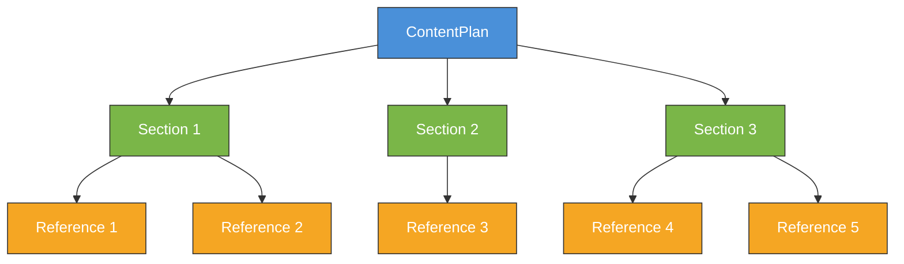

# Chapter 4: Complex Structures and Nested Data

Welcome to **Chapter 4: Complex Structures and Nested Data**. In this part of **Instructor Tutorial: Structured LLM Outputs**, you will build an intuitive mental model first, then move into concrete implementation details and practical production tradeoffs.


> Model nested objects, arrays, and rich domain data without losing validation guarantees.

## Overview

So far we have extracted flat objects and added validation. Real-world data is rarely flat, though. You will encounter deeply nested JSON, polymorphic types, recursive trees, and documents that are too long to fit in a single prompt. This chapter walks through all of those scenarios.

Instructor plus strong Pydantic schemas keep outputs predictable even when the structure gets complicated. The key insight is that **every nested model is itself validated**, so errors bubble up through the entire tree and trigger retries at the top level.

By the end of this chapter you will be able to:

- Compose deeply nested models and understand how they relate to each other.
- Define recursive and self-referencing structures (think org charts or comment threads).
- Use union types and discriminated unions for polymorphic extraction.
- Handle long documents by chunking and merging results.
- Extract knowledge graphs with entities and typed relationships.
- Tune performance when schemas grow large.

## How Nested Models Compose

Before diving into code, it helps to visualize how Pydantic models nest inside each other. When you define a field whose type is another `BaseModel`, Instructor asks the LLM to produce JSON that matches the entire tree. Validation starts at the leaves and works its way up.



Each color represents a level of nesting. The LLM produces JSON for the entire tree in a single call, and Pydantic validates every node. If `Reference 4` has an invalid URL, the whole `ContentPlan` fails validation, which triggers a retry with the specific error message sent back to the model.

## Nested Content Plan Example

Let's start with the content plan from the diagram above. This is a practical example you might use to generate tutorial outlines, blog post structures, or documentation skeletons.

```python
from pydantic import BaseModel, Field, HttpUrl, conint
from typing import Literal
import instructor
from openai import OpenAI

# Patch the client once; use it everywhere
client = instructor.from_openai(OpenAI())

class Reference(BaseModel):
    """A supporting link for a section."""
    title: str = Field(..., description="Descriptive link text, not a raw URL")
    url: HttpUrl

class Section(BaseModel):
    """One section of the content plan."""
    heading: str = Field(..., description="short, actionable heading")
    summary: str = Field(..., max_length=280, description="tweet-length summary")
    bullets: list[str] = Field(
        ...,
        max_items=4,
        description="tight bullet list, 5-10 words each"
    )
    references: list[Reference] = Field(
        default_factory=list,
        max_items=3,
        description="optional supporting links"
    )

class ContentPlan(BaseModel):
    """A structured tutorial outline."""
    topic: str
    audience: Literal["beginner", "intermediate", "expert"]
    sections: list[Section] = Field(..., min_items=3, max_items=6)
```

Now call the API. Notice that the `response_model` is a single top-level class, but Instructor knows how to recurse into every nested model.

```python
plan = client.responses.create(
    model="gpt-4o-mini",
    messages=[
        {
            "role": "user",
            "content": (
                "Create a tutorial outline about building a Next.js + CopilotKit app. "
                "Target intermediate developers. Include references to real documentation."
            ),
        }
    ],
    response_model=ContentPlan,
    max_retries=2,  # retry if nested validation fails
)

# Pretty-print the result
print(f"Topic: {plan.topic}")
print(f"Audience: {plan.audience}")
for i, section in enumerate(plan.sections, 1):
    print(f"\n--- Section {i}: {section.heading} ---")
    print(f"  Summary: {section.summary}")
    for bullet in section.bullets:
        print(f"  - {bullet}")
    for ref in section.references:
        print(f"  Link: {ref.title} -> {ref.url}")
```

**Sample output:**

```
Topic: Building a Next.js + CopilotKit App
Audience: intermediate

--- Section 1: Set Up the Project ---
  Summary: Scaffold a Next.js project and install CopilotKit dependencies.
  - Initialize Next.js with create-next-app
  - Install @copilotkit/react-core package
  - Configure environment variables for API keys
  Link: CopilotKit Quickstart -> https://docs.copilotkit.ai/quickstart

--- Section 2: Add a Chat Sidebar ---
  Summary: Integrate the CopilotKit sidebar component into your layout.
  - Import CopilotSidebar from the UI package
  - Wrap your app with CopilotProvider
  - Customize the sidebar theme and position
  Link: CopilotKit React Reference -> https://docs.copilotkit.ai/reference/react

--- Section 3: Connect Backend Actions ---
  Summary: Wire server-side actions so the copilot can call your API routes.
  - Create a Next.js API route for copilot actions
  - Register actions with useCopilotAction hook
  - Test the round-trip from chat to backend
  Link: CopilotKit Actions Guide -> https://docs.copilotkit.ai/guides/actions
```

The key takeaway: you defined the shape once, and Instructor handled all the JSON generation and validation across three levels of nesting.

## Controlling Length and Depth

Nested structures can balloon quickly. Here are practical techniques to keep things under control:

- **`max_items` on lists** -- Cap how many items the LLM can produce. Without this, a model asked for "all possible sections" might generate dozens.
- **`max_length` on strings** -- Keep summaries tight. Adding a description like "tweet-length, under 280 characters" gives the model a concrete target.
- **Descriptive field hints** -- Tell the model what you want: `"3 bullets, 5-10 words each"`. LLMs follow formatting instructions surprisingly well.
- **Break big objects into smaller calls** -- If you need 50 items, request them in batches of 10 and merge in Python. This is cheaper and more accurate.

## Hierarchical IDs

When your extracted data needs stable references (for example, steps in a playbook that refer to each other), generate IDs on the Python side rather than asking the LLM to invent them.

```python
from uuid import uuid4

class Step(BaseModel):
    """A single step in a playbook."""
    id: str = Field(
        default_factory=lambda: str(uuid4()),
        description="Auto-generated unique identifier"
    )
    action: str = Field(..., description="what to do in this step")
    expected: str = Field(..., description="expected outcome after completing this step")

class Playbook(BaseModel):
    name: str
    steps: list[Step] = Field(..., max_items=10)
```

IDs generated by `default_factory` ensure stable references without asking the LLM to invent UUIDs. The model fills in `action` and `expected`; Python fills in `id`. This division of labor keeps both sides doing what they are best at.

## Recursive and Self-Referencing Models

Some data is naturally recursive. Think of a comment thread where each comment can have replies, or an organizational chart where each manager has reports who may themselves be managers.

Pydantic v2 supports self-referencing models, but you need to use `model_rebuild()` or a forward reference. Here is how to extract a nested comment thread:

```python
from __future__ import annotations  # enables forward references
from pydantic import BaseModel, Field
import instructor
from openai import OpenAI

client = instructor.from_openai(OpenAI())

class Comment(BaseModel):
    """A comment that can have nested replies."""
    author: str
    text: str = Field(..., max_length=500)
    sentiment: Literal["positive", "neutral", "negative"]
    replies: list[Comment] = Field(
        default_factory=list,
        max_items=3,
        description="nested replies to this comment, if any"
    )

# Rebuild the model so Pydantic resolves the forward reference
Comment.model_rebuild()
```

Now extract a thread from unstructured text:

```python
from typing import Literal

thread = client.responses.create(
    model="gpt-4o-mini",
    messages=[
        {
            "role": "user",
            "content": """Extract the comment thread from this forum post:

            Alice: Great tutorial! Really helped me understand async/await.
              Bob (reply to Alice): Agreed, the examples were clear.
                Carol (reply to Bob): I still don't get the error handling part though.
              Dave (reply to Alice): Would love a follow-up on generators.
            Eve: The code samples didn't work on Python 3.9.
            """,
        }
    ],
    response_model=list[Comment],
    max_retries=2,
)

# Helper to print the tree
def print_thread(comments, indent=0):
    for c in comments:
        prefix = "  " * indent
        print(f"{prefix}{c.author} [{c.sentiment}]: {c.text}")
        print_thread(c.replies, indent + 1)

print_thread(thread)
```

**Sample output:**

```
Alice [positive]: Great tutorial! Really helped me understand async/await.
  Bob [positive]: Agreed, the examples were clear.
    Carol [negative]: I still don't get the error handling part though.
  Dave [positive]: Would love a follow-up on generators.
Eve [negative]: The code samples didn't work on Python 3.9.
```

A word of caution: recursive models work well for two or three levels of nesting. Beyond that, you are asking the LLM to produce deeply nested JSON, which increases the chance of structural errors. For very deep trees, consider extracting one level at a time and assembling in Python.

## Union Types and Discriminated Unions

Sometimes a field can hold different types of objects. For example, a content block might be a paragraph, an image, or a code snippet. Pydantic's discriminated unions let you handle this cleanly.

```python
from pydantic import BaseModel, Field
from typing import Literal, Union
import instructor
from openai import OpenAI

client = instructor.from_openai(OpenAI())

class Paragraph(BaseModel):
    """A block of prose text."""
    block_type: Literal["paragraph"] = "paragraph"
    text: str

class Image(BaseModel):
    """An image with alt text."""
    block_type: Literal["image"] = "image"
    alt_text: str
    url: str = Field(..., description="URL or file path of the image")

class CodeSnippet(BaseModel):
    """A block of source code."""
    block_type: Literal["code"] = "code"
    language: str = Field(..., description="programming language, e.g. python, javascript")
    source: str

# The discriminator tells Pydantic which class to use based on block_type
ContentBlock = Union[Paragraph, Image, CodeSnippet]

class Article(BaseModel):
    title: str
    blocks: list[ContentBlock] = Field(
        ...,
        min_items=2,
        max_items=10,
        description="ordered content blocks; each must have a block_type field"
    )
```

The `block_type` field acts as a discriminator. When the LLM produces `{"block_type": "code", "language": "python", "source": "..."}`, Pydantic knows to validate it against `CodeSnippet` rather than `Paragraph`.

```python
article = client.responses.create(
    model="gpt-4o-mini",
    messages=[
        {
            "role": "user",
            "content": (
                "Write a short article about Python list comprehensions. "
                "Include a paragraph intro, a code example, and an image placeholder."
            ),
        }
    ],
    response_model=Article,
)

for block in article.blocks:
    if block.block_type == "paragraph":
        print(f"[TEXT] {block.text[:80]}...")
    elif block.block_type == "code":
        print(f"[CODE ({block.language})]\n{block.source}")
    elif block.block_type == "image":
        print(f"[IMAGE] {block.alt_text} -> {block.url}")
```

Discriminated unions are especially useful when you are parsing semi-structured documents where the content type varies from block to block. The LLM sets the discriminator field, and Pydantic routes validation to the correct model automatically.

## Extracting from Long Documents

LLMs have context windows, and even large-context models can lose accuracy in the middle of very long inputs. When you need to extract structured data from a 50-page document, you need a chunking strategy.

### Strategy 1: Sliding Window with Overlap

Split the document into overlapping chunks so you do not miss information at chunk boundaries.

```python
def chunk_text(text: str, chunk_size: int = 3000, overlap: int = 500) -> list[str]:
    """Split text into overlapping chunks."""
    chunks = []
    start = 0
    while start < len(text):
        end = start + chunk_size
        chunks.append(text[start:end])
        start = end - overlap  # slide back by the overlap amount
    return chunks
```

### Strategy 2: Extract per Chunk, then Deduplicate

Run extraction on each chunk independently, then merge and deduplicate the results.

```python
from pydantic import BaseModel, Field
import instructor
from openai import OpenAI

client = instructor.from_openai(OpenAI())

class KeyFinding(BaseModel):
    """A single finding extracted from a document chunk."""
    claim: str = Field(..., description="the factual claim or finding")
    evidence: str = Field(..., max_length=300, description="supporting quote from the text")
    confidence: Literal["high", "medium", "low"]

class ChunkFindings(BaseModel):
    findings: list[KeyFinding] = Field(..., max_items=5)

def extract_from_document(full_text: str) -> list[KeyFinding]:
    """Extract findings from a long document using chunked processing."""
    chunks = chunk_text(full_text)
    all_findings = []

    for i, chunk in enumerate(chunks):
        print(f"Processing chunk {i + 1}/{len(chunks)}...")
        result = client.responses.create(
            model="gpt-4o-mini",
            messages=[
                {
                    "role": "system",
                    "content": (
                        "Extract key findings from the following document excerpt. "
                        "Only include findings that are clearly stated in the text."
                    ),
                },
                {"role": "user", "content": chunk},
            ],
            response_model=ChunkFindings,
        )
        all_findings.extend(result.findings)

    return deduplicate_findings(all_findings)
```

### Strategy 3: Two-Pass Extraction

For highly structured documents, use a two-pass approach:

1. **First pass** -- extract a high-level outline (headings, section titles).
2. **Second pass** -- for each section, extract detailed data using a focused prompt.

```python
class SectionOutline(BaseModel):
    heading: str
    page_range: str = Field(..., description="e.g. 'pages 3-7'")
    summary: str = Field(..., max_length=200)

class DocumentOutline(BaseModel):
    title: str
    sections: list[SectionOutline] = Field(..., max_items=20)

# First pass: get the outline
outline = client.responses.create(
    model="gpt-4o-mini",
    messages=[
        {"role": "user", "content": f"Outline this document:\n\n{full_text[:8000]}"}
    ],
    response_model=DocumentOutline,
)

# Second pass: extract details per section
for section in outline.sections:
    # Find the relevant chunk for this section and extract in detail
    section_text = find_section_text(full_text, section.heading)
    details = client.responses.create(
        model="gpt-4o-mini",
        messages=[
            {"role": "user", "content": f"Extract detailed findings from:\n\n{section_text}"}
        ],
        response_model=ChunkFindings,
    )
```

The two-pass approach is more expensive (more API calls) but produces better results because each call has a focused context window.

## Paginating Large Outputs

If the schema is large (for example, 50+ items), paginate:

1. Ask for high-level structure first (headings only).
2. Request each section separately with `response_model=Section`.
3. Combine in your application code.

This reduces context size and improves accuracy. It also makes it easier to retry individual sections without re-running the entire extraction.

```python
# Step 1: Get just the headings
class Heading(BaseModel):
    title: str
    description: str = Field(..., max_length=100)

class Outline(BaseModel):
    headings: list[Heading] = Field(..., min_items=3, max_items=10)

outline = client.responses.create(
    model="gpt-4o-mini",
    messages=[{"role": "user", "content": "List the main sections for a Python testing guide"}],
    response_model=Outline,
)

# Step 2: Expand each heading into a full section
sections = []
for heading in outline.headings:
    section = client.responses.create(
        model="gpt-4o-mini",
        messages=[
            {
                "role": "user",
                "content": f"Write the '{heading.title}' section: {heading.description}",
            }
        ],
        response_model=Section,  # reuse the Section model from earlier
    )
    sections.append(section)
```

## Validating Relationships

Use validators to enforce cross-field rules. This is where Pydantic really shines -- you can express business logic that goes beyond simple type checking.

```python
from pydantic import model_validator

class Roadmap(BaseModel):
    quarter: str
    goals: list[str] = Field(..., min_items=1)
    risks: list[str]
    milestones: list[str]

    @model_validator(mode="after")
    def goals_and_risks_balanced(self):
        """Ensure the plan is goal-focused, not risk-heavy."""
        if len(self.risks) > len(self.goals):
            raise ValueError("risks cannot exceed goals; focus the plan")
        return self

    @model_validator(mode="after")
    def milestones_match_goals(self):
        """Each goal should have at least one milestone."""
        if len(self.milestones) < len(self.goals):
            raise ValueError(
                f"Expected at least {len(self.goals)} milestones "
                f"(one per goal), got {len(self.milestones)}"
            )
        return self
```

When a cross-field validator fails, Instructor sends the error message back to the LLM on retry. Because the message is descriptive ("risks cannot exceed goals"), the model can correct its output intelligently.

## Real-World Example: Knowledge Graph Extraction

One of the most powerful applications of structured extraction is building knowledge graphs from unstructured text. You extract entities and the relationships between them, producing a graph you can visualize or query.

```python
from pydantic import BaseModel, Field
from typing import Literal
import instructor
from openai import OpenAI

client = instructor.from_openai(OpenAI())

class Entity(BaseModel):
    """A named entity extracted from text."""
    name: str = Field(..., description="canonical name of the entity")
    entity_type: Literal[
        "person", "organization", "technology", "concept", "location", "event"
    ]
    description: str = Field(..., max_length=200, description="one-sentence description")

class Relationship(BaseModel):
    """A directed relationship between two entities."""
    source: str = Field(..., description="name of the source entity (must match an entity name)")
    target: str = Field(..., description="name of the target entity (must match an entity name)")
    relation: str = Field(..., description="type of relationship, e.g. 'founded', 'uses', 'located_in'")
    detail: str = Field(..., max_length=150, description="brief context for this relationship")

class KnowledgeGraph(BaseModel):
    """A knowledge graph with entities and relationships."""
    entities: list[Entity] = Field(..., min_items=2, max_items=20)
    relationships: list[Relationship] = Field(..., min_items=1, max_items=30)

    @model_validator(mode="after")
    def relationships_reference_known_entities(self):
        """Every relationship must connect entities that exist in the graph."""
        entity_names = {e.name for e in self.entities}
        for rel in self.relationships:
            if rel.source not in entity_names:
                raise ValueError(
                    f"Relationship source '{rel.source}' not found in entities. "
                    f"Known entities: {entity_names}"
                )
            if rel.target not in entity_names:
                raise ValueError(
                    f"Relationship target '{rel.target}' not found in entities. "
                    f"Known entities: {entity_names}"
                )
        return self
```

The `model_validator` is critical here. Without it, the LLM might produce relationships that reference entities it forgot to include in the entity list. The validator catches this and the retry prompt tells the model exactly which entity name is missing.

```python
graph = client.responses.create(
    model="gpt-4o-mini",
    messages=[
        {
            "role": "system",
            "content": (
                "Extract a knowledge graph from the text. "
                "Entity names in relationships must exactly match entity names in the entity list."
            ),
        },
        {
            "role": "user",
            "content": """
            OpenAI was founded by Sam Altman and others in San Francisco in 2015.
            The company developed GPT-4 and ChatGPT. Microsoft invested $10 billion
            in OpenAI in 2023. ChatGPT uses the GPT-4 model architecture and became
            the fastest-growing consumer app. OpenAI also developed DALL-E for
            image generation and Whisper for speech recognition.
            """,
        },
    ],
    response_model=KnowledgeGraph,
    max_retries=3,
)

# Print the graph
print("=== Entities ===")
for e in graph.entities:
    print(f"  [{e.entity_type}] {e.name}: {e.description}")

print("\n=== Relationships ===")
for r in graph.relationships:
    print(f"  {r.source} --[{r.relation}]--> {r.target}")
    print(f"    {r.detail}")
```

**Sample output:**

```
=== Entities ===
  [person] Sam Altman: Co-founder and CEO of OpenAI
  [organization] OpenAI: AI research company focused on artificial general intelligence
  [organization] Microsoft: Technology company that invested in OpenAI
  [technology] GPT-4: Large language model developed by OpenAI
  [technology] ChatGPT: Conversational AI product built on GPT-4
  [technology] DALL-E: Image generation model developed by OpenAI
  [technology] Whisper: Speech recognition model developed by OpenAI
  [location] San Francisco: City where OpenAI was founded

=== Relationships ===
  Sam Altman --[co-founded]--> OpenAI
    Sam Altman co-founded OpenAI in 2015
  OpenAI --[located_in]--> San Francisco
    OpenAI was founded in San Francisco
  OpenAI --[developed]--> GPT-4
    OpenAI created the GPT-4 large language model
  OpenAI --[developed]--> ChatGPT
    OpenAI built ChatGPT as a consumer AI product
  ChatGPT --[uses]--> GPT-4
    ChatGPT is built on the GPT-4 model architecture
  Microsoft --[invested_in]--> OpenAI
    Microsoft invested $10 billion in OpenAI in 2023
  OpenAI --[developed]--> DALL-E
    OpenAI created DALL-E for image generation
  OpenAI --[developed]--> Whisper
    OpenAI developed Whisper for speech recognition
```

You can feed this output directly into a graph database like Neo4j, or render it with a visualization library like `networkx` or `d3.js`.

## Performance Tips for Complex Schemas

As your schemas grow, you will notice that extraction takes longer and costs more. Here are strategies to keep things fast and affordable.

**1. Choose the right model size.** For simple nested structures (two or three levels), `gpt-4o-mini` works well and is significantly cheaper. Reserve `gpt-4o` for deeply nested schemas, recursive structures, or cases where accuracy on subtle relationships matters.

**2. Minimize optional fields.** Every optional field is a decision the LLM has to make. If a field is almost always present, make it required. If it is rarely present, consider removing it from the schema entirely and extracting it in a separate call.

**3. Use `max_items` aggressively.** Unbounded lists are the biggest performance killer. A list of 50 items takes much longer to generate than five lists of 10 items extracted in parallel.

**4. Parallelize independent extractions.** If you are extracting entities and summaries from the same document, run both calls concurrently with `asyncio` or threads.

```python
import asyncio
import instructor
from openai import AsyncOpenAI

async_client = instructor.from_openai(AsyncOpenAI())

async def extract_both(text: str):
    """Run two extractions concurrently."""
    entities_task = async_client.responses.create(
        model="gpt-4o-mini",
        messages=[{"role": "user", "content": f"Extract entities:\n{text}"}],
        response_model=KnowledgeGraph,
    )
    summary_task = async_client.responses.create(
        model="gpt-4o-mini",
        messages=[{"role": "user", "content": f"Summarize:\n{text}"}],
        response_model=ContentPlan,
    )
    graph, plan = await asyncio.gather(entities_task, summary_task)
    return graph, plan
```

**5. Cache repeated extractions.** If you are extracting from the same document multiple times during development, cache the results locally to avoid burning API credits.

**6. Keep field descriptions short.** Descriptions are included in the prompt as part of the schema. Long, verbose descriptions eat into your token budget. Aim for under 15 words per field description.

## Strategy Summary

Different levels of complexity call for different approaches. Here is a quick reference:

| Complexity Level | Example | Recommended Approach |
|---|---|---|
| **Flat** | Single object, 3-5 fields | One `BaseModel`, single API call |
| **Shallow nesting** | Object with a list of sub-objects | Nested models, single API call |
| **Deep nesting (3+ levels)** | Content plan with sections, bullets, and references | Nested models with `max_items`, single API call with retries |
| **Recursive** | Comment threads, org charts | Self-referencing model with `model_rebuild()`, limit depth to 2-3 levels |
| **Polymorphic** | Mixed content blocks (text, code, images) | Discriminated unions with a `block_type` literal field |
| **Long documents** | 50+ page reports | Chunk the document, extract per chunk, deduplicate |
| **Large output** | 50+ items needed | Paginate: extract outline first, then expand each section |
| **Cross-references** | Knowledge graphs, entity linking | `model_validator` to enforce referential integrity |
| **High throughput** | Batch processing many documents | Async client with `asyncio.gather` for parallel extraction |

## Key Takeaways

- Nested Pydantic models give you validated, typed extraction at every level of the tree.
- Recursive models work for naturally hierarchical data, but keep nesting shallow (two to three levels) for best results.
- Discriminated unions handle polymorphic content cleanly -- the LLM sets a type field, and Pydantic routes to the correct model.
- Long documents need a chunking strategy. The two-pass approach (outline first, details second) gives the best accuracy.
- Cross-field validators are your best friend for relational data. They catch inconsistencies and give the LLM clear retry instructions.
- When performance matters, parallelize with the async client and cap list sizes with `max_items`.

---

Previous: [Chapter 3: Validation & Retries](03-validation.md) | Next: [Chapter 5: Streaming](05-streaming.md)

## What Problem Does This Solve?

Most teams struggle here because the hard part is not writing more code, but deciding clear boundaries for `Field`, `OpenAI`, `description` so behavior stays predictable as complexity grows.

In practical terms, this chapter helps you avoid three common failures:

- coupling core logic too tightly to one implementation path
- missing the handoff boundaries between setup, execution, and validation
- shipping changes without clear rollback or observability strategy

After working through this chapter, you should be able to reason about `Chapter 4: Complex Structures and Nested Data` as an operating subsystem inside **Instructor Tutorial: Structured LLM Outputs**, with explicit contracts for inputs, state transitions, and outputs.

Use the implementation notes around `BaseModel`, `list`, `model` as your checklist when adapting these patterns to your own repository.

## How it Works Under the Hood

Under the hood, `Chapter 4: Complex Structures and Nested Data` usually follows a repeatable control path:

1. **Context bootstrap**: initialize runtime config and prerequisites for `Field`.
2. **Input normalization**: shape incoming data so `OpenAI` receives stable contracts.
3. **Core execution**: run the main logic branch and propagate intermediate state through `description`.
4. **Policy and safety checks**: enforce limits, auth scopes, and failure boundaries.
5. **Output composition**: return canonical result payloads for downstream consumers.
6. **Operational telemetry**: emit logs/metrics needed for debugging and performance tuning.

When debugging, walk this sequence in order and confirm each stage has explicit success/failure conditions.

## Source Walkthrough

Use the following upstream sources to verify implementation details while reading this chapter:

- [View Repo](https://github.com/instructor-ai/instructor)
  Why it matters: authoritative reference on `View Repo` (github.com).
- [Awesome Code Docs](https://github.com/johnxie/awesome-code-docs)
  Why it matters: authoritative reference on `Awesome Code Docs` (github.com).

Suggested trace strategy:
- search upstream code for `Field` and `OpenAI` to map concrete implementation paths
- compare docs claims against actual runtime/config code before reusing patterns in production

## Chapter Connections

- [Tutorial Index](index.md)
- [Previous Chapter: Chapter 3: Validation, Errors, and Retries](03-validation.md)
- [Next Chapter: Chapter 5: Streaming Structured Outputs](05-streaming.md)
- [Main Catalog](../../README.md#-tutorial-catalog)
- [A-Z Tutorial Directory](../../discoverability/tutorial-directory.md)
