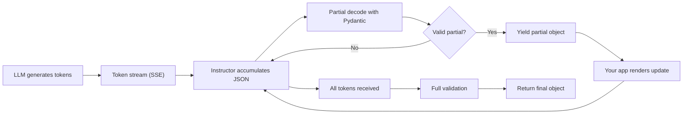

# Chapter 5: Streaming Structured Outputs

> Stream partial objects for faster UX while keeping schema guarantees.

## Overview

When you call an LLM the traditional way, you send a prompt and wait for the entire response to come back before you can do anything with it. For short answers that is fine, but when the model needs to generate a list of ten items or a multi-paragraph summary, your users are staring at a spinner for several seconds. Streaming fixes that.

Instructor can stream partial responses that are **incrementally validated** against your Pydantic schema. As the LLM produces tokens, Instructor decodes the JSON so far, fills in whatever fields are ready, and hands you a partial object you can render immediately. Once all the tokens arrive, the final object goes through full Pydantic validation just like a regular call.

This gives you the best of both worlds: the snappy, "typing in real time" feel that users love, **plus** the hard schema guarantees that Instructor is known for.

### Why streaming matters

- **Perceived latency drops dramatically.** Even if total generation time is the same, showing results progressively makes the app feel instant.
- **You can start downstream work earlier.** For example, you can begin rendering the first list item in the UI while the model is still generating the fifth.
- **Users can cancel early.** If the first few results are obviously wrong, the user can abort without waiting for the full response.

## How Partial Streaming Works

Before we jump into code, it helps to understand what is actually happening under the hood. The diagram below shows the pipeline from the LLM to your application code.



Here is what happens at each stage:

1. **Token generation.** The LLM sends tokens one at a time (or in small batches) via Server-Sent Events.
2. **JSON accumulation.** Instructor concatenates the tokens into a growing JSON string. At any given moment, this string is likely *incomplete* JSON -- for example, a key might be present but its value is still being written.
3. **Partial decode.** Instructor attempts to parse the incomplete JSON. It uses a lenient parser that can handle missing closing braces or truncated strings. Fields that are fully present get populated; fields still in-flight are set to `None` or their default value.
4. **Lightweight validation.** The partial object is checked against your Pydantic model. If the partial is nonsensical (for example, a field that should be an integer contains letters), Instructor skips the yield and waits for more tokens.
5. **Yield.** Your code receives the partial object. You can read whichever fields are already populated and ignore the rest.
6. **Final validation.** Once the token stream ends, Instructor runs full Pydantic validation (including custom validators) on the complete JSON. If validation fails, Instructor retries just like it does for non-streaming calls.

The key takeaway: **partial objects may have `None` fields**, but any field that *is* present has been sanity-checked. The final object is always fully validated.

## Basic Streaming Example

Let's start with the simplest possible streaming call. We define a small model and iterate over partial results.

```python
import instructor
from pydantic import BaseModel, Field
from openai import OpenAI

# Patch the OpenAI client with Instructor
client = instructor.from_openai(OpenAI())

class Idea(BaseModel):
    title: str
    blurb: str = Field(..., max_length=140)

# Start a streaming request -- note `stream` instead of `create`
stream = client.responses.stream(
    model="gpt-4o-mini",
    messages=[
        {
            "role": "user",
            "content": "Generate 3 marketing ideas for a note-taking app",
        }
    ],
    response_model=list[Idea],
)

# Each iteration yields a partially-populated list of Idea objects
for partial in stream:
    print("partial:", partial)

# After the loop, retrieve the fully validated final result
ideas = stream.get_final_response()
print("final:", ideas)
```

### What the output looks like

When you run the code above, you will see output similar to this. Notice how the list grows progressively and fields fill in over time:

```text
partial: [Idea(title='Note Ninja', blurb='')]
partial: [Idea(title='Note Ninja', blurb='Capture ideas at the')]
partial: [Idea(title='Note Ninja', blurb='Capture ideas at the speed of thought')]
partial: [Idea(title='Note Ninja', blurb='Capture ideas at the speed of thought'), Idea(title='', blurb='')]
partial: [Idea(title='Note Ninja', blurb='Capture ideas at the speed of thought'), Idea(title='Think Ink', blurb='')]
partial: [Idea(title='Note Ninja', blurb='Capture ideas at the speed of thought'), Idea(title='Think Ink', blurb='Where messy thoughts become')]
partial: [Idea(title='Note Ninja', blurb='Capture ideas at the speed of thought'), Idea(title='Think Ink', blurb='Where messy thoughts become organized plans')]
partial: [Idea(title='Note Ninja', blurb='Capture ideas at the speed of thought'), Idea(title='Think Ink', blurb='Where messy thoughts become organized plans'), Idea(title='', blurb='')]
partial: [Idea(title='Note Ninja', blurb='Capture ideas at the speed of thought'), Idea(title='Think Ink', blurb='Where messy thoughts become organized plans'), Idea(title='Brain Dump Pro', blurb='')]
partial: [Idea(title='Note Ninja', blurb='Capture ideas at the speed of thought'), Idea(title='Think Ink', blurb='Where messy thoughts become organized plans'), Idea(title='Brain Dump Pro', blurb='Your second brain, always ready')]
final: [Idea(title='Note Ninja', blurb='Capture ideas at the speed of thought'), Idea(title='Think Ink', blurb='Where messy thoughts become organized plans'), Idea(title='Brain Dump Pro', blurb='Your second brain, always ready')]
```

A few things to notice:

- **Empty strings appear first.** A field starts as `''` before the model begins writing it.
- **Items appear one at a time.** The list grows from one item to two, then to three.
- **`get_final_response()` is the source of truth.** Always use it for downstream logic; partials are for display only.

## Async Streaming

If your application is async (for instance, a FastAPI backend or an asyncio script), Instructor supports async streaming out of the box. The API mirrors the synchronous version, but you use `async for` and `await`.

```python
import asyncio
import instructor
from pydantic import BaseModel, Field
from openai import AsyncOpenAI

# Use the async OpenAI client
async_client = instructor.from_openai(AsyncOpenAI())

class MovieRecommendation(BaseModel):
    title: str
    year: int
    reason: str = Field(..., description="One sentence explaining why this movie fits")

async def get_recommendations(genre: str, count: int = 5):
    """Stream movie recommendations for a given genre."""
    stream = async_client.responses.stream(
        model="gpt-4o-mini",
        messages=[
            {
                "role": "user",
                "content": f"Recommend {count} {genre} movies. For each, explain why it's great.",
            }
        ],
        response_model=list[MovieRecommendation],
    )

    # async for works just like for, but non-blocking
    async for partial in stream:
        # In a real app you'd push this to a websocket or SSE channel
        latest = partial[-1] if partial else None
        if latest and latest.title:
            print(f"  Streaming: {latest.title} ...")

    # Grab the validated final result
    final = await stream.get_final_response()
    return final

# Run it
recommendations = asyncio.run(get_recommendations("sci-fi"))
for rec in recommendations:
    print(f"{rec.title} ({rec.year}): {rec.reason}")
```

### When to use async streaming

- **Web servers** (FastAPI, Starlette, aiohttp) -- you do not want to block the event loop.
- **Concurrent requests** -- async lets you fire off multiple streaming calls at the same time without threads.
- **Chat applications** -- real-time message delivery pairs naturally with async.

If you are writing a CLI tool or a one-off script, synchronous streaming is simpler and works perfectly well.

## Rendering in a Web App (FastAPI)

One of the most common use cases for streaming is pushing partial results to a browser as Server-Sent Events (SSE). Here is a complete, production-ready FastAPI endpoint with proper error handling, CORS, and graceful shutdown.

```python
import json
import logging
from contextlib import asynccontextmanager

import instructor
from fastapi import FastAPI, HTTPException, Request
from fastapi.middleware.cors import CORSMiddleware
from fastapi.responses import StreamingResponse
from openai import AsyncOpenAI
from pydantic import BaseModel, Field

logger = logging.getLogger(__name__)

# ── Models ────────────────────────────────────────────────────────────
class Idea(BaseModel):
    title: str
    blurb: str = Field(..., max_length=140)

class IdeasRequest(BaseModel):
    topic: str = "snack ideas"
    count: int = Field(default=5, ge=1, le=20)

# ── App setup ─────────────────────────────────────────────────────────
@asynccontextmanager
async def lifespan(app: FastAPI):
    # Startup: initialize the Instructor client once
    app.state.client = instructor.from_openai(AsyncOpenAI())
    yield
    # Shutdown: nothing to clean up

app = FastAPI(lifespan=lifespan)

# Allow your frontend origin (adjust for production)
app.add_middleware(
    CORSMiddleware,
    allow_origins=["http://localhost:3000"],
    allow_methods=["POST"],
    allow_headers=["*"],
)

# ── Streaming endpoint ────────────────────────────────────────────────
@app.post("/ideas")
async def ideas_endpoint(body: IdeasRequest, request: Request):
    """Stream a list of ideas as Server-Sent Events."""
    client = request.app.state.client

    try:
        stream = client.responses.stream(
            model="gpt-4o-mini",
            messages=[
                {
                    "role": "user",
                    "content": f"Give {body.count} {body.topic}",
                }
            ],
            response_model=list[Idea],
        )
    except Exception as exc:
        logger.exception("Failed to start stream")
        raise HTTPException(status_code=502, detail="LLM provider error") from exc

    async def event_source():
        try:
            async for partial in stream:
                # Check if the client disconnected
                if await request.is_disconnected():
                    logger.info("Client disconnected, stopping stream")
                    break

                # Send each partial update as an SSE "data" event
                payload = json.dumps(
                    [item.model_dump() for item in partial],
                    ensure_ascii=False,
                )
                yield f"data: {payload}\n\n"

            # Send the fully validated final result
            final = await stream.get_final_response()
            payload = json.dumps(
                [item.model_dump() for item in final],
                ensure_ascii=False,
            )
            yield f"event: done\ndata: {payload}\n\n"

        except Exception as exc:
            # Send an error event so the frontend can handle it
            logger.exception("Streaming error")
            yield f"event: error\ndata: {json.dumps({'error': str(exc)})}\n\n"

    return StreamingResponse(
        event_source(),
        media_type="text/event-stream",
        headers={
            "Cache-Control": "no-cache",
            "X-Accel-Buffering": "no",  # Disable nginx buffering
        },
    )
```

Key improvements over a bare-bones version:

- **Request body validation** with a Pydantic model (`IdeasRequest`).
- **Client disconnect detection** -- if the user navigates away, the server stops generating.
- **Named SSE events** -- the final payload uses `event: done` and errors use `event: error`, making frontend handling cleaner.
- **CORS middleware** so your React/Next.js frontend can call the endpoint.
- **Proper logging** so you can debug issues in production.

## Streaming with Lists

Streaming really shines when the model is generating a list of objects. Each item appears one by one, and your UI can render them as they arrive. Here is a pattern for streaming a list where you care about each new complete item.

```python
import instructor
from pydantic import BaseModel, Field
from openai import OpenAI

client = instructor.from_openai(OpenAI())

class Recipe(BaseModel):
    name: str
    prep_time_minutes: int = Field(..., ge=1)
    ingredients: list[str] = Field(..., min_length=1)
    instructions: str

# We'll track how many items are "done" as the stream progresses
stream = client.responses.stream(
    model="gpt-4o-mini",
    messages=[
        {
            "role": "user",
            "content": "Give me 4 quick weeknight dinner recipes.",
        }
    ],
    response_model=list[Recipe],
)

seen_count = 0

for partial in stream:
    current_count = len(partial)

    # Detect when a new item has been added to the list
    if current_count > seen_count:
        new_item = partial[seen_count]
        # Only print when the title is populated (not an empty placeholder)
        if new_item.name:
            print(f"\n--- Recipe #{seen_count + 1}: {new_item.name} ---")
            print(f"  Prep time: {new_item.prep_time_minutes} min")
            print(f"  Ingredients: {', '.join(new_item.ingredients)}")

    # Also update the most recent item as its fields fill in
    if partial:
        latest = partial[-1]
        if latest.name and latest.instructions:
            # The latest item is fully populated
            seen_count = current_count

final_recipes = stream.get_final_response()
print(f"\nDone! Got {len(final_recipes)} recipes total.")
```

### Tips for list streaming

- **Track `len(partial)` to detect new items.** Each time the length increases, a new object has started appearing.
- **Don't render items too eagerly.** An item with only a `name` and no `ingredients` yet will look broken in the UI. Wait until key fields are populated.
- **Use `max_items` in your Field definitions** to prevent the model from generating an unbounded number of items, which could eat through your token budget.

## React / Frontend Integration

Now let's look at the other side of the equation: consuming the SSE stream in a JavaScript frontend. This example works with React but the `EventSource` pattern applies to any framework.

```javascript
// hooks/useStreamingIdeas.js
import { useState, useCallback } from "react";

/**
 * Custom hook that streams ideas from the /ideas endpoint.
 * Returns { ideas, isStreaming, error, startStream }.
 */
export function useStreamingIdeas() {
  const [ideas, setIdeas] = useState([]);
  const [isStreaming, setIsStreaming] = useState(false);
  const [error, setError] = useState(null);

  const startStream = useCallback(async (topic, count = 5) => {
    setIsStreaming(true);
    setError(null);
    setIdeas([]);

    try {
      // We use fetch instead of EventSource because we need to POST
      const response = await fetch("http://localhost:8000/ideas", {
        method: "POST",
        headers: { "Content-Type": "application/json" },
        body: JSON.stringify({ topic, count }),
      });

      if (!response.ok) {
        throw new Error(`Server error: ${response.status}`);
      }

      const reader = response.body.getReader();
      const decoder = new TextDecoder();
      let buffer = "";

      while (true) {
        const { done, value } = await reader.read();
        if (done) break;

        buffer += decoder.decode(value, { stream: true });

        // SSE messages are separated by double newlines
        const messages = buffer.split("\n\n");
        // Keep the last (potentially incomplete) chunk in the buffer
        buffer = messages.pop() || "";

        for (const message of messages) {
          if (message.startsWith("event: error")) {
            const dataLine = message.split("\n").find((l) => l.startsWith("data: "));
            const errData = JSON.parse(dataLine.slice(6));
            throw new Error(errData.error);
          }

          if (message.startsWith("event: done")) {
            // Final validated result
            const dataLine = message.split("\n").find((l) => l.startsWith("data: "));
            const finalIdeas = JSON.parse(dataLine.slice(6));
            setIdeas(finalIdeas);
            continue;
          }

          if (message.startsWith("data: ")) {
            // Partial update
            const partial = JSON.parse(message.slice(6));
            setIdeas(partial);
          }
        }
      }
    } catch (err) {
      setError(err.message);
    } finally {
      setIsStreaming(false);
    }
  }, []);

  return { ideas, isStreaming, error, startStream };
}
```

And a simple component that uses the hook:

```jsx
// components/IdeaStream.jsx
import { useStreamingIdeas } from "../hooks/useStreamingIdeas";

export function IdeaStream() {
  const { ideas, isStreaming, error, startStream } = useStreamingIdeas();

  return (
    <div>
      <button
        onClick={() => startStream("healthy snack ideas", 5)}
        disabled={isStreaming}
      >
        {isStreaming ? "Generating..." : "Generate Ideas"}
      </button>

      {error && <p style={{ color: "red" }}>Error: {error}</p>}

      <ul>
        {ideas.map((idea, idx) => (
          <li key={idx}>
            <strong>{idea.title || "..."}</strong>
            {idea.blurb && <span> -- {idea.blurb}</span>}
          </li>
        ))}
      </ul>
    </div>
  );
}
```

A few things to note about the frontend code:

- **We use `fetch` + `ReadableStream` instead of `EventSource`** because `EventSource` only supports GET requests, and we need to POST a JSON body.
- **The buffer handles partial SSE chunks.** Network packets don't always align with SSE message boundaries, so we accumulate text and split on `\n\n`.
- **Placeholder text (`"..."`) handles incomplete items.** While the model is still generating a title, we show an ellipsis instead of nothing.

## Streaming vs Batch: When to Use Each

Not every request benefits from streaming. Here is a quick comparison to help you decide.

| Criteria | Streaming | Batch (non-streaming) |
|---|---|---|
| **User-facing latency** | Low perceived latency -- results appear progressively | User waits for the full response |
| **Code complexity** | More complex -- you handle partials, SSE, and frontend state | Simpler -- one request, one response |
| **Validation** | Partial validation during stream, full validation at the end | Full validation once |
| **Error handling** | Mid-stream errors need graceful recovery | Errors are straightforward try/except |
| **Token usage** | Same as batch (streaming does not affect token count) | Same as streaming |
| **Best for** | Lists, long text, chat UIs, dashboards | Short extractions, background jobs, pipelines |
| **Cancellation** | User can abort early and save tokens | Must wait for full response |

### Rules of thumb

- **Use streaming when** the response takes more than ~2 seconds and a human is waiting for it. Lists of items, summaries, and chat messages are great candidates.
- **Use batch when** the response is short (a single classification label, a yes/no answer) or when no human is watching (background ETL, batch processing).
- **Use batch for retry-heavy workflows.** If you expect frequent validation failures and retries, batch mode is simpler because you don't have to manage partial state across retries.

## Debugging Streams

Streaming introduces a category of bugs you don't see in batch mode. Here are common issues and how to fix them.

### 1. Partials are always empty or None

This usually means the model is returning its response in a format Instructor cannot parse incrementally. Check that:

- You are using `responses.stream()`, not `responses.create()` with `stream=True` (which gives you raw token chunks, not Instructor partials).
- Your model supports streaming. Most OpenAI and Anthropic models do, but some fine-tuned or local models may not.

### 2. The final object fails validation but partials looked fine

Remember, partials use **lenient** validation. The final object uses **strict** validation. A field that looked acceptable mid-stream (e.g., a string that was being built up) might fail a custom validator once complete.

**Fix:** Check your validators. If a `model_validator` is too strict for partial data, make sure it only runs on the final call. You can detect this by checking if all fields are populated.

### 3. The stream hangs or is very slow

- **Network buffering.** Nginx, CloudFlare, and some load balancers buffer SSE responses by default. Add the header `X-Accel-Buffering: no` (shown in the FastAPI example above) and configure your reverse proxy to disable buffering for the streaming endpoint.
- **Large schemas.** If your Pydantic model is very large (dozens of fields, deeply nested), partial decoding on every token batch can be expensive. Simplify the schema or increase the partial yield interval.

### 4. UI flickers as partials update

When you update React state on every partial, the component re-renders rapidly. This can cause flickering or jank.

**Fix:** Debounce your state updates. For example, only update at most every 100ms:

```javascript
import { useRef, useCallback } from "react";

function useDebouncedCallback(callback, delay) {
  const timeoutRef = useRef(null);
  return useCallback((...args) => {
    clearTimeout(timeoutRef.current);
    timeoutRef.current = setTimeout(() => callback(...args), delay);
  }, [callback, delay]);
}

// In your streaming loop:
const debouncedSetIdeas = useDebouncedCallback(setIdeas, 100);
// Then use debouncedSetIdeas(partial) instead of setIdeas(partial)
```

### 5. Logging partial objects floods your logs

If you log every partial for debugging, you will drown in output. Instead, log only meaningful transitions:

```python
prev_count = 0
for partial in stream:
    if len(partial) > prev_count:
        # A new item appeared -- worth logging
        logger.debug(f"New item #{len(partial)}: {partial[-1]}")
        prev_count = len(partial)
```

## Tips for Stable Streaming

Here is a summary of best practices to keep your streaming pipelines reliable:

- **Keep models concise.** Large schemas increase both latency and validation cost on every partial decode. If you have a complex schema, consider breaking it into smaller streaming calls.
- **Stream lists of small objects rather than one giant object.** A list of 10 items with 3 fields each streams much more smoothly than a single object with 30 fields.
- **Add `max_items` to list fields** to avoid unbounded growth during streaming. Without it, a chatty model might generate far more items than you need.
- **Always use `get_final_response()` for business logic.** Partial objects are for display only. Do not persist, deduplicate, or make decisions based on partial data.
- **Handle client disconnects.** In a web app, check if the client is still connected before continuing to generate. This saves compute and avoids unnecessary API costs.
- **Set reasonable timeouts.** A stream that runs for 60 seconds is probably stuck. Set a timeout on your HTTP client and on your SSE endpoint.

## Summary

Streaming is one of Instructor's most powerful features for building responsive applications. The library handles the hard parts -- incremental JSON parsing, partial validation, and retry logic -- so you can focus on building a great user experience. Start with synchronous streaming in a script, graduate to async when you move to a web framework, and use the debugging tips above when things get tricky.

---

Previous: [Chapter 4: Complex Structures](04-complex.md) | Next: [Chapter 6: Multiple Providers](06-providers.md)
