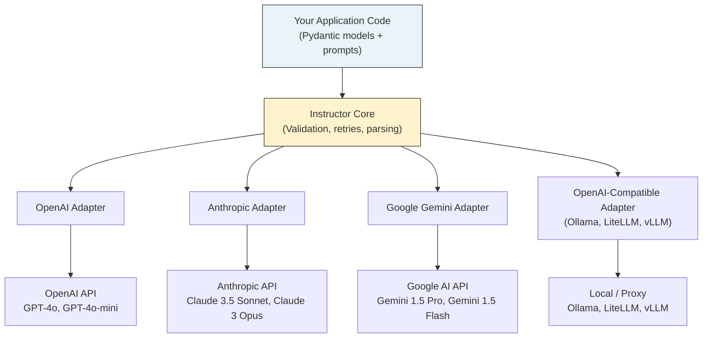

# Chapter 6: Using Multiple Providers

Welcome to **Chapter 6: Using Multiple Providers**. In this part of **Instructor Tutorial: Structured LLM Outputs**, you will build an intuitive mental model first, then move into concrete implementation details and practical production tradeoffs.


> Swap between OpenAI, Anthropic, Google, and local models (Ollama) without changing schemas.

## Overview

One of Instructor's most powerful features is provider abstraction. You define your Pydantic schemas once, and then use them with any supported LLM backend -- OpenAI, Anthropic, Google Gemini, local Ollama models, or even a universal proxy like LiteLLM. Your extraction logic stays the same; only the client setup and model string change.

This matters more than you might think. In production, you'll often want to route different tasks to different models (fast models for classification, powerful models for complex extraction), fall back to a secondary provider when one goes down, or develop locally without burning API credits. Instructor makes all of this straightforward.

## How the Provider Abstraction Works

Instructor sits between your application code and the underlying LLM SDK. Each provider has a thin adapter that translates Instructor's unified interface into the provider's native API, and then parses the response back into your Pydantic model.



The key insight is that **every adapter produces the same output type** -- your Pydantic model. This means your downstream code never needs to know which provider generated the data.

## OpenAI

OpenAI is the default provider and the one you've been using throughout this tutorial. Let's look at the full configuration options.

### Basic Setup

```python
import instructor
from openai import OpenAI
from pydantic import BaseModel, Field

# Default setup -- reads OPENAI_API_KEY from environment
client = instructor.from_openai(OpenAI())

class ContactInfo(BaseModel):
    name: str = Field(..., description="Full name of the person")
    email: str = Field(..., description="Email address")
    company: str = Field(..., description="Company or organization")

contact = client.responses.create(
    model="gpt-4o",
    messages=[
        {"role": "user", "content": "John Smith works at Acme Corp, email john@acme.io"}
    ],
    response_model=ContactInfo,
)

print(contact)
# name='John Smith' email='john@acme.io' company='Acme Corp'
```

### Model Selection Guide

OpenAI offers several models, and picking the right one for your task makes a real difference in both quality and cost:

```python
# GPT-4o -- best quality, higher cost
# Use for: complex extraction, nuanced classification, multi-step reasoning
result = client.responses.create(
    model="gpt-4o",
    messages=[{"role": "user", "content": complex_document}],
    response_model=DetailedAnalysis,
)

# GPT-4o-mini -- fast, cheap, surprisingly capable
# Use for: simple extraction, classification, high-volume tasks
result = client.responses.create(
    model="gpt-4o-mini",
    messages=[{"role": "user", "content": short_text}],
    response_model=SimpleLabel,
)
```

### Advanced Configuration

```python
from openai import OpenAI

# Custom timeout and retry settings at the SDK level
raw_client = OpenAI(
    api_key="sk-...",          # or set OPENAI_API_KEY env var
    timeout=30.0,              # seconds before the request times out
    max_retries=2,             # SDK-level retries (separate from Instructor retries)
    organization="org-...",    # if you belong to multiple orgs
)

client = instructor.from_openai(raw_client)

# Instructor-level retries and temperature control
result = client.responses.create(
    model="gpt-4o",
    messages=[{"role": "user", "content": text}],
    response_model=MyModel,
    max_retries=3,             # Instructor will retry on validation failure
    temperature=0.0,           # lower = more deterministic output
)
```

### OpenAI Gotchas

- **Rate limits**: OpenAI enforces per-minute token and request limits. If you're doing batch extraction, add a small delay or use exponential backoff.
- **JSON mode vs. function calling**: Instructor uses function calling under the hood for OpenAI, which is more reliable than raw JSON mode. You generally don't need to configure this yourself.
- **Model deprecation**: OpenAI periodically retires model versions. Pin to a specific snapshot (like `gpt-4o-2024-08-06`) in production, but be prepared to update.

## Anthropic (Claude)

Anthropic's Claude models are excellent at following instructions and tend to produce very clean structured output. Instructor supports Claude through the `from_anthropic` adapter.

### Basic Setup

```python
import instructor
from anthropic import Anthropic
from pydantic import BaseModel, Field

# Reads ANTHROPIC_API_KEY from environment
client = instructor.from_anthropic(Anthropic())

class Summary(BaseModel):
    headline: str = Field(..., description="One-line summary")
    key_points: list[str] = Field(..., description="3-5 bullet points")
    sentiment: str = Field(..., description="positive, negative, or neutral")

summary = client.messages.create(
    model="claude-sonnet-4-20250514",
    max_tokens=1024,
    messages=[
        {"role": "user", "content": "Summarize this product review: ..."}
    ],
    response_model=Summary,
)
```

### Understanding Tool Use Mode

Here's something important about how Instructor works with Anthropic. Unlike OpenAI, which has a dedicated function-calling mechanism, Anthropic uses **tool use** (also called tool calling) to produce structured output. Instructor translates your Pydantic model into a tool definition, asks Claude to "call" that tool with the appropriate arguments, and then parses the tool call arguments back into your model.

You don't need to configure this manually -- Instructor handles it behind the scenes. But it helps to know this is happening, because:

1. **`max_tokens` is required**: Anthropic's API always requires a `max_tokens` parameter. Forget it and you'll get an error.
2. **Tool use adds a small overhead**: The tool definition is included in the prompt, which uses tokens. Keep your models concise.
3. **System prompts work differently**: With Anthropic, system messages go in a separate `system` parameter, not in the `messages` list.

```python
# Using a system prompt with Anthropic
summary = client.messages.create(
    model="claude-sonnet-4-20250514",
    max_tokens=1024,
    system="You are a precise data extraction assistant. Extract exactly what is asked.",
    messages=[
        {"role": "user", "content": document_text}
    ],
    response_model=Summary,
)
```

### Model Selection

```python
# Claude 3.5 Sonnet -- excellent balance of speed and quality
# The go-to choice for most structured extraction tasks
result = client.messages.create(
    model="claude-sonnet-4-20250514",
    max_tokens=1024,
    messages=[{"role": "user", "content": text}],
    response_model=MyModel,
)

# Claude 3 Opus -- highest quality, slower, more expensive
# Use for: complex reasoning, ambiguous extraction, critical tasks
result = client.messages.create(
    model="claude-3-opus-20240229",
    max_tokens=2048,
    messages=[{"role": "user", "content": complex_text}],
    response_model=DetailedModel,
)
```

### Anthropic Gotchas

- **Always set `max_tokens`**: Unlike OpenAI, this parameter is mandatory. A good default for structured output is 1024.
- **No `response_format` parameter**: Don't try to pass `response_format="json"` -- Anthropic doesn't support it. Instructor uses tool use instead.
- **Different message format**: Anthropic doesn't support a `"role": "system"` entry in `messages`. Use the `system` parameter instead.

## Google Gemini

Google's Gemini models offer strong performance and competitive pricing. Instructor supports them through the `from_gemini` adapter.

### Basic Setup

```python
import instructor
from google import genai
from pydantic import BaseModel, Field

# Set up the Google AI client
# Reads GOOGLE_API_KEY from environment
google_client = genai.Client()

client = instructor.from_gemini(google_client)

class Recipe(BaseModel):
    name: str
    ingredients: list[str]
    prep_time_minutes: int = Field(..., ge=1)
    difficulty: str = Field(..., description="easy, medium, or hard")

recipe = client.chat.completions.create(
    model="gemini-1.5-pro",
    messages=[
        {"role": "user", "content": "Give me a recipe for chocolate chip cookies"}
    ],
    response_model=Recipe,
)

print(f"{recipe.name} -- {recipe.prep_time_minutes} min, {recipe.difficulty}")
```

### Model Selection

```python
# Gemini 1.5 Pro -- strong reasoning, large context window (up to 1M tokens)
# Great for processing long documents
result = client.chat.completions.create(
    model="gemini-1.5-pro",
    messages=[{"role": "user", "content": long_document}],
    response_model=MyModel,
)

# Gemini 1.5 Flash -- fast and cheap
# Good for high-throughput, simpler tasks
result = client.chat.completions.create(
    model="gemini-1.5-flash",
    messages=[{"role": "user", "content": short_text}],
    response_model=SimpleModel,
)
```

### Gemini Gotchas

- **API key setup**: You need a Google AI API key (from Google AI Studio), not a GCP service account. Set it as `GOOGLE_API_KEY`.
- **Context window advantage**: Gemini 1.5 Pro supports up to 1 million tokens of context, making it ideal for extracting from very long documents.
- **Slightly different behavior**: Gemini's structured output can sometimes differ in edge cases from OpenAI or Anthropic. Test your specific schemas with Gemini before deploying.

## Local Development with Ollama

Ollama lets you run open-source models locally, which is fantastic for development -- no API costs, no rate limits, and no data leaving your machine. Since Ollama exposes an OpenAI-compatible API, Instructor can talk to it through the regular OpenAI adapter.

### Setup

First, install Ollama and pull a model:

```bash
# Install Ollama (macOS)
brew install ollama

# Start the Ollama server
ollama serve

# Pull a model that handles structured output well
ollama pull llama3.1
ollama pull mistral
```

Then point the OpenAI client at your local Ollama instance:

```python
import instructor
from openai import OpenAI
from pydantic import BaseModel, Field

# Point the OpenAI client at Ollama's local API
ollama_client = OpenAI(
    base_url="http://localhost:11434/v1",
    api_key="ollama",  # Ollama doesn't need a real key, but the SDK requires one
)

client = instructor.from_openai(ollama_client)

class KeyPoints(BaseModel):
    points: list[str] = Field(..., min_length=1, max_length=5)
    topic: str

result = client.responses.create(
    model="llama3.1",
    messages=[
        {"role": "user", "content": "Extract key points from: AI is transforming healthcare..."}
    ],
    response_model=KeyPoints,
)
```

### Recommended Models for Structured Output

Not all open-source models handle structured output equally well. Here are some that work reliably with Instructor:

| Model | Size | Structured Output Quality | Speed | Best For |
|-------|------|--------------------------|-------|----------|
| `llama3.1:8b` | 4.7 GB | Good | Fast | Development, simple extraction |
| `llama3.1:70b` | 40 GB | Very good | Slow | Complex extraction (needs lots of RAM) |
| `mistral` | 4.1 GB | Good | Fast | General tasks, multilingual |
| `mixtral` | 26 GB | Very good | Medium | Complex tasks on beefier hardware |
| `qwen2.5:7b` | 4.4 GB | Good | Fast | Code-related extraction |

### Ollama Gotchas

- **Smaller models struggle with complex schemas**: If your Pydantic model has deeply nested fields or many optional properties, smaller models (7B-8B) may produce validation errors. Simplify your schema or use a larger model.
- **Instructor retries help a lot here**: Set `max_retries=3` or higher. Local models are more likely to need a second attempt at producing valid JSON.
- **No streaming partial objects**: Some Ollama setups don't support the streaming features that Instructor relies on for partial objects. Test before depending on it.
- **Cold start**: The first request after pulling a model can be slow as Ollama loads it into memory. Subsequent requests are faster.

## LiteLLM as a Universal Proxy

LiteLLM is a Python library that provides a unified interface to 100+ LLM providers. When combined with Instructor, it gives you an incredibly flexible setup -- one configuration layer that can route to any provider.

### Setup

```bash
pip install litellm instructor
```

```python
import instructor
import litellm
from pydantic import BaseModel, Field

# LiteLLM can be used with Instructor via the OpenAI-compatible interface
from openai import OpenAI

client = instructor.from_openai(
    OpenAI(
        api_key="anything",            # LiteLLM reads provider keys from env
        base_url="http://localhost:4000" # LiteLLM proxy server
    )
)

# Or use LiteLLM directly without the proxy
from litellm import completion

# LiteLLM uses a provider prefix to route to the right backend
# "openai/gpt-4o" -> OpenAI
# "anthropic/claude-sonnet-4-20250514" -> Anthropic
# "gemini/gemini-1.5-pro" -> Google

class Sentiment(BaseModel):
    label: str = Field(..., description="positive, negative, or neutral")
    confidence: float = Field(..., ge=0.0, le=1.0)

# With the LiteLLM proxy, just switch the model string
result = client.responses.create(
    model="openai/gpt-4o",
    messages=[{"role": "user", "content": "I love this product!"}],
    response_model=Sentiment,
)
```

### When to Use LiteLLM

LiteLLM shines when you need to:
- **Switch providers via config**: Change the model string in an environment variable, and your entire app switches providers.
- **Track usage across providers**: LiteLLM's proxy can log all requests, making cost tracking easier.
- **Access niche providers**: If you need to hit Azure OpenAI, Bedrock, Vertex AI, or any of dozens of other backends, LiteLLM probably supports it.

## Provider Comparison

Here's a quick reference to help you choose the right provider for each task:

| Feature | OpenAI (GPT-4o) | Anthropic (Claude 3.5 Sonnet) | Google (Gemini 1.5 Pro) | Ollama (Llama 3.1 8B) |
|---------|-----------------|-------------------------------|------------------------|-----------------------|
| **Structured output quality** | Excellent | Excellent | Very good | Good (with retries) |
| **Pricing tier** | Mid-high | Mid-high | Mid | Free (local) |
| **Max context window** | 128K tokens | 200K tokens | 1M tokens | Varies by model |
| **Speed (time to first token)** | Fast | Fast | Fast | Depends on hardware |
| **Best for** | General extraction, broad tool ecosystem | Instruction following, long documents | Very long documents, multimodal | Development, privacy-sensitive |
| **Structured output method** | Function calling | Tool use | Function calling | JSON mode / function calling |
| **Instructor adapter** | `from_openai()` | `from_anthropic()` | `from_gemini()` | `from_openai()` (with base_url) |

## Routing by Tenant or Task

In a real application, you'll often want to route different requests to different providers. Maybe enterprise customers get GPT-4o while free-tier users get GPT-4o-mini, or maybe you use Claude for summarization and GPT-4o for data extraction.

```python
import instructor
from openai import OpenAI
from anthropic import Anthropic
from enum import Enum

class TaskType(Enum):
    EXTRACTION = "extraction"
    SUMMARIZATION = "summarization"
    CLASSIFICATION = "classification"

class Tier(Enum):
    FREE = "free"
    PRO = "pro"
    ENTERPRISE = "enterprise"

def get_client_and_model(task: TaskType, tier: Tier):
    """Pick the best provider based on task type and customer tier."""

    if tier == Tier.FREE:
        # Free tier always uses the cheapest option
        return instructor.from_openai(OpenAI()), "gpt-4o-mini"

    if task == TaskType.SUMMARIZATION:
        # Claude excels at summarization
        return instructor.from_anthropic(Anthropic()), "claude-sonnet-4-20250514"

    if task == TaskType.EXTRACTION:
        # GPT-4o is great at structured extraction
        return instructor.from_openai(OpenAI()), "gpt-4o"

    # Default fallback
    return instructor.from_openai(OpenAI()), "gpt-4o-mini"


# Usage
client, model = get_client_and_model(TaskType.EXTRACTION, Tier.ENTERPRISE)
```

## Fallback Chains

Provider outages happen. Rate limits get hit. Models return garbage. A robust production system needs fallback logic. Here's a pattern that tries multiple providers in sequence, moving to the next one if the current one fails.

```python
import instructor
import logging
from openai import OpenAI
from anthropic import Anthropic
from pydantic import BaseModel, Field
from dataclasses import dataclass
from typing import TypeVar, Type

logger = logging.getLogger(__name__)
T = TypeVar("T", bound=BaseModel)

@dataclass
class ProviderConfig:
    """Configuration for a single provider in the fallback chain."""
    name: str
    client: object          # The Instructor-wrapped client
    model: str
    max_retries: int = 2
    use_anthropic_api: bool = False  # True if using Anthropic's messages.create

class FallbackChain:
    """Try multiple providers in sequence until one succeeds."""

    def __init__(self, providers: list[ProviderConfig]):
        self.providers = providers

    def create(
        self,
        messages: list[dict],
        response_model: Type[T],
        **kwargs,
    ) -> T:
        last_error = None

        for provider in self.providers:
            try:
                logger.info(f"Trying provider: {provider.name} ({provider.model})")

                if provider.use_anthropic_api:
                    # Anthropic uses messages.create and needs max_tokens
                    result = provider.client.messages.create(
                        model=provider.model,
                        max_tokens=kwargs.get("max_tokens", 1024),
                        messages=messages,
                        response_model=response_model,
                        max_retries=provider.max_retries,
                    )
                else:
                    # OpenAI-compatible providers use responses.create
                    result = provider.client.responses.create(
                        model=provider.model,
                        messages=messages,
                        response_model=response_model,
                        max_retries=provider.max_retries,
                    )

                logger.info(f"Success with provider: {provider.name}")
                return result

            except Exception as e:
                logger.warning(f"Provider {provider.name} failed: {e}")
                last_error = e
                continue

        # All providers failed
        raise RuntimeError(
            f"All {len(self.providers)} providers failed. Last error: {last_error}"
        )


# Set up the fallback chain
chain = FallbackChain([
    ProviderConfig(
        name="openai-primary",
        client=instructor.from_openai(OpenAI()),
        model="gpt-4o",
        max_retries=2,
    ),
    ProviderConfig(
        name="anthropic-backup",
        client=instructor.from_anthropic(Anthropic()),
        model="claude-sonnet-4-20250514",
        max_retries=2,
        use_anthropic_api=True,
    ),
    ProviderConfig(
        name="openai-fallback",
        client=instructor.from_openai(OpenAI()),
        model="gpt-4o-mini",
        max_retries=3,  # more retries for the last resort
    ),
])


# Use it just like a regular client
class UserProfile(BaseModel):
    name: str
    age: int = Field(..., ge=0, le=150)
    interests: list[str]

profile = chain.create(
    messages=[{"role": "user", "content": "John, 32, likes hiking and cooking"}],
    response_model=UserProfile,
)
print(profile)
# name='John' age=32 interests=['hiking', 'cooking']
```

This pattern gives you resilience without complicating your application code. The caller just calls `chain.create()` and doesn't need to know which provider actually handled the request.

## Testing Across Providers

When you support multiple providers, you need to test your schemas against each one. Small differences in how models interpret instructions can lead to surprising validation failures. Here's a practical approach using pytest.

```python
import pytest
import instructor
from openai import OpenAI
from anthropic import Anthropic
from pydantic import BaseModel, Field

class MovieReview(BaseModel):
    title: str
    rating: float = Field(..., ge=1.0, le=10.0)
    pros: list[str] = Field(..., min_length=1)
    cons: list[str] = Field(..., min_length=1)

# Define providers as pytest fixtures
@pytest.fixture
def openai_client():
    return instructor.from_openai(OpenAI()), "gpt-4o-mini", False

@pytest.fixture
def anthropic_client():
    return instructor.from_anthropic(Anthropic()), "claude-sonnet-4-20250514", True

# Parameterize tests across providers
@pytest.fixture(params=["openai_client", "anthropic_client"])
def provider(request):
    return request.getfixturevalue(request.param)

TEST_INPUT = """
Review: The Matrix is a groundbreaking sci-fi film. Amazing visual effects
and deep philosophical themes. However, some dialogue feels stilted and
the pacing drags in the second act. 8.5/10.
"""

def test_movie_review_extraction(provider):
    """Verify that every provider can extract a valid MovieReview."""
    client, model, is_anthropic = provider

    if is_anthropic:
        result = client.messages.create(
            model=model,
            max_tokens=1024,
            messages=[{"role": "user", "content": f"Extract a review: {TEST_INPUT}"}],
            response_model=MovieReview,
        )
    else:
        result = client.responses.create(
            model=model,
            messages=[{"role": "user", "content": f"Extract a review: {TEST_INPUT}"}],
            response_model=MovieReview,
        )

    # Structural assertions -- these should pass regardless of provider
    assert result.title, "Title should not be empty"
    assert 1.0 <= result.rating <= 10.0, "Rating should be in range"
    assert len(result.pros) >= 1, "Should have at least one pro"
    assert len(result.cons) >= 1, "Should have at least one con"

def test_rating_accuracy(provider):
    """Check that the extracted rating is close to the stated value."""
    client, model, is_anthropic = provider

    if is_anthropic:
        result = client.messages.create(
            model=model,
            max_tokens=1024,
            messages=[{"role": "user", "content": f"Extract a review: {TEST_INPUT}"}],
            response_model=MovieReview,
        )
    else:
        result = client.responses.create(
            model=model,
            messages=[{"role": "user", "content": f"Extract a review: {TEST_INPUT}"}],
            response_model=MovieReview,
        )

    # The review explicitly says "8.5/10", so the model should pick that up
    assert 7.5 <= result.rating <= 9.5, f"Expected ~8.5, got {result.rating}"
```

### Tips for Cross-Provider Testing

- **Test structure, not exact values**: Different models will phrase things differently. Assert on types, ranges, and list lengths rather than exact string matches.
- **Use generous tolerances**: A rating of 8.5 might be extracted as 8.0 or 9.0 by different models. Test that it's in a reasonable range.
- **Mark slow tests**: Provider API calls are slow. Use `@pytest.mark.slow` or `@pytest.mark.integration` so you can skip them during fast local iteration.
- **Mock for unit tests**: For day-to-day development, mock the Instructor client and test your business logic separately from the LLM calls.

## Migration Guide

Switching providers doesn't have to be painful. Since Instructor keeps your schemas identical across providers, most of the work is in updating the client setup and adjusting for API differences.

### From OpenAI to Anthropic

The most common migration. Here's a checklist:

```python
# BEFORE: OpenAI
import instructor
from openai import OpenAI

client = instructor.from_openai(OpenAI())

result = client.responses.create(
    model="gpt-4o",
    messages=[
        {"role": "system", "content": "You are a helpful extractor."},
        {"role": "user", "content": text},
    ],
    response_model=MyModel,
)

# AFTER: Anthropic
import instructor
from anthropic import Anthropic

client = instructor.from_anthropic(Anthropic())

result = client.messages.create(
    model="claude-sonnet-4-20250514",
    max_tokens=1024,                        # REQUIRED for Anthropic
    system="You are a helpful extractor.",   # system prompt moves here
    messages=[
        {"role": "user", "content": text},  # no system message in the list
    ],
    response_model=MyModel,
)
```

**What changes:**
1. `from_openai()` becomes `from_anthropic()`
2. `responses.create()` becomes `messages.create()`
3. Add `max_tokens` (required)
4. Move system messages from the `messages` list to the `system` parameter
5. Update the model string

**What stays the same:**
- Your Pydantic `response_model`
- The `messages` format for user/assistant turns
- Instructor's `max_retries` parameter
- All your downstream code that consumes the model

### From Any Provider to Ollama (for Local Development)

This is a great pattern for development: use Ollama locally and a cloud provider in production.

```python
import os
import instructor
from openai import OpenAI

def get_client():
    """Return an Instructor client based on the environment."""
    if os.getenv("ENV", "development") == "production":
        # Production: use OpenAI
        return instructor.from_openai(OpenAI()), "gpt-4o"
    else:
        # Development: use local Ollama
        ollama = OpenAI(
            base_url="http://localhost:11434/v1",
            api_key="ollama",
        )
        return instructor.from_openai(ollama), "llama3.1"

client, model = get_client()

# This code works identically in both environments
result = client.responses.create(
    model=model,
    messages=[{"role": "user", "content": text}],
    response_model=MyModel,
    max_retries=3,  # extra retries help with local models
)
```

### Environment Variable Pattern

For maximum flexibility, drive your provider choice entirely from environment variables:

```python
import os
import instructor
from pydantic import BaseModel

def create_client():
    """Create an Instructor client from environment configuration."""
    provider = os.getenv("LLM_PROVIDER", "openai")
    model = os.getenv("LLM_MODEL", "gpt-4o-mini")

    if provider == "openai":
        from openai import OpenAI
        return instructor.from_openai(OpenAI()), model

    elif provider == "anthropic":
        from anthropic import Anthropic
        return instructor.from_anthropic(Anthropic()), model

    elif provider == "ollama":
        from openai import OpenAI
        ollama = OpenAI(
            base_url=os.getenv("OLLAMA_BASE_URL", "http://localhost:11434/v1"),
            api_key="ollama",
        )
        return instructor.from_openai(ollama), model

    else:
        raise ValueError(f"Unknown provider: {provider}")

# In .env for development:
#   LLM_PROVIDER=ollama
#   LLM_MODEL=llama3.1
#
# In .env for production:
#   LLM_PROVIDER=openai
#   LLM_MODEL=gpt-4o
#   OPENAI_API_KEY=sk-...
```

This way, switching providers is a config change -- no code changes, no redeployment of application logic.

## Tips and Best Practices

- **Match model strengths to tasks**: Use fast, cheap models (GPT-4o-mini, Gemini Flash) for classification and routing. Save powerful models (GPT-4o, Claude Opus) for complex extraction and reasoning.
- **Normalize errors across providers**: Each provider has its own exception hierarchy. Wrap provider-specific exceptions in your own error types so your application code doesn't need to handle them individually.
- **Store provider config externally**: Keep provider name, model string, and API keys in environment variables or a config file. This lets you switch without code changes.
- **Test with the cheapest model first**: When developing new schemas, start with GPT-4o-mini or a local Ollama model. Only move to more expensive models once your schema is working.
- **Monitor costs per provider**: If you're using multiple providers in production, track cost per request. LiteLLM's proxy or simple logging can help with this.
- **Pin model versions in production**: Use snapshot identifiers (like `gpt-4o-2024-08-06`) rather than aliases (like `gpt-4o`) in production to avoid unexpected behavior changes.

---

Previous: [Chapter 5: Streaming](05-streaming.md) | Next: [Chapter 7: Advanced Patterns](07-advanced.md)

## What Problem Does This Solve?

Most teams struggle here because the hard part is not writing more code, but deciding clear boundaries for `model`, `client`, `messages` so behavior stays predictable as complexity grows.

In practical terms, this chapter helps you avoid three common failures:

- coupling core logic too tightly to one implementation path
- missing the handoff boundaries between setup, execution, and validation
- shipping changes without clear rollback or observability strategy

After working through this chapter, you should be able to reason about `Chapter 6: Using Multiple Providers` as an operating subsystem inside **Instructor Tutorial: Structured LLM Outputs**, with explicit contracts for inputs, state transitions, and outputs.

Use the implementation notes around `OpenAI`, `instructor`, `provider` as your checklist when adapting these patterns to your own repository.

## How it Works Under the Hood

Under the hood, `Chapter 6: Using Multiple Providers` usually follows a repeatable control path:

1. **Context bootstrap**: initialize runtime config and prerequisites for `model`.
2. **Input normalization**: shape incoming data so `client` receives stable contracts.
3. **Core execution**: run the main logic branch and propagate intermediate state through `messages`.
4. **Policy and safety checks**: enforce limits, auth scopes, and failure boundaries.
5. **Output composition**: return canonical result payloads for downstream consumers.
6. **Operational telemetry**: emit logs/metrics needed for debugging and performance tuning.

When debugging, walk this sequence in order and confirm each stage has explicit success/failure conditions.

## Source Walkthrough

Use the following upstream sources to verify implementation details while reading this chapter:

- [View Repo](https://github.com/instructor-ai/instructor)
  Why it matters: authoritative reference on `View Repo` (github.com).
- [Awesome Code Docs](https://github.com/johnxie/awesome-code-docs)
  Why it matters: authoritative reference on `Awesome Code Docs` (github.com).

Suggested trace strategy:
- search upstream code for `model` and `client` to map concrete implementation paths
- compare docs claims against actual runtime/config code before reusing patterns in production

## Chapter Connections

- [Tutorial Index](index.md)
- [Previous Chapter: Chapter 5: Streaming Structured Outputs](05-streaming.md)
- [Next Chapter: Chapter 7: Advanced Patterns and Guardrails](07-advanced.md)
- [Main Catalog](../../README.md#-tutorial-catalog)
- [A-Z Tutorial Directory](../../discoverability/tutorial-directory.md)
