# Chapter 8: Production Use and Operations

Welcome to **Chapter 8: Production Use and Operations**. In this part of **Instructor Tutorial: Structured LLM Outputs**, you will build an intuitive mental model first, then move into concrete implementation details and practical production tradeoffs.


> Harden Instructor apps with observability, safety, cost controls, and deployment patterns so your structured-output workflows run reliably at scale.

## Overview

You have built schemas, validated outputs, streamed results, and wired up multiple providers. Now it is time to ship it. This final chapter covers everything you need to take an Instructor-based application from a working prototype to a production service that your team (and your on-call rotation) can trust.

We will walk through production architecture, deployment configurations, monitoring, cost management, testing strategies, error handling, security, and scaling patterns. By the end you will have a concrete checklist you can tape to your monitor -- or, more realistically, paste into your team's wiki.

## Production Architecture

Before diving into individual topics, let us look at how a production Instructor service typically fits together. The diagram below shows the main request path alongside the supporting infrastructure for monitoring, logging, and caching.

```mermaid
graph LR
    Client["Client App"] --> Gateway["API Gateway<br/>(Auth + TLS)"]
    Gateway --> RateLimiter["Rate Limiter"]
    RateLimiter --> InstructorService["Instructor Service<br/>(FastAPI / Workers)"]
    InstructorService --> Cache["Response Cache<br/>(Redis)"]
    InstructorService --> Primary["Primary LLM<br/>(e.g. GPT-4o)"]
    InstructorService --> Fallback["Fallback LLM<br/>(e.g. Claude 3.5)"]

    InstructorService --> Logging["Structured Logging<br/>(JSON → ELK / Loki)"]
    InstructorService --> Metrics["Metrics<br/>(Prometheus)"]
    Metrics --> Alerting["Alerting<br/>(Grafana / PagerDuty)"]
    InstructorService --> Tracing["Distributed Tracing<br/>(OpenTelemetry)"]

    style Client fill:#e8f4fd,stroke:#333
    style InstructorService fill:#d4edda,stroke:#333
    style Primary fill:#fff3cd,stroke:#333
    style Fallback fill:#fff3cd,stroke:#333
    style Metrics fill:#f8d7da,stroke:#333
    style Alerting fill:#f8d7da,stroke:#333
```



The key ideas here: every request passes through authentication and rate limiting before it reaches your Instructor service. The service itself talks to one or more LLM providers (with fallback logic), and every call emits structured logs, metrics, and traces to your observability stack. A response cache sits in front of the LLM calls for deterministic or frequently repeated queries.

## Configuration and Secrets

Good configuration hygiene is the foundation of a production deployment. Keep secrets out of your code and use environment variables injected by your platform's secret manager.

```bash
# .env.production -- loaded by your secret manager, never committed to git
OPENAI_API_KEY=sk-...
ANTHROPIC_API_KEY=sk-ant-...
MODEL_PRIMARY=gpt-4o-mini
MODEL_FALLBACK=claude-3-5-sonnet-20241022
MAX_RETRIES=2
RATE_LIMIT_PER_MIN=120
LOG_LEVEL=info
REDIS_URL=redis://cache:6379/0
SENTRY_DSN=https://examplePublicKey@o0.ingest.sentry.io/0
```

A few rules of thumb:

- **Never ship keys in the client bundle.** Instructor calls happen server-side.
- **Rotate keys on a schedule.** If a key leaks, you want the blast radius limited.
- **Use a typed config class** so typos surface at startup, not at 3 AM.

```python
from pydantic_settings import BaseSettings

class Settings(BaseSettings):
    """Typed, validated configuration loaded from environment variables."""
    openai_api_key: str
    anthropic_api_key: str
    model_primary: str = "gpt-4o-mini"
    model_fallback: str = "claude-3-5-sonnet-20241022"
    max_retries: int = 2
    rate_limit_per_min: int = 120
    log_level: str = "info"
    redis_url: str = "redis://localhost:6379/0"

    class Config:
        env_file = ".env"

# Fails fast if a required variable is missing
settings = Settings()
```

## Deployment Patterns

### Serverless (FastAPI on AWS Lambda / GCP Cloud Run)

Great for bursty workloads where you do not want to manage infrastructure. Keep cold starts in mind -- pre-load your Instructor client outside the handler so the patched client is reused across invocations.

```python
# handler.py -- reuse the client across warm invocations
import instructor
from openai import OpenAI

client = instructor.from_openai(OpenAI())  # initialized once at module level

def handler(event, context):
    result = client.responses.create(
        model="gpt-4o-mini",
        messages=[{"role": "user", "content": event["prompt"]}],
        response_model=MySchema,
    )
    return result.model_dump()
```

### Containers with Docker

For steady traffic and more control, package your service as a Docker image.

```dockerfile
# Dockerfile
FROM python:3.12-slim

WORKDIR /app

# Install dependencies first for better layer caching
COPY requirements.txt .
RUN pip install --no-cache-dir -r requirements.txt

COPY . .

# Run with uvicorn; adjust workers based on your CPU allocation
CMD ["uvicorn", "main:app", "--host", "0.0.0.0", "--port", "8000", "--workers", "4"]
```

```yaml
# docker-compose.yml -- local development and staging
version: "3.9"
services:
  instructor-api:
    build: .
    ports:
      - "8000:8000"
    env_file:
      - .env.production
    depends_on:
      - redis
    healthcheck:
      test: ["CMD", "curl", "-f", "http://localhost:8000/health"]
      interval: 30s
      timeout: 5s
      retries: 3

  redis:
    image: redis:7-alpine
    ports:
      - "6379:6379"
```

### Kubernetes

For larger-scale deployments, Kubernetes gives you autoscaling, rolling updates, and health management out of the box.

```yaml
# k8s/deployment.yaml
apiVersion: apps/v1
kind: Deployment
metadata:
  name: instructor-api
  labels:
    app: instructor-api
spec:
  replicas: 3
  selector:
    matchLabels:
      app: instructor-api
  template:
    metadata:
      labels:
        app: instructor-api
    spec:
      containers:
        - name: instructor-api
          image: your-registry/instructor-api:latest
          ports:
            - containerPort: 8000
          envFrom:
            - secretRef:
                name: instructor-secrets
          resources:
            requests:
              cpu: "250m"
              memory: "256Mi"
            limits:
              cpu: "1000m"
              memory: "512Mi"
          livenessProbe:
            httpGet:
              path: /health
              port: 8000
            initialDelaySeconds: 10
            periodSeconds: 15
          readinessProbe:
            httpGet:
              path: /health
              port: 8000
            initialDelaySeconds: 5
            periodSeconds: 10
---
apiVersion: v1
kind: Service
metadata:
  name: instructor-api
spec:
  selector:
    app: instructor-api
  ports:
    - port: 80
      targetPort: 8000
  type: ClusterIP
---
apiVersion: autoscaling/v2
kind: HorizontalPodAutoscaler
metadata:
  name: instructor-api-hpa
spec:
  scaleTargetRef:
    apiVersion: apps/v1
    kind: Deployment
    name: instructor-api
  minReplicas: 2
  maxReplicas: 10
  metrics:
    - type: Resource
      resource:
        name: cpu
        target:
          type: Utilization
          averageUtilization: 70
```

The HPA (Horizontal Pod Autoscaler) will spin up more pods when CPU utilization crosses 70%, which is a reasonable starting point for I/O-bound LLM workloads. You may also want to scale on custom metrics like request queue depth.

## Monitoring and Alerting

You cannot fix what you cannot see. Structured logging and metrics are non-negotiable for production LLM services.

### Structured Logging

Emit logs as JSON so they are parseable by ELK, Loki, Datadog, or whatever your team uses. Include a request ID in every log line so you can trace a single request across services.

```python
import logging
import json
import uuid
import time
from contextvars import ContextVar

# Per-request context for correlation
request_id_var: ContextVar[str] = ContextVar("request_id", default="unknown")

class JSONFormatter(logging.Formatter):
    """Emit logs as single-line JSON for easy ingestion."""
    def format(self, record):
        log_entry = {
            "timestamp": self.formatTime(record),
            "level": record.levelname,
            "message": record.getMessage(),
            "request_id": request_id_var.get(),
            "module": record.module,
        }
        # Attach any extra fields the caller provided
        if hasattr(record, "extra_data"):
            log_entry.update(record.extra_data)
        return json.dumps(log_entry)

# Wire it up
logger = logging.getLogger("instructor_service")
handler = logging.StreamHandler()
handler.setFormatter(JSONFormatter())
logger.addHandler(handler)
logger.setLevel(logging.INFO)
```

Then in your request handler:

```python
from fastapi import FastAPI, Request

app = FastAPI()

@app.middleware("http")
async def add_request_id(request: Request, call_next):
    rid = request.headers.get("X-Request-ID", str(uuid.uuid4()))
    request_id_var.set(rid)
    response = await call_next(request)
    response.headers["X-Request-ID"] = rid
    return response
```

### Prometheus Metrics

Expose counters and histograms that Prometheus can scrape. This gives you dashboards for latency, throughput, error rates, and token usage.

```python
from prometheus_client import Counter, Histogram, start_http_server

# Start a metrics server on port 9090 (separate from your API port)
start_http_server(9090)

# Define metrics
REQUEST_COUNT = Counter(
    "instructor_requests_total",
    "Total Instructor LLM requests",
    ["model", "status"],  # labels
)
REQUEST_LATENCY = Histogram(
    "instructor_request_duration_seconds",
    "Latency of Instructor LLM requests",
    ["model"],
    buckets=[0.1, 0.25, 0.5, 1.0, 2.5, 5.0, 10.0],
)
TOKEN_USAGE = Counter(
    "instructor_tokens_total",
    "Total tokens consumed",
    ["model", "direction"],  # direction: prompt or completion
)

def generate_report(prompt: str) -> Report:
    model = settings.model_primary
    start = time.time()
    try:
        result = client.responses.create(
            model=model,
            messages=[{"role": "user", "content": prompt}],
            response_model=Report,
        )
        REQUEST_COUNT.labels(model=model, status="success").inc()
        return result
    except Exception as e:
        REQUEST_COUNT.labels(model=model, status="error").inc()
        raise
    finally:
        REQUEST_LATENCY.labels(model=model).observe(time.time() - start)
```

### Alerting Rules

Here is a sample Prometheus alerting rule you would load into Grafana or Alertmanager:

```yaml
# alerts.yml
groups:
  - name: instructor_alerts
    rules:
      - alert: HighErrorRate
        expr: rate(instructor_requests_total{status="error"}[5m]) > 0.1
        for: 2m
        labels:
          severity: critical
        annotations:
          summary: "Instructor error rate above 10% for 2 minutes"

      - alert: HighLatency
        expr: histogram_quantile(0.95, rate(instructor_request_duration_seconds_bucket[5m])) > 5
        for: 3m
        labels:
          severity: warning
        annotations:
          summary: "p95 latency above 5 seconds for 3 minutes"

      - alert: TokenBudgetWarning
        expr: sum(increase(instructor_tokens_total[24h])) > 500000
        labels:
          severity: warning
        annotations:
          summary: "Daily token usage exceeded 500k"
```

## Cost Management

LLM APIs charge per token, and costs can spiral quickly if you are not paying attention. A good cost management strategy has three layers: tracking, budgeting, and routing.

### Token Tracking

Record every call's token usage so you can attribute costs to teams, features, or individual users.

```python
from collections import defaultdict
from datetime import datetime, timezone
from pydantic import BaseModel

class UsageRecord(BaseModel):
    user_id: str
    model: str
    prompt_tokens: int
    completion_tokens: int
    timestamp: datetime

# In-memory for illustration; use a database in production
usage_log: list[UsageRecord] = []
monthly_totals: dict[tuple[str, str], int] = defaultdict(int)

def record_usage(user_id: str, model: str, prompt_tokens: int, completion_tokens: int):
    """Log token usage and update running totals."""
    total = prompt_tokens + completion_tokens
    month_key = datetime.now(timezone.utc).strftime("%Y-%m")
    monthly_totals[(user_id, month_key)] += total

    usage_log.append(UsageRecord(
        user_id=user_id,
        model=model,
        prompt_tokens=prompt_tokens,
        completion_tokens=completion_tokens,
        timestamp=datetime.now(timezone.utc),
    ))

    # Emit a metric for Prometheus too
    TOKEN_USAGE.labels(model=model, direction="prompt").inc(prompt_tokens)
    TOKEN_USAGE.labels(model=model, direction="completion").inc(completion_tokens)
```

### Budget Alerts

Set per-tenant or per-feature budgets and alert before you hit the ceiling, not after.

```python
MONTHLY_BUDGET_TOKENS = 1_000_000  # per user

def check_budget(user_id: str) -> bool:
    """Return True if the user is within budget, False otherwise."""
    month_key = datetime.now(timezone.utc).strftime("%Y-%m")
    used = monthly_totals.get((user_id, month_key), 0)

    if used > MONTHLY_BUDGET_TOKENS * 0.9:
        logger.warning(
            "Budget warning",
            extra={"extra_data": {
                "user_id": user_id,
                "used_tokens": used,
                "budget": MONTHLY_BUDGET_TOKENS,
                "utilization_pct": round(used / MONTHLY_BUDGET_TOKENS * 100, 1),
            }},
        )
    if used >= MONTHLY_BUDGET_TOKENS:
        logger.error("Budget exceeded", extra={"extra_data": {"user_id": user_id}})
        return False
    return True
```

### Model Routing by Cost

Not every request needs your most expensive model. Route simple tasks to cheaper models and reserve the heavy hitters for complex work.

```python
from enum import Enum

class TaskComplexity(str, Enum):
    LOW = "low"        # classification, yes/no, short extraction
    MEDIUM = "medium"  # summarization, moderate generation
    HIGH = "high"      # multi-step reasoning, long-form output

# Cost tiers: map complexity to models
MODEL_ROUTER = {
    TaskComplexity.LOW: "gpt-4o-mini",        # cheapest, fastest
    TaskComplexity.MEDIUM: "gpt-4o",           # good balance
    TaskComplexity.HIGH: "claude-3-5-sonnet-20241022",  # strongest reasoning
}

def route_model(complexity: TaskComplexity) -> str:
    """Pick the right model for the job."""
    return MODEL_ROUTER[complexity]

# Usage in your service
def handle_request(prompt: str, complexity: TaskComplexity, user_id: str):
    if not check_budget(user_id):
        raise BudgetExceededError(f"User {user_id} has exceeded their monthly budget")

    model = route_model(complexity)
    result = client.responses.create(
        model=model,
        messages=[{"role": "user", "content": prompt}],
        response_model=MySchema,
    )
    return result
```

A simple heuristic: if the prompt is under 200 tokens and the schema has fewer than five fields, it is probably a LOW complexity task. You can refine this over time with actual usage data.

## Testing Strategy

LLM-powered applications need a layered testing strategy. You cannot rely solely on end-to-end tests because LLM outputs are non-deterministic. Instead, test the parts you control deterministically and use contract tests to verify the boundary between your code and the LLM.

### Unit Tests for Schemas

Test your Pydantic models independently of any LLM call. These tests are fast, deterministic, and catch schema regressions early.

```python
# tests/test_schemas.py
import pytest
from pydantic import ValidationError
from app.schemas import Report, Event

def test_report_valid():
    """A well-formed dict should produce a valid Report."""
    report = Report(
        title="Q4 Revenue",
        summary="Revenue grew 15% quarter-over-quarter.",
        confidence=0.92,
        tags=["finance", "quarterly"],
    )
    assert report.title == "Q4 Revenue"
    assert 0 <= report.confidence <= 1

def test_report_missing_required_field():
    """Omitting a required field should raise ValidationError."""
    with pytest.raises(ValidationError) as exc_info:
        Report(summary="No title provided", confidence=0.5)
    assert "title" in str(exc_info.value)

def test_event_end_before_start():
    """Custom model validator should reject end < start."""
    with pytest.raises(ValidationError, match="end date must be after start date"):
        Event(name="Hackathon", start="2025-03-15", end="2025-03-10")

def test_report_confidence_out_of_range():
    """Confidence must be between 0 and 1."""
    with pytest.raises(ValidationError):
        Report(title="Test", summary="Test", confidence=1.5)
```

### Contract Tests with Mocked LLM Responses

These tests verify that your code correctly handles LLM output (both valid and invalid) without making real API calls. They are the most important tests for Instructor applications.

```python
# tests/test_contracts.py
import pytest
from unittest.mock import patch, MagicMock
from app.service import generate_report
from app.schemas import Report

def make_mock_response(data: dict):
    """Build a mock that behaves like an Instructor response."""
    return Report.model_validate(data)

@patch("app.service.client")
def test_valid_llm_response(mock_client):
    """When the LLM returns conforming JSON, we get a valid Report."""
    mock_client.responses.create.return_value = make_mock_response({
        "title": "Q4 Summary",
        "summary": "Strong quarter with 20% growth.",
        "confidence": 0.88,
        "tags": ["finance"],
    })

    result = generate_report("Summarize Q4")
    assert isinstance(result, Report)
    assert result.confidence == 0.88

@patch("app.service.client")
def test_llm_returns_invalid_json(mock_client):
    """When the LLM returns garbage, Instructor should raise."""
    mock_client.responses.create.side_effect = ValueError("Validation failed")

    with pytest.raises(ValueError):
        generate_report("Summarize Q4")

@patch("app.service.client")
def test_fallback_on_primary_failure(mock_client):
    """If the primary model fails, we should fall back gracefully."""
    # First call fails, second succeeds
    mock_client.responses.create.side_effect = [
        Exception("Provider timeout"),
        make_mock_response({
            "title": "Fallback Report",
            "summary": "Generated by fallback model.",
            "confidence": 0.75,
            "tags": [],
        }),
    ]

    result = generate_report("Summarize Q4")
    assert result.title == "Fallback Report"
```

### Integration Tests

Run a small suite of integration tests against the real LLM API on a schedule (not on every commit -- that gets expensive). These catch provider-side changes like model deprecations or behavior shifts.

```python
# tests/test_integration.py
import pytest
import instructor
from openai import OpenAI
from app.schemas import Report

# Mark as slow so CI can skip them by default
@pytest.mark.slow
@pytest.mark.integration
def test_real_llm_returns_valid_report():
    """Smoke test: hit the real API and verify we get a valid schema back."""
    client = instructor.from_openai(OpenAI())
    result = client.responses.create(
        model="gpt-4o-mini",
        messages=[{"role": "user", "content": "Summarize the benefits of structured output"}],
        response_model=Report,
    )
    assert isinstance(result, Report)
    assert len(result.title) > 0
    assert 0 <= result.confidence <= 1
```

Run integration tests with: `pytest -m integration --slow` and schedule them nightly in CI.

## Error Handling and Circuit Breakers

LLM providers have outages, rate limits, and occasional bad days. Your service should handle these gracefully instead of cascading failures to your users.

### Retry with Tenacity

The `tenacity` library gives you fine-grained control over retry logic, including exponential backoff and specific exception handling.

```python
from tenacity import (
    retry,
    stop_after_attempt,
    wait_exponential,
    retry_if_exception_type,
    before_sleep_log,
)
from openai import RateLimitError, APITimeoutError

logger = logging.getLogger("instructor_service")

@retry(
    stop=stop_after_attempt(3),
    wait=wait_exponential(multiplier=1, min=1, max=10),  # 1s, 2s, 4s...
    retry=retry_if_exception_type((RateLimitError, APITimeoutError)),
    before_sleep=before_sleep_log(logger, logging.WARNING),
)
def call_llm_with_retry(prompt: str, model: str, response_model):
    """Call the LLM with exponential backoff on transient failures."""
    return client.responses.create(
        model=model,
        messages=[{"role": "user", "content": prompt}],
        response_model=response_model,
    )
```

### Circuit Breaker Pattern

If a provider is consistently failing, stop hammering it. A circuit breaker "opens" after a threshold of failures and routes traffic to a fallback provider for a cool-down period.

```python
import time
from dataclasses import dataclass, field

@dataclass
class CircuitBreaker:
    """Simple circuit breaker for LLM provider calls."""
    failure_threshold: int = 5        # open after this many consecutive failures
    recovery_timeout: float = 60.0    # seconds to wait before trying again
    failure_count: int = field(default=0, init=False)
    last_failure_time: float = field(default=0.0, init=False)
    is_open: bool = field(default=False, init=False)

    def record_success(self):
        self.failure_count = 0
        self.is_open = False

    def record_failure(self):
        self.failure_count += 1
        self.last_failure_time = time.time()
        if self.failure_count >= self.failure_threshold:
            self.is_open = True
            logger.error(f"Circuit breaker OPEN after {self.failure_count} failures")

    def can_attempt(self) -> bool:
        if not self.is_open:
            return True
        # Allow a single probe after the recovery timeout
        if time.time() - self.last_failure_time > self.recovery_timeout:
            logger.info("Circuit breaker half-open, allowing probe request")
            return True
        return False

# One breaker per provider
breakers = {
    "openai": CircuitBreaker(),
    "anthropic": CircuitBreaker(),
}

def call_with_fallback(prompt: str, response_model):
    """Try the primary provider; fall back if its circuit is open or it fails."""
    providers = [
        ("openai", settings.model_primary),
        ("anthropic", settings.model_fallback),
    ]
    for provider_name, model in providers:
        breaker = breakers[provider_name]
        if not breaker.can_attempt():
            logger.warning(f"Skipping {provider_name} -- circuit open")
            continue
        try:
            result = call_llm_with_retry(prompt, model, response_model)
            breaker.record_success()
            return result
        except Exception as e:
            breaker.record_failure()
            logger.error(f"{provider_name} failed: {e}")

    raise RuntimeError("All LLM providers are unavailable")
```

## Security Best Practices

LLM applications have a unique attack surface. Prompt injection, data exfiltration, and PII leakage are all real risks that require deliberate mitigation.

### Input Sanitization

Never pass raw user input directly to the LLM without validation. Strip control characters, enforce length limits, and reject obviously malicious content.

```python
import re
from pydantic import BaseModel, Field, field_validator

class UserPrompt(BaseModel):
    """Validated user input before it reaches the LLM."""
    content: str = Field(..., max_length=2000)

    @field_validator("content")
    @classmethod
    def sanitize_content(cls, v: str) -> str:
        # Remove null bytes and control characters
        v = re.sub(r"[\x00-\x08\x0b\x0c\x0e-\x1f]", "", v)

        # Reject common injection patterns
        injection_patterns = [
            r"ignore\s+(all\s+)?previous\s+instructions",
            r"system\s*:\s*you\s+are",
            r"<\s*script",
        ]
        for pattern in injection_patterns:
            if re.search(pattern, v, re.IGNORECASE):
                raise ValueError("Input contains disallowed patterns")
        return v.strip()
```

### Output Validation

Even after Instructor validates the schema, you should check the content of the output before returning it to the user or acting on it.

```python
class SafeOutput(BaseModel):
    """Post-generation validation on LLM output."""
    answer: str
    sources: list[str] = Field(default_factory=list)

    @field_validator("answer")
    @classmethod
    def no_sensitive_content(cls, v: str) -> str:
        # Block outputs that contain things that look like secrets
        if re.search(r"sk-[a-zA-Z0-9]{20,}", v):
            raise ValueError("Output appears to contain an API key")
        if re.search(r"\b\d{3}-\d{2}-\d{4}\b", v):
            raise ValueError("Output appears to contain an SSN")
        return v

    @field_validator("sources")
    @classmethod
    def validate_urls(cls, v: list[str]) -> list[str]:
        # Only allow HTTPS URLs from trusted domains
        allowed_domains = {"example.com", "docs.yourcompany.com"}
        for url in v:
            from urllib.parse import urlparse
            parsed = urlparse(url)
            if parsed.scheme != "https":
                raise ValueError(f"Non-HTTPS URL not allowed: {url}")
            if parsed.hostname not in allowed_domains:
                raise ValueError(f"Untrusted domain: {parsed.hostname}")
        return v
```

### PII Handling

If your application processes personal data, redact it before it enters the LLM and before you log it.

```python
import hashlib

# Simple PII patterns -- use a library like presidio for production
PII_PATTERNS = {
    "email": r"\b[A-Za-z0-9._%+-]+@[A-Za-z0-9.-]+\.[A-Z|a-z]{2,}\b",
    "phone": r"\b\d{3}[-.]?\d{3}[-.]?\d{4}\b",
    "ssn": r"\b\d{3}-\d{2}-\d{4}\b",
}

def redact_pii(text: str) -> str:
    """Replace PII with hashed placeholders."""
    for pii_type, pattern in PII_PATTERNS.items():
        def replacer(match):
            hashed = hashlib.sha256(match.group().encode()).hexdigest()[:8]
            return f"[REDACTED_{pii_type.upper()}_{hashed}]"
        text = re.sub(pattern, replacer, text)
    return text

def safe_log(message: str, **extra):
    """Log with PII automatically redacted."""
    logger.info(redact_pii(message), extra={"extra_data": {
        k: redact_pii(str(v)) if isinstance(v, str) else v
        for k, v in extra.items()
    }})
```

### Additional Security Measures

- **Enforce authentication** on every generation endpoint. No anonymous access.
- **Validate tool-call arguments** server-side before execution. Never trust the LLM to produce safe shell commands.
- **Use allowlists** for file paths and URLs the LLM can reference.
- **Rate limit per user**, not just globally, to prevent a single actor from exhausting your budget.
- **Audit log** every LLM call with the user ID, prompt hash, and timestamp.

## Scaling Patterns

As traffic grows, you will need to think beyond a single service instance. Here are three patterns that work well for Instructor-based applications.

### Horizontal Scaling

The simplest approach: run more instances behind a load balancer. Because Instructor calls are I/O-bound (waiting on the LLM API), even modest instances can handle significant throughput.

```python
# main.py -- FastAPI app optimized for horizontal scaling
from fastapi import FastAPI
from contextlib import asynccontextmanager
import instructor
from openai import AsyncOpenAI

# Use the async client for better concurrency
async_client = instructor.from_openai(AsyncOpenAI())

@asynccontextmanager
async def lifespan(app: FastAPI):
    # Warm-up on startup (e.g., prime caches, verify provider connectivity)
    logger.info("Service starting, verifying LLM connectivity")
    yield
    logger.info("Service shutting down")

app = FastAPI(lifespan=lifespan)

@app.post("/generate")
async def generate(request: GenerateRequest):
    # async calls let uvicorn handle many concurrent requests per worker
    result = await async_client.responses.create(
        model=settings.model_primary,
        messages=[{"role": "user", "content": request.prompt}],
        response_model=request.response_schema,
    )
    return result.model_dump()
```

### Queue-Based Processing

For workloads that can tolerate some latency (batch reports, bulk extraction), use a task queue to decouple request acceptance from processing.

```python
# tasks.py -- Celery worker for background Instructor jobs
from celery import Celery
import instructor
from openai import OpenAI

celery_app = Celery("instructor_tasks", broker="redis://localhost:6379/0")
client = instructor.from_openai(OpenAI())

@celery_app.task(bind=True, max_retries=3, default_retry_delay=5)
def process_document(self, doc_id: str, prompt: str):
    """Process a document asynchronously and store the result."""
    try:
        result = client.responses.create(
            model="gpt-4o-mini",
            messages=[{"role": "user", "content": prompt}],
            response_model=DocumentAnalysis,
        )
        # Store result in your database
        save_result(doc_id, result.model_dump())
        return {"status": "completed", "doc_id": doc_id}
    except Exception as exc:
        logger.error(f"Task failed for {doc_id}: {exc}")
        raise self.retry(exc=exc)

# Enqueue from your API
@app.post("/analyze")
async def analyze_document(request: AnalyzeRequest):
    task = process_document.delay(request.doc_id, request.prompt)
    return {"task_id": task.id, "status": "queued"}
```

### Async Workers with Semaphore Control

When you need high concurrency but want to respect provider rate limits, use an asyncio semaphore to cap the number of simultaneous LLM calls.

```python
import asyncio

# Limit concurrent LLM calls to avoid hitting provider rate limits
MAX_CONCURRENT_LLM_CALLS = 20
llm_semaphore = asyncio.Semaphore(MAX_CONCURRENT_LLM_CALLS)

async def rate_limited_generate(prompt: str, response_model):
    """Generate with concurrency control."""
    async with llm_semaphore:
        return await async_client.responses.create(
            model=settings.model_primary,
            messages=[{"role": "user", "content": prompt}],
            response_model=response_model,
        )

async def process_batch(prompts: list[str], response_model):
    """Process a batch of prompts with bounded concurrency."""
    tasks = [rate_limited_generate(p, response_model) for p in prompts]
    results = await asyncio.gather(*tasks, return_exceptions=True)

    succeeded = [r for r in results if not isinstance(r, Exception)]
    failed = [r for r in results if isinstance(r, Exception)]

    if failed:
        logger.warning(f"Batch completed with {len(failed)} failures out of {len(results)}")

    return succeeded
```

## Production Readiness Checklist

Before you flip the switch, walk through this checklist with your team. It covers the essentials across security, reliability, observability, and operations.

| Category | Item | Status |
|---|---|---|
| **Secrets** | API keys stored in a secret manager, not in code or env files | [ ] |
| **Secrets** | Keys rotated on a schedule with automated rotation if possible | [ ] |
| **Auth** | All generation endpoints require authentication | [ ] |
| **Auth** | Per-user rate limiting enforced | [ ] |
| **Input** | User input validated and sanitized before reaching the LLM | [ ] |
| **Input** | Prompt length limits enforced | [ ] |
| **Output** | LLM output validated for sensitive content before returning | [ ] |
| **Output** | PII redacted from logs and stored data | [ ] |
| **Logging** | Structured JSON logs with request IDs | [ ] |
| **Logging** | Log levels configurable without redeployment | [ ] |
| **Metrics** | Request count, latency, and error rate exported to Prometheus | [ ] |
| **Metrics** | Token usage tracked per user and per model | [ ] |
| **Alerts** | Alert on p95 latency exceeding threshold | [ ] |
| **Alerts** | Alert on error rate spike | [ ] |
| **Alerts** | Alert on daily/monthly token budget approaching limit | [ ] |
| **Reliability** | Health check endpoint at `/health` | [ ] |
| **Reliability** | Circuit breaker on LLM provider calls | [ ] |
| **Reliability** | Fallback provider configured and tested | [ ] |
| **Reliability** | Retry logic with exponential backoff | [ ] |
| **Testing** | Unit tests for all Pydantic schemas | [ ] |
| **Testing** | Contract tests with mocked LLM responses | [ ] |
| **Testing** | Integration tests run on schedule against real API | [ ] |
| **Testing** | Load tests confirm throughput and retry behavior | [ ] |
| **Deployment** | Docker image builds are reproducible | [ ] |
| **Deployment** | Rolling updates configured (zero downtime) | [ ] |
| **Deployment** | Rollback strategy documented and tested | [ ] |
| **Cost** | Model routing by task complexity | [ ] |
| **Cost** | Per-tenant budget tracking and alerts | [ ] |
| **Cost** | Response caching for repeated queries | [ ] |

## Conclusion

And that wraps up the Instructor tutorial series. Let us take a moment to look back at the ground we have covered.

In **Chapter 1**, you installed Instructor and got your first typed response back from an LLM -- that moment where `print(resp)` showed a real Python object instead of raw text. In **Chapter 2**, you learned to design Pydantic models that guide the LLM toward precise, structured output. **Chapter 3** brought validation into the picture: field constraints, custom validators, and Instructor's automatic retry loop that nudges the model until it gets things right.

**Chapter 4** tackled complex, nested schemas for real-world data extraction. **Chapter 5** introduced streaming, so your users do not stare at a blank screen while the LLM thinks. In **Chapter 6**, you discovered that Instructor is not tied to a single provider -- OpenAI, Anthropic, and others all work through the same clean interface. **Chapter 7** explored advanced patterns: model-level validators, tool-style actions, guardrails against prompt injection, and self-critiquing workflows.

And here in **Chapter 8**, you have assembled the operational backbone that makes all of that work reliable in production: monitoring, cost controls, testing, error handling, security, and scaling patterns.

The core lesson across all eight chapters is this: **structured output is not just about parsing JSON**. It is about building a contract between your application and the LLM -- a contract enforced by Pydantic schemas, validated at every step, and operated with the same rigor you would apply to any production service.

As you build, keep these principles close:

- **Start with the schema.** Define what you expect before you write the prompt.
- **Validate everything.** Trust the LLM to be helpful, but verify its output.
- **Test the boundaries.** The interesting bugs live where your schema meets unexpected input.
- **Monitor relentlessly.** You cannot improve what you do not measure.
- **Fail gracefully.** Retries, fallbacks, and circuit breakers are not optional in production.

Now go build something great. Your structured outputs are ready for the real world.

---

Previous: [Chapter 7: Advanced Patterns](07-advanced.md)

## What Problem Does This Solve?

Most teams struggle here because the hard part is not writing more code, but deciding clear boundaries for `model`, `result`, `instructor` so behavior stays predictable as complexity grows.

In practical terms, this chapter helps you avoid three common failures:

- coupling core logic too tightly to one implementation path
- missing the handoff boundaries between setup, execution, and validation
- shipping changes without clear rollback or observability strategy

After working through this chapter, you should be able to reason about `Chapter 8: Production Use and Operations` as an operating subsystem inside **Instructor Tutorial: Structured LLM Outputs**, with explicit contracts for inputs, state transitions, and outputs.

Use the implementation notes around `self`, `prompt`, `response_model` as your checklist when adapting these patterns to your own repository.

## How it Works Under the Hood

Under the hood, `Chapter 8: Production Use and Operations` usually follows a repeatable control path:

1. **Context bootstrap**: initialize runtime config and prerequisites for `model`.
2. **Input normalization**: shape incoming data so `result` receives stable contracts.
3. **Core execution**: run the main logic branch and propagate intermediate state through `instructor`.
4. **Policy and safety checks**: enforce limits, auth scopes, and failure boundaries.
5. **Output composition**: return canonical result payloads for downstream consumers.
6. **Operational telemetry**: emit logs/metrics needed for debugging and performance tuning.

When debugging, walk this sequence in order and confirm each stage has explicit success/failure conditions.

## Source Walkthrough

Use the following upstream sources to verify implementation details while reading this chapter:

- [View Repo](https://github.com/instructor-ai/instructor)
  Why it matters: authoritative reference on `View Repo` (github.com).
- [Awesome Code Docs](https://github.com/johnxie/awesome-code-docs)
  Why it matters: authoritative reference on `Awesome Code Docs` (github.com).

Suggested trace strategy:
- search upstream code for `model` and `result` to map concrete implementation paths
- compare docs claims against actual runtime/config code before reusing patterns in production

## Chapter Connections

- [Tutorial Index](index.md)
- [Previous Chapter: Chapter 7: Advanced Patterns and Guardrails](07-advanced.md)
- [Main Catalog](../../README.md#-tutorial-catalog)
- [A-Z Tutorial Directory](../../discoverability/tutorial-directory.md)
