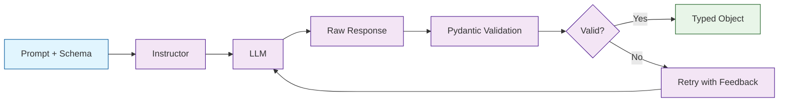

# Instructor Tutorial: Structured LLM Outputs

> Get reliable, typed responses from LLMs with Pydantic validation.

<div align="center">

**📋 Structured Data Extraction from LLMs**

[](https://github.com/instructor-ai/instructor)

</div>

---

## 🎯 What is Instructor?

**Instructor**<sup>[View Repo](https://github.com/instructor-ai/instructor)</sup> is a library that makes it easy to get structured, validated outputs from LLMs. Instead of parsing free-form text, define a Pydantic model and Instructor ensures the LLM returns data that matches your schema.

### Why Instructor?

| Feature | Description |
|:--------|:------------|
| **Type Safety** | Pydantic models ensure correct data types |
| **Validation** | Built-in validation with retry logic |
| **Multi-Provider** | OpenAI, Anthropic, Google, Ollama, and more |
| **Streaming** | Stream partial objects as they're generated |
| **Simple API** | Just patch your existing client |
| **Extensible** | Custom validators and complex nested structures |



## Tutorial Chapters

1. **[Chapter 1: Getting Started](01-getting-started.md)** - Installation, setup, and first structured extraction
2. **[Chapter 2: Pydantic Models](02-pydantic-models.md)** - Designing effective schemas
3. **[Chapter 3: Validation & Retries](03-validation.md)** - Ensuring data quality
4. **[Chapter 4: Complex Structures](04-complex.md)** - Nested objects and lists
5. **[Chapter 5: Streaming](05-streaming.md)** - Partial object streaming
6. **[Chapter 6: Multiple Providers](06-providers.md)** - OpenAI, Anthropic, Ollama
7. **[Chapter 7: Advanced Patterns](07-advanced.md)** - Validators, hooks, and optimization
8. **[Chapter 8: Production Use](08-production.md)** - Best practices and scaling

## What You'll Learn

- **Extract Structured Data** reliably from any LLM
- **Define Schemas** with Pydantic for type safety
- **Handle Validation Errors** with automatic retries
- **Work with Complex Data** including nested objects
- **Stream Partial Results** for better UX
- **Use Multiple Providers** with the same code
- **Build Production Systems** with proper error handling

## Prerequisites

- Python 3.9+
- Basic Pydantic knowledge
- API key for your LLM provider

## Quick Start

```bash
# Install Instructor
pip install instructor

# With specific providers
pip install instructor[anthropic]
pip install instructor[google]
```

## Your First Extraction

```python
import instructor
from openai import OpenAI
from pydantic import BaseModel

# Patch the OpenAI client
client = instructor.from_openai(OpenAI())

# Define your output schema
class User(BaseModel):
    name: str
    age: int
    email: str

# Extract structured data
user = client.chat.completions.create(
    model="gpt-4o",
    response_model=User,
    messages=[
        {"role": "user", "content": "John Doe is 30 years old. His email is john@example.com"}
    ]
)

print(user)
# User(name='John Doe', age=30, email='john@example.com')
print(user.name)  # Fully typed!
# 'John Doe'
```

## Complex Extraction

```python
from pydantic import BaseModel, Field
from typing import List, Optional
from enum import Enum

class Priority(str, Enum):
    LOW = "low"
    MEDIUM = "medium"
    HIGH = "high"

class Task(BaseModel):
    title: str = Field(description="Brief task title")
    description: str = Field(description="Detailed description")
    priority: Priority
    due_date: Optional[str] = Field(description="ISO format date if mentioned")
    assignee: Optional[str] = None

class TaskList(BaseModel):
    tasks: List[Task]
    project_name: str

# Extract multiple tasks from natural language
result = client.chat.completions.create(
    model="gpt-4o",
    response_model=TaskList,
    messages=[
        {"role": "user", "content": """
        For the Website Redesign project:
        - High priority: Update homepage hero section by Friday, assign to Sarah
        - Medium priority: Fix mobile navigation issues
        - Low priority: Add dark mode support, due next month
        """}
    ]
)

for task in result.tasks:
    print(f"[{task.priority.value}] {task.title}")
# [high] Update homepage hero section
# [medium] Fix mobile navigation issues
# [low] Add dark mode support
```

## Validation with Retries

```python
from pydantic import BaseModel, field_validator
import instructor

class ValidatedUser(BaseModel):
    name: str
    email: str
    age: int

    @field_validator('email')
    @classmethod
    def validate_email(cls, v):
        if '@' not in v:
            raise ValueError('Invalid email format')
        return v

    @field_validator('age')
    @classmethod
    def validate_age(cls, v):
        if v < 0 or v > 150:
            raise ValueError('Age must be between 0 and 150')
        return v

# Instructor automatically retries with validation feedback
user = client.chat.completions.create(
    model="gpt-4o",
    response_model=ValidatedUser,
    max_retries=3,  # Retry up to 3 times on validation failure
    messages=[
        {"role": "user", "content": "Extract: Bob, bob.email, 25"}
    ]
)
# Instructor will retry and get a proper email format
```

## Streaming Partial Objects

```python
from instructor import Partial

class Article(BaseModel):
    title: str
    summary: str
    key_points: List[str]

# Stream partial results
for partial in client.chat.completions.create_partial(
    model="gpt-4o",
    response_model=Article,
    messages=[
        {"role": "user", "content": "Write an article about AI agents"}
    ]
):
    print(f"Title: {partial.title}")
    print(f"Points so far: {len(partial.key_points or [])}")
    # Partial objects are available as they stream in
```

## Multiple Providers

```python
import instructor
from openai import OpenAI
from anthropic import Anthropic

# OpenAI
openai_client = instructor.from_openai(OpenAI())

# Anthropic
anthropic_client = instructor.from_anthropic(Anthropic())

# Same extraction code works with both!
def extract_user(client, text: str) -> User:
    return client.chat.completions.create(
        model="gpt-4o" if isinstance(client, OpenAI) else "claude-3-5-sonnet-20241022",
        response_model=User,
        messages=[{"role": "user", "content": text}]
    )
```

## Common Use Cases

| Use Case | Example Schema |
|:---------|:---------------|
| **Data Extraction** | Extract entities from documents |
| **Classification** | Categorize text into predefined classes |
| **Summarization** | Structured summaries with key points |
| **Form Filling** | Extract form fields from unstructured text |
| **Code Generation** | Generate code with specific structure |
| **API Responses** | Ensure LLM outputs match API schemas |

## Learning Path

### 🟢 Beginner Track
1. Chapters 1-3: Setup, basic models, and validation
2. Extract simple structured data

### 🟡 Intermediate Track
1. Chapters 4-6: Complex structures, streaming, and providers
2. Build production extraction pipelines

### 🔴 Advanced Track
1. Chapters 7-8: Advanced patterns and production
2. Master structured LLM applications

---

**Ready to get structured outputs from LLMs? Let's begin with [Chapter 1: Getting Started](01-getting-started.md)!**

*Generated for [Awesome Code Docs](https://github.com/johnxie/awesome-code-docs)*
