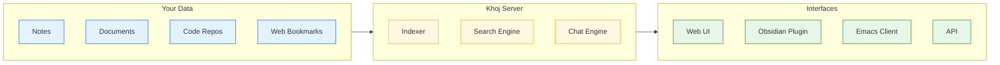
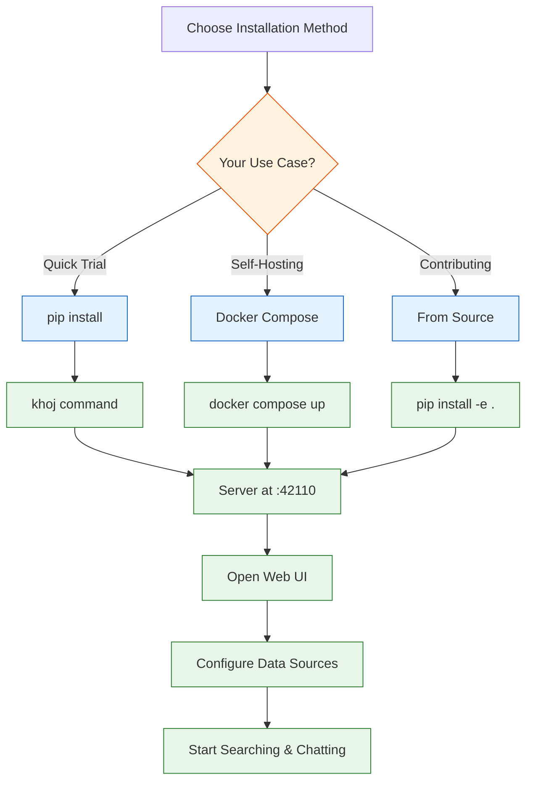
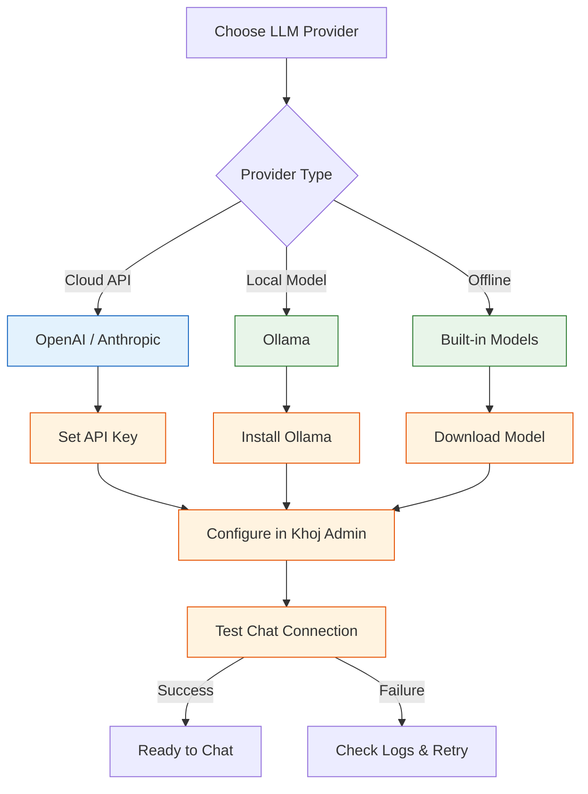

# Chapter 1: Getting Started

Khoj is an open-source AI personal assistant designed to give you natural language access to your personal knowledge base. Unlike cloud-only AI assistants, Khoj can be self-hosted, giving you full control over your data and privacy. This chapter walks you through installation, initial configuration, and connecting your first data sources.

## What is Khoj?

Khoj transforms your scattered notes, documents, and online data into a searchable, conversational knowledge base. Think of it as having a personal research assistant that has read everything you have ever written and can instantly recall and synthesize that information.



### Key Capabilities

| Feature | Description |
|---------|-------------|
| **Semantic Search** | Find information by meaning, not just keywords |
| **Chat with Your Data** | Ask questions and get answers grounded in your notes |
| **Multi-Format Support** | Index Org-mode, Markdown, PDF, plaintext, and more |
| **Multiple LLM Backends** | Use OpenAI, Anthropic, or local models via Ollama |
| **Self-Hostable** | Run entirely on your own infrastructure |
| **Client Integrations** | Native plugins for Obsidian and Emacs |
| **Automation** | Schedule recurring queries and autonomous tasks |
| **Online Search** | Supplement your data with web search results |

## Prerequisites

Before installing Khoj, ensure your system meets these requirements:

| Requirement | Minimum | Recommended |
|-------------|---------|-------------|
| **Python** | 3.10+ | 3.11+ |
| **RAM** | 4 GB | 8 GB+ |
| **Disk Space** | 2 GB | 10 GB+ (depends on data volume) |
| **Docker** (optional) | 20.10+ | Latest stable |
| **OS** | Linux, macOS, Windows | Linux (Ubuntu 22.04+) |

## Installation Methods

Khoj offers several installation paths depending on your needs. Let us explore each one.

### Method 1: pip Install (Simplest)

The fastest way to get started is via pip:

```python
# Create a virtual environment (recommended)
import subprocess
import sys

def setup_khoj_venv():
    """Set up Khoj in an isolated virtual environment."""
    venv_path = "~/.khoj-env"

    # Create virtual environment
    subprocess.run([sys.executable, "-m", "venv", venv_path])

    # Install Khoj
    pip_path = f"{venv_path}/bin/pip"
    subprocess.run([pip_path, "install", "khoj-assistant"])

    print(f"Khoj installed in virtual environment at {venv_path}")
    print(f"Activate with: source {venv_path}/bin/activate")
    print(f"Start with: khoj")

setup_khoj_venv()
```

From the command line:

```bash
# Install Khoj
pip install khoj-assistant

# Start the Khoj server
khoj

# Khoj will be available at http://localhost:42110
```

### Method 2: Docker (Recommended for Self-Hosting)

Docker provides the most reproducible and isolated deployment:

```yaml
# docker-compose.yml
version: "3.9"
services:
  khoj:
    image: ghcr.io/khoj-ai/khoj:latest
    container_name: khoj
    ports:
      - "42110:42110"
    volumes:
      - khoj-data:/root/.khoj
      - ./data:/data  # Mount your notes directory
    environment:
      - KHOJ_ADMIN_EMAIL=admin@example.com
      - KHOJ_ADMIN_PASSWORD=your-secure-password
      - KHOJ_DEBUG=false
    restart: unless-stopped

  postgres:
    image: postgres:15
    container_name: khoj-db
    environment:
      - POSTGRES_DB=khoj
      - POSTGRES_USER=khoj
      - POSTGRES_PASSWORD=db-password
    volumes:
      - postgres-data:/var/lib/postgresql/data

volumes:
  khoj-data:
  postgres-data:
```

```bash
# Launch with Docker Compose
docker compose up -d

# Check logs
docker compose logs -f khoj
```

### Method 3: From Source (For Development)

```bash
# Clone the repository
git clone https://github.com/khoj-ai/khoj.git
cd khoj

# Install dependencies
pip install -e '.[dev]'

# Start the server
khoj --host 0.0.0.0 --port 42110
```



## Initial Configuration

After installation, Khoj starts a web server at `http://localhost:42110`. The first time you access it, you will need to complete initial setup.

### Creating an Admin Account

```python
import requests

def configure_khoj_admin(base_url="http://localhost:42110"):
    """
    Demonstrates the initial admin configuration flow.
    In practice, this is done through the web UI on first launch.
    """
    # The admin account is typically created during first launch
    # via environment variables or the web setup wizard
    config = {
        "admin_email": "admin@example.com",
        "admin_password": "secure-password-here",
    }

    print(f"Access Khoj at: {base_url}")
    print(f"Admin panel at: {base_url}/server/admin/")
    print("Complete the setup wizard to configure your instance.")

    return config
```

### Server Configuration Options

Khoj accepts several command-line arguments and environment variables:

| Parameter | Environment Variable | Default | Description |
|-----------|---------------------|---------|-------------|
| `--host` | `KHOJ_HOST` | `127.0.0.1` | Server bind address |
| `--port` | `KHOJ_PORT` | `42110` | Server port |
| `--anonymous-mode` | `KHOJ_ANONYMOUS_MODE` | `false` | Allow access without login |
| `--chat-model` | `KHOJ_CHAT_MODEL` | `gpt-4` | Default chat model |
| `--debug` | `KHOJ_DEBUG` | `false` | Enable debug logging |

```python
import os

def get_khoj_config():
    """Retrieve Khoj configuration from environment variables."""
    config = {
        "host": os.environ.get("KHOJ_HOST", "127.0.0.1"),
        "port": int(os.environ.get("KHOJ_PORT", 42110)),
        "debug": os.environ.get("KHOJ_DEBUG", "false").lower() == "true",
        "anonymous_mode": os.environ.get(
            "KHOJ_ANONYMOUS_MODE", "false"
        ).lower() == "true",
        "admin_email": os.environ.get("KHOJ_ADMIN_EMAIL", ""),
        "database_url": os.environ.get(
            "DATABASE_URL", "sqlite:///~/.khoj/khoj.db"
        ),
    }
    return config

config = get_khoj_config()
print(f"Khoj will run at http://{config['host']}:{config['port']}")
```

## Connecting Your First Data Source

Khoj becomes powerful when connected to your personal data. Let us walk through connecting different types of data.

### Connecting a Local Notes Directory

The simplest way to get started is pointing Khoj at a directory of Markdown or Org-mode notes:

```python
import requests
import json

def configure_content_source(
    base_url="http://localhost:42110",
    api_key="your-api-key",
    content_type="markdown",
    directory_path="/path/to/your/notes"
):
    """
    Configure a local directory as a content source for Khoj.
    """
    headers = {
        "Authorization": f"Bearer {api_key}",
        "Content-Type": "application/json"
    }

    # Define the content source configuration
    content_config = {
        "content_type": content_type,
        "input_filter": [f"{directory_path}/**/*.md"],
        "input_files": None,
        "compressed_jsonl": None,
        "embeddings_file": None,
    }

    response = requests.post(
        f"{base_url}/api/config/data/content-source",
        headers=headers,
        json=content_config
    )

    if response.status_code == 200:
        print(f"Content source configured: {directory_path}")
        print(f"Content type: {content_type}")
        return response.json()
    else:
        print(f"Error: {response.status_code} - {response.text}")
        return None

# Connect your Obsidian vault
configure_content_source(
    content_type="markdown",
    directory_path="/home/user/ObsidianVault"
)

# Connect your Org-mode notes
configure_content_source(
    content_type="org",
    directory_path="/home/user/org"
)
```

### Configuring an LLM Backend

Khoj requires an LLM backend for its chat functionality. Here is how to configure different providers:

```python
def configure_llm_backend(
    base_url="http://localhost:42110",
    api_key="your-api-key",
    provider="openai",
    model_config=None
):
    """
    Configure the LLM backend for Khoj chat.

    Supported providers:
    - openai: GPT-4, GPT-3.5-turbo
    - anthropic: Claude 3, Claude 3.5
    - ollama: Any locally hosted model
    - offline: Use local models without external API
    """
    providers = {
        "openai": {
            "name": "OpenAI",
            "api_key_env": "OPENAI_API_KEY",
            "default_model": "gpt-4",
            "api_base": "https://api.openai.com/v1",
        },
        "anthropic": {
            "name": "Anthropic",
            "api_key_env": "ANTHROPIC_API_KEY",
            "default_model": "claude-3-5-sonnet-20241022",
            "api_base": "https://api.anthropic.com",
        },
        "ollama": {
            "name": "Ollama (Local)",
            "api_key_env": None,
            "default_model": "llama3.1:8b",
            "api_base": "http://localhost:11434",
        },
    }

    provider_config = providers.get(provider, providers["openai"])

    if model_config:
        provider_config.update(model_config)

    print(f"Configuring LLM backend: {provider_config['name']}")
    print(f"Model: {provider_config['default_model']}")
    print(f"API Base: {provider_config['api_base']}")

    return provider_config

# Configure with OpenAI
openai_config = configure_llm_backend(provider="openai")

# Configure with local Ollama
ollama_config = configure_llm_backend(provider="ollama")
```



## Triggering Your First Index

Once data sources are connected, you need to trigger indexing so Khoj can search your content:

```python
import requests
import time

def trigger_indexing(
    base_url="http://localhost:42110",
    api_key="your-api-key"
):
    """Trigger Khoj to index all configured content sources."""
    headers = {"Authorization": f"Bearer {api_key}"}

    # Trigger the indexing process
    response = requests.get(
        f"{base_url}/api/update",
        headers=headers
    )

    if response.status_code == 200:
        print("Indexing triggered successfully!")
        print("This may take a few minutes depending on data volume.")

        # Poll for indexing status
        for i in range(30):
            status = requests.get(
                f"{base_url}/api/config/index/status",
                headers=headers
            )
            if status.json().get("completed"):
                print(f"Indexing completed in ~{(i+1)*10} seconds")
                return True
            time.sleep(10)

    return False

# Trigger indexing
trigger_indexing()
```

## Making Your First Search

With data indexed, you can now search your knowledge base:

```python
import requests

def search_khoj(
    query,
    base_url="http://localhost:42110",
    api_key="your-api-key",
    content_type="all",
    results_count=5
):
    """
    Search your personal knowledge base using Khoj.

    Args:
        query: Natural language search query
        content_type: Filter by type ('markdown', 'org', 'pdf', 'all')
        results_count: Number of results to return
    """
    headers = {"Authorization": f"Bearer {api_key}"}
    params = {
        "q": query,
        "t": content_type,
        "n": results_count,
    }

    response = requests.get(
        f"{base_url}/api/search",
        headers=headers,
        params=params
    )

    if response.status_code == 200:
        results = response.json()
        print(f"Found {len(results)} results for: '{query}'")
        for i, result in enumerate(results, 1):
            print(f"\n--- Result {i} ---")
            print(f"Score: {result.get('score', 'N/A'):.4f}")
            print(f"Source: {result.get('additional', {}).get('file', 'Unknown')}")
            print(f"Content: {result.get('entry', '')[:200]}...")
        return results
    else:
        print(f"Search failed: {response.status_code}")
        return []

# Search for project ideas
search_khoj("machine learning project ideas for beginners")

# Search specifically in Markdown notes
search_khoj("meeting notes from last week", content_type="markdown")
```

## Starting a Chat Session

Khoj's chat feature lets you have a conversation grounded in your personal data:

```python
import requests

def chat_with_khoj(
    message,
    base_url="http://localhost:42110",
    api_key="your-api-key",
    conversation_id=None
):
    """
    Chat with Khoj AI, grounded in your personal knowledge base.
    """
    headers = {
        "Authorization": f"Bearer {api_key}",
        "Content-Type": "application/json"
    }

    payload = {
        "q": message,
        "stream": False,
    }

    if conversation_id:
        payload["conversation_id"] = conversation_id

    response = requests.get(
        f"{base_url}/api/chat",
        headers=headers,
        params=payload
    )

    if response.status_code == 200:
        result = response.json()
        print(f"You: {message}")
        print(f"Khoj: {result.get('response', 'No response')}")

        # Show sources used
        context = result.get("context", [])
        if context:
            print(f"\nSources referenced: {len(context)} documents")
            for src in context[:3]:
                print(f"  - {src.get('file', 'Unknown source')}")

        return result
    else:
        print(f"Chat failed: {response.status_code}")
        return None

# Start a conversation
chat_with_khoj("What are the main themes across my recent notes?")

# Follow up
chat_with_khoj("Can you summarize my notes about Python programming?")
```

## Client Integrations

### Obsidian Plugin

Khoj offers a native Obsidian plugin for seamless integration:

1. Open Obsidian Settings -> Community Plugins -> Browse
2. Search for "Khoj" and install the plugin
3. Configure the plugin with your Khoj server URL

```python
# Obsidian plugin configuration (settings.json equivalent)
obsidian_khoj_config = {
    "khoj_url": "http://localhost:42110",
    "khoj_api_key": "your-api-key",
    "auto_sync": True,
    "sync_interval_minutes": 30,
    "results_count": 6,
    "enable_chat": True,
}
```

### Emacs Client

For Emacs users, Khoj provides a native Emacs package:

```python
# Emacs configuration equivalent
emacs_config = """
;; Install from MELPA
;; M-x package-install RET khoj RET

;; Configure Khoj
(setq khoj-server-url "http://localhost:42110")
(setq khoj-api-key "your-api-key")
(setq khoj-auto-index t)

;; Key bindings
;; C-c s s -> Search
;; C-c s c -> Chat
;; C-c s i -> Index
"""

print("Emacs Khoj configuration:")
print(emacs_config)
```

## Verifying Your Installation

Run this verification script to ensure everything is working:

```python
import requests
import sys

def verify_khoj_installation(base_url="http://localhost:42110"):
    """Verify that Khoj is properly installed and configured."""
    checks = {
        "server_reachable": False,
        "api_responsive": False,
        "data_configured": False,
        "search_working": False,
        "chat_available": False,
    }

    # Check 1: Server is reachable
    try:
        response = requests.get(f"{base_url}/api/health", timeout=5)
        checks["server_reachable"] = response.status_code == 200
    except requests.ConnectionError:
        print("FAIL: Cannot connect to Khoj server")
        print(f"  Ensure Khoj is running at {base_url}")
        return checks

    # Check 2: API is responsive
    try:
        response = requests.get(f"{base_url}/api/config/types")
        checks["api_responsive"] = response.status_code in [200, 403]
    except Exception:
        pass

    # Check 3: Data sources configured
    try:
        response = requests.get(f"{base_url}/api/config/types")
        if response.status_code == 200:
            types = response.json()
            checks["data_configured"] = len(types) > 0
    except Exception:
        pass

    # Print results
    print("Khoj Installation Verification")
    print("=" * 40)
    for check, passed in checks.items():
        status = "PASS" if passed else "FAIL"
        print(f"  [{status}] {check.replace('_', ' ').title()}")

    all_passed = all(checks.values())
    print(f"\nOverall: {'All checks passed!' if all_passed else 'Some checks failed.'}")
    return checks

verify_khoj_installation()
```

## Summary

In this chapter, you learned how to:

- **Install Khoj** using pip, Docker, or from source
- **Configure the server** with appropriate settings and environment variables
- **Connect data sources** including Markdown notes and Org-mode files
- **Set up LLM backends** for chat functionality (OpenAI, Anthropic, or Ollama)
- **Trigger indexing** to make your content searchable
- **Perform searches** and **start chat sessions** with your data
- **Integrate with editors** like Obsidian and Emacs

## Key Takeaways

1. Khoj is designed for self-hosting, giving you full control over your data and privacy.
2. Docker Compose is the recommended deployment method for persistent self-hosting.
3. Multiple LLM backends are supported, including fully offline operation with Ollama.
4. Data must be indexed before it becomes searchable; indexing can be triggered manually or scheduled.
5. Client integrations for Obsidian and Emacs bring Khoj directly into your workflow.

## Next Steps

In [Chapter 2: Architecture Overview](02-architecture-overview.md), we will explore Khoj's internal architecture, including how the search indexing pipeline works, how LLM integration is managed, and the overall system design that makes Khoj a powerful personal assistant.

---
*Built with insights from the [Khoj](https://github.com/khoj-ai/khoj) project.*
