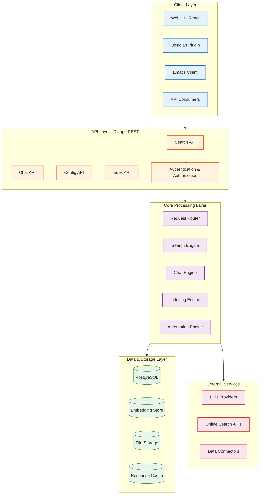
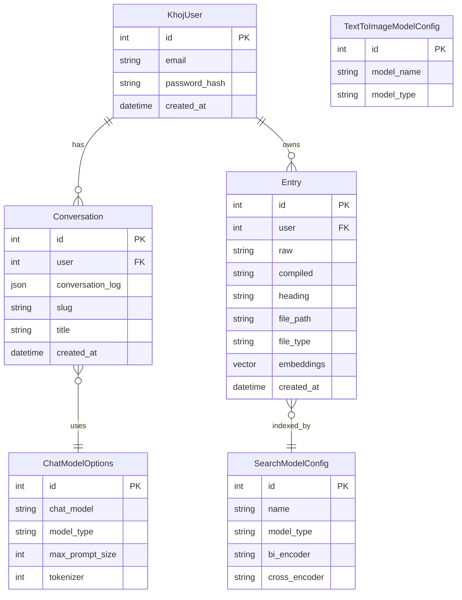
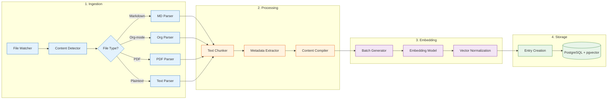
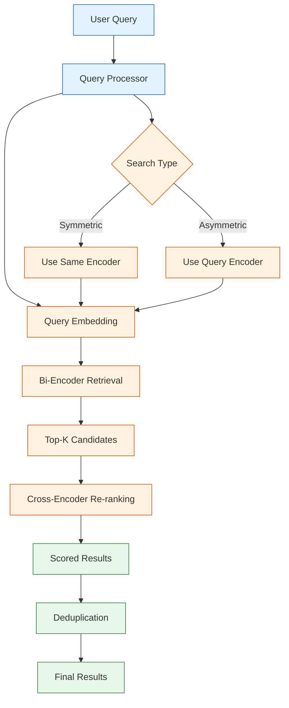
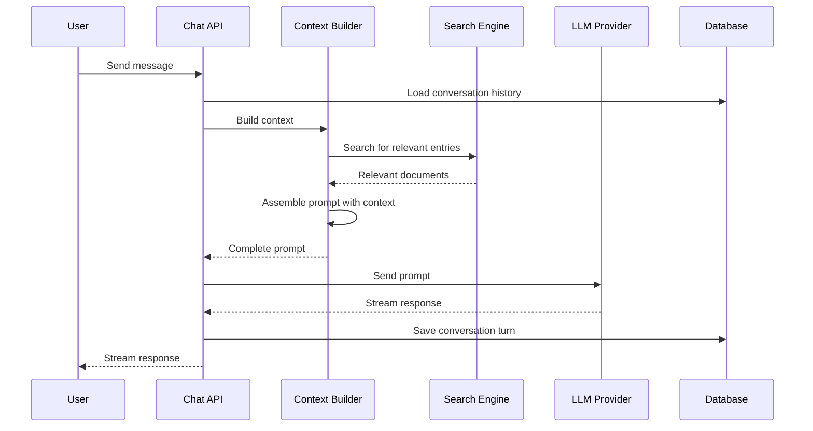
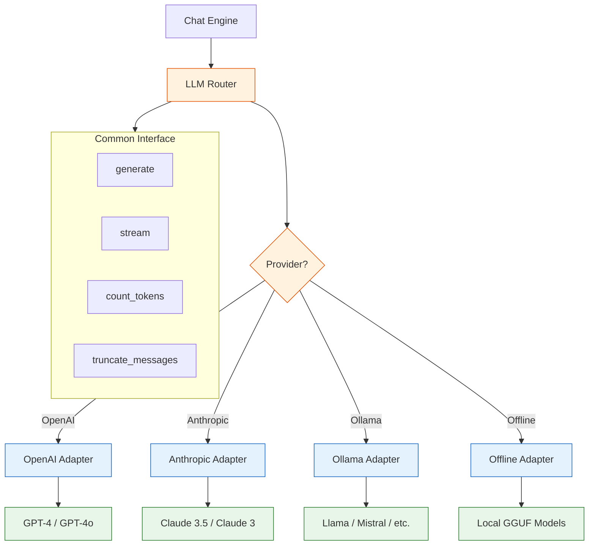
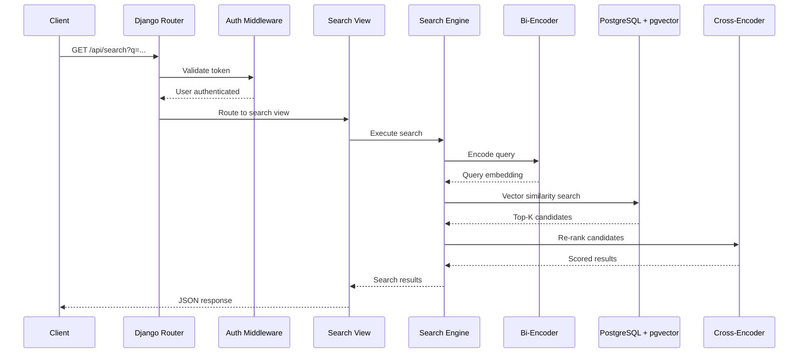

# Chapter 2: Architecture Overview

Understanding Khoj's architecture is essential for effectively configuring, extending, and troubleshooting the system. Khoj is built as a modular, Django-based web application that orchestrates data ingestion, semantic search, and LLM-powered chat into a unified personal assistant experience. This chapter explores each architectural layer in depth.

## High-Level System Architecture

Khoj follows a layered architecture pattern where each layer has clear responsibilities and well-defined interfaces.



## Core Components

### The Django Application Layer

Khoj is built on Django, leveraging its robust ORM, authentication system, and admin interface. The application is organized into several Django apps:

```python
# Simplified representation of Khoj's Django project structure
KHOJ_PROJECT_STRUCTURE = {
    "src/khoj/": {
        "app/": "Main Django application settings and URLs",
        "database/": {
            "models/": "Django ORM models for all entities",
            "adapters/": "Database adapter patterns for data access",
        },
        "processor/": {
            "content/": "Content type processors (markdown, org, pdf)",
            "conversation/": "Chat and conversation management",
            "embeddings/": "Embedding generation and management",
        },
        "search_type/": "Search implementations (text, image)",
        "routers/": "API endpoint definitions and handlers",
        "utils/": "Shared utilities and helpers",
    }
}

def print_structure(structure, indent=0):
    """Visualize the project structure."""
    for key, value in structure.items():
        prefix = "  " * indent
        if isinstance(value, dict):
            print(f"{prefix}{key}")
            print_structure(value, indent + 1)
        else:
            print(f"{prefix}{key} -> {value}")

print_structure(KHOJ_PROJECT_STRUCTURE)
```

### Data Models

Khoj uses Django models to manage its entities. Here are the key models and their relationships:



```python
# Simplified representation of Khoj's core Django models
from dataclasses import dataclass, field
from typing import Optional
from datetime import datetime

@dataclass
class KhojUser:
    """Represents a Khoj user with their preferences."""
    id: int
    email: str
    created_at: datetime = field(default_factory=datetime.now)

@dataclass
class Entry:
    """
    Core data unit in Khoj. Each entry represents a chunk of
    indexed content with its embedding vector.
    """
    id: int
    user: KhojUser
    raw: str                    # Original raw content
    compiled: str               # Processed/cleaned content
    heading: Optional[str]      # Section heading if available
    file_path: str              # Source file path
    file_type: str              # markdown, org, pdf, etc.
    embeddings: list[float]     # Vector embedding
    corpus_id: int              # Unique ID within the corpus
    created_at: datetime = field(default_factory=datetime.now)

@dataclass
class Conversation:
    """Stores a chat conversation with full history."""
    id: int
    user: KhojUser
    conversation_log: dict      # Full message history
    slug: str                   # URL-friendly identifier
    title: Optional[str] = None
    created_at: datetime = field(default_factory=datetime.now)

@dataclass
class SearchModelConfig:
    """Configuration for the search embedding model."""
    name: str
    model_type: str             # bi_encoder, cross_encoder
    bi_encoder: str             # e.g., "sentence-transformers/all-MiniLM-L6-v2"
    cross_encoder: str          # e.g., "cross-encoder/ms-marco-MiniLM-L-6-v2"
    embeddings_inference_endpoint: Optional[str] = None

print("Core models define the data backbone of Khoj")
```

## The Indexing Pipeline

The indexing pipeline is responsible for transforming raw documents into searchable embeddings. This is one of the most critical components of Khoj's architecture.



### Text Chunking Strategy

Khoj uses intelligent text chunking to split documents into meaningful segments:

```python
from dataclasses import dataclass

@dataclass
class ChunkConfig:
    """Configuration for text chunking."""
    max_tokens: int = 256
    overlap_tokens: int = 32
    split_by_heading: bool = True
    preserve_paragraphs: bool = True

def chunk_document(content: str, config: ChunkConfig) -> list[dict]:
    """
    Demonstrates Khoj's document chunking approach.

    Khoj uses a heading-aware chunking strategy that:
    1. First splits by headings (# in Markdown, * in Org-mode)
    2. Then splits large sections by paragraphs
    3. Applies token-based splitting as a final fallback
    4. Maintains overlap between chunks for context continuity
    """
    chunks = []
    sections = split_by_headings(content)

    for section in sections:
        heading = section.get("heading", "")
        body = section.get("body", "")

        if estimate_tokens(body) <= config.max_tokens:
            # Section fits in one chunk
            chunks.append({
                "heading": heading,
                "content": body,
                "tokens": estimate_tokens(body),
            })
        else:
            # Split large sections by paragraph
            paragraphs = body.split("\n\n")
            current_chunk = []
            current_tokens = 0

            for para in paragraphs:
                para_tokens = estimate_tokens(para)
                if current_tokens + para_tokens > config.max_tokens:
                    # Save current chunk and start new one
                    chunks.append({
                        "heading": heading,
                        "content": "\n\n".join(current_chunk),
                        "tokens": current_tokens,
                    })
                    # Keep overlap from previous chunk
                    overlap_text = current_chunk[-1] if current_chunk else ""
                    current_chunk = [overlap_text, para]
                    current_tokens = estimate_tokens(overlap_text) + para_tokens
                else:
                    current_chunk.append(para)
                    current_tokens += para_tokens

            if current_chunk:
                chunks.append({
                    "heading": heading,
                    "content": "\n\n".join(current_chunk),
                    "tokens": current_tokens,
                })

    return chunks

def split_by_headings(content: str) -> list[dict]:
    """Split content by heading markers."""
    # Simplified - actual implementation handles nested headings
    sections = []
    current_heading = ""
    current_body = []

    for line in content.split("\n"):
        if line.startswith("#"):
            if current_body:
                sections.append({
                    "heading": current_heading,
                    "body": "\n".join(current_body)
                })
            current_heading = line.lstrip("#").strip()
            current_body = []
        else:
            current_body.append(line)

    if current_body:
        sections.append({
            "heading": current_heading,
            "body": "\n".join(current_body)
        })

    return sections

def estimate_tokens(text: str) -> int:
    """Rough token estimation (4 chars per token)."""
    return len(text) // 4
```

## The Search Engine

Khoj implements a multi-stage search pipeline that combines bi-encoder retrieval with cross-encoder re-ranking for high-quality results.



### Search Pipeline Implementation

```python
from typing import Optional
import numpy as np

class KhojSearchEngine:
    """
    Demonstrates Khoj's two-stage search architecture.

    Stage 1: Bi-encoder retrieval
    - Fast approximate nearest neighbor search
    - Retrieves top-K candidates from the full corpus
    - Uses sentence-transformers for embedding

    Stage 2: Cross-encoder re-ranking
    - Precise relevance scoring
    - Re-ranks the top-K candidates
    - Higher accuracy but slower (only applied to candidates)
    """

    def __init__(self, bi_encoder_model: str, cross_encoder_model: str):
        self.bi_encoder = bi_encoder_model
        self.cross_encoder = cross_encoder_model
        self.index = None

    def search(
        self,
        query: str,
        entries: list[dict],
        search_type: str = "asymmetric",
        top_k: int = 10,
        rerank_top_n: int = 5,
    ) -> list[dict]:
        """
        Execute a two-stage search.

        Args:
            query: Natural language search query
            entries: Indexed entries with embeddings
            search_type: 'symmetric' or 'asymmetric'
            top_k: Candidates from bi-encoder stage
            rerank_top_n: Final results after re-ranking
        """
        # Stage 1: Bi-encoder retrieval
        query_embedding = self._encode_query(query, search_type)
        candidates = self._retrieve_candidates(
            query_embedding, entries, top_k
        )

        # Stage 2: Cross-encoder re-ranking
        reranked = self._rerank_candidates(query, candidates)

        # Return top-N after re-ranking
        return reranked[:rerank_top_n]

    def _encode_query(self, query: str, search_type: str) -> list[float]:
        """
        Encode query into embedding vector.

        For asymmetric search (question -> passage matching):
            Uses a query-specific encoding
        For symmetric search (passage -> passage matching):
            Uses the same encoding as documents
        """
        if search_type == "asymmetric":
            # Prepend query instruction for asymmetric models
            formatted_query = f"Represent this query: {query}"
        else:
            formatted_query = query

        # In production, this calls the actual bi-encoder model
        # Returns a normalized embedding vector
        embedding = self._mock_encode(formatted_query)
        return embedding

    def _retrieve_candidates(
        self,
        query_embedding: list[float],
        entries: list[dict],
        top_k: int
    ) -> list[dict]:
        """Retrieve top-K candidates using cosine similarity."""
        scored_entries = []
        for entry in entries:
            score = self._cosine_similarity(
                query_embedding, entry["embeddings"]
            )
            scored_entries.append({**entry, "bi_encoder_score": score})

        # Sort by similarity score descending
        scored_entries.sort(
            key=lambda x: x["bi_encoder_score"], reverse=True
        )
        return scored_entries[:top_k]

    def _rerank_candidates(
        self, query: str, candidates: list[dict]
    ) -> list[dict]:
        """Re-rank candidates using cross-encoder for precision."""
        for candidate in candidates:
            # Cross-encoder scores query-document pairs directly
            pair_score = self._cross_encode(query, candidate["compiled"])
            candidate["cross_encoder_score"] = pair_score

        candidates.sort(
            key=lambda x: x["cross_encoder_score"], reverse=True
        )
        return candidates

    def _cosine_similarity(self, a: list[float], b: list[float]) -> float:
        """Compute cosine similarity between two vectors."""
        a_arr, b_arr = np.array(a), np.array(b)
        return float(
            np.dot(a_arr, b_arr) /
            (np.linalg.norm(a_arr) * np.linalg.norm(b_arr))
        )

    def _mock_encode(self, text: str) -> list[float]:
        """Mock encoder for demonstration purposes."""
        return [0.1] * 384  # Typical embedding dimension

    def _cross_encode(self, query: str, passage: str) -> float:
        """Mock cross-encoder scoring."""
        return 0.85  # Placeholder score

print("Khoj uses a two-stage retrieval pipeline for accurate search")
```

## The Chat Engine

The chat engine orchestrates conversations by combining user messages with relevant context from the search engine and sending them to the configured LLM.



```python
class ChatEngine:
    """
    Demonstrates Khoj's chat orchestration pipeline.

    The chat engine is responsible for:
    1. Managing conversation history
    2. Retrieving relevant context from indexed data
    3. Constructing effective prompts
    4. Routing to the appropriate LLM backend
    5. Streaming responses back to the client
    """

    def __init__(self, search_engine, llm_client, max_context_tokens=4096):
        self.search_engine = search_engine
        self.llm_client = llm_client
        self.max_context_tokens = max_context_tokens

    def process_message(
        self,
        user_message: str,
        conversation_history: list[dict],
        user_id: int,
    ) -> dict:
        """Process a user message and generate a response."""

        # Step 1: Determine if context retrieval is needed
        needs_context = self._should_retrieve_context(user_message)

        # Step 2: Retrieve relevant context
        context_entries = []
        if needs_context:
            context_entries = self.search_engine.search(
                query=user_message,
                entries=self._get_user_entries(user_id),
                top_k=10,
                rerank_top_n=5,
            )

        # Step 3: Build the prompt
        prompt = self._build_prompt(
            user_message=user_message,
            conversation_history=conversation_history,
            context_entries=context_entries,
        )

        # Step 4: Generate response via LLM
        response = self.llm_client.generate(prompt)

        # Step 5: Return response with metadata
        return {
            "response": response,
            "context": context_entries,
            "intent": {
                "needs_context": needs_context,
                "query_used": user_message,
            },
        }

    def _should_retrieve_context(self, message: str) -> bool:
        """
        Determine if the message needs context from personal data.
        Simple messages like greetings do not need retrieval.
        """
        no_context_patterns = [
            "hello", "hi", "hey", "thanks", "thank you",
            "bye", "goodbye", "good morning",
        ]
        return message.lower().strip() not in no_context_patterns

    def _build_prompt(
        self,
        user_message: str,
        conversation_history: list[dict],
        context_entries: list[dict],
    ) -> str:
        """Assemble the complete prompt for the LLM."""
        parts = []

        # System instructions
        parts.append(
            "You are Khoj, a personal AI assistant. "
            "Answer questions using the provided context from "
            "the user's personal notes and documents. "
            "Be helpful, accurate, and cite your sources."
        )

        # Add relevant context
        if context_entries:
            parts.append("\n--- Relevant Context ---")
            for entry in context_entries:
                source = entry.get("file_path", "Unknown")
                content = entry.get("compiled", "")
                parts.append(f"[Source: {source}]\n{content}")
            parts.append("--- End Context ---\n")

        # Add conversation history (truncated to fit context window)
        if conversation_history:
            parts.append("Previous conversation:")
            for turn in conversation_history[-6:]:  # Last 6 turns
                role = turn.get("role", "user")
                content = turn.get("content", "")
                parts.append(f"{role}: {content}")

        # Add current message
        parts.append(f"User: {user_message}")
        parts.append("Assistant:")

        return "\n\n".join(parts)

    def _get_user_entries(self, user_id: int) -> list[dict]:
        """Retrieve all indexed entries for a user."""
        # In production, queries the database
        return []

print("Chat engine orchestrates context retrieval and LLM interaction")
```

## LLM Integration Architecture

Khoj supports multiple LLM backends through an abstraction layer that normalizes different provider APIs:



```python
from abc import ABC, abstractmethod
from typing import Generator

class BaseLLMAdapter(ABC):
    """Base class for all LLM backend adapters in Khoj."""

    @abstractmethod
    def generate(self, prompt: str, **kwargs) -> str:
        """Generate a complete response."""
        pass

    @abstractmethod
    def stream(self, prompt: str, **kwargs) -> Generator[str, None, None]:
        """Stream response tokens."""
        pass

    @abstractmethod
    def count_tokens(self, text: str) -> int:
        """Count tokens in the given text."""
        pass

class OpenAIAdapter(BaseLLMAdapter):
    """Adapter for OpenAI's API (GPT models)."""

    def __init__(self, api_key: str, model: str = "gpt-4"):
        self.api_key = api_key
        self.model = model

    def generate(self, prompt: str, **kwargs) -> str:
        # Calls OpenAI's chat completions API
        temperature = kwargs.get("temperature", 0.7)
        max_tokens = kwargs.get("max_tokens", 2048)
        return f"[OpenAI {self.model} response]"

    def stream(self, prompt: str, **kwargs) -> Generator[str, None, None]:
        yield "[Streaming "
        yield f"from {self.model}]"

    def count_tokens(self, text: str) -> int:
        # Uses tiktoken for accurate token counting
        return len(text) // 4

class OllamaAdapter(BaseLLMAdapter):
    """Adapter for locally-hosted models via Ollama."""

    def __init__(self, host: str = "http://localhost:11434", model: str = "llama3.1"):
        self.host = host
        self.model = model

    def generate(self, prompt: str, **kwargs) -> str:
        # Calls Ollama's local API
        return f"[Ollama {self.model} response]"

    def stream(self, prompt: str, **kwargs) -> Generator[str, None, None]:
        yield "[Streaming "
        yield f"from local {self.model}]"

    def count_tokens(self, text: str) -> int:
        return len(text) // 4

# LLM Router
class LLMRouter:
    """Routes requests to the appropriate LLM adapter."""

    def __init__(self):
        self.adapters: dict[str, BaseLLMAdapter] = {}

    def register_adapter(self, name: str, adapter: BaseLLMAdapter):
        self.adapters[name] = adapter

    def get_adapter(self, name: str) -> BaseLLMAdapter:
        if name not in self.adapters:
            raise ValueError(f"Unknown LLM provider: {name}")
        return self.adapters[name]

# Usage
router = LLMRouter()
router.register_adapter("openai", OpenAIAdapter(api_key="sk-...", model="gpt-4"))
router.register_adapter("ollama", OllamaAdapter(model="llama3.1:8b"))

adapter = router.get_adapter("openai")
print(f"Using adapter: {type(adapter).__name__}")
```

## Request Processing Flow

When a user interacts with Khoj, requests flow through several layers. Here is the complete lifecycle of a search request:



## Database Architecture

Khoj uses PostgreSQL with the pgvector extension for efficient vector similarity search:

```python
# Simplified database schema representation
DATABASE_SCHEMA = {
    "khoj_user": {
        "columns": ["id", "email", "password", "is_active", "created_at"],
        "indexes": ["email_unique"],
    },
    "entry": {
        "columns": [
            "id", "user_id", "raw", "compiled", "heading",
            "file_path", "file_type", "corpus_id",
            "embeddings",  # pgvector column
            "created_at", "updated_at"
        ],
        "indexes": [
            "user_id_idx",
            "file_path_idx",
            "embeddings_ivfflat_idx",  # Vector similarity index
        ],
    },
    "conversation": {
        "columns": [
            "id", "user_id", "conversation_log",
            "slug", "title", "created_at"
        ],
        "indexes": ["user_id_idx", "slug_idx"],
    },
    "search_model_config": {
        "columns": [
            "id", "name", "model_type",
            "bi_encoder", "cross_encoder"
        ],
    },
    "chat_model_options": {
        "columns": [
            "id", "chat_model", "model_type",
            "max_prompt_size", "tokenizer"
        ],
    },
}

def describe_schema():
    """Print database schema overview."""
    for table, details in DATABASE_SCHEMA.items():
        print(f"\nTable: {table}")
        print(f"  Columns: {', '.join(details['columns'])}")
        if "indexes" in details:
            print(f"  Indexes: {', '.join(details['indexes'])}")

describe_schema()
```

### Vector Index Configuration

```python
# pgvector index configuration for efficient similarity search
VECTOR_INDEX_CONFIG = {
    "index_type": "ivfflat",  # Inverted File Flat index
    "lists": 100,             # Number of cluster lists
    "probes": 10,             # Number of lists to probe during search
    "distance_metric": "cosine",  # cosine, l2, or inner_product
    "dimensions": 384,        # Matches the bi-encoder output dimension
}

# SQL equivalent for creating the vector index
CREATE_VECTOR_INDEX_SQL = """
CREATE INDEX IF NOT EXISTS entry_embeddings_idx
ON entry
USING ivfflat (embeddings vector_cosine_ops)
WITH (lists = 100);
"""

print(f"Vector index: {VECTOR_INDEX_CONFIG['index_type']}")
print(f"Dimensions: {VECTOR_INDEX_CONFIG['dimensions']}")
print(f"Distance metric: {VECTOR_INDEX_CONFIG['distance_metric']}")
```

## Component Communication Patterns

| Component A | Component B | Communication | Data Format |
|-------------|-------------|---------------|-------------|
| Client | API Layer | HTTP REST | JSON |
| API Layer | Search Engine | Direct function call | Python objects |
| API Layer | Chat Engine | Direct function call | Python objects |
| Search Engine | Database | Django ORM / SQL | QuerySets |
| Chat Engine | LLM Provider | HTTP API | Provider-specific JSON |
| Indexing Engine | Embedding Model | HTTP / Direct call | Tensors / Lists |
| File Watcher | Indexing Engine | Django signals | File paths |
| Automation Engine | Chat Engine | Internal queue | Task objects |

## Summary

In this chapter, you explored Khoj's complete architecture:

- **Layered design** with clear separation between clients, API, core processing, and data storage
- **Django foundation** providing robust ORM, authentication, and admin capabilities
- **Indexing pipeline** that transforms documents into searchable embeddings through parsing, chunking, and encoding stages
- **Two-stage search** combining fast bi-encoder retrieval with precise cross-encoder re-ranking
- **Chat engine** that orchestrates context retrieval and LLM interaction
- **LLM abstraction layer** supporting multiple backends through a common adapter pattern
- **PostgreSQL with pgvector** for efficient vector similarity search at scale

## Key Takeaways

1. Khoj's modular architecture allows each component to be configured and extended independently.
2. The two-stage search pipeline (bi-encoder + cross-encoder) balances speed and accuracy.
3. The LLM adapter pattern makes it straightforward to add new model providers.
4. PostgreSQL with pgvector provides production-grade vector storage without requiring a separate vector database.
5. Content chunking is heading-aware, preserving semantic boundaries in the source documents.

## Next Steps

In [Chapter 3: Data Connectors](03-data-connectors.md), we will dive deep into each of Khoj's data connectors, exploring how content from Org-mode files, Markdown notes, PDFs, GitHub repositories, and Notion pages is ingested and processed.

---
*Built with insights from the [Khoj](https://github.com/khoj-ai/khoj) project.*
