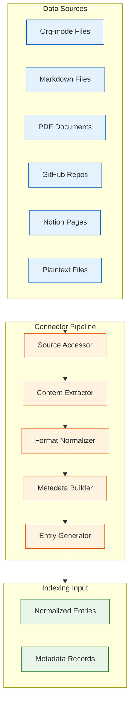
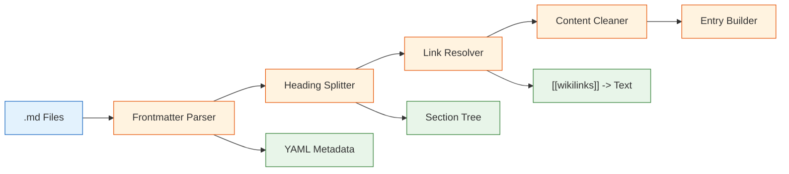
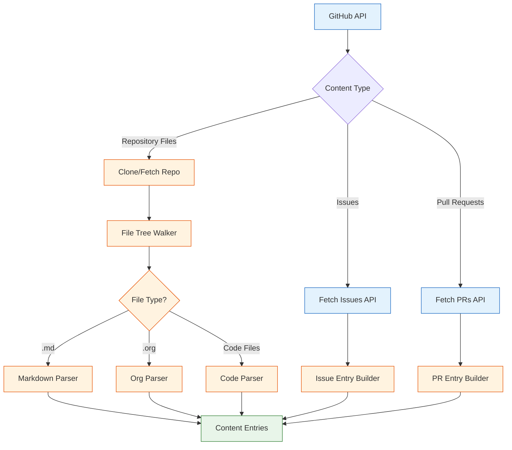
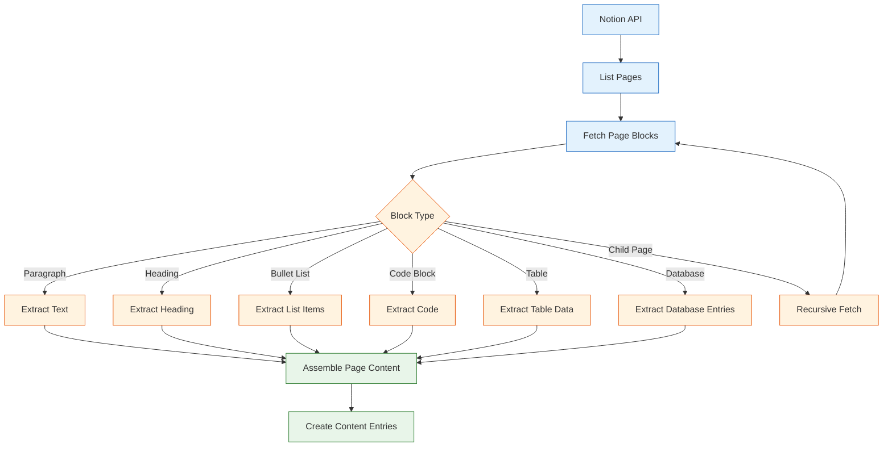
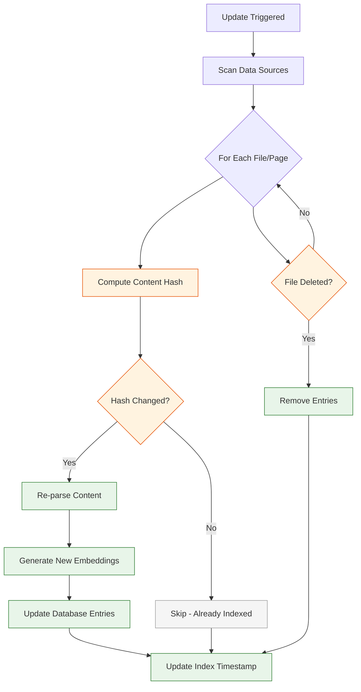

# Chapter 3: Data Connectors

Khoj's power comes from its ability to connect to and index your personal data across a variety of formats and sources. Data connectors are the bridge between your raw content and Khoj's searchable knowledge base. This chapter explores each connector in depth, covering how data is ingested, parsed, and prepared for indexing.

## Connector Architecture Overview

Every data connector in Khoj follows a common pipeline pattern: source access, content extraction, normalization, and entry creation. This ensures consistent behavior regardless of the input format.



## Connector Comparison

| Connector | Input Format | Source Type | Heading-Aware | Incremental Update | Auth Required |
|-----------|-------------|-------------|---------------|-------------------|---------------|
| **Org-mode** | `.org` files | Local filesystem | Yes (outline hierarchy) | Yes | No |
| **Markdown** | `.md` files | Local filesystem | Yes (`#` headings) | Yes | No |
| **PDF** | `.pdf` files | Local filesystem | Partial (page-based) | Yes | No |
| **GitHub** | Repository content | Remote API | Yes (file structure) | Yes | OAuth token |
| **Notion** | Notion pages & databases | Remote API | Yes (block hierarchy) | Yes | Integration token |
| **Plaintext** | `.txt` files | Local filesystem | No | Yes | No |

## The Base Connector Interface

All connectors implement a common interface that the indexing engine relies on:

```python
from abc import ABC, abstractmethod
from dataclasses import dataclass, field
from typing import Optional
from datetime import datetime
from pathlib import Path

@dataclass
class ContentEntry:
    """
    A normalized content entry ready for indexing.
    Every connector produces entries in this format.
    """
    raw: str                     # Original content
    compiled: str                # Cleaned, processed content
    heading: Optional[str]       # Section heading (if applicable)
    file_path: str               # Source file or URL
    file_type: str               # markdown, org, pdf, github, notion
    metadata: dict = field(default_factory=dict)
    created_at: datetime = field(default_factory=datetime.now)

class BaseConnector(ABC):
    """Base class for all Khoj data connectors."""

    @abstractmethod
    def extract_entries(self, source_config: dict) -> list[ContentEntry]:
        """Extract and normalize content entries from the source."""
        pass

    @abstractmethod
    def get_file_filter(self) -> list[str]:
        """Return glob patterns for files this connector handles."""
        pass

    @abstractmethod
    def supports_incremental(self) -> bool:
        """Whether this connector supports incremental updates."""
        pass

    def should_reindex(self, file_path: str, last_indexed: datetime) -> bool:
        """Check if a file needs re-indexing based on modification time."""
        file_mtime = datetime.fromtimestamp(Path(file_path).stat().st_mtime)
        return file_mtime > last_indexed

print("All connectors produce ContentEntry objects for the indexer")
```

## Org-mode Connector

The Org-mode connector is one of Khoj's most sophisticated, designed for Emacs users who maintain extensive personal knowledge bases in Org format.

### Org-mode Parsing

Org-mode files have a rich hierarchical structure with headings, properties, tags, and various block types:

```python
import re
from typing import Optional

class OrgModeConnector(BaseConnector):
    """
    Connector for Emacs Org-mode files.

    Handles:
    - Hierarchical outline structure (* headings)
    - Properties drawers (:PROPERTIES:)
    - Tags (heading :tag1:tag2:)
    - TODO states
    - Timestamps and scheduling
    - Code blocks (#+BEGIN_SRC)
    - Links ([[url][description]])
    """

    def get_file_filter(self) -> list[str]:
        return ["**/*.org"]

    def supports_incremental(self) -> bool:
        return True

    def extract_entries(self, source_config: dict) -> list[ContentEntry]:
        """Parse Org-mode files into content entries."""
        entries = []
        input_filter = source_config.get("input_filter", [])

        for file_path in self._resolve_files(input_filter):
            with open(file_path, "r", encoding="utf-8") as f:
                content = f.read()

            file_entries = self._parse_org_file(content, str(file_path))
            entries.extend(file_entries)

        return entries

    def _parse_org_file(
        self, content: str, file_path: str
    ) -> list[ContentEntry]:
        """
        Parse an Org-mode file into entries by splitting on headings.

        Each top-level heading (and its subtree) becomes one entry.
        The entry preserves the heading hierarchy for context.
        """
        entries = []
        sections = self._split_by_headings(content)

        for section in sections:
            heading = section["heading"]
            body = section["body"]
            level = section["level"]
            tags = self._extract_tags(heading)
            properties = self._extract_properties(body)

            # Clean the body text
            compiled = self._compile_org_content(body)

            entry = ContentEntry(
                raw=f"{'*' * level} {heading}\n{body}",
                compiled=compiled,
                heading=self._clean_heading(heading),
                file_path=file_path,
                file_type="org",
                metadata={
                    "tags": tags,
                    "properties": properties,
                    "level": level,
                    "todo_state": self._extract_todo_state(heading),
                },
            )
            entries.append(entry)

        return entries

    def _split_by_headings(self, content: str) -> list[dict]:
        """Split Org content by heading markers (asterisks)."""
        sections = []
        current_heading = ""
        current_body = []
        current_level = 0

        for line in content.split("\n"):
            heading_match = re.match(r"^(\*+)\s+(.+)$", line)
            if heading_match:
                if current_heading or current_body:
                    sections.append({
                        "heading": current_heading,
                        "body": "\n".join(current_body),
                        "level": current_level,
                    })
                current_level = len(heading_match.group(1))
                current_heading = heading_match.group(2)
                current_body = []
            else:
                current_body.append(line)

        if current_heading or current_body:
            sections.append({
                "heading": current_heading,
                "body": "\n".join(current_body),
                "level": current_level,
            })

        return sections

    def _extract_tags(self, heading: str) -> list[str]:
        """Extract tags from an Org heading (e.g., 'My Heading :tag1:tag2:')."""
        tag_match = re.search(r":(\w+(?::\w+)*):$", heading.strip())
        if tag_match:
            return tag_match.group(1).split(":")
        return []

    def _extract_properties(self, body: str) -> dict:
        """Extract properties from :PROPERTIES: drawer."""
        properties = {}
        in_drawer = False
        for line in body.split("\n"):
            if ":PROPERTIES:" in line:
                in_drawer = True
            elif ":END:" in line:
                in_drawer = False
            elif in_drawer:
                prop_match = re.match(r":(\w+):\s+(.+)", line.strip())
                if prop_match:
                    properties[prop_match.group(1)] = prop_match.group(2)
        return properties

    def _extract_todo_state(self, heading: str) -> Optional[str]:
        """Extract TODO state from heading."""
        todo_match = re.match(
            r"(TODO|DONE|NEXT|WAITING|CANCELLED)\s+", heading
        )
        return todo_match.group(1) if todo_match else None

    def _compile_org_content(self, content: str) -> str:
        """Clean and normalize Org-mode content for indexing."""
        lines = []
        skip = False
        for line in content.split("\n"):
            # Skip property drawers
            if ":PROPERTIES:" in line:
                skip = True
                continue
            if ":END:" in line:
                skip = False
                continue
            if skip:
                continue
            # Convert Org links to plain text
            line = re.sub(r"\[\[([^\]]+)\]\[([^\]]+)\]\]", r"\2", line)
            line = re.sub(r"\[\[([^\]]+)\]\]", r"\1", line)
            lines.append(line)
        return "\n".join(lines).strip()

    def _clean_heading(self, heading: str) -> str:
        """Remove tags and TODO states from heading."""
        heading = re.sub(r":(\w+(?::\w+)*):$", "", heading).strip()
        heading = re.sub(
            r"^(TODO|DONE|NEXT|WAITING|CANCELLED)\s+", "", heading
        )
        return heading

    def _resolve_files(self, patterns: list[str]) -> list[Path]:
        """Resolve glob patterns to file paths."""
        files = []
        for pattern in patterns:
            files.extend(Path("/").glob(pattern.lstrip("/")))
        return files

print("Org-mode connector handles rich hierarchical content")
```

## Markdown Connector

The Markdown connector handles `.md` files commonly used by Obsidian, Logseq, and other note-taking applications.



```python
import re
import yaml
from typing import Optional

class MarkdownConnector(BaseConnector):
    """
    Connector for Markdown files.

    Handles:
    - YAML frontmatter
    - ATX headings (# through ######)
    - Wikilinks ([[page]])
    - Code blocks (``` and ~~~)
    - Tables
    - Obsidian-specific syntax ([[page|alias]], ![[embed]])
    """

    def get_file_filter(self) -> list[str]:
        return ["**/*.md", "**/*.markdown"]

    def supports_incremental(self) -> bool:
        return True

    def extract_entries(self, source_config: dict) -> list[ContentEntry]:
        """Parse Markdown files into content entries."""
        entries = []
        input_filter = source_config.get("input_filter", [])

        for file_path in self._resolve_files(input_filter):
            with open(file_path, "r", encoding="utf-8") as f:
                content = f.read()

            frontmatter, body = self._extract_frontmatter(content)
            file_entries = self._parse_markdown(body, str(file_path), frontmatter)
            entries.extend(file_entries)

        return entries

    def _extract_frontmatter(self, content: str) -> tuple[dict, str]:
        """Extract YAML frontmatter from Markdown content."""
        if content.startswith("---"):
            parts = content.split("---", 2)
            if len(parts) >= 3:
                try:
                    frontmatter = yaml.safe_load(parts[1])
                    body = parts[2].strip()
                    return frontmatter or {}, body
                except yaml.YAMLError:
                    pass
        return {}, content

    def _parse_markdown(
        self, content: str, file_path: str, frontmatter: dict
    ) -> list[ContentEntry]:
        """Split Markdown by headings and create entries."""
        entries = []
        sections = self._split_by_headings(content)

        for section in sections:
            compiled = self._compile_markdown(section["body"])
            entry = ContentEntry(
                raw=f"# {section['heading']}\n{section['body']}",
                compiled=compiled,
                heading=section["heading"],
                file_path=file_path,
                file_type="markdown",
                metadata={
                    "frontmatter": frontmatter,
                    "heading_level": section["level"],
                },
            )
            entries.append(entry)

        return entries

    def _split_by_headings(self, content: str) -> list[dict]:
        """Split Markdown content by ATX headings."""
        sections = []
        current = {"heading": "", "body": "", "level": 0}
        body_lines = []

        for line in content.split("\n"):
            match = re.match(r"^(#{1,6})\s+(.+)$", line)
            if match:
                if current["heading"] or body_lines:
                    current["body"] = "\n".join(body_lines)
                    sections.append(current)
                current = {
                    "heading": match.group(2).strip(),
                    "level": len(match.group(1)),
                    "body": "",
                }
                body_lines = []
            else:
                body_lines.append(line)

        current["body"] = "\n".join(body_lines)
        sections.append(current)
        return sections

    def _compile_markdown(self, content: str) -> str:
        """Clean Markdown content for indexing."""
        # Convert wikilinks to plain text
        content = re.sub(r"\[\[([^\]|]+)\|([^\]]+)\]\]", r"\2", content)
        content = re.sub(r"\[\[([^\]]+)\]\]", r"\1", content)
        # Remove image embeds but keep alt text
        content = re.sub(r"!\[([^\]]*)\]\([^)]+\)", r"\1", content)
        # Remove HTML tags
        content = re.sub(r"<[^>]+>", "", content)
        return content.strip()

    def _resolve_files(self, patterns):
        return []

print("Markdown connector handles .md files with frontmatter and wikilinks")
```

## PDF Connector

The PDF connector extracts text from PDF documents, handling both text-based and scanned PDFs.

```python
class PDFConnector(BaseConnector):
    """
    Connector for PDF documents.

    Uses multiple extraction strategies:
    1. Direct text extraction (pdfplumber/PyPDF2)
    2. OCR fallback for scanned documents (Tesseract)

    Handles:
    - Multi-page documents
    - Tables within PDFs
    - Headers and footers filtering
    - Page number tracking
    """

    def get_file_filter(self) -> list[str]:
        return ["**/*.pdf"]

    def supports_incremental(self) -> bool:
        return True

    def extract_entries(self, source_config: dict) -> list[ContentEntry]:
        """Extract text content from PDF files."""
        entries = []
        input_filter = source_config.get("input_filter", [])

        for file_path in self._resolve_files(input_filter):
            pdf_entries = self._extract_pdf(str(file_path))
            entries.extend(pdf_entries)

        return entries

    def _extract_pdf(self, file_path: str) -> list[ContentEntry]:
        """
        Extract text from a PDF file, creating one entry per logical section.

        The extraction process:
        1. Extract text from each page
        2. Merge pages into a continuous document
        3. Split by detected headings or page boundaries
        4. Create entries with page number metadata
        """
        entries = []

        # In production, uses pdfplumber or PyPDF2
        pages = self._extract_pages(file_path)

        # Merge and split by logical sections
        full_text = "\n\n".join(pages)
        sections = self._detect_sections(full_text)

        for i, section in enumerate(sections):
            entry = ContentEntry(
                raw=section["text"],
                compiled=self._clean_pdf_text(section["text"]),
                heading=section.get("heading", f"Page {section.get('page', i+1)}"),
                file_path=file_path,
                file_type="pdf",
                metadata={
                    "page_number": section.get("page", i + 1),
                    "total_pages": len(pages),
                },
            )
            entries.append(entry)

        return entries

    def _extract_pages(self, file_path: str) -> list[str]:
        """Extract text from each page of a PDF."""
        # Production code uses pdfplumber:
        # import pdfplumber
        # with pdfplumber.open(file_path) as pdf:
        #     return [page.extract_text() for page in pdf.pages]
        return ["[Page content placeholder]"]

    def _detect_sections(self, text: str) -> list[dict]:
        """Detect logical sections in extracted PDF text."""
        sections = []
        current_section = {"text": "", "heading": None, "page": 1}

        for line in text.split("\n"):
            # Heuristic: lines in ALL CAPS or bold-like are headings
            if line.isupper() and len(line.split()) <= 8 and len(line) > 3:
                if current_section["text"].strip():
                    sections.append(current_section)
                current_section = {
                    "text": "",
                    "heading": line.strip(),
                    "page": current_section["page"],
                }
            else:
                current_section["text"] += line + "\n"

        if current_section["text"].strip():
            sections.append(current_section)

        return sections

    def _clean_pdf_text(self, text: str) -> str:
        """Clean extracted PDF text."""
        # Remove excessive whitespace
        text = re.sub(r"\n{3,}", "\n\n", text)
        # Remove page headers/footers (common patterns)
        text = re.sub(r"Page \d+ of \d+", "", text)
        return text.strip()

    def _resolve_files(self, patterns):
        return []

print("PDF connector extracts text with page-level granularity")
```

## GitHub Connector

The GitHub connector allows Khoj to index content from GitHub repositories, including code, issues, and documentation.



```python
import requests
from typing import Optional
from datetime import datetime

class GitHubConnector(BaseConnector):
    """
    Connector for GitHub repositories.

    Indexes:
    - Repository file contents (README, docs, code)
    - Issues and their comments
    - Pull requests and their descriptions
    - Repository metadata

    Authentication: Requires a GitHub personal access token
    or GitHub App installation token.
    """

    SUPPORTED_EXTENSIONS = {
        ".md", ".markdown", ".org", ".txt", ".rst",
        ".py", ".js", ".ts", ".go", ".rs", ".java",
    }

    def __init__(self, github_token: str):
        self.token = github_token
        self.api_base = "https://api.github.com"
        self.headers = {
            "Authorization": f"token {github_token}",
            "Accept": "application/vnd.github.v3+json",
        }

    def get_file_filter(self) -> list[str]:
        return []  # Uses API, not filesystem

    def supports_incremental(self) -> bool:
        return True

    def extract_entries(self, source_config: dict) -> list[ContentEntry]:
        """
        Index a GitHub repository.

        source_config should contain:
        - repo_owner: Repository owner
        - repo_name: Repository name
        - include_issues: Whether to index issues
        - include_prs: Whether to index pull requests
        - branch: Branch to index (default: main)
        """
        owner = source_config["repo_owner"]
        repo = source_config["repo_name"]
        branch = source_config.get("branch", "main")

        entries = []

        # Index repository files
        file_entries = self._index_repo_files(owner, repo, branch)
        entries.extend(file_entries)

        # Index issues
        if source_config.get("include_issues", True):
            issue_entries = self._index_issues(owner, repo)
            entries.extend(issue_entries)

        # Index pull requests
        if source_config.get("include_prs", False):
            pr_entries = self._index_pull_requests(owner, repo)
            entries.extend(pr_entries)

        return entries

    def _index_repo_files(
        self, owner: str, repo: str, branch: str
    ) -> list[ContentEntry]:
        """Index files from the repository tree."""
        entries = []

        # Get repository tree
        tree_url = (
            f"{self.api_base}/repos/{owner}/{repo}"
            f"/git/trees/{branch}?recursive=1"
        )

        # In production, makes actual API call:
        # response = requests.get(tree_url, headers=self.headers)
        # tree = response.json().get("tree", [])

        # For each supported file, fetch content and create entry
        # tree_items = [item for item in tree
        #               if self._is_supported(item["path"])]

        # for item in tree_items:
        #     content = self._fetch_file_content(owner, repo, item["path"])
        #     entry = ContentEntry(
        #         raw=content,
        #         compiled=content,
        #         heading=item["path"],
        #         file_path=f"github://{owner}/{repo}/{item['path']}",
        #         file_type="github",
        #         metadata={"repo": f"{owner}/{repo}", "branch": branch},
        #     )
        #     entries.append(entry)

        return entries

    def _index_issues(
        self, owner: str, repo: str
    ) -> list[ContentEntry]:
        """Index GitHub issues."""
        entries = []
        page = 1

        # Paginate through all issues
        while True:
            url = (
                f"{self.api_base}/repos/{owner}/{repo}"
                f"/issues?state=all&page={page}&per_page=100"
            )
            # response = requests.get(url, headers=self.headers)
            # issues = response.json()

            # if not issues:
            #     break

            # for issue in issues:
            #     body = issue.get("body", "") or ""
            #     title = issue.get("title", "")
            #     labels = [l["name"] for l in issue.get("labels", [])]
            #
            #     entry = ContentEntry(
            #         raw=f"# {title}\n\n{body}",
            #         compiled=f"{title}\n\n{body}",
            #         heading=title,
            #         file_path=f"github://{owner}/{repo}/issues/{issue['number']}",
            #         file_type="github",
            #         metadata={
            #             "type": "issue",
            #             "state": issue["state"],
            #             "labels": labels,
            #             "number": issue["number"],
            #         },
            #     )
            #     entries.append(entry)

            # page += 1
            break  # Placeholder

        return entries

    def _is_supported(self, file_path: str) -> bool:
        """Check if a file type is supported for indexing."""
        from pathlib import Path
        return Path(file_path).suffix.lower() in self.SUPPORTED_EXTENSIONS

    def _index_pull_requests(self, owner, repo):
        return []

print("GitHub connector indexes repos, issues, and PRs via the API")
```

## Notion Connector

The Notion connector integrates with the Notion API to index pages and databases.



```python
class NotionConnector(BaseConnector):
    """
    Connector for Notion workspaces.

    Indexes:
    - Pages (all block types)
    - Database entries
    - Nested/child pages
    - Properties and metadata

    Authentication: Requires a Notion integration token
    configured with appropriate page access.
    """

    BLOCK_TYPE_HANDLERS = {
        "paragraph": "_handle_paragraph",
        "heading_1": "_handle_heading",
        "heading_2": "_handle_heading",
        "heading_3": "_handle_heading",
        "bulleted_list_item": "_handle_list_item",
        "numbered_list_item": "_handle_list_item",
        "code": "_handle_code",
        "table": "_handle_table",
        "toggle": "_handle_toggle",
        "quote": "_handle_quote",
        "callout": "_handle_callout",
    }

    def __init__(self, notion_token: str):
        self.token = notion_token
        self.api_base = "https://api.notion.com/v1"
        self.headers = {
            "Authorization": f"Bearer {notion_token}",
            "Notion-Version": "2022-06-28",
            "Content-Type": "application/json",
        }

    def get_file_filter(self) -> list[str]:
        return []  # Uses API

    def supports_incremental(self) -> bool:
        return True

    def extract_entries(self, source_config: dict) -> list[ContentEntry]:
        """
        Index all accessible Notion pages.

        source_config may contain:
        - root_page_id: Start from a specific page
        - include_databases: Whether to index database entries
        - max_depth: Maximum recursion depth for child pages
        """
        entries = []
        pages = self._list_pages()

        for page in pages:
            page_id = page["id"]
            title = self._get_page_title(page)
            blocks = self._get_page_blocks(page_id)
            content = self._blocks_to_text(blocks)

            entry = ContentEntry(
                raw=content,
                compiled=content,
                heading=title,
                file_path=f"notion://{page_id}",
                file_type="notion",
                metadata={
                    "page_id": page_id,
                    "last_edited": page.get("last_edited_time"),
                    "created": page.get("created_time"),
                    "properties": self._extract_properties(page),
                },
            )
            entries.append(entry)

        return entries

    def _list_pages(self) -> list[dict]:
        """List all pages accessible by the integration."""
        # POST to /v1/search with empty query
        # response = requests.post(
        #     f"{self.api_base}/search",
        #     headers=self.headers,
        #     json={"filter": {"property": "object", "value": "page"}}
        # )
        return []

    def _get_page_blocks(self, page_id: str) -> list[dict]:
        """Fetch all blocks within a page."""
        # GET /v1/blocks/{page_id}/children
        return []

    def _blocks_to_text(self, blocks: list[dict]) -> str:
        """Convert Notion blocks to plain text."""
        lines = []
        for block in blocks:
            block_type = block.get("type", "")
            handler_name = self.BLOCK_TYPE_HANDLERS.get(block_type)

            if handler_name and hasattr(self, handler_name):
                handler = getattr(self, handler_name)
                text = handler(block)
                if text:
                    lines.append(text)

        return "\n\n".join(lines)

    def _handle_paragraph(self, block: dict) -> str:
        """Extract text from a paragraph block."""
        rich_text = block.get("paragraph", {}).get("rich_text", [])
        return self._rich_text_to_string(rich_text)

    def _handle_heading(self, block: dict) -> str:
        """Extract text from a heading block."""
        block_type = block.get("type", "heading_1")
        level = int(block_type.split("_")[1])
        rich_text = block.get(block_type, {}).get("rich_text", [])
        text = self._rich_text_to_string(rich_text)
        return f"{'#' * level} {text}"

    def _handle_list_item(self, block: dict) -> str:
        """Extract text from a list item block."""
        block_type = block.get("type", "bulleted_list_item")
        rich_text = block.get(block_type, {}).get("rich_text", [])
        text = self._rich_text_to_string(rich_text)
        prefix = "- " if "bulleted" in block_type else "1. "
        return f"{prefix}{text}"

    def _handle_code(self, block: dict) -> str:
        """Extract text from a code block."""
        code_block = block.get("code", {})
        language = code_block.get("language", "")
        rich_text = code_block.get("rich_text", [])
        text = self._rich_text_to_string(rich_text)
        return f"```{language}\n{text}\n```"

    def _handle_quote(self, block: dict) -> str:
        rich_text = block.get("quote", {}).get("rich_text", [])
        text = self._rich_text_to_string(rich_text)
        return f"> {text}"

    def _handle_callout(self, block: dict) -> str:
        rich_text = block.get("callout", {}).get("rich_text", [])
        return self._rich_text_to_string(rich_text)

    def _handle_table(self, block: dict) -> str:
        return "[Table content]"

    def _handle_toggle(self, block: dict) -> str:
        rich_text = block.get("toggle", {}).get("rich_text", [])
        return self._rich_text_to_string(rich_text)

    def _rich_text_to_string(self, rich_text: list[dict]) -> str:
        """Convert Notion rich_text array to plain string."""
        return "".join(
            segment.get("plain_text", "") for segment in rich_text
        )

    def _get_page_title(self, page: dict) -> str:
        """Extract the title from a page object."""
        properties = page.get("properties", {})
        title_prop = properties.get("title", properties.get("Name", {}))
        if isinstance(title_prop, dict):
            title_array = title_prop.get("title", [])
            return self._rich_text_to_string(title_array)
        return "Untitled"

    def _extract_properties(self, page: dict) -> dict:
        """Extract all properties from a Notion page."""
        return {}

print("Notion connector recursively indexes pages and databases")
```

## Incremental Update Strategy

All connectors support incremental updates to avoid re-indexing unchanged content:



```python
import hashlib
from datetime import datetime

class IncrementalUpdateManager:
    """
    Manages incremental updates for all connectors.

    Tracks file hashes to detect changes and only re-indexes
    modified or new content, significantly reducing update time.
    """

    def __init__(self):
        self.hash_store: dict[str, str] = {}  # file_path -> content_hash
        self.timestamp_store: dict[str, datetime] = {}

    def compute_hash(self, content: str) -> str:
        """Compute SHA-256 hash of content."""
        return hashlib.sha256(content.encode("utf-8")).hexdigest()

    def needs_update(self, file_path: str, content: str) -> bool:
        """Check if content has changed since last indexing."""
        current_hash = self.compute_hash(content)
        stored_hash = self.hash_store.get(file_path)

        if stored_hash is None:
            # New file, needs indexing
            return True

        return current_hash != stored_hash

    def mark_indexed(self, file_path: str, content: str):
        """Record that a file has been indexed."""
        self.hash_store[file_path] = self.compute_hash(content)
        self.timestamp_store[file_path] = datetime.now()

    def get_update_stats(self) -> dict:
        """Get statistics about the last update cycle."""
        return {
            "total_tracked": len(self.hash_store),
            "last_update": max(
                self.timestamp_store.values(), default=None
            ),
        }

# Usage
manager = IncrementalUpdateManager()
print(f"Tracked files: {manager.get_update_stats()['total_tracked']}")
```

## Summary

In this chapter, you explored Khoj's data connector ecosystem:

- **Base connector interface** that all connectors implement for consistent entry generation
- **Org-mode connector** with full support for hierarchical outlines, tags, properties, and TODO states
- **Markdown connector** handling frontmatter, wikilinks, and Obsidian-compatible syntax
- **PDF connector** with text extraction and OCR fallback for scanned documents
- **GitHub connector** indexing repository files, issues, and pull requests via the API
- **Notion connector** recursively indexing pages and databases through the Notion API
- **Incremental update strategy** using content hashing to avoid unnecessary re-indexing

## Key Takeaways

1. All connectors produce a common `ContentEntry` format, keeping the indexing pipeline connector-agnostic.
2. Heading-aware splitting preserves semantic boundaries in structured documents.
3. Remote connectors (GitHub, Notion) require API tokens and handle pagination and rate limiting.
4. Incremental updates use content hashing to detect changes, making subsequent indexing runs fast.
5. Each connector extracts rich metadata that can be used for filtering and context in search results.

## Next Steps

In [Chapter 4: Search & Retrieval](04-search-and-retrieval.md), we will explore how the entries produced by these connectors are embedded, indexed, and searched using Khoj's two-stage retrieval pipeline with symmetric and asymmetric search modes.

---
*Built with insights from the [Khoj](https://github.com/khoj-ai/khoj) project.*
