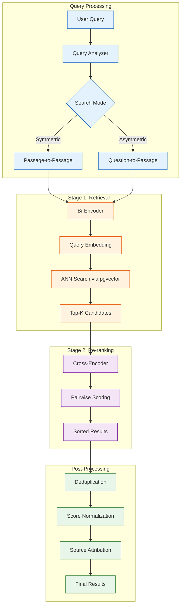
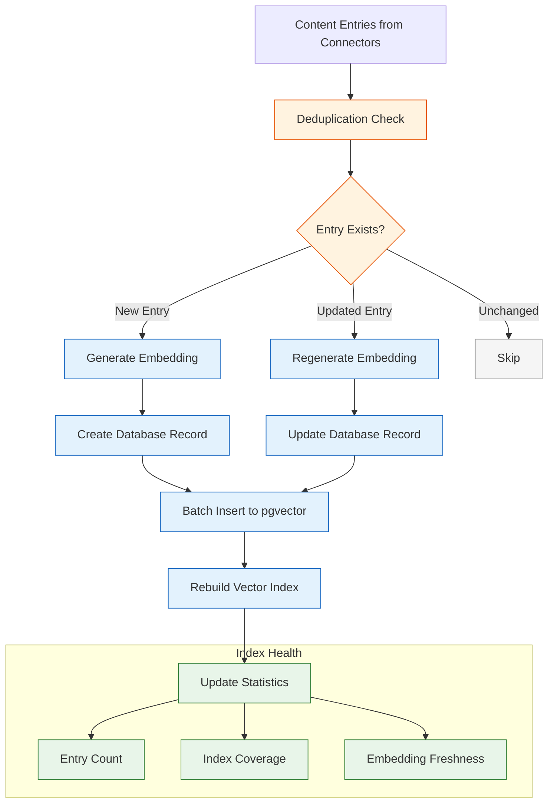
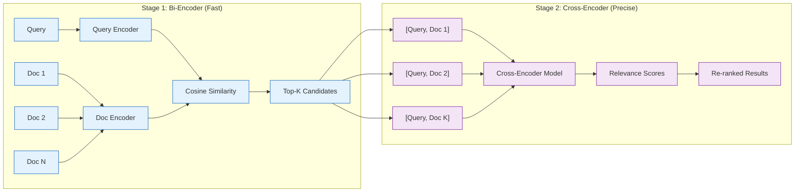

# Chapter 4: Search & Retrieval

Search is the foundational capability that makes Khoj useful as a personal assistant. Rather than relying on simple keyword matching, Khoj implements semantic search using embedding models combined with a two-stage retrieval pipeline. This chapter covers the complete search architecture, from embedding generation through result ranking.

## Search Architecture Overview

Khoj's search system is designed around the principle that finding the right information requires both fast recall (getting candidates quickly) and precise ranking (ordering them by true relevance).



## Symmetric vs. Asymmetric Search

Understanding the difference between symmetric and asymmetric search is key to using Khoj effectively. The search mode determines how queries are encoded relative to documents.

| Aspect | Symmetric Search | Asymmetric Search |
|--------|-----------------|-------------------|
| **Use Case** | Find similar passages | Answer questions from passages |
| **Query Type** | A passage or note excerpt | A question or short phrase |
| **Encoding** | Same encoder for query and documents | Different encoding for queries vs. documents |
| **Example Query** | "Neural networks use layers of interconnected nodes" | "How do neural networks work?" |
| **Best For** | Finding duplicates, related content | Question answering, research |
| **Model Type** | Symmetric bi-encoder | Asymmetric bi-encoder |

```python
from enum import Enum
from dataclasses import dataclass

class SearchMode(Enum):
    """Khoj supports two fundamental search modes."""
    SYMMETRIC = "symmetric"
    ASYMMETRIC = "asymmetric"

@dataclass
class SearchConfig:
    """Configuration for a search operation."""
    mode: SearchMode
    top_k: int = 10             # Candidates from bi-encoder
    rerank_top_n: int = 5       # Results after cross-encoder
    score_threshold: float = 0.2  # Minimum relevance score
    content_type_filter: str = "all"  # Filter by data type
    deduplicate: bool = True

class SearchModeSelector:
    """
    Automatically selects the appropriate search mode based on
    the query characteristics.

    Heuristics:
    - Short queries with question words -> asymmetric
    - Long queries that look like passages -> symmetric
    - Queries with special operators -> symmetric
    """

    QUESTION_WORDS = {
        "what", "how", "why", "when", "where", "who",
        "which", "can", "does", "is", "are", "do",
        "should", "would", "could", "will",
    }

    def select_mode(self, query: str) -> SearchMode:
        """Determine the best search mode for a given query."""
        words = query.lower().split()

        # Check for question patterns
        if words and words[0] in self.QUESTION_WORDS:
            return SearchMode.ASYMMETRIC

        # Check for question mark
        if query.strip().endswith("?"):
            return SearchMode.ASYMMETRIC

        # Long queries are likely passage-style
        if len(words) > 15:
            return SearchMode.SYMMETRIC

        # Default to asymmetric for short queries
        if len(words) <= 5:
            return SearchMode.ASYMMETRIC

        return SearchMode.ASYMMETRIC

# Example usage
selector = SearchModeSelector()
queries = [
    "How does photosynthesis work?",
    "Machine learning algorithms for text classification",
    "The mitochondria is the powerhouse of the cell and provides energy",
    "meeting notes",
]

for query in queries:
    mode = selector.select_mode(query)
    print(f"Query: '{query}' -> Mode: {mode.value}")
```

## Embedding Models

Khoj uses sentence-transformer models to convert text into dense vector representations. The choice of embedding model significantly impacts search quality.

### Model Selection

```python
@dataclass
class EmbeddingModelConfig:
    """Configuration for embedding models used in Khoj."""
    model_name: str
    dimensions: int
    max_sequence_length: int
    model_type: str  # "bi_encoder" or "cross_encoder"
    description: str

# Models commonly used with Khoj
EMBEDDING_MODELS = {
    "default": EmbeddingModelConfig(
        model_name="sentence-transformers/all-MiniLM-L6-v2",
        dimensions=384,
        max_sequence_length=256,
        model_type="bi_encoder",
        description="Fast, lightweight model suitable for most use cases",
    ),
    "high_quality": EmbeddingModelConfig(
        model_name="sentence-transformers/all-mpnet-base-v2",
        dimensions=768,
        max_sequence_length=384,
        model_type="bi_encoder",
        description="Higher quality embeddings, slower inference",
    ),
    "multilingual": EmbeddingModelConfig(
        model_name="sentence-transformers/paraphrase-multilingual-MiniLM-L12-v2",
        dimensions=384,
        max_sequence_length=128,
        model_type="bi_encoder",
        description="Supports 50+ languages with good quality",
    ),
    "cross_encoder": EmbeddingModelConfig(
        model_name="cross-encoder/ms-marco-MiniLM-L-6-v2",
        dimensions=0,  # Cross-encoders output scores, not embeddings
        max_sequence_length=512,
        model_type="cross_encoder",
        description="Re-ranking model for precise relevance scoring",
    ),
}

def print_model_comparison():
    """Display a comparison of available embedding models."""
    print(f"{'Model':<55} {'Dims':>5} {'MaxLen':>7} {'Type':<14}")
    print("-" * 85)
    for name, config in EMBEDDING_MODELS.items():
        print(
            f"{config.model_name:<55} "
            f"{config.dimensions:>5} "
            f"{config.max_sequence_length:>7} "
            f"{config.model_type:<14}"
        )

print_model_comparison()
```

### Embedding Generation Pipeline


```python
import numpy as np
from typing import Optional

class EmbeddingGenerator:
    """
    Generates embeddings for content entries using sentence-transformers.

    Key design decisions:
    1. Batched processing for GPU efficiency
    2. L2 normalization for cosine similarity
    3. Truncation to model's max sequence length
    4. Caching of embeddings for unchanged content
    """

    def __init__(
        self,
        model_name: str = "sentence-transformers/all-MiniLM-L6-v2",
        batch_size: int = 64,
        device: str = "cpu",
    ):
        self.model_name = model_name
        self.batch_size = batch_size
        self.device = device
        # In production: self.model = SentenceTransformer(model_name)

    def generate_embeddings(
        self, texts: list[str], show_progress: bool = True
    ) -> np.ndarray:
        """
        Generate embeddings for a list of texts.

        Args:
            texts: List of text strings to embed
            show_progress: Whether to show a progress bar

        Returns:
            NumPy array of shape (len(texts), embedding_dim)
        """
        all_embeddings = []

        for i in range(0, len(texts), self.batch_size):
            batch = texts[i : i + self.batch_size]

            # In production:
            # batch_embeddings = self.model.encode(
            #     batch,
            #     normalize_embeddings=True,
            #     show_progress_bar=False,
            #     device=self.device,
            # )
            # Placeholder:
            batch_embeddings = np.random.randn(len(batch), 384)

            # Normalize to unit length for cosine similarity
            norms = np.linalg.norm(batch_embeddings, axis=1, keepdims=True)
            batch_embeddings = batch_embeddings / norms

            all_embeddings.append(batch_embeddings)

            if show_progress:
                progress = min(i + self.batch_size, len(texts))
                print(f"  Embedded {progress}/{len(texts)} entries")

        return np.vstack(all_embeddings)

    def generate_query_embedding(
        self, query: str, search_mode: SearchMode = SearchMode.ASYMMETRIC
    ) -> np.ndarray:
        """
        Generate embedding for a search query.

        For asymmetric search, the query may be prefixed
        with a special instruction for the model.
        """
        if search_mode == SearchMode.ASYMMETRIC:
            # Some models benefit from query prefixing
            formatted_query = f"Represent this query for retrieval: {query}"
        else:
            formatted_query = query

        embedding = self.generate_embeddings([formatted_query])
        return embedding[0]

# Usage
generator = EmbeddingGenerator()
texts = ["Sample text one", "Sample text two", "Sample text three"]
embeddings = generator.generate_embeddings(texts)
print(f"Generated {embeddings.shape[0]} embeddings of dimension {embeddings.shape[1]}")
```

## The Indexing Pipeline

The indexing pipeline transforms raw content entries into searchable vector records in the database.



```python
from datetime import datetime
from typing import Optional
import hashlib

class IndexingPipeline:
    """
    Orchestrates the complete indexing process from raw entries
    to searchable vector records.

    The pipeline handles:
    1. Content deduplication via hashing
    2. Batched embedding generation
    3. Database upsert operations
    4. Vector index maintenance
    """

    def __init__(self, embedding_generator: EmbeddingGenerator):
        self.embedding_generator = embedding_generator
        self.content_hashes: dict[str, str] = {}

    def index_entries(
        self,
        entries: list[dict],
        user_id: int,
        regenerate: bool = False,
    ) -> dict:
        """
        Index a batch of content entries.

        Returns statistics about the indexing operation.
        """
        stats = {
            "total": len(entries),
            "new": 0,
            "updated": 0,
            "skipped": 0,
            "errors": 0,
            "duration_seconds": 0,
        }

        start_time = datetime.now()

        # Phase 1: Categorize entries
        new_entries = []
        updated_entries = []

        for entry in entries:
            content_hash = self._compute_hash(entry["compiled"])
            file_path = entry["file_path"]

            stored_hash = self.content_hashes.get(file_path)

            if stored_hash is None:
                new_entries.append(entry)
                stats["new"] += 1
            elif stored_hash != content_hash or regenerate:
                updated_entries.append(entry)
                stats["updated"] += 1
            else:
                stats["skipped"] += 1

        # Phase 2: Generate embeddings for new and updated entries
        entries_to_embed = new_entries + updated_entries
        if entries_to_embed:
            texts = [e["compiled"] for e in entries_to_embed]
            embeddings = self.embedding_generator.generate_embeddings(texts)

            # Phase 3: Store in database
            for entry, embedding in zip(entries_to_embed, embeddings):
                self._store_entry(entry, embedding.tolist(), user_id)
                self.content_hashes[entry["file_path"]] = (
                    self._compute_hash(entry["compiled"])
                )

        # Phase 4: Clean up deleted entries
        self._remove_stale_entries(
            current_paths={e["file_path"] for e in entries},
            user_id=user_id,
        )

        stats["duration_seconds"] = (
            datetime.now() - start_time
        ).total_seconds()

        return stats

    def _compute_hash(self, content: str) -> str:
        """Compute content hash for change detection."""
        return hashlib.sha256(content.encode()).hexdigest()

    def _store_entry(
        self, entry: dict, embedding: list[float], user_id: int
    ):
        """Store an entry with its embedding in the database."""
        # In production, uses Django ORM:
        # Entry.objects.update_or_create(
        #     user_id=user_id,
        #     file_path=entry["file_path"],
        #     corpus_id=entry.get("corpus_id"),
        #     defaults={
        #         "raw": entry["raw"],
        #         "compiled": entry["compiled"],
        #         "heading": entry.get("heading"),
        #         "file_type": entry["file_type"],
        #         "embeddings": embedding,
        #     }
        # )
        pass

    def _remove_stale_entries(
        self, current_paths: set[str], user_id: int
    ):
        """Remove entries for files that no longer exist."""
        # In production:
        # Entry.objects.filter(
        #     user_id=user_id
        # ).exclude(
        #     file_path__in=current_paths
        # ).delete()
        pass

# Usage
generator = EmbeddingGenerator()
pipeline = IndexingPipeline(generator)
stats = pipeline.index_entries(
    entries=[
        {
            "raw": "# My Note\nSome content here",
            "compiled": "My Note. Some content here",
            "heading": "My Note",
            "file_path": "/notes/my-note.md",
            "file_type": "markdown",
        }
    ],
    user_id=1,
)
print(f"Indexing stats: {stats}")
```

## Vector Similarity Search

At the core of Khoj's retrieval is vector similarity search using PostgreSQL's pgvector extension.

### Distance Metrics

| Metric | Formula | Use Case | pgvector Operator |
|--------|---------|----------|-------------------|
| **Cosine Distance** | 1 - cos(a, b) | Normalized text embeddings | `<=>` |
| **L2 (Euclidean)** | sqrt(sum((a-b)^2)) | Raw embedding comparison | `<->` |
| **Inner Product** | -sum(a*b) | Maximum inner product search | `<#>` |

```python
class VectorSearchEngine:
    """
    Implements vector similarity search using pgvector.

    Key concepts:
    - Uses IVFFlat index for approximate nearest neighbor (ANN) search
    - Cosine distance as the primary similarity metric
    - Configurable probe count for speed/accuracy tradeoff
    """

    def __init__(self, probes: int = 10):
        self.probes = probes

    def search(
        self,
        query_embedding: list[float],
        user_id: int,
        top_k: int = 10,
        content_type_filter: Optional[str] = None,
    ) -> list[dict]:
        """
        Execute vector similarity search.

        The SQL equivalent of this operation:

        SET LOCAL ivfflat.probes = 10;
        SELECT id, raw, compiled, heading, file_path, file_type,
               1 - (embeddings <=> query_vector) AS similarity
        FROM entry
        WHERE user_id = :user_id
          AND (:content_type IS NULL OR file_type = :content_type)
        ORDER BY embeddings <=> query_vector
        LIMIT :top_k;
        """
        # In production, this executes via Django ORM:
        # from pgvector.django import CosineDistance
        #
        # results = Entry.objects.filter(
        #     user_id=user_id,
        # ).annotate(
        #     distance=CosineDistance('embeddings', query_embedding)
        # ).order_by('distance')[:top_k]

        results = []
        print(
            f"Searching with {len(query_embedding)}-dim vector, "
            f"top_k={top_k}, probes={self.probes}"
        )
        return results

    def explain_ann_search(self):
        """Explain how ANN search works with IVFFlat."""
        explanation = {
            "index_type": "IVFFlat (Inverted File Flat)",
            "build_phase": (
                "Clusters all vectors into 'lists' using k-means. "
                "Each list contains vectors near a centroid."
            ),
            "search_phase": (
                "1. Compare query to all centroids. "
                "2. Select top 'probes' closest centroids. "
                "3. Exhaustively search vectors in those lists. "
                "4. Return top-K most similar vectors."
            ),
            "tradeoffs": {
                "more_lists": "Faster search, potentially less accurate",
                "more_probes": "More accurate, slower search",
                "typical_config": "lists=100, probes=10 for ~100K vectors",
            },
        }
        return explanation

search_engine = VectorSearchEngine(probes=10)
ann_info = search_engine.explain_ann_search()
print(f"Index type: {ann_info['index_type']}")
print(f"Build: {ann_info['build_phase']}")
```

## Cross-Encoder Re-ranking

After the bi-encoder retrieves candidates, the cross-encoder re-ranks them for precision.



```python
class CrossEncoderReranker:
    """
    Re-ranks search candidates using a cross-encoder model.

    Unlike bi-encoders that encode query and document independently,
    cross-encoders process the query-document pair jointly, enabling
    much more precise relevance assessment at the cost of speed.

    The cross-encoder sees both texts simultaneously and can capture
    fine-grained interactions between query terms and document content.
    """

    def __init__(
        self,
        model_name: str = "cross-encoder/ms-marco-MiniLM-L-6-v2"
    ):
        self.model_name = model_name
        # In production: self.model = CrossEncoder(model_name)

    def rerank(
        self,
        query: str,
        candidates: list[dict],
        top_n: int = 5,
    ) -> list[dict]:
        """
        Re-rank candidates using cross-encoder scoring.

        Args:
            query: The original search query
            candidates: List of candidate entries from bi-encoder
            top_n: Number of results to return after re-ranking

        Returns:
            Re-ranked list of entries with cross-encoder scores
        """
        if not candidates:
            return []

        # Create query-document pairs
        pairs = [
            (query, candidate["compiled"])
            for candidate in candidates
        ]

        # Score all pairs
        # In production:
        # scores = self.model.predict(pairs)
        scores = [0.9 - (i * 0.1) for i in range(len(pairs))]

        # Attach scores and sort
        for candidate, score in zip(candidates, scores):
            candidate["cross_encoder_score"] = float(score)

        # Sort by cross-encoder score
        reranked = sorted(
            candidates,
            key=lambda x: x["cross_encoder_score"],
            reverse=True,
        )

        return reranked[:top_n]

    def compare_bi_vs_cross(
        self, query: str, candidates: list[dict]
    ) -> dict:
        """
        Compare bi-encoder and cross-encoder rankings to show
        how re-ranking can change result ordering.
        """
        bi_ranking = [c.get("heading", "?") for c in candidates]
        reranked = self.rerank(query, candidates, top_n=len(candidates))
        cross_ranking = [c.get("heading", "?") for c in reranked]

        return {
            "query": query,
            "bi_encoder_order": bi_ranking,
            "cross_encoder_order": cross_ranking,
            "ranking_changed": bi_ranking != cross_ranking,
        }

reranker = CrossEncoderReranker()
print(f"Re-ranker model: {reranker.model_name}")
```

## Complete Search Pipeline

Bringing it all together, here is the complete search flow:

```python
class KhojSearchPipeline:
    """
    The complete Khoj search pipeline combining all stages.

    Pipeline stages:
    1. Query analysis and mode selection
    2. Query embedding generation
    3. Vector similarity search (bi-encoder retrieval)
    4. Cross-encoder re-ranking
    5. Post-processing (deduplication, scoring, attribution)
    """

    def __init__(self):
        self.mode_selector = SearchModeSelector()
        self.embedding_generator = EmbeddingGenerator()
        self.vector_search = VectorSearchEngine()
        self.reranker = CrossEncoderReranker()

    def search(
        self,
        query: str,
        user_id: int,
        config: Optional[SearchConfig] = None,
    ) -> list[dict]:
        """Execute the complete search pipeline."""
        if config is None:
            config = SearchConfig(
                mode=self.mode_selector.select_mode(query)
            )

        print(f"Search mode: {config.mode.value}")
        print(f"Query: '{query}'")

        # Stage 1: Generate query embedding
        query_embedding = self.embedding_generator.generate_query_embedding(
            query, config.mode
        )
        print(f"Query embedded to {len(query_embedding)} dimensions")

        # Stage 2: Bi-encoder retrieval
        candidates = self.vector_search.search(
            query_embedding=query_embedding.tolist(),
            user_id=user_id,
            top_k=config.top_k,
            content_type_filter=(
                config.content_type_filter
                if config.content_type_filter != "all"
                else None
            ),
        )
        print(f"Retrieved {len(candidates)} candidates")

        # Stage 3: Cross-encoder re-ranking
        if candidates:
            results = self.reranker.rerank(
                query=query,
                candidates=candidates,
                top_n=config.rerank_top_n,
            )
        else:
            results = []

        # Stage 4: Post-processing
        results = self._post_process(results, config)
        print(f"Returning {len(results)} final results")

        return results

    def _post_process(
        self, results: list[dict], config: SearchConfig
    ) -> list[dict]:
        """Apply post-processing to search results."""
        if config.deduplicate:
            results = self._deduplicate(results)

        # Filter by score threshold
        results = [
            r for r in results
            if r.get("cross_encoder_score", 0) >= config.score_threshold
        ]

        # Normalize scores to 0-1 range
        if results:
            max_score = max(
                r.get("cross_encoder_score", 0) for r in results
            )
            if max_score > 0:
                for r in results:
                    r["normalized_score"] = (
                        r.get("cross_encoder_score", 0) / max_score
                    )

        return results

    def _deduplicate(self, results: list[dict]) -> list[dict]:
        """Remove duplicate entries based on content similarity."""
        seen_hashes = set()
        unique_results = []

        for result in results:
            content_hash = hashlib.md5(
                result.get("compiled", "").encode()
            ).hexdigest()
            if content_hash not in seen_hashes:
                seen_hashes.add(content_hash)
                unique_results.append(result)

        return unique_results

# Execute a search
pipeline = KhojSearchPipeline()
results = pipeline.search(
    query="What are the best practices for Python testing?",
    user_id=1,
)
```

## Search API Endpoints

Khoj exposes search functionality through REST API endpoints:

| Endpoint | Method | Description | Key Parameters |
|----------|--------|-------------|----------------|
| `/api/search` | GET | General semantic search | `q`, `t`, `n`, `r` |
| `/api/search?t=markdown` | GET | Search only Markdown content | `q`, `n` |
| `/api/search?t=org` | GET | Search only Org-mode content | `q`, `n` |
| `/api/search?t=pdf` | GET | Search only PDF content | `q`, `n` |

### API Parameters

| Parameter | Type | Default | Description |
|-----------|------|---------|-------------|
| `q` | string | required | Search query |
| `t` | string | `"all"` | Content type filter |
| `n` | int | `5` | Number of results |
| `r` | bool | `true` | Enable cross-encoder re-ranking |
| `max_distance` | float | `None` | Maximum cosine distance threshold |

```python
import requests

def search_api_example(
    base_url: str = "http://localhost:42110",
    api_key: str = "your-api-key",
):
    """Demonstrate search API usage patterns."""

    headers = {"Authorization": f"Bearer {api_key}"}

    # Basic search
    response = requests.get(
        f"{base_url}/api/search",
        headers=headers,
        params={"q": "machine learning basics", "n": 5},
    )
    print(f"Basic search: {response.status_code}")

    # Filtered search (Markdown only)
    response = requests.get(
        f"{base_url}/api/search",
        headers=headers,
        params={"q": "project notes", "t": "markdown", "n": 10},
    )
    print(f"Filtered search: {response.status_code}")

    # Search without re-ranking (faster, less precise)
    response = requests.get(
        f"{base_url}/api/search",
        headers=headers,
        params={"q": "quick lookup", "n": 3, "r": False},
    )
    print(f"Fast search (no re-ranking): {response.status_code}")

search_api_example()
```

## Performance Optimization

### Index Tuning

```python
class IndexTuningGuide:
    """Guidelines for optimizing Khoj's search index."""

    RECOMMENDATIONS = {
        "small_corpus": {
            "description": "Under 10,000 entries",
            "ivfflat_lists": 50,
            "probes": 5,
            "expected_latency_ms": "5-15",
        },
        "medium_corpus": {
            "description": "10,000 - 100,000 entries",
            "ivfflat_lists": 100,
            "probes": 10,
            "expected_latency_ms": "15-50",
        },
        "large_corpus": {
            "description": "100,000 - 1,000,000 entries",
            "ivfflat_lists": 500,
            "probes": 20,
            "expected_latency_ms": "50-150",
        },
    }

    @staticmethod
    def get_recommendation(entry_count: int) -> dict:
        """Get tuning recommendations based on corpus size."""
        if entry_count < 10_000:
            return IndexTuningGuide.RECOMMENDATIONS["small_corpus"]
        elif entry_count < 100_000:
            return IndexTuningGuide.RECOMMENDATIONS["medium_corpus"]
        else:
            return IndexTuningGuide.RECOMMENDATIONS["large_corpus"]

# Example
guide = IndexTuningGuide()
rec = guide.get_recommendation(50_000)
print(f"Recommendation for 50K entries:")
print(f"  IVFFlat lists: {rec['ivfflat_lists']}")
print(f"  Probes: {rec['probes']}")
print(f"  Expected latency: {rec['expected_latency_ms']}ms")
```

## Summary

In this chapter, you explored Khoj's complete search and retrieval system:

- **Symmetric vs. asymmetric search** modes for different query types
- **Embedding models** that convert text into dense vector representations
- **Indexing pipeline** that manages incremental updates and embedding generation
- **Vector similarity search** using pgvector's IVFFlat index for fast retrieval
- **Cross-encoder re-ranking** for precise relevance scoring of candidates
- **Complete search pipeline** orchestrating all stages from query to results
- **Performance tuning** guidelines for different corpus sizes

## Key Takeaways

1. The two-stage retrieval pipeline balances speed (bi-encoder) with precision (cross-encoder).
2. Asymmetric search is best for question-style queries, while symmetric search works well for finding similar content.
3. pgvector's IVFFlat index enables fast approximate nearest neighbor search directly within PostgreSQL.
4. Incremental indexing via content hashing avoids expensive re-embedding of unchanged content.
5. Tuning the number of IVFFlat lists and probes allows you to trade off search speed against recall accuracy.

## Next Steps

In [Chapter 5: Chat Interface](05-chat-interface.md), we will explore how Khoj's chat system leverages search results as context for LLM-powered conversations, managing conversation threads and delivering grounded, source-attributed responses.

---
*Built with insights from the [Khoj](https://github.com/khoj-ai/khoj) project.*
