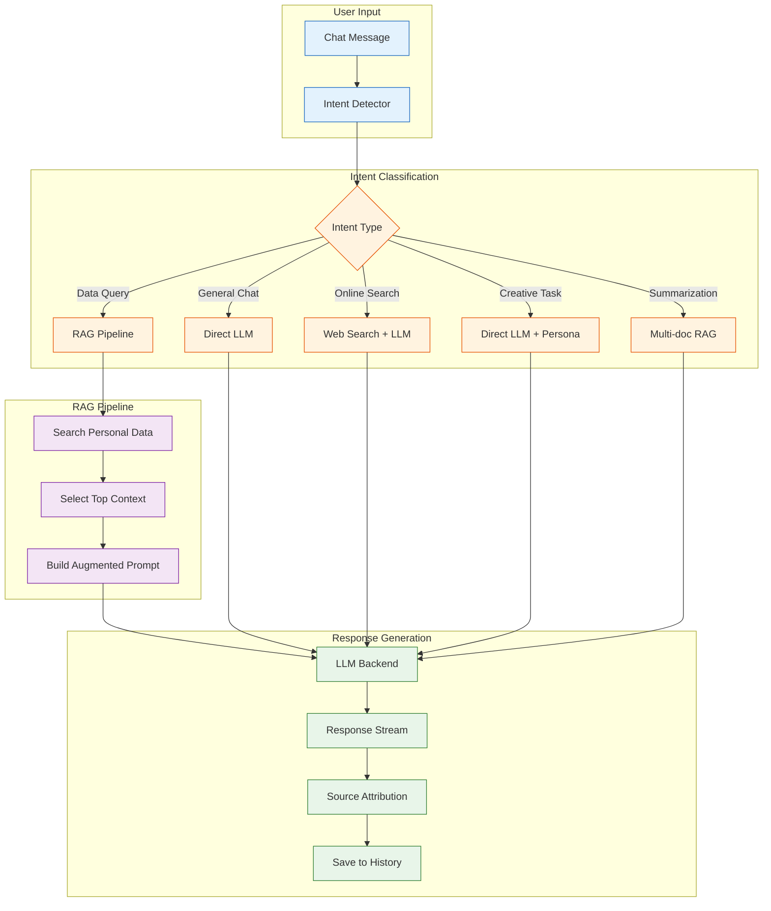
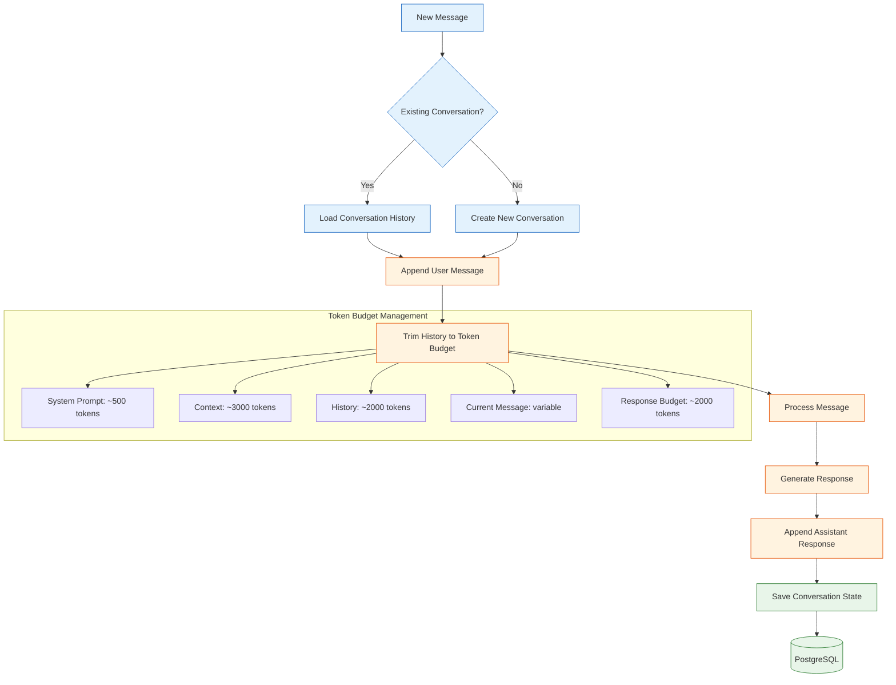
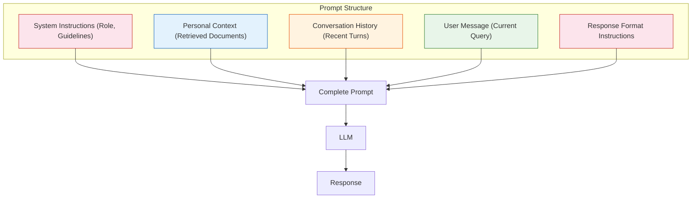
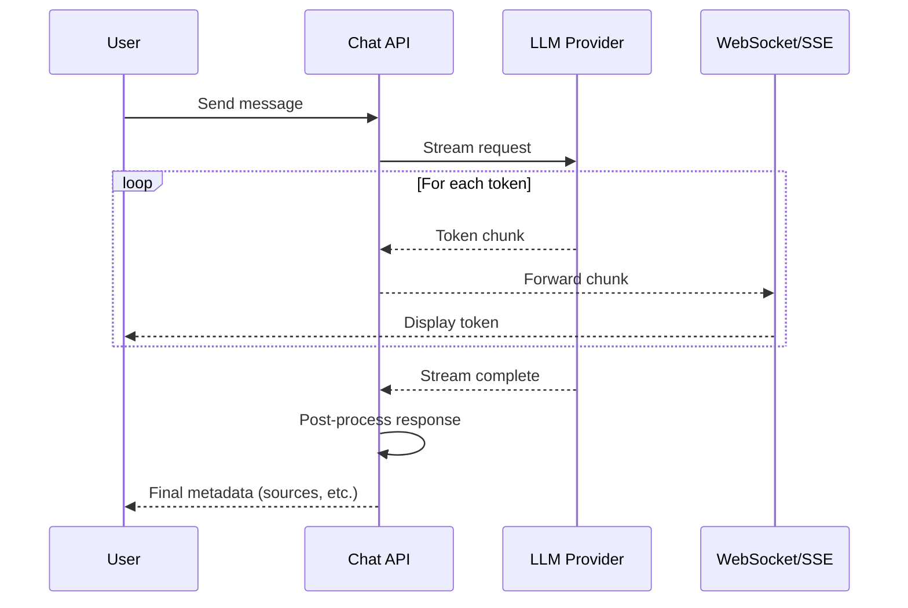
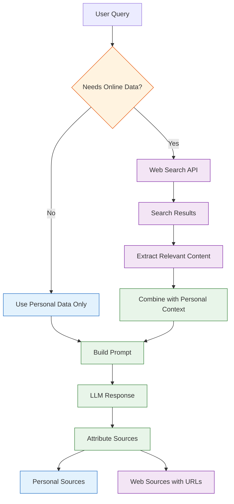

# Chapter 5: Chat Interface

Welcome to **Chapter 5: Chat Interface**. In this part of **Khoj AI: Deep Dive Tutorial**, you will build an intuitive mental model first, then move into concrete implementation details and practical production tradeoffs.


Khoj's chat interface transforms a static knowledge base into a dynamic conversational experience. By grounding LLM responses in your personal data, Khoj provides answers that are relevant, accurate, and attributable to specific sources. This chapter explores how the chat system works, from intent detection through response generation and conversation management.

## Chat System Overview

The chat system is the primary way users interact with Khoj beyond simple search. It combines retrieval-augmented generation (RAG) with conversation management to deliver a coherent, context-aware assistant experience.



## Intent Detection

Before processing a message, Khoj classifies the user's intent to determine the appropriate response strategy. This classification decides whether to retrieve context from personal data, perform a web search, or respond directly.

```python
from enum import Enum
from dataclasses import dataclass
from typing import Optional

class ChatIntent(Enum):
    """Possible intents for a user's chat message."""
    DATA_QUERY = "data_query"       # Needs context from personal data
    GENERAL_CHAT = "general_chat"   # General knowledge question
    ONLINE_SEARCH = "online_search" # Needs current web information
    CREATIVE = "creative"           # Creative writing, brainstorming
    SUMMARIZE = "summarize"         # Summarize notes/documents
    CODE_HELP = "code_help"         # Programming assistance
    GREETING = "greeting"           # Social interaction

@dataclass
class IntentResult:
    """Result of intent classification."""
    primary_intent: ChatIntent
    confidence: float
    needs_context: bool
    needs_online: bool
    inferred_query: Optional[str] = None

class IntentDetector:
    """
    Classifies user messages to determine the response strategy.

    The detector uses a combination of:
    1. Keyword/pattern matching for obvious cases
    2. LLM-based classification for ambiguous messages
    3. Conversation history for context-dependent intent
    """

    GREETING_PATTERNS = {
        "hello", "hi", "hey", "good morning", "good evening",
        "good afternoon", "howdy", "greetings",
    }

    ONLINE_INDICATORS = {
        "latest", "today", "current", "recent", "news",
        "weather", "price", "stock", "trending",
    }

    CREATIVE_INDICATORS = {
        "write", "compose", "create", "draft", "brainstorm",
        "imagine", "story", "poem", "essay",
    }

    SUMMARIZE_INDICATORS = {
        "summarize", "summary", "overview", "recap",
        "digest", "key points", "main ideas",
    }

    def classify(
        self,
        message: str,
        conversation_history: list[dict] = None,
    ) -> IntentResult:
        """Classify a user message into an intent category."""
        message_lower = message.lower().strip()
        words = set(message_lower.split())

        # Check greetings
        if message_lower in self.GREETING_PATTERNS:
            return IntentResult(
                primary_intent=ChatIntent.GREETING,
                confidence=0.95,
                needs_context=False,
                needs_online=False,
            )

        # Check for online search need
        if words & self.ONLINE_INDICATORS:
            return IntentResult(
                primary_intent=ChatIntent.ONLINE_SEARCH,
                confidence=0.8,
                needs_context=False,
                needs_online=True,
                inferred_query=message,
            )

        # Check for summarization
        if words & self.SUMMARIZE_INDICATORS:
            return IntentResult(
                primary_intent=ChatIntent.SUMMARIZE,
                confidence=0.85,
                needs_context=True,
                needs_online=False,
                inferred_query=message,
            )

        # Check for creative tasks
        if words & self.CREATIVE_INDICATORS:
            return IntentResult(
                primary_intent=ChatIntent.CREATIVE,
                confidence=0.75,
                needs_context=False,
                needs_online=False,
            )

        # Check for personal data references
        personal_indicators = {
            "my", "i", "mine", "our", "we",
            "notes", "documents", "files",
        }
        if words & personal_indicators:
            return IntentResult(
                primary_intent=ChatIntent.DATA_QUERY,
                confidence=0.8,
                needs_context=True,
                needs_online=False,
                inferred_query=message,
            )

        # Default: treat as data query (attempt context retrieval)
        return IntentResult(
            primary_intent=ChatIntent.DATA_QUERY,
            confidence=0.6,
            needs_context=True,
            needs_online=False,
            inferred_query=message,
        )

# Examples
detector = IntentDetector()
test_messages = [
    "What did I write about machine learning last month?",
    "What's the weather in San Francisco today?",
    "Write me a haiku about coding",
    "Summarize my notes on project management",
    "Hello!",
]

for msg in test_messages:
    result = detector.classify(msg)
    print(f"'{msg}' -> {result.primary_intent.value} "
          f"(confidence: {result.confidence:.2f}, "
          f"context: {result.needs_context})")
```

## Conversation Management

Khoj maintains conversation threads that preserve context across multiple turns, enabling natural follow-up questions and topic continuity.



```python
from datetime import datetime
from typing import Optional
import json
import uuid

class ConversationManager:
    """
    Manages conversation threads for Khoj's chat interface.

    Responsibilities:
    - Creating and loading conversation threads
    - Managing conversation history within token budgets
    - Generating conversation titles from content
    - Supporting multiple concurrent conversations per user
    """

    MAX_HISTORY_TURNS = 20
    MAX_HISTORY_TOKENS = 2000

    def __init__(self):
        self.conversations: dict[str, dict] = {}

    def create_conversation(self, user_id: int) -> dict:
        """Create a new conversation thread."""
        conversation_id = str(uuid.uuid4())
        conversation = {
            "id": conversation_id,
            "user_id": user_id,
            "slug": conversation_id[:8],
            "title": None,
            "conversation_log": [],
            "created_at": datetime.now().isoformat(),
            "updated_at": datetime.now().isoformat(),
        }
        self.conversations[conversation_id] = conversation
        return conversation

    def add_turn(
        self,
        conversation_id: str,
        role: str,
        content: str,
        context: list[dict] = None,
        intent: dict = None,
    ):
        """Add a message turn to the conversation."""
        conversation = self.conversations.get(conversation_id)
        if not conversation:
            raise ValueError(f"Conversation {conversation_id} not found")

        turn = {
            "role": role,  # "user" or "assistant"
            "content": content,
            "timestamp": datetime.now().isoformat(),
            "context": context or [],
            "intent": intent,
        }

        conversation["conversation_log"].append(turn)
        conversation["updated_at"] = datetime.now().isoformat()

        # Auto-generate title from first exchange
        if len(conversation["conversation_log"]) == 2 and not conversation["title"]:
            conversation["title"] = self._generate_title(
                conversation["conversation_log"]
            )

    def get_history_for_prompt(
        self,
        conversation_id: str,
        max_tokens: int = None,
    ) -> list[dict]:
        """
        Get conversation history trimmed to fit the token budget.

        Strategy:
        1. Always include the most recent turns
        2. Progressively remove older turns if over budget
        3. Keep at least the last 2 turns for continuity
        """
        max_tokens = max_tokens or self.MAX_HISTORY_TOKENS
        conversation = self.conversations.get(conversation_id)
        if not conversation:
            return []

        history = conversation["conversation_log"]

        # Start with all turns
        selected_turns = list(history)

        # Trim from the beginning until within budget
        total_tokens = sum(
            self._estimate_tokens(turn["content"])
            for turn in selected_turns
        )

        while total_tokens > max_tokens and len(selected_turns) > 2:
            removed = selected_turns.pop(0)
            total_tokens -= self._estimate_tokens(removed["content"])

        return [
            {"role": t["role"], "content": t["content"]}
            for t in selected_turns
        ]

    def list_conversations(self, user_id: int) -> list[dict]:
        """List all conversations for a user, most recent first."""
        user_convos = [
            c for c in self.conversations.values()
            if c["user_id"] == user_id
        ]
        return sorted(
            user_convos,
            key=lambda c: c["updated_at"],
            reverse=True,
        )

    def _generate_title(self, log: list[dict]) -> str:
        """Generate a conversation title from the first exchange."""
        first_message = log[0]["content"] if log else ""
        # Truncate to first 50 chars as a simple title
        title = first_message[:50]
        if len(first_message) > 50:
            title += "..."
        return title

    def _estimate_tokens(self, text: str) -> int:
        """Rough token count estimation."""
        return len(text) // 4

# Usage
manager = ConversationManager()
convo = manager.create_conversation(user_id=1)
print(f"Created conversation: {convo['id'][:8]}")

manager.add_turn(convo["id"], "user", "What are my notes about Python?")
manager.add_turn(
    convo["id"],
    "assistant",
    "Based on your notes, you have several documents about Python...",
    context=[{"file_path": "/notes/python.md"}],
)
```

## Context Assembly

The context assembly stage is where Khoj selects the most relevant information from your personal data to include in the LLM prompt. This is the core of the RAG (Retrieval-Augmented Generation) approach.

```python
class ContextAssembler:
    """
    Assembles context from search results for the LLM prompt.

    The assembler balances:
    - Relevance: Include the most relevant entries
    - Diversity: Cover different sources and topics
    - Budget: Stay within the token limit
    - Recency: Prefer more recent content when scores are similar
    """

    def __init__(self, max_context_tokens: int = 3000):
        self.max_context_tokens = max_context_tokens

    def assemble_context(
        self,
        search_results: list[dict],
        query: str,
        max_entries: int = 5,
    ) -> dict:
        """
        Select and format context entries for the LLM prompt.

        Returns:
            {
                "context_text": str,      # Formatted context string
                "sources": list[dict],     # Source attributions
                "token_count": int,        # Tokens used
                "entries_used": int,       # Number of entries included
            }
        """
        selected = []
        total_tokens = 0
        sources = []

        for result in search_results[:max_entries]:
            entry_text = self._format_entry(result)
            entry_tokens = self._estimate_tokens(entry_text)

            # Check if adding this entry exceeds the budget
            if total_tokens + entry_tokens > self.max_context_tokens:
                # Try truncating the entry
                remaining_tokens = self.max_context_tokens - total_tokens
                if remaining_tokens > 100:  # Worth including truncated
                    entry_text = self._truncate_to_tokens(
                        entry_text, remaining_tokens
                    )
                    entry_tokens = remaining_tokens
                else:
                    break  # No room left

            selected.append(entry_text)
            total_tokens += entry_tokens
            sources.append({
                "file_path": result.get("file_path", "Unknown"),
                "heading": result.get("heading", ""),
                "score": result.get("cross_encoder_score", 0),
            })

        context_text = "\n\n---\n\n".join(selected)

        return {
            "context_text": context_text,
            "sources": sources,
            "token_count": total_tokens,
            "entries_used": len(selected),
        }

    def _format_entry(self, result: dict) -> str:
        """Format a search result entry for inclusion in the prompt."""
        heading = result.get("heading", "")
        content = result.get("compiled", result.get("raw", ""))
        file_path = result.get("file_path", "")

        parts = []
        if heading:
            parts.append(f"## {heading}")
        parts.append(content)
        parts.append(f"[Source: {file_path}]")

        return "\n".join(parts)

    def _estimate_tokens(self, text: str) -> int:
        return len(text) // 4

    def _truncate_to_tokens(self, text: str, max_tokens: int) -> str:
        """Truncate text to approximately max_tokens."""
        max_chars = max_tokens * 4
        if len(text) <= max_chars:
            return text
        return text[:max_chars] + "..."

assembler = ContextAssembler(max_context_tokens=3000)
print(f"Max context: {assembler.max_context_tokens} tokens")
```

## Prompt Engineering

Khoj constructs prompts carefully to guide the LLM toward helpful, grounded responses. The prompt structure varies based on the detected intent.



```python
class PromptBuilder:
    """
    Constructs prompts for Khoj's chat interface.

    Prompt templates are designed to:
    1. Ground the LLM in the user's personal data
    2. Encourage source attribution
    3. Handle different intent types appropriately
    4. Manage the token budget across all sections
    """

    SYSTEM_PROMPTS = {
        ChatIntent.DATA_QUERY: (
            "You are Khoj, a personal AI assistant with access to "
            "the user's notes and documents. Answer questions based "
            "on the provided context from their personal knowledge base. "
            "Always cite the source file when referencing specific "
            "information. If the context does not contain relevant "
            "information, say so honestly rather than guessing."
        ),
        ChatIntent.GENERAL_CHAT: (
            "You are Khoj, a helpful AI assistant. Provide clear, "
            "accurate, and thoughtful responses. If you are unsure "
            "about something, express your uncertainty."
        ),
        ChatIntent.ONLINE_SEARCH: (
            "You are Khoj, a personal AI assistant with access to "
            "current web search results. Use the provided search "
            "results to answer the user's question with up-to-date "
            "information. Cite your sources."
        ),
        ChatIntent.CREATIVE: (
            "You are Khoj, a creative AI assistant. Help the user "
            "with creative tasks like writing, brainstorming, and "
            "ideation. Be imaginative while respecting any "
            "constraints the user provides."
        ),
        ChatIntent.SUMMARIZE: (
            "You are Khoj, a personal AI assistant tasked with "
            "summarizing the user's notes and documents. Provide "
            "concise, well-organized summaries that capture the "
            "key points. Reference specific documents when possible."
        ),
    }

    def __init__(self, max_prompt_tokens: int = 8000):
        self.max_prompt_tokens = max_prompt_tokens

    def build_prompt(
        self,
        user_message: str,
        intent: IntentResult,
        context: dict = None,
        conversation_history: list[dict] = None,
    ) -> list[dict]:
        """
        Build a complete prompt as a list of message objects.

        Returns a list compatible with OpenAI/Anthropic message format.
        """
        messages = []

        # 1. System message
        system_prompt = self.SYSTEM_PROMPTS.get(
            intent.primary_intent,
            self.SYSTEM_PROMPTS[ChatIntent.GENERAL_CHAT],
        )
        messages.append({
            "role": "system",
            "content": system_prompt,
        })

        # 2. Context from personal data (if applicable)
        if context and context.get("context_text"):
            context_message = (
                "Here is relevant context from the user's "
                "personal knowledge base:\n\n"
                f"{context['context_text']}\n\n"
                "Use this context to inform your response. "
                "Cite sources when referencing specific information."
            )
            messages.append({
                "role": "system",
                "content": context_message,
            })

        # 3. Conversation history
        if conversation_history:
            for turn in conversation_history:
                messages.append({
                    "role": turn["role"],
                    "content": turn["content"],
                })

        # 4. Current user message
        messages.append({
            "role": "user",
            "content": user_message,
        })

        # Validate total tokens
        total_tokens = sum(
            self._estimate_tokens(m["content"]) for m in messages
        )
        if total_tokens > self.max_prompt_tokens:
            messages = self._trim_prompt(messages)

        return messages

    def _trim_prompt(self, messages: list[dict]) -> list[dict]:
        """Trim prompt to fit within token budget."""
        # Strategy: Remove oldest conversation history turns first
        while (
            self._total_tokens(messages) > self.max_prompt_tokens
            and len(messages) > 3
        ):
            # Find the first non-system, non-last message to remove
            for i, msg in enumerate(messages):
                if msg["role"] != "system" and i < len(messages) - 1:
                    messages.pop(i)
                    break
        return messages

    def _estimate_tokens(self, text: str) -> int:
        return len(text) // 4

    def _total_tokens(self, messages: list[dict]) -> int:
        return sum(self._estimate_tokens(m["content"]) for m in messages)

# Example
builder = PromptBuilder()
intent = IntentResult(
    primary_intent=ChatIntent.DATA_QUERY,
    confidence=0.9,
    needs_context=True,
    needs_online=False,
)
messages = builder.build_prompt(
    user_message="What did I write about testing strategies?",
    intent=intent,
    context={"context_text": "Testing is essential for quality..."},
    conversation_history=[
        {"role": "user", "content": "Tell me about my coding notes"},
        {"role": "assistant", "content": "You have several notes about..."},
    ],
)
print(f"Prompt has {len(messages)} messages")
for msg in messages:
    role = msg["role"]
    preview = msg["content"][:60]
    print(f"  [{role}] {preview}...")
```

## Response Streaming

Khoj streams responses from the LLM to provide a responsive user experience. Tokens are sent to the client as they are generated.



```python
from typing import Generator, AsyncGenerator

class ResponseStreamer:
    """
    Handles streaming responses from LLM backends to clients.

    Supports:
    - Server-Sent Events (SSE) for web clients
    - WebSocket for real-time bidirectional communication
    - Chunked HTTP response for API consumers
    """

    def stream_response(
        self,
        llm_adapter,
        prompt_messages: list[dict],
        on_token: callable = None,
    ) -> Generator[dict, None, None]:
        """
        Stream a response from the LLM backend.

        Yields event objects suitable for SSE transport:
        {
            "type": "token" | "source" | "complete" | "error",
            "data": str | dict
        }
        """
        full_response = ""
        token_count = 0

        try:
            # Start streaming from LLM
            for token in llm_adapter.stream(prompt_messages):
                full_response += token
                token_count += 1

                yield {
                    "type": "token",
                    "data": token,
                }

                if on_token:
                    on_token(token)

            # Send completion event with metadata
            yield {
                "type": "complete",
                "data": {
                    "response": full_response,
                    "token_count": token_count,
                },
            }

        except Exception as e:
            yield {
                "type": "error",
                "data": {"error": str(e)},
            }

    def format_sse_event(self, event: dict) -> str:
        """Format an event for Server-Sent Events transport."""
        event_type = event.get("type", "message")
        data = json.dumps(event.get("data", ""))
        return f"event: {event_type}\ndata: {data}\n\n"

streamer = ResponseStreamer()
print("Streaming enables real-time response delivery to clients")
```

## Source Attribution

One of Khoj's distinguishing features is source attribution. Every response grounded in personal data includes references to the original documents.

```python
class SourceAttributor:
    """
    Extracts and formats source attributions for chat responses.

    Ensures users can:
    1. Verify claims against original sources
    2. Navigate to source documents
    3. Understand which parts of the response come from which sources
    """

    def extract_attributions(
        self,
        response: str,
        context_sources: list[dict],
    ) -> dict:
        """
        Match response content to source documents.

        Returns:
        {
            "response": str,
            "sources": [
                {
                    "file_path": str,
                    "heading": str,
                    "relevance_score": float,
                    "excerpt": str,
                }
            ],
            "attribution_confidence": float,
        }
        """
        sources = []
        for source in context_sources:
            sources.append({
                "file_path": source.get("file_path", ""),
                "heading": source.get("heading", ""),
                "relevance_score": source.get("score", 0),
                "excerpt": source.get("compiled", "")[:150] + "...",
            })

        # Estimate attribution confidence based on context overlap
        confidence = self._estimate_confidence(response, context_sources)

        return {
            "response": response,
            "sources": sources,
            "attribution_confidence": confidence,
        }

    def _estimate_confidence(
        self, response: str, sources: list[dict]
    ) -> float:
        """
        Estimate how well the response is grounded in sources.

        Higher confidence means more response content can be
        traced back to the provided context.
        """
        if not sources:
            return 0.0

        response_words = set(response.lower().split())
        source_words = set()
        for source in sources:
            content = source.get("compiled", source.get("raw", ""))
            source_words.update(content.lower().split())

        # Simple overlap metric
        if not response_words:
            return 0.0

        overlap = len(response_words & source_words)
        coverage = overlap / len(response_words)
        return min(coverage, 1.0)

    def format_sources_markdown(self, sources: list[dict]) -> str:
        """Format sources as Markdown for display."""
        if not sources:
            return ""

        lines = ["\n---", "**Sources:**"]
        for i, source in enumerate(sources, 1):
            file_path = source.get("file_path", "Unknown")
            heading = source.get("heading", "")
            score = source.get("relevance_score", 0)

            line = f"{i}. `{file_path}`"
            if heading:
                line += f" - {heading}"
            line += f" (relevance: {score:.2f})"
            lines.append(line)

        return "\n".join(lines)

attributor = SourceAttributor()
print("Source attribution grounds responses in verifiable data")
```

## Online Search Integration

When the user's query requires current information beyond their personal data, Khoj can supplement with online search results.



```python
class OnlineSearchIntegration:
    """
    Integrates web search results into Khoj's chat responses.

    When a user's question requires current or real-time information
    that is not in their personal knowledge base, Khoj can perform
    an online search and incorporate the results.
    """

    def __init__(self, search_api_key: str = None):
        self.search_api_key = search_api_key

    def search_online(
        self, query: str, num_results: int = 5
    ) -> list[dict]:
        """
        Perform a web search and return structured results.

        Uses search APIs like Google, Bing, or Serper
        to fetch current information.
        """
        # In production, calls a search API:
        # response = requests.get(
        #     "https://api.serper.dev/search",
        #     headers={"X-API-KEY": self.search_api_key},
        #     params={"q": query, "num": num_results},
        # )

        results = []
        # Each result has: title, snippet, url, date
        return results

    def merge_contexts(
        self,
        personal_context: dict,
        online_results: list[dict],
        max_tokens: int = 4000,
    ) -> dict:
        """
        Merge personal data context with online search results.

        Personal data takes priority; online results fill
        remaining token budget.
        """
        personal_tokens = personal_context.get("token_count", 0)
        remaining_budget = max_tokens - personal_tokens

        # Format online results
        online_entries = []
        online_tokens = 0

        for result in online_results:
            entry_text = (
                f"[Web: {result.get('title', '')}]\n"
                f"{result.get('snippet', '')}\n"
                f"URL: {result.get('url', '')}"
            )
            entry_tokens = len(entry_text) // 4

            if online_tokens + entry_tokens <= remaining_budget:
                online_entries.append(entry_text)
                online_tokens += entry_tokens

        # Combine contexts
        combined_text = personal_context.get("context_text", "")
        if online_entries:
            combined_text += (
                "\n\n--- Online Search Results ---\n\n"
                + "\n\n".join(online_entries)
            )

        return {
            "context_text": combined_text,
            "personal_sources": personal_context.get("sources", []),
            "online_sources": online_results,
            "token_count": personal_tokens + online_tokens,
        }

online = OnlineSearchIntegration()
print("Online search supplements personal data with current information")
```

## Chat API Reference

| Endpoint | Method | Description |
|----------|--------|-------------|
| `/api/chat` | GET | Send a chat message (supports streaming) |
| `/api/chat/conversations` | GET | List all conversations |
| `/api/chat/conversation/{id}` | GET | Get a specific conversation |
| `/api/chat/conversation` | DELETE | Delete a conversation |
| `/api/chat/options` | GET | Get available chat models |

```python
import requests

def chat_api_examples(
    base_url: str = "http://localhost:42110",
    api_key: str = "your-api-key",
):
    """Demonstrate Khoj chat API usage."""
    headers = {"Authorization": f"Bearer {api_key}"}

    # Send a chat message
    response = requests.get(
        f"{base_url}/api/chat",
        headers=headers,
        params={
            "q": "What are my key takeaways from last week?",
            "stream": "false",
        },
    )
    if response.status_code == 200:
        result = response.json()
        print(f"Response: {result.get('response', '')[:100]}...")

    # List conversations
    response = requests.get(
        f"{base_url}/api/chat/conversations",
        headers=headers,
    )
    if response.status_code == 200:
        conversations = response.json()
        print(f"Total conversations: {len(conversations)}")

    # Get available chat models
    response = requests.get(
        f"{base_url}/api/chat/options",
        headers=headers,
    )
    if response.status_code == 200:
        options = response.json()
        print(f"Available models: {options}")

chat_api_examples()
```

## Summary

In this chapter, you explored Khoj's chat interface in depth:

- **Intent detection** classifies messages to determine the response strategy (data query, general chat, online search, creative, summarization)
- **Conversation management** maintains threaded conversations with token-aware history trimming
- **Context assembly** selects and formats the most relevant personal data for the LLM prompt
- **Prompt engineering** structures prompts with system instructions, context, history, and user messages
- **Response streaming** delivers tokens to the client in real-time via SSE or WebSocket
- **Source attribution** traces response content back to original documents for verifiability
- **Online search integration** supplements personal data with current web information

## Key Takeaways

1. Intent detection enables Khoj to route messages to the appropriate processing pipeline, avoiding unnecessary context retrieval for greetings or creative tasks.
2. Token budget management is critical: the prompt must balance system instructions, context, history, and response space within the LLM's context window.
3. Source attribution is what distinguishes Khoj from generic chatbots -- every answer is grounded in verifiable personal data.
4. Conversation history is preserved and trimmed intelligently to maintain context across long interactions.
5. Online search integration bridges the gap between personal knowledge and current world information.

## Next Steps

In [Chapter 6: Automation & Agents](06-automation-and-agents.md), we will explore how Khoj can automate tasks through scheduled queries, autonomous agents, and tool integration, moving beyond reactive chat toward proactive assistance.

---
*Built with insights from the [Khoj](https://github.com/khoj-ai/khoj) project.*

## What Problem Does This Solve?

Most teams struggle here because the hard part is not writing more code, but deciding clear boundaries for `self`, `response`, `dict` so behavior stays predictable as complexity grows.

In practical terms, this chapter helps you avoid three common failures:

- coupling core logic too tightly to one implementation path
- missing the handoff boundaries between setup, execution, and validation
- shipping changes without clear rollback or observability strategy

After working through this chapter, you should be able to reason about `Chapter 5: Chat Interface` as an operating subsystem inside **Khoj AI: Deep Dive Tutorial**, with explicit contracts for inputs, state transitions, and outputs.

Use the implementation notes around `context`, `content`, `sources` as your checklist when adapting these patterns to your own repository.

## How it Works Under the Hood

Under the hood, `Chapter 5: Chat Interface` usually follows a repeatable control path:

1. **Context bootstrap**: initialize runtime config and prerequisites for `self`.
2. **Input normalization**: shape incoming data so `response` receives stable contracts.
3. **Core execution**: run the main logic branch and propagate intermediate state through `dict`.
4. **Policy and safety checks**: enforce limits, auth scopes, and failure boundaries.
5. **Output composition**: return canonical result payloads for downstream consumers.
6. **Operational telemetry**: emit logs/metrics needed for debugging and performance tuning.

When debugging, walk this sequence in order and confirm each stage has explicit success/failure conditions.

## Source Walkthrough

Use the following upstream sources to verify implementation details while reading this chapter:

- [Khoj](https://github.com/khoj-ai/khoj)
  Why it matters: authoritative reference on `Khoj` (github.com).

Suggested trace strategy:
- search upstream code for `self` and `response` to map concrete implementation paths
- compare docs claims against actual runtime/config code before reusing patterns in production

## Chapter Connections

- [Tutorial Index](index.md)
- [Previous Chapter: Chapter 4: Search & Retrieval](04-search-and-retrieval.md)
- [Next Chapter: Chapter 6: Automation & Agents](06-automation-and-agents.md)
- [Main Catalog](../../README.md#-tutorial-catalog)
- [A-Z Tutorial Directory](../../discoverability/tutorial-directory.md)
