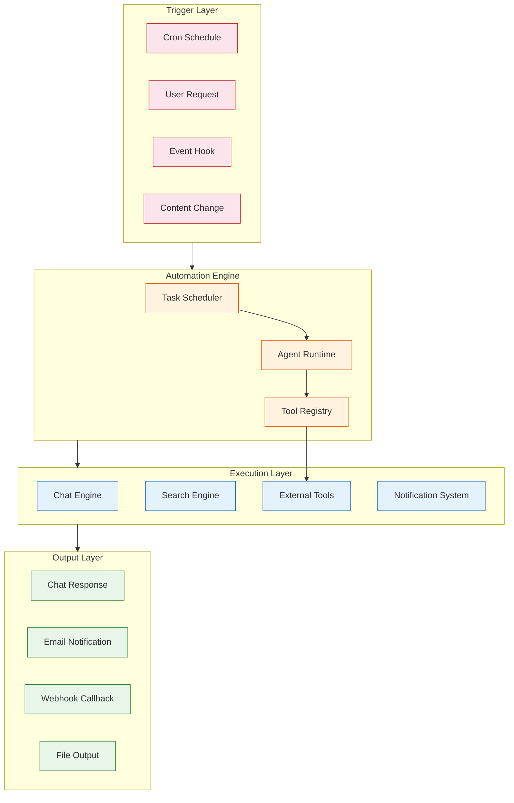
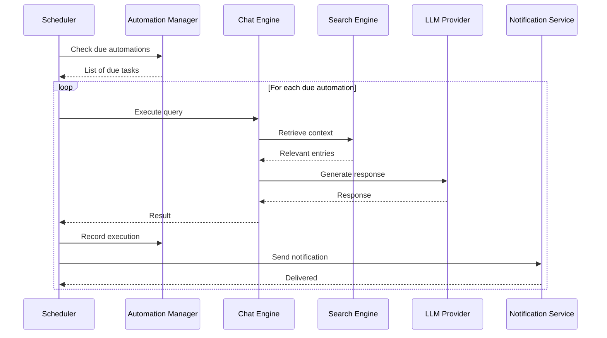
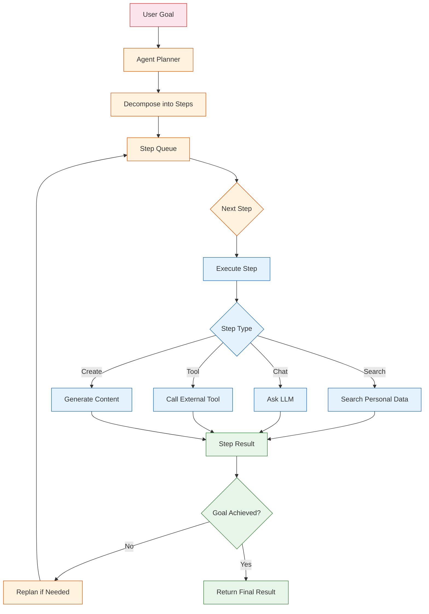

# Chapter 6: Automation & Agents

Khoj goes beyond reactive search and chat by providing automation and agent capabilities. Scheduled tasks, autonomous agents, and tool integration allow Khoj to proactively assist you -- surfacing relevant information, executing recurring queries, and taking actions on your behalf. This chapter explores the automation framework in depth.

## Automation Architecture

Khoj's automation system is built around three core concepts: scheduled automations (cron-like recurring tasks), autonomous agents (goal-driven task execution), and tool integration (extending agent capabilities with external actions).



## Scheduled Automations

Scheduled automations let you define recurring queries or tasks that Khoj executes automatically on a defined schedule. This is ideal for daily briefings, weekly summaries, or periodic knowledge reviews.

### Automation Data Model

```python
from dataclasses import dataclass, field
from datetime import datetime
from typing import Optional
from enum import Enum

class AutomationFrequency(Enum):
    """Supported scheduling frequencies."""
    HOURLY = "hourly"
    DAILY = "daily"
    WEEKLY = "weekly"
    MONTHLY = "monthly"
    CUSTOM_CRON = "custom_cron"

class AutomationStatus(Enum):
    """Lifecycle status of an automation."""
    ACTIVE = "active"
    PAUSED = "paused"
    COMPLETED = "completed"
    FAILED = "failed"
    DISABLED = "disabled"

@dataclass
class ScheduledAutomation:
    """
    Represents a scheduled automation task in Khoj.

    An automation is essentially a saved query or instruction
    that Khoj executes on a recurring schedule.
    """
    id: str
    user_id: int
    name: str
    query_to_run: str           # The query/instruction to execute
    schedule: str               # Cron expression or frequency name
    frequency: AutomationFrequency
    status: AutomationStatus = AutomationStatus.ACTIVE
    notification_method: str = "email"  # email, webhook, in-app
    next_run_at: Optional[datetime] = None
    last_run_at: Optional[datetime] = None
    last_result: Optional[str] = None
    created_at: datetime = field(default_factory=datetime.now)
    run_count: int = 0
    max_runs: Optional[int] = None  # None = unlimited

    def should_run(self, current_time: datetime) -> bool:
        """Check if this automation should execute now."""
        if self.status != AutomationStatus.ACTIVE:
            return False
        if self.max_runs and self.run_count >= self.max_runs:
            return False
        if self.next_run_at and current_time >= self.next_run_at:
            return True
        return False

print("Scheduled automations run queries on a recurring basis")
```

### Creating and Managing Automations

```python
import uuid
from datetime import datetime, timedelta

class AutomationManager:
    """
    Manages the lifecycle of scheduled automations.

    Capabilities:
    - Create, update, pause, resume, and delete automations
    - Calculate next run times from cron expressions
    - Track execution history and results
    - Handle notification delivery
    """

    def __init__(self):
        self.automations: dict[str, ScheduledAutomation] = {}

    def create_automation(
        self,
        user_id: int,
        name: str,
        query: str,
        frequency: AutomationFrequency,
        schedule: str = None,
        notification_method: str = "email",
    ) -> ScheduledAutomation:
        """Create a new scheduled automation."""
        automation_id = str(uuid.uuid4())

        # Calculate the first run time
        if schedule:
            next_run = self._parse_cron_next(schedule)
        else:
            next_run = self._calculate_next_run(frequency)

        automation = ScheduledAutomation(
            id=automation_id,
            user_id=user_id,
            name=name,
            query_to_run=query,
            schedule=schedule or frequency.value,
            frequency=frequency,
            notification_method=notification_method,
            next_run_at=next_run,
        )

        self.automations[automation_id] = automation
        print(f"Created automation '{name}' (next run: {next_run})")
        return automation

    def pause_automation(self, automation_id: str):
        """Pause an active automation."""
        automation = self.automations.get(automation_id)
        if automation:
            automation.status = AutomationStatus.PAUSED
            print(f"Paused automation: {automation.name}")

    def resume_automation(self, automation_id: str):
        """Resume a paused automation."""
        automation = self.automations.get(automation_id)
        if automation and automation.status == AutomationStatus.PAUSED:
            automation.status = AutomationStatus.ACTIVE
            automation.next_run_at = self._calculate_next_run(
                automation.frequency
            )
            print(f"Resumed automation: {automation.name}")

    def get_due_automations(
        self, current_time: datetime = None
    ) -> list[ScheduledAutomation]:
        """Get all automations that are due to run."""
        current_time = current_time or datetime.now()
        return [
            a for a in self.automations.values()
            if a.should_run(current_time)
        ]

    def record_execution(
        self,
        automation_id: str,
        result: str,
        success: bool = True,
    ):
        """Record the result of an automation execution."""
        automation = self.automations.get(automation_id)
        if automation:
            automation.last_run_at = datetime.now()
            automation.last_result = result
            automation.run_count += 1
            automation.next_run_at = self._calculate_next_run(
                automation.frequency
            )
            if not success:
                automation.status = AutomationStatus.FAILED

    def _calculate_next_run(
        self, frequency: AutomationFrequency
    ) -> datetime:
        """Calculate the next run time based on frequency."""
        now = datetime.now()
        intervals = {
            AutomationFrequency.HOURLY: timedelta(hours=1),
            AutomationFrequency.DAILY: timedelta(days=1),
            AutomationFrequency.WEEKLY: timedelta(weeks=1),
            AutomationFrequency.MONTHLY: timedelta(days=30),
        }
        return now + intervals.get(frequency, timedelta(days=1))

    def _parse_cron_next(self, cron_expression: str) -> datetime:
        """Parse a cron expression and return the next run time."""
        # In production, uses croniter library
        # from croniter import croniter
        # cron = croniter(cron_expression, datetime.now())
        # return cron.get_next(datetime)
        return datetime.now() + timedelta(hours=1)

# Example: Create automations
manager = AutomationManager()

# Daily morning briefing
manager.create_automation(
    user_id=1,
    name="Morning Briefing",
    query="Summarize my notes from yesterday and list any upcoming deadlines",
    frequency=AutomationFrequency.DAILY,
    schedule="0 8 * * *",  # Every day at 8 AM
)

# Weekly project summary
manager.create_automation(
    user_id=1,
    name="Weekly Project Summary",
    query="Summarize all my project notes from this week and highlight key decisions",
    frequency=AutomationFrequency.WEEKLY,
    schedule="0 17 * * 5",  # Every Friday at 5 PM
)

# Monthly knowledge review
manager.create_automation(
    user_id=1,
    name="Monthly Knowledge Review",
    query="What are the most important themes across all my notes this month?",
    frequency=AutomationFrequency.MONTHLY,
)
```

### Automation Execution Pipeline



```python
class AutomationExecutor:
    """
    Executes scheduled automations by running them through
    the chat engine and delivering results via notifications.
    """

    def __init__(
        self,
        automation_manager: AutomationManager,
        chat_engine=None,
        notification_service=None,
    ):
        self.manager = automation_manager
        self.chat_engine = chat_engine
        self.notification_service = notification_service

    def run_due_automations(self):
        """Execute all automations that are due to run."""
        due_automations = self.manager.get_due_automations()
        print(f"Found {len(due_automations)} due automations")

        results = []
        for automation in due_automations:
            result = self._execute_automation(automation)
            results.append(result)

        return results

    def _execute_automation(
        self, automation: ScheduledAutomation
    ) -> dict:
        """Execute a single automation."""
        print(f"Executing: {automation.name}")

        try:
            # Run the query through the chat engine
            # In production:
            # response = self.chat_engine.process_message(
            #     user_message=automation.query_to_run,
            #     conversation_history=[],
            #     user_id=automation.user_id,
            # )
            response_text = f"[Result for: {automation.query_to_run}]"

            # Record success
            self.manager.record_execution(
                automation.id,
                result=response_text,
                success=True,
            )

            # Send notification
            self._send_notification(automation, response_text)

            return {
                "automation_id": automation.id,
                "name": automation.name,
                "status": "success",
                "response": response_text,
            }

        except Exception as e:
            self.manager.record_execution(
                automation.id,
                result=str(e),
                success=False,
            )
            return {
                "automation_id": automation.id,
                "name": automation.name,
                "status": "error",
                "error": str(e),
            }

    def _send_notification(
        self,
        automation: ScheduledAutomation,
        result: str,
    ):
        """Send the automation result via the configured notification method."""
        method = automation.notification_method
        print(f"  Sending {method} notification for: {automation.name}")

        # In production, dispatches to the appropriate notification channel:
        # if method == "email":
        #     send_email(automation.user_id, automation.name, result)
        # elif method == "webhook":
        #     send_webhook(automation.webhook_url, result)
        # elif method == "in-app":
        #     create_notification(automation.user_id, result)

executor = AutomationExecutor(manager)
results = executor.run_due_automations()
```

## Autonomous Agents

Beyond scheduled tasks, Khoj supports autonomous agents that can reason about goals, plan multi-step actions, and execute them with tool support.



```python
from dataclasses import dataclass, field
from enum import Enum
from typing import Optional, Callable

class StepType(Enum):
    """Types of actions an agent step can perform."""
    SEARCH = "search"           # Search personal knowledge base
    CHAT = "chat"               # Ask the LLM a question
    TOOL_CALL = "tool_call"     # Call an external tool
    SUMMARIZE = "summarize"     # Summarize collected information
    CREATE = "create"           # Generate new content
    DECIDE = "decide"           # Make a decision based on context

@dataclass
class AgentStep:
    """A single step in an agent's execution plan."""
    step_number: int
    step_type: StepType
    description: str
    input_data: dict = field(default_factory=dict)
    output_data: Optional[dict] = None
    status: str = "pending"     # pending, running, completed, failed
    depends_on: list[int] = field(default_factory=list)

@dataclass
class AgentPlan:
    """A plan consisting of ordered steps to achieve a goal."""
    goal: str
    steps: list[AgentStep]
    current_step: int = 0
    status: str = "planned"     # planned, executing, completed, failed

class KhojAgent:
    """
    An autonomous agent that can plan and execute multi-step tasks.

    The agent follows a plan-execute-reflect loop:
    1. Plan: Decompose the goal into executable steps
    2. Execute: Run each step using available tools
    3. Reflect: Evaluate progress and replan if needed

    Available capabilities:
    - Search personal knowledge base
    - Ask questions to the LLM
    - Call registered tools (web search, calculations, etc.)
    - Generate and save content
    """

    def __init__(self, tools: dict[str, Callable] = None):
        self.tools = tools or {}
        self.execution_log: list[dict] = []

    def plan(self, goal: str, context: str = "") -> AgentPlan:
        """
        Create an execution plan for the given goal.

        In production, this uses the LLM to decompose the goal
        into concrete, executable steps.
        """
        # Example: Goal decomposition for a research task
        if "research" in goal.lower() or "find" in goal.lower():
            steps = [
                AgentStep(
                    step_number=1,
                    step_type=StepType.SEARCH,
                    description="Search personal notes for relevant information",
                    input_data={"query": goal},
                ),
                AgentStep(
                    step_number=2,
                    step_type=StepType.TOOL_CALL,
                    description="Search the web for additional context",
                    input_data={"tool": "web_search", "query": goal},
                    depends_on=[1],
                ),
                AgentStep(
                    step_number=3,
                    step_type=StepType.SUMMARIZE,
                    description="Synthesize findings into a coherent summary",
                    depends_on=[1, 2],
                ),
            ]
        else:
            steps = [
                AgentStep(
                    step_number=1,
                    step_type=StepType.CHAT,
                    description=f"Process request: {goal}",
                    input_data={"message": goal},
                ),
            ]

        plan = AgentPlan(goal=goal, steps=steps)
        print(f"Created plan with {len(steps)} steps for: {goal}")
        return plan

    def execute(self, plan: AgentPlan) -> dict:
        """Execute an agent plan step by step."""
        plan.status = "executing"
        all_results = {}

        for step in plan.steps:
            # Check dependencies
            for dep in step.depends_on:
                if dep not in all_results:
                    print(f"Waiting for step {dep} to complete")

            print(f"Executing step {step.step_number}: {step.description}")
            step.status = "running"

            try:
                result = self._execute_step(step, all_results)
                step.output_data = result
                step.status = "completed"
                all_results[step.step_number] = result

                self.execution_log.append({
                    "step": step.step_number,
                    "type": step.step_type.value,
                    "status": "completed",
                    "result_preview": str(result)[:100],
                })

            except Exception as e:
                step.status = "failed"
                plan.status = "failed"
                print(f"Step {step.step_number} failed: {e}")
                return {"status": "failed", "error": str(e)}

        plan.status = "completed"
        plan.current_step = len(plan.steps)

        return {
            "status": "completed",
            "goal": plan.goal,
            "results": all_results,
            "steps_executed": len(plan.steps),
        }

    def _execute_step(
        self, step: AgentStep, previous_results: dict
    ) -> dict:
        """Execute a single step based on its type."""
        if step.step_type == StepType.SEARCH:
            return self._step_search(step.input_data)
        elif step.step_type == StepType.CHAT:
            return self._step_chat(step.input_data)
        elif step.step_type == StepType.TOOL_CALL:
            return self._step_tool_call(step.input_data)
        elif step.step_type == StepType.SUMMARIZE:
            return self._step_summarize(previous_results)
        elif step.step_type == StepType.CREATE:
            return self._step_create(step.input_data, previous_results)
        else:
            return {"result": "Step type not implemented"}

    def _step_search(self, input_data: dict) -> dict:
        """Execute a search step."""
        query = input_data.get("query", "")
        # In production: results = search_engine.search(query, user_id)
        return {"search_results": [], "query": query}

    def _step_chat(self, input_data: dict) -> dict:
        """Execute a chat step."""
        message = input_data.get("message", "")
        # In production: response = chat_engine.process_message(message)
        return {"response": f"[LLM response to: {message}]"}

    def _step_tool_call(self, input_data: dict) -> dict:
        """Execute a tool call step."""
        tool_name = input_data.get("tool", "")
        if tool_name in self.tools:
            tool_fn = self.tools[tool_name]
            return {"tool_result": tool_fn(input_data)}
        return {"error": f"Tool '{tool_name}' not found"}

    def _step_summarize(self, previous_results: dict) -> dict:
        """Summarize results from previous steps."""
        return {"summary": "Synthesized results from previous steps"}

    def _step_create(
        self, input_data: dict, previous_results: dict
    ) -> dict:
        """Generate new content based on previous results."""
        return {"content": "Generated content"}

# Example usage
agent = KhojAgent(tools={
    "web_search": lambda data: {"results": "Web search results"},
    "calculator": lambda data: {"result": "42"},
})

plan = agent.plan("Research the best practices for Python testing")
result = agent.execute(plan)
print(f"Agent result: {result['status']}")
```

## Tool Registry

The tool registry allows extending agent capabilities with custom tools that can interact with external services and APIs.

```python
from dataclasses import dataclass
from typing import Callable, Any

@dataclass
class ToolDefinition:
    """Definition of a tool available to Khoj agents."""
    name: str
    description: str
    function: Callable
    parameters: dict               # JSON Schema for parameters
    requires_auth: bool = False
    rate_limit: Optional[int] = None  # Calls per minute
    category: str = "general"

class ToolRegistry:
    """
    Registry of tools available to Khoj agents.

    Tools extend agent capabilities beyond search and chat,
    enabling interactions with external systems, calculations,
    content generation, and more.
    """

    def __init__(self):
        self.tools: dict[str, ToolDefinition] = {}
        self._register_builtin_tools()

    def register(self, tool: ToolDefinition):
        """Register a new tool."""
        self.tools[tool.name] = tool
        print(f"Registered tool: {tool.name} ({tool.category})")

    def get_tool(self, name: str) -> Optional[ToolDefinition]:
        """Get a tool by name."""
        return self.tools.get(name)

    def list_tools(self, category: str = None) -> list[ToolDefinition]:
        """List available tools, optionally filtered by category."""
        tools = list(self.tools.values())
        if category:
            tools = [t for t in tools if t.category == category]
        return tools

    def execute_tool(self, name: str, parameters: dict) -> Any:
        """Execute a tool with the given parameters."""
        tool = self.tools.get(name)
        if not tool:
            raise ValueError(f"Tool '{name}' not registered")

        print(f"Executing tool: {name}")
        return tool.function(**parameters)

    def get_tool_descriptions_for_llm(self) -> str:
        """
        Format tool descriptions for inclusion in LLM prompts.

        This enables the LLM to understand which tools are available
        and how to request their use.
        """
        descriptions = []
        for tool in self.tools.values():
            desc = (
                f"- {tool.name}: {tool.description}\n"
                f"  Parameters: {tool.parameters}"
            )
            descriptions.append(desc)
        return "\n".join(descriptions)

    def _register_builtin_tools(self):
        """Register Khoj's built-in tools."""
        # Web search tool
        self.register(ToolDefinition(
            name="web_search",
            description="Search the web for current information",
            function=lambda query: {"results": f"Web results for: {query}"},
            parameters={"query": {"type": "string", "required": True}},
            category="search",
        ))

        # Date/time tool
        self.register(ToolDefinition(
            name="current_datetime",
            description="Get the current date and time",
            function=lambda: {"datetime": datetime.now().isoformat()},
            parameters={},
            category="utility",
        ))

        # Calculator tool
        self.register(ToolDefinition(
            name="calculator",
            description="Evaluate mathematical expressions",
            function=lambda expression: {
                "result": eval(expression)  # Sandboxed in production
            },
            parameters={
                "expression": {"type": "string", "required": True}
            },
            category="utility",
        ))

# Example
registry = ToolRegistry()

# Register a custom tool
registry.register(ToolDefinition(
    name="send_email",
    description="Send an email notification",
    function=lambda to, subject, body: {
        "sent": True, "to": to
    },
    parameters={
        "to": {"type": "string", "required": True},
        "subject": {"type": "string", "required": True},
        "body": {"type": "string", "required": True},
    },
    category="communication",
    requires_auth=True,
))

# List all tools
print("\nAvailable tools:")
for tool in registry.list_tools():
    print(f"  [{tool.category}] {tool.name}: {tool.description}")

# Get tool descriptions for LLM
print("\nTool descriptions for LLM prompt:")
print(registry.get_tool_descriptions_for_llm())
```

## Automation API

Khoj exposes automation management through its REST API:

| Endpoint | Method | Description |
|----------|--------|-------------|
| `/api/automations` | GET | List all automations for the user |
| `/api/automations` | POST | Create a new automation |
| `/api/automations/{id}` | GET | Get automation details |
| `/api/automations/{id}` | PUT | Update an automation |
| `/api/automations/{id}` | DELETE | Delete an automation |
| `/api/automations/{id}/run` | POST | Trigger an automation manually |

```python
import requests

def automation_api_examples(
    base_url: str = "http://localhost:42110",
    api_key: str = "your-api-key",
):
    """Demonstrate the automation API."""
    headers = {
        "Authorization": f"Bearer {api_key}",
        "Content-Type": "application/json",
    }

    # Create a daily automation
    automation_data = {
        "query_to_run": "What are my top priorities for today based on my notes?",
        "schedule": "0 8 * * *",
        "subject": "Daily Priorities",
    }
    response = requests.post(
        f"{base_url}/api/automations",
        headers=headers,
        json=automation_data,
    )
    print(f"Create automation: {response.status_code}")

    # List automations
    response = requests.get(
        f"{base_url}/api/automations",
        headers=headers,
    )
    if response.status_code == 200:
        automations = response.json()
        print(f"Total automations: {len(automations)}")
        for auto in automations:
            print(f"  - {auto.get('subject', 'Untitled')}: {auto.get('schedule')}")

    # Trigger manual run
    # response = requests.post(
    #     f"{base_url}/api/automations/{automation_id}/run",
    #     headers=headers,
    # )

automation_api_examples()
```

## Automation Patterns

Here are common automation patterns that demonstrate the system's flexibility:

```python
class AutomationPatterns:
    """Common automation patterns for Khoj users."""

    @staticmethod
    def daily_briefing():
        """Morning briefing automation."""
        return {
            "name": "Morning Briefing",
            "query": (
                "Based on my notes, give me: "
                "1) Key tasks and deadlines for today, "
                "2) A summary of what I worked on yesterday, "
                "3) Any recurring themes or blocked items."
            ),
            "schedule": "0 7 * * 1-5",  # Weekdays at 7 AM
            "notification": "email",
        }

    @staticmethod
    def weekly_review():
        """Weekly review automation."""
        return {
            "name": "Weekly Review",
            "query": (
                "Provide a comprehensive review of my week: "
                "1) Projects I made progress on, "
                "2) Key decisions documented, "
                "3) Ideas or insights worth revisiting, "
                "4) Suggested priorities for next week."
            ),
            "schedule": "0 16 * * 5",  # Friday at 4 PM
            "notification": "email",
        }

    @staticmethod
    def knowledge_gap_detector():
        """Detect gaps in your knowledge base."""
        return {
            "name": "Knowledge Gap Analysis",
            "query": (
                "Analyze my notes and identify: "
                "1) Topics I have started exploring but not completed, "
                "2) Areas where my notes are sparse or outdated, "
                "3) Connections between topics I might have missed."
            ),
            "schedule": "0 10 1 * *",  # 1st of each month
            "notification": "in-app",
        }

    @staticmethod
    def research_monitor(topic: str):
        """Monitor for new information on a topic."""
        return {
            "name": f"Research Monitor: {topic}",
            "query": (
                f"Search my recent notes and the web for new "
                f"developments related to: {topic}. "
                f"Summarize any new findings."
            ),
            "schedule": "0 9 * * 1",  # Every Monday at 9 AM
            "notification": "email",
        }

# Print example patterns
patterns = AutomationPatterns()
for pattern_fn in [
    patterns.daily_briefing,
    patterns.weekly_review,
    patterns.knowledge_gap_detector,
]:
    pattern = pattern_fn()
    print(f"\n{pattern['name']}:")
    print(f"  Schedule: {pattern['schedule']}")
    print(f"  Query: {pattern['query'][:80]}...")
```

## Summary

In this chapter, you explored Khoj's automation and agent capabilities:

- **Scheduled automations** run recurring queries on cron-like schedules with configurable notification delivery
- **Automation management** supports the full lifecycle of creating, pausing, resuming, and monitoring automations
- **Autonomous agents** decompose goals into multi-step plans and execute them using search, chat, and tools
- **Tool registry** provides an extensible framework for adding custom capabilities to agents
- **Automation API** enables programmatic management of all automation features
- **Common patterns** demonstrate practical use cases like daily briefings, weekly reviews, and research monitoring

## Key Takeaways

1. Automations transform Khoj from a reactive tool into a proactive assistant that surfaces information without being asked.
2. The plan-execute-reflect loop enables agents to handle complex, multi-step tasks autonomously.
3. The tool registry is designed for extensibility, letting you add custom integrations without modifying core code.
4. Notification delivery ensures automation results reach you through your preferred channel (email, webhook, in-app).
5. Combining scheduled automations with personal data search creates powerful workflows like daily briefings grounded in your actual notes.

## Next Steps

In [Chapter 7: Customization & Plugins](07-customization-and-plugins.md), we will explore how to customize Khoj's behavior through configuration, build custom data type processors, and extend the system with plugins and model configuration options.

---
*Built with insights from the [Khoj](https://github.com/khoj-ai/khoj) project.*
