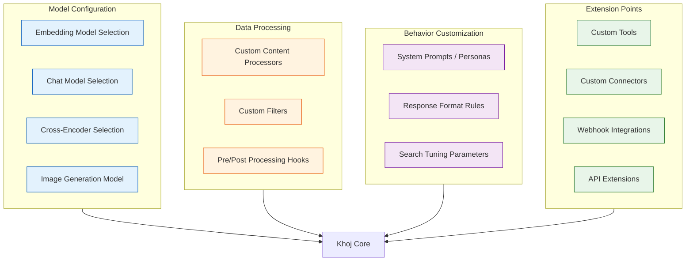
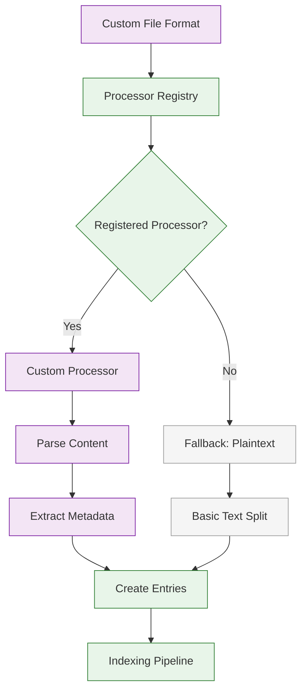
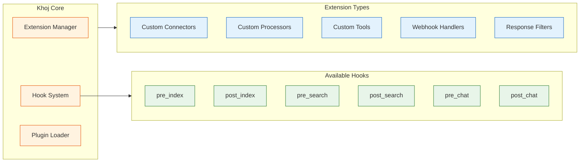

# Chapter 7: Customization & Plugins

Welcome to **Chapter 7: Customization & Plugins**. In this part of **Khoj AI: Deep Dive Tutorial**, you will build an intuitive mental model first, then move into concrete implementation details and practical production tradeoffs.


Khoj is designed to be customizable at every layer, from the embedding models and LLM backends to the data processors and response behavior. This chapter explores how to tailor Khoj to your specific needs through model configuration, custom data type processors, prompt personalization, and the extension architecture.

## Customization Overview

Khoj offers customization at multiple levels, each affecting different aspects of the system:



## Model Configuration

### Embedding Model Configuration

The embedding model determines how your content is represented as vectors. Choosing the right model affects both search quality and performance.

```python
from dataclasses import dataclass
from typing import Optional

@dataclass
class EmbeddingModelOptions:
    """Configuration options for embedding models in Khoj."""
    model_name: str
    dimensions: int
    max_tokens: int
    inference_endpoint: Optional[str] = None
    api_key: Optional[str] = None
    batch_size: int = 64
    device: str = "cpu"         # cpu, cuda, mps

# Available embedding model configurations
EMBEDDING_MODEL_CONFIGS = {
    "fast": EmbeddingModelOptions(
        model_name="sentence-transformers/all-MiniLM-L6-v2",
        dimensions=384,
        max_tokens=256,
        batch_size=128,
        device="cpu",
    ),
    "balanced": EmbeddingModelOptions(
        model_name="sentence-transformers/all-mpnet-base-v2",
        dimensions=768,
        max_tokens=384,
        batch_size=64,
        device="cpu",
    ),
    "high_quality": EmbeddingModelOptions(
        model_name="BAAI/bge-large-en-v1.5",
        dimensions=1024,
        max_tokens=512,
        batch_size=32,
        device="cuda",
    ),
    "multilingual": EmbeddingModelOptions(
        model_name="sentence-transformers/paraphrase-multilingual-mpnet-base-v2",
        dimensions=768,
        max_tokens=128,
        batch_size=64,
        device="cpu",
    ),
    "remote_api": EmbeddingModelOptions(
        model_name="text-embedding-3-small",
        dimensions=1536,
        max_tokens=8191,
        inference_endpoint="https://api.openai.com/v1/embeddings",
        api_key="sk-...",
        batch_size=100,
    ),
}

def select_embedding_model(
    priority: str = "balanced",
    multilingual: bool = False,
    gpu_available: bool = False,
) -> EmbeddingModelOptions:
    """
    Select the best embedding model based on requirements.

    Args:
        priority: 'fast', 'balanced', or 'high_quality'
        multilingual: Whether multilingual support is needed
        gpu_available: Whether GPU acceleration is available
    """
    if multilingual:
        return EMBEDDING_MODEL_CONFIGS["multilingual"]

    config = EMBEDDING_MODEL_CONFIGS.get(priority, EMBEDDING_MODEL_CONFIGS["balanced"])

    if gpu_available and priority == "high_quality":
        config.device = "cuda"

    return config

# Example selection
model = select_embedding_model(priority="balanced", gpu_available=False)
print(f"Selected model: {model.model_name}")
print(f"Dimensions: {model.dimensions}, Device: {model.device}")
```

### Model Comparison

| Model | Dimensions | Speed | Quality | VRAM (GPU) | Best For |
|-------|-----------|-------|---------|------------|----------|
| all-MiniLM-L6-v2 | 384 | Fast | Good | 0.5 GB | Small corpora, CPU-only |
| all-mpnet-base-v2 | 768 | Medium | Very Good | 1.0 GB | General purpose |
| bge-large-en-v1.5 | 1024 | Slow | Excellent | 2.0 GB | Maximum quality |
| multilingual-mpnet | 768 | Medium | Good | 1.0 GB | Multi-language notes |
| text-embedding-3-small | 1536 | API-dependent | Excellent | N/A | Remote inference |

### Chat Model Configuration

Khoj supports multiple LLM providers for its chat functionality. Each can be configured with specific parameters:

```python
@dataclass
class ChatModelConfig:
    """Configuration for a chat model backend."""
    model_name: str
    provider: str               # openai, anthropic, ollama, offline
    max_prompt_size: int        # Maximum context window
    api_endpoint: Optional[str] = None
    api_key: Optional[str] = None
    temperature: float = 0.7
    top_p: float = 0.9
    max_response_tokens: int = 2048
    supports_streaming: bool = True
    supports_vision: bool = False

CHAT_MODEL_CONFIGS = {
    "gpt4": ChatModelConfig(
        model_name="gpt-4",
        provider="openai",
        max_prompt_size=8192,
        temperature=0.7,
        supports_vision=False,
    ),
    "gpt4o": ChatModelConfig(
        model_name="gpt-4o",
        provider="openai",
        max_prompt_size=128000,
        temperature=0.7,
        supports_vision=True,
    ),
    "claude35sonnet": ChatModelConfig(
        model_name="claude-3-5-sonnet-20241022",
        provider="anthropic",
        max_prompt_size=200000,
        temperature=0.7,
        supports_vision=True,
    ),
    "llama31_8b": ChatModelConfig(
        model_name="llama3.1:8b",
        provider="ollama",
        max_prompt_size=8192,
        api_endpoint="http://localhost:11434",
        temperature=0.7,
    ),
    "mistral_7b": ChatModelConfig(
        model_name="mistral:7b",
        provider="ollama",
        max_prompt_size=8192,
        api_endpoint="http://localhost:11434",
        temperature=0.7,
    ),
}

def configure_chat_model(model_key: str) -> ChatModelConfig:
    """Get chat model configuration."""
    config = CHAT_MODEL_CONFIGS.get(model_key)
    if not config:
        available = ", ".join(CHAT_MODEL_CONFIGS.keys())
        raise ValueError(
            f"Unknown model: {model_key}. Available: {available}"
        )
    print(f"Chat model: {config.model_name} ({config.provider})")
    print(f"  Context window: {config.max_prompt_size:,} tokens")
    print(f"  Streaming: {config.supports_streaming}")
    print(f"  Vision: {config.supports_vision}")
    return config

configure_chat_model("claude35sonnet")
```

## Custom Data Type Processors

Khoj's data processing is extensible. You can create custom processors for specialized file formats that are not supported out of the box.



```python
from abc import ABC, abstractmethod
from typing import Optional

class ContentProcessor(ABC):
    """
    Base class for custom content processors.

    To add support for a new file format:
    1. Subclass ContentProcessor
    2. Implement the required methods
    3. Register with the ProcessorRegistry
    """

    @abstractmethod
    def get_supported_extensions(self) -> list[str]:
        """Return file extensions this processor handles."""
        pass

    @abstractmethod
    def process_file(self, file_path: str, content: str) -> list[dict]:
        """
        Process a file and return a list of content entries.

        Each entry should have:
        - raw: Original content
        - compiled: Cleaned content for embedding
        - heading: Section heading (if applicable)
        - metadata: Additional metadata dict
        """
        pass

    @abstractmethod
    def get_priority(self) -> int:
        """
        Return processor priority (higher = preferred).
        Used when multiple processors match the same extension.
        """
        pass

class JupyterNotebookProcessor(ContentProcessor):
    """
    Custom processor for Jupyter Notebook (.ipynb) files.

    Extracts content from notebook cells, preserving
    the distinction between code, markdown, and output cells.
    """

    def get_supported_extensions(self) -> list[str]:
        return [".ipynb"]

    def get_priority(self) -> int:
        return 10

    def process_file(self, file_path: str, content: str) -> list[dict]:
        """Process a Jupyter notebook into content entries."""
        import json

        try:
            notebook = json.loads(content)
        except json.JSONDecodeError:
            return []

        entries = []
        cells = notebook.get("cells", [])

        for i, cell in enumerate(cells):
            cell_type = cell.get("cell_type", "code")
            source = "".join(cell.get("source", []))

            if not source.strip():
                continue

            # Format based on cell type
            if cell_type == "markdown":
                compiled = source
                heading = self._extract_heading(source)
            elif cell_type == "code":
                # Include output if available
                outputs = cell.get("outputs", [])
                output_text = self._extract_output(outputs)
                compiled = f"```python\n{source}\n```"
                if output_text:
                    compiled += f"\nOutput:\n{output_text}"
                heading = f"Code Cell {i + 1}"
            else:
                compiled = source
                heading = f"Cell {i + 1}"

            entries.append({
                "raw": source,
                "compiled": compiled,
                "heading": heading,
                "metadata": {
                    "cell_type": cell_type,
                    "cell_index": i,
                    "notebook_path": file_path,
                },
            })

        return entries

    def _extract_heading(self, markdown: str) -> Optional[str]:
        """Extract the first heading from markdown content."""
        for line in markdown.split("\n"):
            if line.startswith("#"):
                return line.lstrip("#").strip()
        return None

    def _extract_output(self, outputs: list) -> str:
        """Extract text output from notebook cell outputs."""
        texts = []
        for output in outputs:
            if "text" in output:
                texts.extend(output["text"])
            elif "data" in output and "text/plain" in output["data"]:
                texts.extend(output["data"]["text/plain"])
        return "".join(texts)[:500]  # Limit output length

class CSVProcessor(ContentProcessor):
    """
    Custom processor for CSV files.

    Converts CSV rows into searchable text entries.
    """

    def get_supported_extensions(self) -> list[str]:
        return [".csv"]

    def get_priority(self) -> int:
        return 10

    def process_file(self, file_path: str, content: str) -> list[dict]:
        """Process a CSV file into content entries."""
        import csv
        from io import StringIO

        entries = []
        reader = csv.DictReader(StringIO(content))

        # Group rows into chunks for indexing
        chunk_size = 20
        current_chunk = []

        for row in reader:
            current_chunk.append(row)

            if len(current_chunk) >= chunk_size:
                entry = self._chunk_to_entry(current_chunk, file_path)
                entries.append(entry)
                current_chunk = []

        if current_chunk:
            entry = self._chunk_to_entry(current_chunk, file_path)
            entries.append(entry)

        return entries

    def _chunk_to_entry(
        self, rows: list[dict], file_path: str
    ) -> dict:
        """Convert a chunk of CSV rows to a content entry."""
        # Format rows as readable text
        lines = []
        for row in rows:
            row_text = ", ".join(
                f"{k}: {v}" for k, v in row.items() if v
            )
            lines.append(row_text)

        compiled = "\n".join(lines)
        return {
            "raw": compiled,
            "compiled": compiled,
            "heading": f"Data from {file_path}",
            "metadata": {
                "row_count": len(rows),
                "columns": list(rows[0].keys()) if rows else [],
            },
        }

class ProcessorRegistry:
    """
    Registry for content processors.

    Manages the mapping between file extensions and
    their appropriate processors.
    """

    def __init__(self):
        self.processors: dict[str, ContentProcessor] = {}

    def register(self, processor: ContentProcessor):
        """Register a content processor."""
        for ext in processor.get_supported_extensions():
            existing = self.processors.get(ext)
            if existing and existing.get_priority() >= processor.get_priority():
                continue
            self.processors[ext] = processor
            print(f"Registered processor for {ext}: "
                  f"{type(processor).__name__}")

    def get_processor(self, file_path: str) -> Optional[ContentProcessor]:
        """Get the appropriate processor for a file."""
        from pathlib import Path
        ext = Path(file_path).suffix.lower()
        return self.processors.get(ext)

    def list_supported_formats(self) -> dict[str, str]:
        """List all supported file formats."""
        return {
            ext: type(proc).__name__
            for ext, proc in self.processors.items()
        }

# Register custom processors
registry = ProcessorRegistry()
registry.register(JupyterNotebookProcessor())
registry.register(CSVProcessor())

print("\nSupported formats:")
for ext, processor_name in registry.list_supported_formats().items():
    print(f"  {ext} -> {processor_name}")
```

## Persona and Prompt Customization

Khoj's response behavior can be customized through persona configuration and prompt templates.

```python
from dataclasses import dataclass, field

@dataclass
class PersonaConfig:
    """
    Configuration for a Khoj persona.

    Personas customize how Khoj responds, including:
    - Tone and style of responses
    - Domain-specific knowledge emphasis
    - Response format preferences
    - Interaction patterns
    """
    name: str
    system_prompt: str
    greeting: str = "How can I help you?"
    response_style: str = "balanced"  # concise, balanced, detailed
    citation_style: str = "inline"    # inline, footnote, none
    domain_focus: list[str] = field(default_factory=list)
    max_response_length: int = 2048
    always_cite_sources: bool = True

PERSONAS = {
    "default": PersonaConfig(
        name="Khoj",
        system_prompt=(
            "You are Khoj, a personal AI assistant. Answer questions "
            "helpfully and accurately using the user's personal data "
            "when available. Cite sources when referencing specific "
            "information from their notes."
        ),
    ),
    "researcher": PersonaConfig(
        name="Research Khoj",
        system_prompt=(
            "You are Khoj, configured as a research assistant. "
            "Provide thorough, well-structured analyses. Always "
            "identify connections between different sources. "
            "Highlight gaps in available information. "
            "Suggest further research directions when appropriate."
        ),
        response_style="detailed",
        citation_style="footnote",
        domain_focus=["research", "academic", "analysis"],
        always_cite_sources=True,
    ),
    "developer": PersonaConfig(
        name="Dev Khoj",
        system_prompt=(
            "You are Khoj, configured as a developer assistant. "
            "Focus on code-related questions and technical documentation. "
            "Provide code examples when helpful. Reference relevant "
            "documentation and code files from the user's repositories."
        ),
        response_style="concise",
        domain_focus=["programming", "code", "technical"],
    ),
    "writer": PersonaConfig(
        name="Writer Khoj",
        system_prompt=(
            "You are Khoj, configured as a writing assistant. "
            "Help with drafting, editing, and organizing written "
            "content. Draw on the user's existing notes for "
            "reference and inspiration. Maintain the user's "
            "writing voice and style."
        ),
        response_style="balanced",
        domain_focus=["writing", "editing", "content"],
    ),
}

class PersonaManager:
    """Manages persona selection and application."""

    def __init__(self):
        self.personas = dict(PERSONAS)
        self.user_persona_map: dict[int, str] = {}

    def set_user_persona(self, user_id: int, persona_name: str):
        """Set the active persona for a user."""
        if persona_name not in self.personas:
            raise ValueError(f"Unknown persona: {persona_name}")
        self.user_persona_map[user_id] = persona_name
        print(f"Set persona for user {user_id}: {persona_name}")

    def get_user_persona(self, user_id: int) -> PersonaConfig:
        """Get the active persona for a user."""
        persona_name = self.user_persona_map.get(user_id, "default")
        return self.personas[persona_name]

    def create_custom_persona(
        self,
        name: str,
        base_persona: str = "default",
        **overrides,
    ) -> PersonaConfig:
        """Create a custom persona based on an existing one."""
        base = self.personas.get(base_persona, self.personas["default"])

        # Create new persona with overrides
        config_dict = {
            "name": name,
            "system_prompt": overrides.get(
                "system_prompt", base.system_prompt
            ),
            "greeting": overrides.get("greeting", base.greeting),
            "response_style": overrides.get(
                "response_style", base.response_style
            ),
            "citation_style": overrides.get(
                "citation_style", base.citation_style
            ),
            "domain_focus": overrides.get(
                "domain_focus", base.domain_focus
            ),
        }

        persona = PersonaConfig(**config_dict)
        self.personas[name] = persona
        print(f"Created custom persona: {name}")
        return persona

    def apply_persona_to_prompt(
        self, persona: PersonaConfig, base_prompt: str
    ) -> str:
        """Modify a prompt based on persona configuration."""
        additions = []

        if persona.response_style == "concise":
            additions.append("Keep responses concise and to the point.")
        elif persona.response_style == "detailed":
            additions.append(
                "Provide thorough, detailed responses with examples."
            )

        if persona.always_cite_sources:
            additions.append(
                "Always cite the source file when referencing information."
            )

        if persona.domain_focus:
            focus = ", ".join(persona.domain_focus)
            additions.append(
                f"Focus especially on topics related to: {focus}."
            )

        if additions:
            return base_prompt + "\n\n" + " ".join(additions)
        return base_prompt

# Usage
manager = PersonaManager()
manager.set_user_persona(user_id=1, persona_name="researcher")

# Create a custom persona
manager.create_custom_persona(
    name="data_scientist",
    base_persona="developer",
    system_prompt=(
        "You are Khoj, configured for data science workflows. "
        "Help with data analysis, visualization, and ML pipelines."
    ),
    domain_focus=["data science", "machine learning", "statistics"],
    response_style="detailed",
)
```

## Search Tuning

Fine-tune search behavior to match your content and usage patterns:

```python
@dataclass
class SearchTuningConfig:
    """
    Configuration for search behavior tuning.

    These parameters control how search balances
    speed, relevance, and diversity.
    """
    # Retrieval parameters
    bi_encoder_top_k: int = 20      # Candidates from vector search
    cross_encoder_top_n: int = 5    # Results after re-ranking
    score_threshold: float = 0.2    # Minimum relevance score

    # Diversity parameters
    max_per_file: int = 3           # Max results from same file
    diversity_weight: float = 0.1   # Weight for result diversity

    # Recency parameters
    recency_bias: float = 0.0      # Boost for recent content (0-1)
    recency_decay_days: int = 90   # Days before recency boost fades

    # Content type weights
    type_weights: dict = field(default_factory=lambda: {
        "markdown": 1.0,
        "org": 1.0,
        "pdf": 0.9,
        "github": 0.8,
        "notion": 0.9,
    })

SEARCH_PROFILES = {
    "default": SearchTuningConfig(),
    "precise": SearchTuningConfig(
        bi_encoder_top_k=30,
        cross_encoder_top_n=3,
        score_threshold=0.4,
    ),
    "broad": SearchTuningConfig(
        bi_encoder_top_k=50,
        cross_encoder_top_n=10,
        score_threshold=0.1,
        max_per_file=5,
    ),
    "recent_focused": SearchTuningConfig(
        recency_bias=0.3,
        recency_decay_days=30,
    ),
}

def apply_search_tuning(
    results: list[dict],
    config: SearchTuningConfig,
) -> list[dict]:
    """Apply search tuning to raw search results."""
    # Apply score threshold
    results = [
        r for r in results
        if r.get("score", 0) >= config.score_threshold
    ]

    # Apply per-file limit
    file_counts: dict[str, int] = {}
    filtered = []
    for r in results:
        file_path = r.get("file_path", "")
        count = file_counts.get(file_path, 0)
        if count < config.max_per_file:
            filtered.append(r)
            file_counts[file_path] = count + 1
    results = filtered

    # Apply content type weights
    for r in results:
        file_type = r.get("file_type", "markdown")
        weight = config.type_weights.get(file_type, 1.0)
        r["weighted_score"] = r.get("score", 0) * weight

    # Sort by weighted score
    results.sort(key=lambda r: r.get("weighted_score", 0), reverse=True)

    return results[:config.cross_encoder_top_n]

# Example
config = SEARCH_PROFILES["precise"]
print(f"Search profile: precise")
print(f"  Top-K: {config.bi_encoder_top_k}")
print(f"  Score threshold: {config.score_threshold}")
```

## Extension Architecture

Khoj's extension points allow you to add custom functionality without modifying the core codebase.



```python
from typing import Callable, Any

class HookSystem:
    """
    A hook system for extending Khoj's behavior at key points.

    Hooks allow custom code to run before or after core operations
    without modifying the source code.
    """

    def __init__(self):
        self.hooks: dict[str, list[Callable]] = {
            "pre_index": [],
            "post_index": [],
            "pre_search": [],
            "post_search": [],
            "pre_chat": [],
            "post_chat": [],
            "on_error": [],
        }

    def register(self, hook_name: str, callback: Callable):
        """Register a callback for a hook."""
        if hook_name not in self.hooks:
            raise ValueError(f"Unknown hook: {hook_name}")
        self.hooks[hook_name].append(callback)
        print(f"Registered hook: {hook_name} -> {callback.__name__}")

    def trigger(self, hook_name: str, **kwargs) -> list[Any]:
        """Trigger all callbacks for a hook."""
        results = []
        for callback in self.hooks.get(hook_name, []):
            try:
                result = callback(**kwargs)
                results.append(result)
            except Exception as e:
                print(f"Hook error in {callback.__name__}: {e}")
                # Trigger error hooks
                if hook_name != "on_error":
                    self.trigger("on_error", error=e, hook=hook_name)
        return results

# Create hook system
hooks = HookSystem()

# Example: Log all search queries
def log_search_query(query: str, **kwargs):
    """Log search queries for analytics."""
    print(f"[Analytics] Search query: {query}")

hooks.register("pre_search", log_search_query)

# Example: Filter sensitive content from results
def filter_sensitive_results(results: list, **kwargs) -> list:
    """Remove entries tagged as sensitive from search results."""
    return [
        r for r in results
        if "sensitive" not in r.get("metadata", {}).get("tags", [])
    ]

hooks.register("post_search", filter_sensitive_results)

# Example: Add custom metadata to indexed entries
def enrich_entry_metadata(entries: list, **kwargs) -> list:
    """Add custom metadata during indexing."""
    for entry in entries:
        # Add word count
        entry.setdefault("metadata", {})["word_count"] = len(
            entry.get("compiled", "").split()
        )
    return entries

hooks.register("pre_index", enrich_entry_metadata)

# Trigger a hook
hooks.trigger("pre_search", query="test query")
```

## Webhook Integration

Khoj supports webhooks for integrating with external services on key events:

```python
import requests
from dataclasses import dataclass

@dataclass
class WebhookConfig:
    """Configuration for a webhook integration."""
    url: str
    events: list[str]           # Events to subscribe to
    secret: Optional[str] = None  # Shared secret for verification
    active: bool = True
    retry_count: int = 3
    timeout_seconds: int = 10

class WebhookManager:
    """
    Manages webhook subscriptions and event delivery.

    Supported events:
    - index.completed: Indexing finished
    - search.performed: Search query executed
    - chat.message: Chat message processed
    - automation.executed: Scheduled automation ran
    - error.occurred: An error occurred
    """

    def __init__(self):
        self.webhooks: list[WebhookConfig] = []

    def register_webhook(self, config: WebhookConfig):
        """Register a new webhook subscription."""
        self.webhooks.append(config)
        events = ", ".join(config.events)
        print(f"Registered webhook: {config.url} for [{events}]")

    def dispatch_event(self, event_name: str, payload: dict):
        """Dispatch an event to all subscribed webhooks."""
        for webhook in self.webhooks:
            if not webhook.active:
                continue
            if event_name not in webhook.events:
                continue

            self._send_webhook(webhook, event_name, payload)

    def _send_webhook(
        self,
        webhook: WebhookConfig,
        event_name: str,
        payload: dict,
    ):
        """Send a webhook request with retry logic."""
        headers = {
            "Content-Type": "application/json",
            "X-Khoj-Event": event_name,
        }

        if webhook.secret:
            import hmac
            import hashlib
            import json
            body = json.dumps(payload)
            signature = hmac.new(
                webhook.secret.encode(),
                body.encode(),
                hashlib.sha256,
            ).hexdigest()
            headers["X-Khoj-Signature"] = signature

        for attempt in range(webhook.retry_count):
            try:
                # In production:
                # response = requests.post(
                #     webhook.url,
                #     json=payload,
                #     headers=headers,
                #     timeout=webhook.timeout_seconds,
                # )
                # if response.status_code < 300:
                #     return
                print(f"  Webhook sent to {webhook.url} "
                      f"(event: {event_name})")
                return
            except Exception as e:
                print(f"  Webhook attempt {attempt + 1} failed: {e}")

# Usage
webhook_mgr = WebhookManager()
webhook_mgr.register_webhook(WebhookConfig(
    url="https://example.com/khoj-events",
    events=["index.completed", "automation.executed"],
    secret="my-webhook-secret",
))

# Dispatch an event
webhook_mgr.dispatch_event("index.completed", {
    "entries_indexed": 150,
    "duration_seconds": 45,
})
```

## Configuration via Admin UI

Khoj provides a Django admin interface for managing all configuration through a web UI:

| Configuration Area | Admin Path | Description |
|-------------------|------------|-------------|
| Search Models | `/server/admin/database/searchmodelconfig/` | Configure embedding models |
| Chat Models | `/server/admin/database/chatmodeloptions/` | Configure LLM backends |
| Data Sources | `/server/admin/database/contentsourceconfig/` | Manage data connectors |
| Automations | `/server/admin/database/automation/` | Manage scheduled tasks |
| Users | `/server/admin/auth/user/` | User management |
| Conversations | `/server/admin/database/conversation/` | View conversation logs |

```python
# Configuration that can be managed via the admin UI
ADMIN_CONFIGURABLE = {
    "search_model": {
        "fields": ["name", "bi_encoder", "cross_encoder",
                    "embeddings_inference_endpoint"],
        "description": "Configure the search embedding and re-ranking models",
    },
    "chat_model": {
        "fields": ["chat_model", "model_type", "max_prompt_size",
                    "tokenizer", "api_key"],
        "description": "Configure LLM backends for chat functionality",
    },
    "content_source": {
        "fields": ["content_type", "input_filter", "input_files"],
        "description": "Configure data source locations and types",
    },
}

print("All major settings are configurable via the Django admin UI")
for area, config in ADMIN_CONFIGURABLE.items():
    print(f"\n{area}:")
    print(f"  {config['description']}")
    print(f"  Fields: {', '.join(config['fields'])}")
```

## Summary

In this chapter, you explored Khoj's extensive customization options:

- **Model configuration** for both embedding and chat models, with support for local and remote inference
- **Custom content processors** for extending file format support beyond the built-in types
- **Persona system** for tailoring response style, tone, and domain focus
- **Search tuning** parameters for balancing speed, relevance, diversity, and recency
- **Extension architecture** with a hook system for inserting custom logic at key points
- **Webhook integration** for connecting Khoj to external services
- **Admin UI** for managing configuration through Django's admin interface

## Key Takeaways

1. Khoj's model configuration is fully swappable, letting you choose between speed, quality, and cost across both embedding and chat models.
2. Custom content processors follow a simple interface, making it straightforward to add support for new file formats like Jupyter notebooks or CSV files.
3. The persona system separates behavioral customization from core logic, enabling multiple interaction styles without code changes.
4. Search tuning profiles let you optimize for different use cases: precise retrieval, broad exploration, or recency-focused results.
5. The hook system and webhook integration provide extension points for monitoring, filtering, and connecting to external systems.

## Next Steps

In [Chapter 8: Production Deployment](08-production-deployment.md), we will cover deploying Khoj in a production environment, including Docker deployment strategies, scaling considerations, security hardening, monitoring, and backup procedures.

---
*Built with insights from the [Khoj](https://github.com/khoj-ai/khoj) project.*

## What Problem Does This Solve?

Most teams struggle here because the hard part is not writing more code, but deciding clear boundaries for `model_name`, `model`, `config` so behavior stays predictable as complexity grows.

In practical terms, this chapter helps you avoid three common failures:

- coupling core logic too tightly to one implementation path
- missing the handoff boundaries between setup, execution, and validation
- shipping changes without clear rollback or observability strategy

After working through this chapter, you should be able to reason about `Chapter 7: Customization & Plugins` as an operating subsystem inside **Khoj AI: Deep Dive Tutorial**, with explicit contracts for inputs, state transitions, and outputs.

Use the implementation notes around `content`, `self`, `Custom` as your checklist when adapting these patterns to your own repository.

## How it Works Under the Hood

Under the hood, `Chapter 7: Customization & Plugins` usually follows a repeatable control path:

1. **Context bootstrap**: initialize runtime config and prerequisites for `model_name`.
2. **Input normalization**: shape incoming data so `model` receives stable contracts.
3. **Core execution**: run the main logic branch and propagate intermediate state through `config`.
4. **Policy and safety checks**: enforce limits, auth scopes, and failure boundaries.
5. **Output composition**: return canonical result payloads for downstream consumers.
6. **Operational telemetry**: emit logs/metrics needed for debugging and performance tuning.

When debugging, walk this sequence in order and confirm each stage has explicit success/failure conditions.

## Source Walkthrough

Use the following upstream sources to verify implementation details while reading this chapter:

- [Khoj](https://github.com/khoj-ai/khoj)
  Why it matters: authoritative reference on `Khoj` (github.com).

Suggested trace strategy:
- search upstream code for `model_name` and `model` to map concrete implementation paths
- compare docs claims against actual runtime/config code before reusing patterns in production

## Chapter Connections

- [Tutorial Index](index.md)
- [Previous Chapter: Chapter 6: Automation & Agents](06-automation-and-agents.md)
- [Next Chapter: Chapter 8: Production Deployment](08-production-deployment.md)
- [Main Catalog](../../README.md#-tutorial-catalog)
- [A-Z Tutorial Directory](../../discoverability/tutorial-directory.md)
