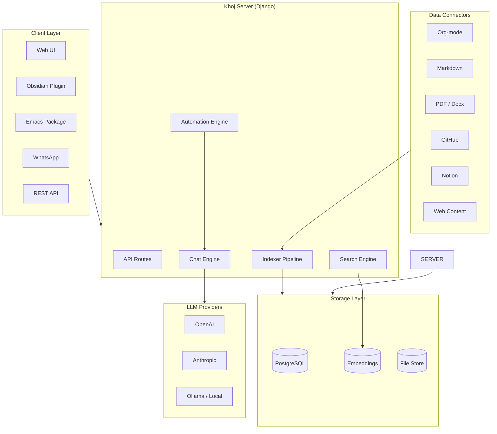

# Khoj AI: Deep Dive Tutorial

> **Project**: [Khoj](https://github.com/khoj-ai/khoj) — An open-source, self-hostable AI personal assistant that connects to your notes, documents, and online data.

## What Is Khoj?

Khoj is an open-source AI personal assistant that transforms your scattered notes, documents, and online data into a searchable, conversational knowledge base. It combines semantic search with LLM-backed chat to help you retrieve, synthesize, and act on your personal information. Khoj can be self-hosted for full data privacy or used via the hosted service.

| Feature | Description |
|---------|-------------|
| **Semantic Search** | Symmetric and asymmetric search with cross-encoder re-ranking over personal data |
| **Multi-Source** | Org-mode, Markdown, PDF, GitHub repos, Notion pages, web content |
| **LLM Chat** | Conversational AI with context from your knowledge base (OpenAI, Anthropic, Ollama) |
| **Automation** | Scheduled tasks, autonomous agents, and tool-use for proactive assistance |
| **Self-Hostable** | Full Docker deployment with PostgreSQL, data stays on your infrastructure |
| **Client Integrations** | Obsidian plugin, Emacs package, web UI, WhatsApp, and API access |

## Architecture Overview

## Tutorial Structure

| Chapter | Topic | What You'll Learn |
|---------|-------|-------------------|
| [1. Getting Started](01-getting-started.md) | Setup | Installation, self-hosting, connecting first data sources |
| [2. Architecture Overview](02-architecture-overview.md) | Design | System components, search indexing, LLM integration pipeline |
| [3. Data Connectors](03-data-connectors.md) | Ingestion | Org-mode, Markdown, PDF, GitHub, Notion connector internals |
| [4. Search & Retrieval](04-search-and-retrieval.md) | Search | Symmetric/asymmetric search, embeddings, cross-encoder ranking |
| [5. Chat Interface](05-chat-interface.md) | Conversation | Context management, conversation threads, tool use, citations |
| [6. Automation & Agents](06-automation-and-agents.md) | Agents | Scheduled tasks, autonomous actions, tool integration |
| [7. Customization & Plugins](07-customization-and-plugins.md) | Extensibility | Custom data types, model configuration, extensions |
| [8. Production Deployment](08-production-deployment.md) | Operations | Docker, scaling, security, monitoring, backup strategies |

## Tech Stack

| Component | Technology |
|-----------|-----------|
| **Backend** | Python, Django |
| **Database** | PostgreSQL |
| **Search** | Sentence Transformers embeddings, cross-encoder re-ranking |
| **LLM Providers** | OpenAI, Anthropic, Google, Ollama (local) |
| **Frontend** | Next.js (web UI) |
| **Clients** | Obsidian plugin, Emacs package, WhatsApp bot |
| **Deployment** | Docker Compose, systemd |
| **Task Queue** | Django Q / APScheduler for automation |

---

Ready to begin? Start with [Chapter 1: Getting Started](01-getting-started.md).

---

*Built with insights from the [Khoj repository](https://github.com/khoj-ai/khoj) and community documentation.*

## Navigation & Backlinks

- [Start Here: Chapter 1: Getting Started](01-getting-started.md)
- [Back to Main Catalog](../../README.md#-tutorial-catalog)
- [Browse A-Z Tutorial Directory](../../discoverability/tutorial-directory.md)
- [Search by Intent](../../discoverability/query-hub.md)
- [Explore Category Hubs](../../README.md#category-hubs)

## Full Chapter Map

1. [Chapter 1: Getting Started](01-getting-started.md)
2. [Chapter 2: Architecture Overview](02-architecture-overview.md)
3. [Chapter 3: Data Connectors](03-data-connectors.md)
4. [Chapter 4: Search & Retrieval](04-search-and-retrieval.md)
5. [Chapter 5: Chat Interface](05-chat-interface.md)
6. [Chapter 6: Automation & Agents](06-automation-and-agents.md)
7. [Chapter 7: Customization & Plugins](07-customization-and-plugins.md)
8. [Chapter 8: Production Deployment](08-production-deployment.md)

## Source References

- [Khoj](https://github.com/khoj-ai/khoj)

*Generated by [AI Codebase Knowledge Builder](https://github.com/The-Pocket/Tutorial-Codebase-Knowledge)*
