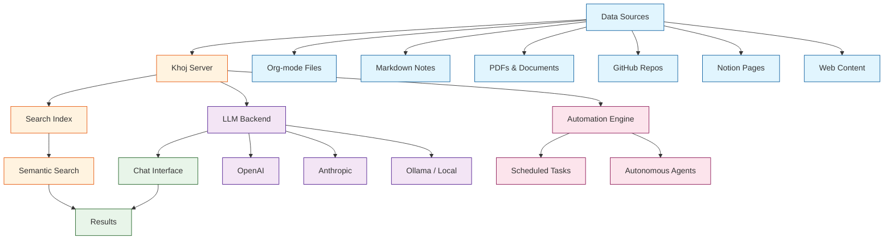

# Khoj AI - Personal Assistant Deep Dive

Khoj[View Repo](https://github.com/khoj-ai/khoj) is an open-source, self-hostable AI personal assistant that connects to your notes, documents, and online data. It provides natural language search and chat across your personal knowledge base, combining semantic search with powerful LLM-backed conversational capabilities to help you retrieve, synthesize, and act on your information.

Khoj supports multiple LLM backends (OpenAI, Anthropic, local models via Ollama), integrates with popular note-taking systems like Obsidian, Emacs Org-mode, and Notion, and offers automation through scheduled tasks and autonomous agents.

## Tutorial Chapters

Welcome to your comprehensive deep dive into Khoj AI! This tutorial explores how to set up, configure, and extend Khoj as your personal AI assistant, from basic installation through production-grade deployment.

1. **[Chapter 1: Getting Started](01-getting-started.md)** - Installation, self-hosting setup, connecting data sources
2. **[Chapter 2: Architecture Overview](02-architecture-overview.md)** - System design, search indexing, LLM integration pipeline
3. **[Chapter 3: Data Connectors](03-data-connectors.md)** - Org-mode, Markdown, PDF, GitHub, Notion connectors
4. **[Chapter 4: Search & Retrieval](04-search-and-retrieval.md)** - Symmetric/asymmetric search, embeddings, indexing pipeline
5. **[Chapter 5: Chat Interface](05-chat-interface.md)** - Conversational AI, context management, conversation threads
6. **[Chapter 6: Automation & Agents](06-automation-and-agents.md)** - Scheduled tasks, autonomous actions, tool integration
7. **[Chapter 7: Customization & Plugins](07-customization-and-plugins.md)** - Custom data types, model configuration, extensions
8. **[Chapter 8: Production Deployment](08-production-deployment.md)** - Docker deployment, scaling, security, monitoring

---
*Built with insights from the [Khoj](https://github.com/khoj-ai/khoj) project.*
