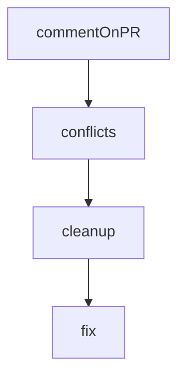

# Chapter 1: Getting Started

Welcome to **Chapter 1: Getting Started**. In this part of **Kilo Code Tutorial: Agentic Engineering from IDE and CLI Surfaces**, you will build an intuitive mental model first, then move into concrete implementation details and practical production tradeoffs.


This chapter gets Kilo installed and running with a first coding-agent workflow.

## Start Points

- install from VS Code Marketplace for IDE-native workflows
- follow quick-start onboarding for model/provider setup

## Baseline Flow

1. install Kilo extension
2. authenticate and select provider/model
3. run a bounded task in your project to validate setup

## Source References

- [Kilo README](https://github.com/Kilo-Org/kilocode/blob/main/README.md)

## Summary

You now have Kilo ready for first-task execution.

Next: [Chapter 2: Agent Loop and State Model](02-agent-loop-and-state-model.md)

## Source Code Walkthrough

### `script/beta.ts`

The `commentOnPR` function in [`script/beta.ts`](https://github.com/Kilo-Org/kilocode/blob/HEAD/script/beta.ts) handles a key part of this chapter's functionality:

```ts
}

async function commentOnPR(prNumber: number, reason: string) {
  const body = `⚠️ **Blocking Beta Release**

This PR cannot be merged into the beta branch due to: **${reason}**

Please resolve this issue to include this PR in the next beta release.`

  try {
    await $`gh pr comment ${prNumber} --body ${body}`
    console.log(`  Posted comment on PR #${prNumber}`)
  } catch (err) {
    console.log(`  Failed to post comment on PR #${prNumber}: ${err}`)
  }
}

async function conflicts() {
  const out = await $`git diff --name-only --diff-filter=U`.text().catch(() => "")
  return out
    .split("\n")
    .map((x) => x.trim())
    .filter(Boolean)
}

async function cleanup() {
  try {
    await $`git merge --abort`
  } catch {}
  try {
    await $`git checkout -- .`
  } catch {}
```

This function is important because it defines how Kilo Code Tutorial: Agentic Engineering from IDE and CLI Surfaces implements the patterns covered in this chapter.

### `script/beta.ts`

The `conflicts` function in [`script/beta.ts`](https://github.com/Kilo-Org/kilocode/blob/HEAD/script/beta.ts) handles a key part of this chapter's functionality:

```ts
}

async function conflicts() {
  const out = await $`git diff --name-only --diff-filter=U`.text().catch(() => "")
  return out
    .split("\n")
    .map((x) => x.trim())
    .filter(Boolean)
}

async function cleanup() {
  try {
    await $`git merge --abort`
  } catch {}
  try {
    await $`git checkout -- .`
  } catch {}
  try {
    await $`git clean -fd`
  } catch {}
}

async function fix(pr: PR, files: string[]) {
  console.log(`  Trying to auto-resolve ${files.length} conflict(s) with opencode...`)
  const prompt = [
    `Resolve the current git merge conflicts while merging PR #${pr.number} into the beta branch.`,
    `Only touch these files: ${files.join(", ")}.`,
    "Keep the merge in progress, do not abort the merge, and do not create a commit.",
    "When done, leave the working tree with no unmerged files.",
  ].join("\n")

  try {
```

This function is important because it defines how Kilo Code Tutorial: Agentic Engineering from IDE and CLI Surfaces implements the patterns covered in this chapter.

### `script/beta.ts`

The `cleanup` function in [`script/beta.ts`](https://github.com/Kilo-Org/kilocode/blob/HEAD/script/beta.ts) handles a key part of this chapter's functionality:

```ts
}

async function cleanup() {
  try {
    await $`git merge --abort`
  } catch {}
  try {
    await $`git checkout -- .`
  } catch {}
  try {
    await $`git clean -fd`
  } catch {}
}

async function fix(pr: PR, files: string[]) {
  console.log(`  Trying to auto-resolve ${files.length} conflict(s) with opencode...`)
  const prompt = [
    `Resolve the current git merge conflicts while merging PR #${pr.number} into the beta branch.`,
    `Only touch these files: ${files.join(", ")}.`,
    "Keep the merge in progress, do not abort the merge, and do not create a commit.",
    "When done, leave the working tree with no unmerged files.",
  ].join("\n")

  try {
    await $`opencode run -m opencode/gpt-5.3-codex ${prompt}`
  } catch (err) {
    console.log(`  opencode failed: ${err}`)
    return false
  }

  const left = await conflicts()
  if (left.length > 0) {
```

This function is important because it defines how Kilo Code Tutorial: Agentic Engineering from IDE and CLI Surfaces implements the patterns covered in this chapter.

### `script/beta.ts`

The `fix` function in [`script/beta.ts`](https://github.com/Kilo-Org/kilocode/blob/HEAD/script/beta.ts) handles a key part of this chapter's functionality:

```ts
}

async function fix(pr: PR, files: string[]) {
  console.log(`  Trying to auto-resolve ${files.length} conflict(s) with opencode...`)
  const prompt = [
    `Resolve the current git merge conflicts while merging PR #${pr.number} into the beta branch.`,
    `Only touch these files: ${files.join(", ")}.`,
    "Keep the merge in progress, do not abort the merge, and do not create a commit.",
    "When done, leave the working tree with no unmerged files.",
  ].join("\n")

  try {
    await $`opencode run -m opencode/gpt-5.3-codex ${prompt}`
  } catch (err) {
    console.log(`  opencode failed: ${err}`)
    return false
  }

  const left = await conflicts()
  if (left.length > 0) {
    console.log(`  Conflicts remain: ${left.join(", ")}`)
    return false
  }

  console.log("  Conflicts resolved with opencode")
  return true
}

async function main() {
  console.log("Fetching open PRs with beta label...")

  const stdout = await $`gh pr list --state open --label beta --json number,title,author,labels --limit 100`.text()
```

This function is important because it defines how Kilo Code Tutorial: Agentic Engineering from IDE and CLI Surfaces implements the patterns covered in this chapter.


## How These Components Connect


