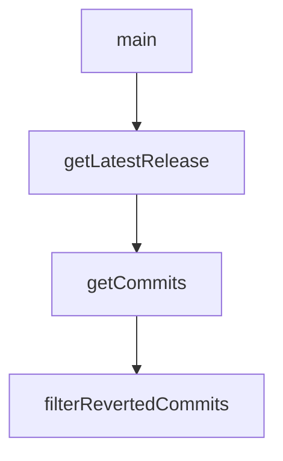

# Chapter 1: Getting Started

Welcome to **Chapter 1: Getting Started**. In this part of **Kilo Code Tutorial: Agentic Engineering from IDE and CLI Surfaces**, you will build an intuitive mental model first, then move into concrete implementation details and practical production tradeoffs.


This chapter gets Kilo installed and running with a first coding-agent workflow.

## Start Points

- install from VS Code Marketplace for IDE-native workflows
- follow quick-start onboarding for model/provider setup

## Baseline Flow

1. install Kilo extension
2. authenticate and select provider/model
3. run a bounded task in your project to validate setup

## Source References

- [Kilo README](https://github.com/Kilo-Org/kilocode/blob/main/README.md)

## Summary

You now have Kilo ready for first-task execution.

Next: [Chapter 2: Agent Loop and State Model](02-agent-loop-and-state-model.md)

## Depth Expansion Playbook

## Source Code Walkthrough

### `script/sync-zed.ts`

The `main` function in [`script/sync-zed.ts`](https://github.com/Kilo-Org/kilocode/blob/HEAD/script/sync-zed.ts) handles a key part of this chapter's functionality:

```ts
const EXTENSION_NAME = "opencode"

async function main() {
  const version = process.argv[2]
  if (!version) throw new Error("Version argument required, ex: bun script/sync-zed.ts v1.0.52")

  const token = process.env.ZED_EXTENSIONS_PAT
  if (!token) throw new Error("ZED_EXTENSIONS_PAT environment variable required")

  const prToken = process.env.ZED_PR_PAT
  if (!prToken) throw new Error("ZED_PR_PAT environment variable required")

  const cleanVersion = version.replace(/^v/, "")
  console.log(`📦 Syncing Zed extension for version ${cleanVersion}`)

  const commitSha = await $`git rev-parse ${version}`.text()
  const sha = commitSha.trim()
  console.log(`🔍 Found commit SHA: ${sha}`)

  const extensionToml = await $`git show ${version}:packages/extensions/zed/extension.toml`.text()
  const parsed = Bun.TOML.parse(extensionToml) as { version: string }
  const extensionVersion = parsed.version

  if (extensionVersion !== cleanVersion) {
    throw new Error(`Version mismatch: extension.toml has ${extensionVersion} but tag is ${cleanVersion}`)
  }
  console.log(`✅ Version ${extensionVersion} matches tag`)

  // Clone the fork to a temp directory
  const workDir = join(tmpdir(), `zed-extensions-${Date.now()}`)
  console.log(`📁 Working in ${workDir}`)

```

This function is important because it defines how Kilo Code Tutorial: Agentic Engineering from IDE and CLI Surfaces implements the patterns covered in this chapter.

### `script/changelog.ts`

The `getLatestRelease` function in [`script/changelog.ts`](https://github.com/Kilo-Org/kilocode/blob/HEAD/script/changelog.ts) handles a key part of this chapter's functionality:

```ts
}

export async function getLatestRelease(skip?: string) {
  const data = await fetch("https://api.github.com/repos/Kilo-Org/kilocode/releases?per_page=100").then((res) => {
    if (!res.ok) throw new Error(res.statusText)
    return res.json()
  })

  const releases = data as Release[]
  const target = skip?.replace(/^v/, "")

  for (const release of releases) {
    if (release.draft) continue
    const tag = release.tag_name.replace(/^v/, "")
    if (target && tag === target) continue
    return tag
  }

  throw new Error("No releases found")
}

type Commit = {
  hash: string
  author: string | null
  message: string
  areas: Set<string>
}

export async function getCommits(from: string, to: string): Promise<Commit[]> {
  const fromRef = from.startsWith("v") ? from : `v${from}`
  const toRef = to === "HEAD" ? to : to.startsWith("v") ? to : `v${to}`

```

This function is important because it defines how Kilo Code Tutorial: Agentic Engineering from IDE and CLI Surfaces implements the patterns covered in this chapter.

### `script/changelog.ts`

The `getCommits` function in [`script/changelog.ts`](https://github.com/Kilo-Org/kilocode/blob/HEAD/script/changelog.ts) handles a key part of this chapter's functionality:

```ts
}

export async function getCommits(from: string, to: string): Promise<Commit[]> {
  const fromRef = from.startsWith("v") ? from : `v${from}`
  const toRef = to === "HEAD" ? to : to.startsWith("v") ? to : `v${to}`

  // Get commit data with GitHub usernames from the API
  const compare =
    await $`gh api "/repos/Kilo-Org/kilocode/compare/${fromRef}...${toRef}" --jq '.commits[] | {sha: .sha, login: .author.login, message: .commit.message}'`.text()

  const commitData = new Map<string, { login: string | null; message: string }>()
  for (const line of compare.split("\n").filter(Boolean)) {
    const data = JSON.parse(line) as { sha: string; login: string | null; message: string }
    commitData.set(data.sha, { login: data.login, message: data.message.split("\n")[0] ?? "" })
  }

  // Get commits that touch the relevant packages
  const log =
    await $`git log ${fromRef}..${toRef} --oneline --format="%H" -- packages/opencode packages/sdk packages/plugin packages/desktop packages/app sdks/vscode packages/extensions github`.text()
  const hashes = log.split("\n").filter(Boolean)

  const commits: Commit[] = []
  for (const hash of hashes) {
    const data = commitData.get(hash)
    if (!data) continue

    const message = data.message
    if (message.match(/^(ignore:|test:|chore:|ci:|release:)/i)) continue

    const files = await $`git diff-tree --no-commit-id --name-only -r ${hash}`.text()
    const areas = new Set<string>()

```

This function is important because it defines how Kilo Code Tutorial: Agentic Engineering from IDE and CLI Surfaces implements the patterns covered in this chapter.

### `script/changelog.ts`

The `filterRevertedCommits` function in [`script/changelog.ts`](https://github.com/Kilo-Org/kilocode/blob/HEAD/script/changelog.ts) handles a key part of this chapter's functionality:

```ts
  }

  return filterRevertedCommits(commits)
}

function filterRevertedCommits(commits: Commit[]): Commit[] {
  const revertPattern = /^Revert "(.+)"$/
  const seen = new Map<string, Commit>()

  for (const commit of commits) {
    const match = commit.message.match(revertPattern)
    if (match) {
      // It's a revert - remove the original if we've seen it
      const original = match[1]!
      if (seen.has(original)) seen.delete(original)
      else seen.set(commit.message, commit) // Keep revert if original not in range
    } else {
      // Regular commit - remove if its revert exists, otherwise add
      const revertMsg = `Revert "${commit.message}"`
      if (seen.has(revertMsg)) seen.delete(revertMsg)
      else seen.set(commit.message, commit)
    }
  }

  return [...seen.values()]
}

const sections = {
  core: "Core",
  tui: "TUI",
  app: "Desktop",
  tauri: "Desktop",
```

This function is important because it defines how Kilo Code Tutorial: Agentic Engineering from IDE and CLI Surfaces implements the patterns covered in this chapter.


## How These Components Connect


