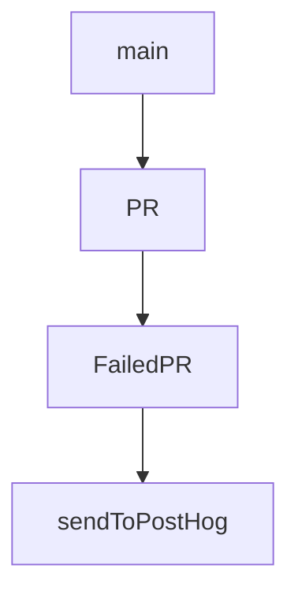

# Chapter 2: Agent Loop and State Model

Welcome to **Chapter 2: Agent Loop and State Model**. In this part of **Kilo Code Tutorial: Agentic Engineering from IDE and CLI Surfaces**, you will build an intuitive mental model first, then move into concrete implementation details and practical production tradeoffs.


Kilo's CLI architecture uses message-state analysis to track whether the agent is running, streaming, waiting for input, or idle.

## State Categories

| State | Meaning |
|:------|:--------|
| running | active execution |
| streaming | partial output in progress |
| waiting_for_input | explicit user decision needed |
| idle | task completed or halted |

## Why It Matters

This state model allows reliable coordination of approvals, followups, and automation behavior.

## Source References

- [AGENT_LOOP.md](https://github.com/Kilo-Org/kilocode/blob/main/apps/cli/docs/AGENT_LOOP.md)

## Summary

You now understand the core loop-state mechanics that drive Kilo interaction behavior.

Next: [Chapter 3: Modes, Prompts, and Approval Workflow](03-modes-prompts-and-approval-workflow.md)

## Source Code Walkthrough

### `script/beta.ts`

The `main` function in [`script/beta.ts`](https://github.com/Kilo-Org/kilocode/blob/HEAD/script/beta.ts) handles a key part of this chapter's functionality:

```ts
  const left = await conflicts()
  if (left.length > 0) {
    console.log(`  Conflicts remain: ${left.join(", ")}`)
    return false
  }

  console.log("  Conflicts resolved with opencode")
  return true
}

async function main() {
  console.log("Fetching open PRs with beta label...")

  const stdout = await $`gh pr list --state open --label beta --json number,title,author,labels --limit 100`.text()
  const prs: PR[] = JSON.parse(stdout).sort((a: PR, b: PR) => a.number - b.number)

  console.log(`Found ${prs.length} open PRs with beta label`)

  if (prs.length === 0) {
    console.log("No team PRs to merge")
    return
  }

  console.log("Fetching latest main branch...")
  await $`git fetch origin main`

  console.log("Checking out main branch...")
  await $`git checkout -B beta origin/main`

  const applied: number[] = []
  const failed: FailedPR[] = []

```

This function is important because it defines how Kilo Code Tutorial: Agentic Engineering from IDE and CLI Surfaces implements the patterns covered in this chapter.

### `script/beta.ts`

The `PR` interface in [`script/beta.ts`](https://github.com/Kilo-Org/kilocode/blob/HEAD/script/beta.ts) handles a key part of this chapter's functionality:

```ts
import { $ } from "bun"

interface PR {
  number: number
  title: string
  author: { login: string }
  labels: Array<{ name: string }>
}

interface FailedPR {
  number: number
  title: string
  reason: string
}

async function commentOnPR(prNumber: number, reason: string) {
  const body = `⚠️ **Blocking Beta Release**

This PR cannot be merged into the beta branch due to: **${reason}**

Please resolve this issue to include this PR in the next beta release.`

  try {
    await $`gh pr comment ${prNumber} --body ${body}`
    console.log(`  Posted comment on PR #${prNumber}`)
  } catch (err) {
    console.log(`  Failed to post comment on PR #${prNumber}: ${err}`)
  }
}

async function conflicts() {
  const out = await $`git diff --name-only --diff-filter=U`.text().catch(() => "")
```

This interface is important because it defines how Kilo Code Tutorial: Agentic Engineering from IDE and CLI Surfaces implements the patterns covered in this chapter.

### `script/beta.ts`

The `FailedPR` interface in [`script/beta.ts`](https://github.com/Kilo-Org/kilocode/blob/HEAD/script/beta.ts) handles a key part of this chapter's functionality:

```ts
}

interface FailedPR {
  number: number
  title: string
  reason: string
}

async function commentOnPR(prNumber: number, reason: string) {
  const body = `⚠️ **Blocking Beta Release**

This PR cannot be merged into the beta branch due to: **${reason}**

Please resolve this issue to include this PR in the next beta release.`

  try {
    await $`gh pr comment ${prNumber} --body ${body}`
    console.log(`  Posted comment on PR #${prNumber}`)
  } catch (err) {
    console.log(`  Failed to post comment on PR #${prNumber}: ${err}`)
  }
}

async function conflicts() {
  const out = await $`git diff --name-only --diff-filter=U`.text().catch(() => "")
  return out
    .split("\n")
    .map((x) => x.trim())
    .filter(Boolean)
}

async function cleanup() {
```

This interface is important because it defines how Kilo Code Tutorial: Agentic Engineering from IDE and CLI Surfaces implements the patterns covered in this chapter.

### `script/stats.ts`

The `sendToPostHog` function in [`script/stats.ts`](https://github.com/Kilo-Org/kilocode/blob/HEAD/script/stats.ts) handles a key part of this chapter's functionality:

```ts
#!/usr/bin/env bun

async function sendToPostHog(event: string, properties: Record<string, any>) {
  const key = process.env["POSTHOG_KEY"]

  if (!key) {
    console.warn("POSTHOG_API_KEY not set, skipping PostHog event")
    return
  }

  const response = await fetch("https://us.i.posthog.com/i/v0/e/", {
    method: "POST",
    headers: {
      "Content-Type": "application/json",
    },
    body: JSON.stringify({
      distinct_id: "download",
      api_key: key,
      event,
      properties: {
        ...properties,
      },
    }),
  }).catch(() => null)

  if (response && !response.ok) {
    console.warn(`PostHog API error: ${response.status}`)
  }
}

interface Asset {
  name: string
```

This function is important because it defines how Kilo Code Tutorial: Agentic Engineering from IDE and CLI Surfaces implements the patterns covered in this chapter.


## How These Components Connect


