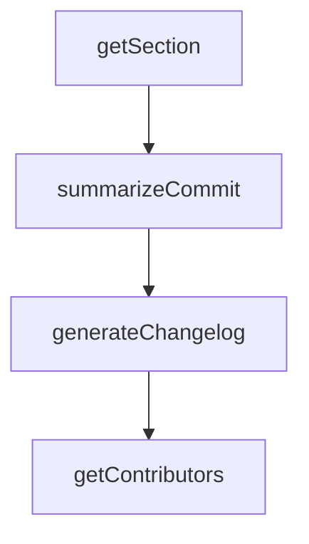

# Chapter 2: Agent Loop and State Model

Welcome to **Chapter 2: Agent Loop and State Model**. In this part of **Kilo Code Tutorial: Agentic Engineering from IDE and CLI Surfaces**, you will build an intuitive mental model first, then move into concrete implementation details and practical production tradeoffs.


Kilo's CLI architecture uses message-state analysis to track whether the agent is running, streaming, waiting for input, or idle.

## State Categories

| State | Meaning |
|:------|:--------|
| running | active execution |
| streaming | partial output in progress |
| waiting_for_input | explicit user decision needed |
| idle | task completed or halted |

## Why It Matters

This state model allows reliable coordination of approvals, followups, and automation behavior.

## Source References

- [AGENT_LOOP.md](https://github.com/Kilo-Org/kilocode/blob/main/apps/cli/docs/AGENT_LOOP.md)

## Summary

You now understand the core loop-state mechanics that drive Kilo interaction behavior.

Next: [Chapter 3: Modes, Prompts, and Approval Workflow](03-modes-prompts-and-approval-workflow.md)

## Depth Expansion Playbook

## Source Code Walkthrough

### `script/changelog.ts`

The `getSection` function in [`script/changelog.ts`](https://github.com/Kilo-Org/kilocode/blob/HEAD/script/changelog.ts) handles a key part of this chapter's functionality:

```ts
} as const

function getSection(areas: Set<string>): string {
  // Priority order for multi-area commits
  const priority = ["core", "tui", "app", "tauri", "sdk", "plugin", "extensions/zed", "extensions/vscode", "github"]
  for (const area of priority) {
    if (areas.has(area)) return sections[area as keyof typeof sections]
  }
  return "Core"
}

async function summarizeCommit(opencode: Awaited<ReturnType<typeof createKilo>>, message: string): Promise<string> {
  console.log("summarizing commit:", message)
  const session = await opencode.client.session.create()
  const result = await opencode.client.session
    .prompt(
      {
        sessionID: session.data!.id,
        model: { providerID: "kilo", modelID: "anthropic/claude-sonnet-4.5" }, // kilocode_change
        tools: {
          "*": false,
        },
        parts: [
          {
            type: "text",
            text: `Summarize this commit message for a changelog entry. Return ONLY a single line summary starting with a capital letter. Be concise but specific. If the commit message is already well-written, just clean it up (capitalize, fix typos, proper grammar). Do not include any prefixes like "fix:" or "feat:".

Commit: ${message}`,
          },
        ],
      },
      {
```

This function is important because it defines how Kilo Code Tutorial: Agentic Engineering from IDE and CLI Surfaces implements the patterns covered in this chapter.

### `script/changelog.ts`

The `summarizeCommit` function in [`script/changelog.ts`](https://github.com/Kilo-Org/kilocode/blob/HEAD/script/changelog.ts) handles a key part of this chapter's functionality:

```ts
}

async function summarizeCommit(opencode: Awaited<ReturnType<typeof createKilo>>, message: string): Promise<string> {
  console.log("summarizing commit:", message)
  const session = await opencode.client.session.create()
  const result = await opencode.client.session
    .prompt(
      {
        sessionID: session.data!.id,
        model: { providerID: "kilo", modelID: "anthropic/claude-sonnet-4.5" }, // kilocode_change
        tools: {
          "*": false,
        },
        parts: [
          {
            type: "text",
            text: `Summarize this commit message for a changelog entry. Return ONLY a single line summary starting with a capital letter. Be concise but specific. If the commit message is already well-written, just clean it up (capitalize, fix typos, proper grammar). Do not include any prefixes like "fix:" or "feat:".

Commit: ${message}`,
          },
        ],
      },
      {
        signal: AbortSignal.timeout(120_000),
      },
    )
    .then((x) => x.data?.parts?.find((y) => y.type === "text")?.text ?? message)
  return result.trim()
}

export async function generateChangelog(commits: Commit[], opencode: Awaited<ReturnType<typeof createKilo>>) {
  // Summarize commits in parallel with max 10 concurrent requests
```

This function is important because it defines how Kilo Code Tutorial: Agentic Engineering from IDE and CLI Surfaces implements the patterns covered in this chapter.

### `script/changelog.ts`

The `generateChangelog` function in [`script/changelog.ts`](https://github.com/Kilo-Org/kilocode/blob/HEAD/script/changelog.ts) handles a key part of this chapter's functionality:

```ts
}

export async function generateChangelog(commits: Commit[], opencode: Awaited<ReturnType<typeof createKilo>>) {
  // Summarize commits in parallel with max 10 concurrent requests
  const BATCH_SIZE = 10
  const summaries: string[] = []
  for (let i = 0; i < commits.length; i += BATCH_SIZE) {
    const batch = commits.slice(i, i + BATCH_SIZE)
    const results = await Promise.all(batch.map((c) => summarizeCommit(opencode, c.message)))
    summaries.push(...results)
  }

  const grouped = new Map<string, string[]>()
  for (let i = 0; i < commits.length; i++) {
    const commit = commits[i]!
    const section = getSection(commit.areas)
    const attribution = commit.author && !Script.team.includes(commit.author) ? ` (@${commit.author})` : ""
    const entry = `- ${summaries[i]}${attribution}`

    if (!grouped.has(section)) grouped.set(section, [])
    grouped.get(section)!.push(entry)
  }

  const sectionOrder = ["Core", "TUI", "Desktop", "SDK", "Extensions"]
  const lines: string[] = []
  for (const section of sectionOrder) {
    const entries = grouped.get(section)
    if (!entries || entries.length === 0) continue
    lines.push(`## ${section}`)
    lines.push(...entries)
  }

```

This function is important because it defines how Kilo Code Tutorial: Agentic Engineering from IDE and CLI Surfaces implements the patterns covered in this chapter.

### `script/changelog.ts`

The `getContributors` function in [`script/changelog.ts`](https://github.com/Kilo-Org/kilocode/blob/HEAD/script/changelog.ts) handles a key part of this chapter's functionality:

```ts
}

export async function getContributors(from: string, to: string) {
  const fromRef = from.startsWith("v") ? from : `v${from}`
  const toRef = to === "HEAD" ? to : to.startsWith("v") ? to : `v${to}`
  const compare =
    await $`gh api "/repos/Kilo-Org/kilocode/compare/${fromRef}...${toRef}" --jq '.commits[] | {login: .author.login, message: .commit.message}'`.text()
  const contributors = new Map<string, Set<string>>()

  for (const line of compare.split("\n").filter(Boolean)) {
    const { login, message } = JSON.parse(line) as { login: string | null; message: string }
    const title = message.split("\n")[0] ?? ""
    if (title.match(/^(ignore:|test:|chore:|ci:|release:)/i)) continue

    if (login && !Script.team.includes(login)) {
      if (!contributors.has(login)) contributors.set(login, new Set())
      contributors.get(login)!.add(title)
    }
  }

  return contributors
}

export async function buildNotes(from: string, to: string) {
  const commits = await getCommits(from, to)

  if (commits.length === 0) {
    return []
  }

  console.log("generating changelog since " + from)

```

This function is important because it defines how Kilo Code Tutorial: Agentic Engineering from IDE and CLI Surfaces implements the patterns covered in this chapter.


## How These Components Connect


